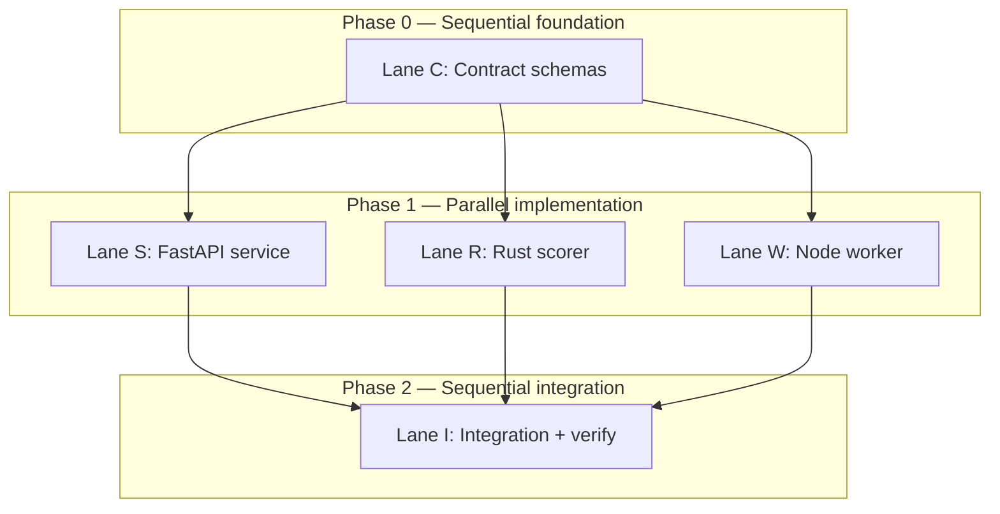
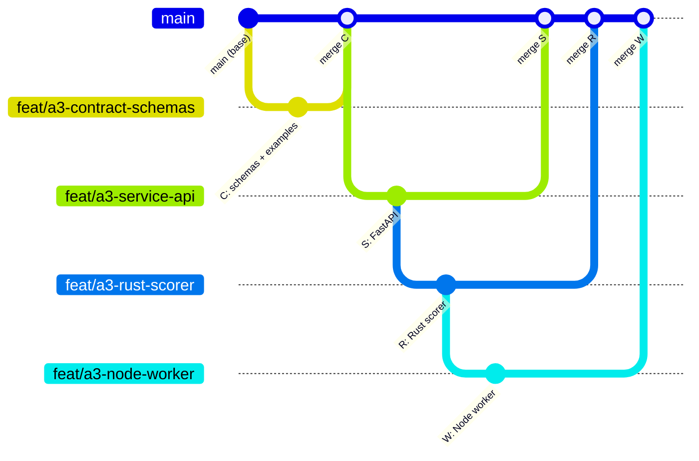

# Parallel Worktree Decomposition Plan

## Metadata

| Field | Value |
|-------|-------|
| **Task ID** | A1 — parallel agent / worktree orchestration |
| **Parent feature** | Mini Fraud Score System (`Task/Advanced/A3/`) |
| **Parent task (concrete)** | Implement the three-component fraud pipeline in parallel without merge chaos |
| **Repository** | `/Users/divyanshupatel/Desktop/mf` |
| **Base branch** | `main` (or `development` if your team uses it — all lanes branch from the same commit) |
| **Orchestrator role** | Human or a coordinator agent that owns contract lane + final integration merge |
| **Created** | 2026-06-16 |
| **Lanes** | 4 parallel implementation lanes + 1 sequential integration lane |

---

## Executive summary

The **Mini Fraud Score System** is a three-component pipeline:

1. **FastAPI service** — ingests transactions, exposes pending queue, accepts scores.
2. **Node.js worker** — polls pending transactions, invokes the Rust scorer, posts results.
3. **Rust scorer** — deterministic risk scoring from a shared JSON contract.

These components are **naturally parallelizable** because they live in disjoint directory trees and communicate only through **frozen JSON schemas** and **HTTP/stdio interfaces**. Merge chaos happens when multiple agents edit the same files, redefine contracts independently, or merge in the wrong order.

This document decomposes the parent feature into **four parallel worktrees** plus one **sequential integration lane**, with explicit ownership boundaries, agent prompts, merge order, conflict plan, and verification gates.



---

## Why this feature splits cleanly

| Signal | Evidence |
|--------|----------|
| **Disjoint file ownership** | `Task/Advanced/A3/contract/`, `service/`, `worker/`, `scorer/` — no shared source files |
| **Stable interface** | JSON schemas in `contract/` define ingest, scoring-input, scoring-result shapes |
| **Independent test suites** | `pytest` (service), `cargo test` (scorer), `npm test` (worker) |
| **Runtime coupling is late** | Components only need each other at integration time, not during unit implementation |
| **Documented env contract** | `FRAUD_API_URL`, `SCORER_BIN`, `POLL_INTERVAL_MS` — see `Task/Advanced/A3/README.md` |

**Anti-pattern (do not parallelize this way):** assigning one agent to `service/app/main.py` and another to `service/app/store.py` — both touch the same Python package and will conflict on imports and shared models.

---

## Parent task definition

### Goal

Deliver a working end-to-end fraud scoring pipeline:

```
Client → POST /transactions → FastAPI (pending)
                ↓
Node worker polls GET /transactions/pending
                ↓
Rust CLI scores via stdin/stdout
                ↓
Node worker POST /transactions/{id}/score → FastAPI (scored)
```

### Acceptance criteria

| # | Criterion | Verified by |
|---|-----------|-------------|
| AC-1 | JSON schemas validate all example payloads in `contract/examples/` | Contract lane + integration |
| AC-2 | `POST /transactions` returns `201` with `status: pending` | `pytest service/tests/test_api.py` |
| AC-3 | `GET /transactions/pending` returns FIFO pending items | `pytest service/tests/test_api.py` |
| AC-4 | `POST /transactions/{id}/score` transitions record to `scored` | `pytest service/tests/test_api.py` |
| AC-5 | Rust scorer applies documented risk rules (amount, country, device, category, off-hours) | `cargo test scorer/` |
| AC-6 | Worker polls, scores, and posts back without manual intervention | `npm run verify` in worker |
| AC-7 | Full pipeline test passes with all three processes | Integration lane |

### Out of scope (explicit)

- Database persistence (in-memory store is sufficient).
- Authentication / authorization.
- Docker / Kubernetes deployment.
- Changing risk rule semantics without updating contract + all three consumers.

---

## Task decomposition

### Phase 0 — Contract foundation (Lane C, **sequential first**)

| Subtask | Owner | Files | Depends on |
|---------|-------|-------|------------|
| C1 | Lane C | `contract/transaction.schema.json` | — |
| C2 | Lane C | `contract/scoring-input.schema.json` | C1 |
| C3 | Lane C | `contract/scoring-result.schema.json` | C1 |
| C4 | Lane C | `contract/examples/low-risk.json`, `high-risk.json` | C1–C3 |
| C5 | Lane C | `Task/Advanced/A3/README.md` (contract section only) | C1–C4 |

**Deliverable:** frozen schemas committed to `main` (or merged first) before any implementation lane starts.

---

### Phase 1 — Parallel implementation (Lanes S, R, W)

#### Lane S — FastAPI ingestion service

| Subtask | Files | Must not touch |
|---------|-------|----------------|
| S1 | `service/app/models.py` — Pydantic models mirroring contract | `worker/`, `scorer/`, `contract/` |
| S2 | `service/app/store.py` — thread-safe in-memory store | same |
| S3 | `service/app/main.py` — routes: health, ingest, pending, get, score | same |
| S4 | `service/requirements.txt`, `service/pytest.ini` | same |
| S5 | `service/tests/test_api.py`, `service/tests/test_integration.py` | same |

**Mock strategy until integration:** use `TestClient` + in-memory store; no worker or Rust required.

---

#### Lane R — Rust scorer

| Subtask | Files | Must not touch |
|---------|-------|----------------|
| R1 | `scorer/Cargo.toml` — deps: serde, chrono | `service/`, `worker/`, `contract/` (read-only) |
| R2 | `scorer/src/lib.rs` — `compute_risk_score`, rule table | same |
| R3 | `scorer/src/main.rs` — stdin JSON → stdout JSON CLI | same |
| R4 | `scorer/tests/integration_test.rs` — golden cases from contract examples | same |

**Mock strategy:** unit tests feed JSON strings directly; no API or worker required.

---

#### Lane W — Node.js polling worker

| Subtask | Files | Must not touch |
|---------|-------|----------------|
| W1 | `worker/package.json` — scripts: start, test, verify | `service/app/`, `scorer/src/` |
| W2 | `worker/src/scorer.js` — spawn Rust CLI, pipe stdin/stdout | same |
| W3 | `worker/src/worker.js` — poll loop, HTTP client, error handling | same |
| W4 | `worker/tests/` — unit tests with mocked fetch + mocked scorer | same |
| W5 | `worker/scripts/verify.js` (if present) — live E2E against running API | same |

**Mock strategy:** mock `fetch` and `scorer.js` in unit tests; assume API paths from README, not from reading `main.py`.

---

### Phase 2 — Integration (Lane I, **sequential last**)

| Subtask | Owner | Action |
|---------|-------|--------|
| I1 | Lane I | Merge all lane branches into `integration/a3-fraud-pipeline` |
| I2 | Lane I | Run cross-component verification (see Verification plan) |
| I3 | Lane I | Fix only glue issues: env defaults, path mismatches, schema drift |
| I4 | Lane I | Update `Task/Advanced/A3/README.md` run-order section if needed |
| I5 | Lane I | Write `Task/Advanced/A1/integration-report.md` with evidence |

---

## Worktree and branch naming

### Naming convention

```
branch:  feat/a3-<lane>-<short-slug>
worktree: ../mf-wt-a3-<lane>
tag (optional): a3-lane-<lane>-done
```

### Setup commands (run from repo root)

```bash
# Ensure clean base
cd /Users/divyanshupatel/Desktop/mf
git fetch origin
git checkout main
git pull --ff-only origin main

# Lane C — contract (create first; others wait)
git checkout -b feat/a3-contract-schemas
# ... implement contract ...
git commit -m "feat(a3): add shared JSON schemas for fraud pipeline"
git checkout main && git merge --ff-only feat/a3-contract-schemas

# Lane S — service (parallel, after contract on main)
git worktree add ../mf-wt-a3-service -b feat/a3-service-api main
cd ../mf-wt-a3-service
# agent works here

# Lane R — scorer (parallel, after contract on main)
git worktree add ../mf-wt-a3-scorer -b feat/a3-rust-scorer main
cd ../mf-wt-a3-scorer

# Lane W — worker (parallel, after contract on main)
git worktree add ../mf-wt-a3-worker -b feat/a3-node-worker main
cd ../mf-wt-a3-worker

# Lane I — integration (after S, R, W merge)
git worktree add ../mf-wt-a3-integration -b integration/a3-fraud-pipeline main
```

### Worktree map

| Lane | Branch | Worktree path | Directory ownership |
|------|--------|---------------|---------------------|
| **C** Contract | `feat/a3-contract-schemas` | (main worktree, short-lived) | `Task/Advanced/A3/contract/**` |
| **S** Service | `feat/a3-service-api` | `../mf-wt-a3-service` | `Task/Advanced/A3/service/**` |
| **R** Scorer | `feat/a3-rust-scorer` | `../mf-wt-a3-scorer` | `Task/Advanced/A3/scorer/**` |
| **W** Worker | `feat/a3-node-worker` | `../mf-wt-a3-worker` | `Task/Advanced/A3/worker/**` (exclude `node_modules/`) |
| **I** Integration | `integration/a3-fraud-pipeline` | `../mf-wt-a3-integration` | glue fixes only; no feature rewrites |

### Cleanup after merge

```bash
git worktree remove ../mf-wt-a3-service
git worktree remove ../mf-wt-a3-scorer
git worktree remove ../mf-wt-a3-worker
git worktree remove ../mf-wt-a3-integration
git branch -d feat/a3-service-api feat/a3-rust-scorer feat/a3-node-worker
git branch -d integration/a3-fraud-pipeline
```

---

## Agent prompts (copy-paste per lane)

### Lane C — Contract (run first, alone)

```markdown
You are **Lane C — Contract** for the Mini Fraud Score System.

**Repo:** /Users/divyanshupatel/Desktop/mf
**Branch:** feat/a3-contract-schemas (create from main)
**Own ONLY:** Task/Advanced/A3/contract/** and the "Data contract" section of Task/Advanced/A3/README.md

**Goal:** Define frozen JSON schemas for:
- transaction ingest (POST /transactions body)
- scoring input (worker → Rust, includes transaction_id)
- scoring result (Rust → worker → POST /score body)

**Rules:**
1. Do NOT edit service/, worker/, or scorer/ source code.
2. Include examples/low-risk.json and examples/high-risk.json that validate against schemas.
3. Document risk rule table in README (points per signal, level thresholds) — this is the source of truth for Lane R.
4. Schemas use JSON Schema draft 2020-12; additionalProperties: false on objects.
5. Commit when done. Other lanes are blocked until you merge to main.

**Acceptance:** Every example file validates against its schema. README contract table matches schema fields exactly.

**Output:** Short contract manifest listing schema file paths, example paths, and field lists for downstream lanes.
```

---

### Lane S — FastAPI service (parallel, after C merges)

```markdown
You are **Lane S — FastAPI Service** for the Mini Fraud Score System.

**Worktree:** ../mf-wt-a3-service
**Branch:** feat/a3-service-api (from main after contract merge)
**Own ONLY:** Task/Advanced/A3/service/**

**Goal:** Implement the ingestion API:
- GET /health
- POST /transactions → 201, status pending
- GET /transactions/pending?limit=1..100
- GET /transactions/{id}
- POST /transactions/{id}/score

**Contract source of truth:** Task/Advanced/A3/contract/*.schema.json (READ ONLY — do not modify)

**Rules:**
1. Do NOT edit worker/, scorer/, or contract/.
2. Pydantic models in app/models.py must mirror contract fields exactly.
3. In-memory store in app/store.py with threading.Lock; include store.reset() for tests.
4. Write pytest tests in service/tests/ covering all endpoints and validation errors.
5. Do NOT commit or push unless explicitly asked.
6. If contract is ambiguous, stop and document the question in service/OPEN_QUESTIONS.md — do not guess.

**Mock strategy:** Use FastAPI TestClient only. No Rust, no Node.

**Done when:** `cd Task/Advanced/A3/service && pytest -v` passes.
```

---

### Lane R — Rust scorer (parallel, after C merges)

```markdown
You are **Lane R — Rust Scorer** for the Mini Fraud Score System.

**Worktree:** ../mf-wt-a3-scorer
**Branch:** feat/a3-rust-scorer (from main after contract merge)
**Own ONLY:** Task/Advanced/A3/scorer/**

**Goal:** Implement deterministic fraud scoring:
- Library function compute_risk_score(input) -> ScoringResult
- CLI: read ScoringInput JSON from stdin, write ScoringResult JSON to stdout
- Apply risk rules exactly as documented in Task/Advanced/A3/README.md (from contract lane)

**Contract source of truth:** Task/Advanced/A3/contract/scoring-input.schema.json and scoring-result.schema.json (READ ONLY)

**Rules:**
1. Do NOT edit service/, worker/, or contract/.
2. Risk rules must match README table: high_amount (+30), elevated_amount (+15), country_mismatch (+20), new_device (+15), high_risk_category (+25), off_hours (+10). Cap at 100. Levels: low <30, medium 30-59, high >=60.
3. Categories: gambling, crypto, wire_transfer (case-insensitive).
4. Off-hours: UTC 01:00–04:59 inclusive.
5. Write integration tests using contract/examples/ payloads.
6. Do NOT commit or push unless explicitly asked.

**Done when:** `cd Task/Advanced/A3/scorer && cargo test` passes and release binary runs against high-risk example.
```

---

### Lane W — Node worker (parallel, after C merges)

```markdown
You are **Lane W — Node Worker** for the Mini Fraud Score System.

**Worktree:** ../mf-wt-a3-worker
**Branch:** feat/a3-node-worker (from main after contract merge)
**Own ONLY:** Task/Advanced/A3/worker/** (exclude node_modules/)

**Goal:** Implement polling worker that:
1. Polls GET {FRAUD_API_URL}/transactions/pending
2. For each item, builds scoring input (transaction fields + transaction_id)
3. Spawns SCORER_BIN, pipes JSON stdin, reads JSON stdout
4. POSTs result to {FRAUD_API_URL}/transactions/{id}/score
5. Respects POLL_INTERVAL_MS (default 2000)

**Interface assumptions (from README — do NOT read service source):**
- API base: FRAUD_API_URL default http://127.0.0.1:8000
- Scorer path: SCORER_BIN default ../scorer/target/release/fraud-scorer
- Score POST body must include transaction_id matching path param

**Rules:**
1. Do NOT edit service/, scorer/, or contract/.
2. Unit tests must mock HTTP and scorer spawn — no live API required for CI.
3. Provide npm scripts: start, test, verify (verify = live E2E, optional in CI).
4. Handle scorer non-zero exit and API errors without crashing the poll loop.
5. Do NOT commit or push unless explicitly asked.

**Done when:** `cd Task/Advanced/A3/worker && npm test` passes.
```

---

### Lane I — Integration (sequential, after S + R + W merge)

```markdown
You are **Lane I — Integration** for the Mini Fraud Score System.

**Worktree:** ../mf-wt-a3-integration
**Branch:** integration/a3-fraud-pipeline

**Goal:** Merge feat/a3-service-api, feat/a3-rust-scorer, feat/a3-node-worker into one branch and prove end-to-end flow.

**Merge order (strict):**
1. feat/a3-service-api
2. feat/a3-rust-scorer
3. feat/a3-node-worker

**Rules:**
1. You may ONLY fix glue issues: import paths, env defaults, README run order, schema field name drift.
2. Do NOT rewrite feature logic in any component — send bugs back to the owning lane.
3. Run full verification matrix (see parallel-worktree-plan.md § Verification).
4. Write Task/Advanced/A1/integration-report.md with command output evidence.
5. Do NOT commit or push unless explicitly asked.

**Done when:** All lane tests pass AND npm run verify succeeds with live API + built scorer.
```

---

## Shared constraints

All lanes MUST honor this manifest. The orchestrator publishes it before Phase 1 starts.

### SC-1 — Contract freeze

After Lane C merges to `main`, **no lane may modify `contract/`** without orchestrator approval and a coordinated re-merge of all consumers.

### SC-2 — Directory ownership

| Path | Owner lane | Others |
|------|------------|--------|
| `Task/Advanced/A3/contract/**` | C | read-only |
| `Task/Advanced/A3/service/**` | S | no access |
| `Task/Advanced/A3/scorer/**` | R | no access |
| `Task/Advanced/A3/worker/**` | W | no access |
| `Task/Advanced/A3/README.md` | C (contract section), I (run order) | others read-only |

### SC-3 — Interface constants

| Constant | Value |
|----------|-------|
| API port (local dev) | `8000` |
| Health path | `GET /health` → `{"status":"ok"}` |
| Pending default limit | `10` (max `100`) |
| Score path | `POST /transactions/{uuid}/score` |
| Transaction status values | `pending`, `scored` |
| Risk levels | `low`, `medium`, `high` |
| Risk score range | `0–100` integer |

### SC-4 — Field names (canonical)

Ingest and scoring-input share these fields:

`user_id`, `amount`, `currency`, `merchant_id`, `merchant_category`, `country`, `user_country`, `device_id`, `is_new_device`, `timestamp`

Scoring-input adds: `transaction_id` (UUID string)

Scoring-result fields: `transaction_id`, `risk_score`, `risk_level`, `signals` (string array)

### SC-5 — Git discipline

- One lane = one branch = one worktree.
- No `git add .` — stage only owned paths.
- No force-push, no rebase of other lanes' branches.
- Save backup before merge: `git stash create "pre-a3-merge-$(date +%s)"` → `git update-ref refs/backup/a3-pre-merge-<ts> <sha>`

### SC-6 — Communication protocol

When a lane is blocked:

1. Write `OPEN_QUESTIONS.md` in owned directory.
2. Do not invent contract changes.
3. Orchestrator resolves and updates contract in a single commit if needed; all lanes rebase onto that commit.

---

## Merge order



### Ordered steps

| Step | Action | Gate |
|------|--------|------|
| 1 | Merge `feat/a3-contract-schemas` → `main` | Schema validation passes |
| 2 | Start lanes S, R, W from updated `main` | Contract manifest published |
| 3 | Merge `feat/a3-service-api` → `integration/a3-fraud-pipeline` | `pytest -v` green |
| 4 | Merge `feat/a3-rust-scorer` → `integration/a3-fraud-pipeline` | `cargo test` green |
| 5 | Merge `feat/a3-node-worker` → `integration/a3-fraud-pipeline` | `npm test` green |
| 6 | Lane I runs live E2E | `npm run verify` green |
| 7 | Merge `integration/a3-fraud-pipeline` → `main` | Full matrix green |

**Why this order:** S, R, W touch disjoint paths — merge order among them is arbitrary. Service first is a convention (API is the hub). If conflicts occur, they will be in `README.md` only.

---

## Conflict and risk plan

### Conflict matrix

| Risk | Likelihood | Impact | Mitigation |
|------|------------|--------|------------|
| Two lanes edit `README.md` | Medium | Low | C owns contract section; I owns run-order; S/R/W don't touch README |
| Schema drift (Pydantic ≠ JSON schema) | Medium | High | Contract manifest + Lane S validates against examples in tests |
| Rust rules ≠ README table | Medium | High | Lane R tests use golden vectors from contract examples |
| Worker URL/path mismatch | Medium | Medium | Worker uses README constants only; integration catches drift |
| Both lanes edit `service/app/models.py` | High if mis-split | High | **Never split within service/** — whole service is one lane |
| Merge conflict in `package-lock.json` | Low | Low | Only Lane W touches worker; run `npm install` once at merge |
| Agent commits secrets | Low | Critical | No `.env` commits; redact in reports |
| Parallel agents on same worktree | High | Critical | One worktree per lane; orchestrator enforces |

### If merge conflict occurs

```bash
# Example: README conflict after merging worker
git checkout --ours Task/Advanced/A3/README.md   # if keeping integration version
# OR manually combine: contract section from C, run-order from I
git add Task/Advanced/A3/README.md
git commit
```

### Escalation paths

| Symptom | Owner | Action |
|---------|-------|--------|
| Field rename needed | Orchestrator | Lane C amends schema → all lanes rebase |
| API returns wrong status code | Lane S | Fix in `feat/a3-service-api`, re-merge |
| Scorer wrong score | Lane R | Fix rules in `feat/a3-rust-scorer`, re-merge |
| Worker crash loop | Lane W | Fix polling/error handling, re-merge |
| E2E fails all unit tests pass | Lane I | Diagnose glue; file bugs to S/R/W |

### Rollback

```bash
# Restore pre-merge state
git reset --hard refs/backup/a3-pre-merge-<timestamp>
# Or revert integration merge commit
git revert -m 1 <merge-commit-sha>
```

---

## Verification plan

### Per-lane gates (must pass before merge to integration)

#### Lane C — Contract

```bash
cd Task/Advanced/A3/contract
# If ajv-cli installed:
# ajv validate -s transaction.schema.json -d examples/low-risk.json
# ajv validate -s transaction.schema.json -d examples/high-risk.json
# Manual: field list in README matches schema required[] arrays
```

| Check | Pass criteria |
|-------|---------------|
| Schemas exist | 3 schema files + 2 examples |
| Examples valid | Both examples conform |
| README table | Risk rules documented with point values |

---

#### Lane S — Service

```bash
cd Task/Advanced/A3/service
python3 -m venv .venv
source .venv/bin/activate
pip install -r requirements.txt
pytest -v
```

| Test | Proves |
|------|--------|
| `test_health` | Server boots |
| `test_ingest_transaction_returns_pending_record` | POST /transactions |
| `test_list_pending_transactions` | GET /transactions/pending |
| `test_submit_score_marks_transaction_scored` | POST /score |
| `test_validation_rejects_non_positive_amount` | Pydantic validation |
| `test_worker_pipeline_via_api` | In-process E2E without worker |

---

#### Lane R — Scorer

```bash
cd Task/Advanced/A3/scorer
cargo test
cargo build --release
cat ../contract/examples/high-risk.json \
  | jq '. + {"transaction_id":"00000000-0000-4000-8000-000000000099"}' \
  | ./target/release/fraud-scorer
```

| Check | Pass criteria |
|-------|---------------|
| Unit tests | All rules fire independently |
| High-risk example | `risk_level: high`, multiple signals |
| Low-risk example | `risk_level: low`, score < 30 |
| CLI | Valid JSON on stdout, exit 0 |

---

#### Lane W — Worker

```bash
cd Task/Advanced/A3/worker
npm install
npm test
```

| Check | Pass criteria |
|-------|---------------|
| Unit tests | Mocked poll + score cycle |
| Error handling | Scorer failure doesn't kill loop |
| Contract mapping | transaction_id preserved end-to-end |

---

### Post-merge integration matrix (Lane I)

Run in **three terminals** or use the verify script:

| # | Command | Expected |
|---|---------|----------|
| 1 | `cd scorer && cargo build --release && cargo test` | All pass |
| 2 | `cd service && pytest -v` | All pass |
| 3 | `cd worker && npm test` | All pass |
| 4 | Start uvicorn on :8000 | `/health` → 200 |
| 5 | `curl -X POST :8000/transactions -d @contract/examples/high-risk.json` | 201 pending |
| 6 | Start worker with env vars | Polls and scores |
| 7 | `GET :8000/transactions/{id}` | status scored, risk_level present |
| 8 | `cd worker && npm run verify` | Script exits 0 |

### Regression checklist

- [ ] Pending queue excludes scored transactions
- [ ] Double-score is idempotent (second POST returns existing scored record)
- [ ] Mismatched transaction_id in score body → 400
- [ ] Unknown transaction_id → 404
- [ ] limit=0 or limit=101 → 400

---

## Step-by-step execution guide

### Step 1 — Orchestrator prep (15 min)

1. Read `Task/Advanced/A3/README.md` and confirm scope.
2. Create tracking issue or shared doc with lane assignments.
3. Ensure `main` is clean: `git status` shows no uncommitted changes in A3 paths.
4. Publish shared constraints (§ Shared constraints) to all agents.

### Step 2 — Lane C solo (30–45 min)

1. Create branch `feat/a3-contract-schemas` from `main`.
2. Implement schemas + examples + README contract section.
3. Validate examples against schemas.
4. Merge to `main` via FF or squash (team preference).
5. Broadcast contract manifest to lanes S, R, W.

### Step 3 — Spawn parallel lanes (2–4 hours wall clock, parallel)

1. Create three worktrees from updated `main`.
2. Launch three agent sessions with lane prompts above.
3. Each agent works only in its worktree.
4. Orchestrator monitors for `OPEN_QUESTIONS.md` files.

### Step 4 — Lane-level verification (30 min each, parallel)

1. Each lane runs its verification commands.
2. Lanes fix failures within their ownership boundary.
3. No cross-lane file edits.

### Step 5 — Sequential merge to integration (45 min)

```bash
cd /Users/divyanshupatel/Desktop/mf
git checkout -b integration/a3-fraud-pipeline main

git merge --no-ff feat/a3-service-api -m "merge(a3): FastAPI service lane"
cd Task/Advanced/A3/service && pytest -v && cd -

git merge --no-ff feat/a3-rust-scorer -m "merge(a3): Rust scorer lane"
cd Task/Advanced/A3/scorer && cargo test && cd -

git merge --no-ff feat/a3-node-worker -m "merge(a3): Node worker lane"
cd Task/Advanced/A3/worker && npm test && cd -
```

### Step 6 — Live E2E (30 min)

1. Terminal 1: `uvicorn app.main:app --port 8000` (service)
2. Terminal 2: `npm start` (worker)
3. POST a transaction; confirm it becomes scored within 2 poll cycles.
4. Run `npm run verify`.

### Step 7 — Final merge and cleanup

1. Merge `integration/a3-fraud-pipeline` → `main`.
2. Remove worktrees and feature branches.
3. Write `integration-report.md` with test output snippets.

---

## What NOT to parallelize

| Tempting split | Why it fails |
|----------------|--------------|
| `main.py` to Agent A, `store.py` to Agent B | Same package, shared imports, guaranteed conflict |
| "One agent per endpoint" | All routes share models and store singleton |
| Contract + service in parallel | Schema drift breaks Pydantic validation |
| Worker + scorer in one lane split by file | Same Node package; scorer spawn logic couples to worker loop |
| Integration tests while features in flight | Tests will churn on every lane commit |

---

## Alternative: analysis task decomposition

The same pattern applies to **read-only analysis** (e.g., repo modernization like A4):

| Lane | Scope | Output file |
|------|-------|-------------|
| A | Dependencies + security | `analysis/deps-security.md` |
| B | CI/CD + testing | `analysis/ci-testing.md` |
| C | Architecture + DX | `analysis/architecture-dx.md` |
| I | Merge findings | `modernization-report.md` |

Analysis lanes write to **disjoint output files** under `Task/Advanced/A4/` — never edit the same report section. Merge order: any order; integration synthesizes.

---

## Appendix A — Current repo state (reference)

The A3 pipeline is partially implemented in this workspace:

| Component | Path | Status |
|-----------|------|--------|
| Contract | `Task/Advanced/A3/contract/` | Schemas + examples present |
| Service | `Task/Advanced/A3/service/app/` | `main.py`, `models.py`, `store.py` implemented |
| Scorer | `Task/Advanced/A3/scorer/src/` | `lib.rs` with full rule table |
| Worker | `Task/Advanced/A3/worker/src/` | `worker.js`, `scorer.js` present |
| Tests | `service/tests/`, `scorer/tests/`, `worker/tests/` | API + integration tests exist |

This plan remains valid for **greenfield implementation** or **feature extensions** (e.g., add `failed` status) — adjust lane prompts to delta scope while keeping ownership boundaries.

---

## Appendix B — Orchestrator checklist

- [ ] Contract merged before Phase 1
- [ ] One worktree per implementation lane
- [ ] Shared constraints published
- [ ] Each lane's `pytest` / `cargo test` / `npm test` green before merge
- [ ] Integration E2E green
- [ ] Worktrees removed
- [ ] No secrets committed
- [ ] `integration-report.md` written with evidence

---

## Appendix C — File ownership quick reference

```
Task/Advanced/A3/
├── contract/          ← Lane C only
├── service/         ← Lane S only
│   ├── app/
│   │   ├── main.py
│   │   ├── models.py
│   │   └── store.py
│   └── tests/
├── scorer/          ← Lane R only
│   ├── src/
│   └── tests/
├── worker/          ← Lane W only
│   ├── src/
│   └── tests/
└── README.md        ← C (contract), I (run order)
```

**Integration lane touches:** `README.md` (run order), optionally root-level CI config — nothing else without escalation.
