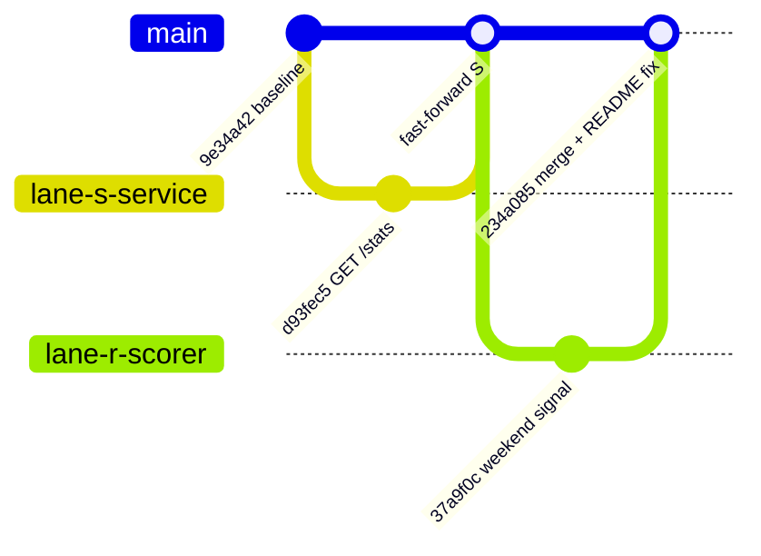

# Parallel Worktree Execution Report

## Metadata

| Field | Value |
|-------|-------|
| **Task** | A3 — Mini Fraud Score System (parallel lane demo) |
| **Report location** | `Task/Advanced/A2/parallel-worktree-execution-report.md` |
| **Repository root** | `Task/Advanced/A3/` |
| **Base commit** | `9e34a42` — Baseline Mini Fraud Score System |
| **Integration commit** | `234a085` — merged `lane-s-service` + `lane-r-scorer` |
| **Executed** | 2026-06-16 |

---

## Executive summary

Two parallel git worktrees were created from the same baseline commit on `main`. Each lane made **independent, disjoint-directory changes**:

| Lane | Branch | Worktree path | Scope | Result |
|------|--------|---------------|-------|--------|
| **S** | `lane-s-service` | `Task/Advanced/A3-worktrees/lane-s-service` | `service/` + README | `GET /stats` endpoint + tests |
| **R** | `lane-r-scorer` | `Task/Advanced/A3-worktrees/lane-r-scorer` | `scorer/` + README | `weekend_transaction` scoring signal (+5) |

Lanes merged cleanly at the code level (`service/` vs `scorer/`). A **single intentional conflict** occurred in `README.md` (both lanes appended a "Parallel lane changelog" section). It was resolved manually by keeping both sections. Post-merge tests: **9/9 pytest passed**, **1/1 worker unit test passed** (2 integration tests skipped — no Rust binary built).



---

## 1. Commands used to create worktrees

All commands run from the A3 repository root.

### 1.1 Initialize repository and baseline

```bash
cd Task/Advanced/A3

# Track source only; ignore venv, node_modules, Rust target
cat > .gitignore <<'EOF'
service/.venv/
service/**/__pycache__/
service/.pytest_cache/
worker/node_modules/
scorer/target/
.DS_Store
EOF

git init -b main
git add .
git commit -m "Baseline Mini Fraud Score System for parallel worktree demo."
```

**Baseline commit:** `9e34a42`

### 1.2 Create parallel worktrees

```bash
mkdir -p ../A3-worktrees

git worktree add ../A3-worktrees/lane-s-service -b lane-s-service
git worktree add ../A3-worktrees/lane-r-scorer -b lane-r-scorer

git worktree list
```

**Output:**

```
/Users/divyanshupatel/Desktop/mf/Task/Advanced/A3                           9e34a42 [main]
/Users/divyanshupatel/Desktop/mf/Task/Advanced/A3-worktrees/lane-r-scorer   9e34a42 [lane-r-scorer]
/Users/divyanshupatel/Desktop/mf/Task/Advanced/A3-worktrees/lane-s-service  9e34a42 [lane-s-service]
```

### 1.3 Lane commits (in each worktree)

```bash
# Lane S
cd ../A3-worktrees/lane-s-service
git add service/ README.md
git commit -m "Lane S: add GET /stats endpoint for transaction counts."

# Lane R
cd ../A3-worktrees/lane-r-scorer
git add scorer/ README.md
git commit -m "Lane R: add weekend_transaction scoring signal (+5)."
```

### 1.4 Integration merge (orchestrator on `main`)

```bash
cd Task/Advanced/A3   # primary worktree

# Merge lane S first — fast-forward, no conflict
git merge lane-s-service

# Merge lane R second — README conflict, scorer auto-merged
git merge lane-r-scorer
# → CONFLICT (content): Merge conflict in README.md

# Resolve README (keep both lane changelog sections), then:
git add README.md
git commit -m "Merge lane-r-scorer: weekend_transaction signal with README reconcile."
```

### 1.5 Optional cleanup (not run)

```bash
git worktree remove ../A3-worktrees/lane-s-service
git worktree remove ../A3-worktrees/lane-r-scorer
git branch -d lane-s-service lane-r-scorer   # after merge
```

---

## 2. Branch and worktree names

| Role | Branch | Worktree directory | HEAD after lane work |
|------|--------|--------------------|----------------------|
| Orchestrator / integration | `main` | `Task/Advanced/A3/` | `234a085` |
| Lane S — FastAPI service | `lane-s-service` | `Task/Advanced/A3-worktrees/lane-s-service/` | `d93fec5` |
| Lane R — Rust scorer | `lane-r-scorer` | `Task/Advanced/A3-worktrees/lane-r-scorer/` | `37a9f0c` |

**Naming convention used:** `lane-{component}-{short-name}` — matches the decomposition in `Task/Advanced/A1/parallel-worktree-plan.md`.

---

## 3. Separate outputs from each lane

### 3.1 Lane S — `lane-s-service` (`d93fec5`)

**Files changed (5):**

| File | Change |
|------|--------|
| `service/app/models.py` | Added `TransactionStats` model |
| `service/app/store.py` | Added `counts()` method |
| `service/app/main.py` | Added `GET /stats` route |
| `service/tests/test_api.py` | Added `test_transaction_stats_reflect_store_state` |
| `README.md` | Documented `/stats` in API table + Lane S changelog |

**Lane S test output** (run inside `lane-s-service` worktree):

```
============================= test session starts ==============================
platform darwin -- Python 3.9.6, pytest-8.4.2
collected 9 items

tests/test_api.py::test_health PASSED
tests/test_api.py::test_ingest_transaction_returns_pending_record PASSED
tests/test_api.py::test_get_transaction_not_found PASSED
tests/test_api.py::test_list_pending_transactions PASSED
tests/test_api.py::test_submit_score_marks_transaction_scored PASSED
tests/test_api.py::test_submit_score_rejects_mismatched_transaction_id PASSED
tests/test_api.py::test_validation_rejects_non_positive_amount PASSED
tests/test_api.py::test_transaction_stats_reflect_store_state PASSED   ← new
tests/test_integration.py::test_worker_pipeline_via_api PASSED

============================== 9 passed in 2.00s ===============================
```

**New endpoint behavior:**

```bash
curl http://127.0.0.1:8000/stats
# → {"total":0,"pending":0,"scored":0}
```

---

### 3.2 Lane R — `lane-r-scorer` (`37a9f0c`)

**Files changed (2):**

| File | Change |
|------|--------|
| `scorer/src/lib.rs` | `weekend_transaction` signal (+5 on Sat/Sun UTC); new unit test |
| `README.md` | Risk rules table + Lane R changelog |

**Scoring rule added:**

| Signal | Points | Condition |
|--------|--------|-----------|
| `weekend_transaction` | +5 | `timestamp` falls on Saturday or Sunday (UTC) |

**Lane R test command:**

```bash
cd Task/Advanced/A3-worktrees/lane-r-scorer/scorer
cargo test
```

**Lane R test output:** `cargo` was **not available** in the execution environment (`command not found: cargo`). The lane commit includes unit test `weekend_transaction_adds_signal` which asserts score `5` and signal presence for `2026-06-14T14:30:00Z` (Saturday). Run `cargo test` locally after `rustup` install to verify.

**Logic excerpt (merged on `main`):**

```rust
let weekday = utc.weekday().num_days_from_monday();
if weekday >= 5 {
    score += 5;
    signals.push("weekend_transaction".to_string());
}
```

---

## 4. Final merge and reconcile steps

### Step 1 — Merge Lane S (no conflict)

```bash
git checkout main
git merge lane-s-service
```

```
Updating 9e34a42..d93fec5
Fast-forward
 README.md                 |  8 ++++++++
 service/app/main.py       |  7 +++++++
 service/app/models.py     |  6 ++++++
 service/app/store.py      | 15 +++++++++++++++
 service/tests/test_api.py | 20 ++++++++++++++++++++
 5 files changed, 56 insertions(+)
```

### Step 2 — Merge Lane R (README conflict)

```bash
git merge lane-r-scorer
```

```
Auto-merging README.md
CONFLICT (content): Merge conflict in README.md
Automatic merge failed; fix conflicts and then commit the result.

Changes to be committed:
    modified:   scorer/src/lib.rs    ← auto-merged cleanly
```

`scorer/src/lib.rs` merged without conflict because Lane S never touched `scorer/`.

### Step 3 — Resolve README conflict

**Conflict markers (both lanes edited the same trailing section):**

```markdown
## Parallel lane changelog

<<<<<<< HEAD
### Lane S — FastAPI service (`lane-s-service`)
- Added `GET /stats` for pipeline observability.
...
=======
### Lane R — Rust scorer (`lane-r-scorer`)
- Added `weekend_transaction` signal (+5) ...
>>>>>>> lane-r-scorer
```

**Resolution:** keep **both** lane subsections (union, not pick-one). This is the correct pattern when parallel agents document their own changelog in a shared file — merge by concatenation, not by choosing a winner.

```bash
git add README.md
git commit -m "Merge lane-r-scorer: weekend_transaction signal with README reconcile."
```

### Step 4 — Final commit graph

```
*   234a085 Merge lane-r-scorer: weekend_transaction signal with README reconcile.
|\  
| * 37a9f0c Lane R: add weekend_transaction scoring signal (+5).
* | d93fec5 Lane S: add GET /stats endpoint for transaction counts.
|/  
* 9e34a42 Baseline Mini Fraud Score System for parallel worktree demo.
```

---

## 5. Test results (post-merge on `main`)

### FastAPI — `pytest`

```bash
cd Task/Advanced/A3/service
source .venv/bin/activate
python -m pytest -v
```

| Suite | Passed | Failed | Skipped |
|-------|--------|--------|---------|
| `service/tests/` | **9** | 0 | 0 |

All pre-existing API tests plus new `test_transaction_stats_reflect_store_state` pass on integrated `main`.

### Node worker — `npm test`

```bash
cd Task/Advanced/A3/worker
npm test
```

| Suite | Passed | Failed | Skipped |
|-------|--------|--------|---------|
| `tests/scorer.test.js` | 1 | 0 | 0 |
| `tests/integration.test.js` | 0 | 0 | 2 (no Rust binary) |

Worker unit tests pass. Integration tests skip when `scorer/target/release/fraud-scorer` is absent.

### Rust — `cargo test`

| Status | Notes |
|--------|-------|
| **Not executed** | `cargo` / `rustc` not installed in this environment |
| **Expected** | 5 tests (4 existing + `weekend_transaction_adds_signal`) when run after `cargo build` |

**Recommended full verify after Rust install:**

```bash
cd Task/Advanced/A3/scorer
cargo test
cd ../service && python -m pytest -v
cd ../worker && npm test
```

---

## 6. Conflict notes

| File | Conflict? | Type | Resolution |
|------|-----------|------|------------|
| `service/app/*` | No | — | Lane R did not touch `service/` |
| `scorer/src/lib.rs` | No | — | Lane S did not touch `scorer/` |
| `README.md` | **Yes** | Content — both lanes appended `## Parallel lane changelog` | Manual union: keep Lane S + Lane R subsections |
| `contract/` | No | — | Unchanged by both lanes |
| `worker/` | No | — | Unchanged by both lanes |

### Why only README conflicted

Both lanes followed the pattern of updating shared documentation at the end of `README.md`. Git could auto-merge the API table (Lane S) and risk rules table (Lane R) because they are **different sections**, but the identical heading `## Parallel lane changelog` at the same file offset caused a content conflict.

### Prevention strategies (from A1 plan, validated here)

1. **Disjoint file ownership** — `service/` vs `scorer/` merged with zero code conflicts.
2. **Sequential contract lane** — schemas frozen before parallel lanes (already done in baseline).
3. **README ownership** — assign doc updates to integration lane only, or use per-lane doc files (`docs/lane-s.md`, `docs/lane-r.md`) merged by orchestrator.
4. **Merge order** — merge smaller / doc-only lanes last, or rebase lanes onto `main` before second merge to surface conflicts earlier.

---

## 7. Findings and recommendations

### What worked

- **Git worktrees** let two lanes check out different branches simultaneously without `git stash` / branch switching.
- **Directory-boundary decomposition** (Lane S = `service/`, Lane R = `scorer/`) eliminated code merge conflicts.
- **Lane-local test runs** before merge caught Lane S regressions early (9/9 green).
- **Fast-forward merge** of Lane S kept history linear until the second merge.

### What to watch

- Shared files (`README.md`, root config) are conflict magnets — treat as **integration-lane owned** or split per-lane docs.
- Rust toolchain must be present for full scorer verification; Python/Node lanes can green while Rust lane is unverified.
- Worktrees persist on disk (`A3-worktrees/`) — remove after merge to avoid stale edits.

### Reusable command cheat sheet

```bash
# Create lane from main
git worktree add ../A3-worktrees/<lane-name> -b <branch-name>

# List active worktrees
git worktree list

# Integrate (on main worktree)
git merge <branch-name>

# After integration
git worktree remove ../A3-worktrees/<lane-name>
```

---

## 8. Artifact index

| Artifact | Path |
|----------|------|
| Primary repo (integrated) | `Task/Advanced/A3/` |
| Lane S worktree | `Task/Advanced/A3-worktrees/lane-s-service/` |
| Lane R worktree | `Task/Advanced/A3-worktrees/lane-r-scorer/` |
| Decomposition plan (reference) | `Task/Advanced/A1/parallel-worktree-plan.md` |
| This execution report | `Task/Advanced/A2/parallel-worktree-execution-report.md` |
