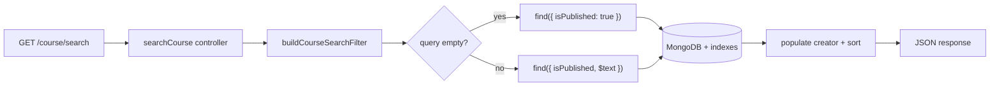

# A6 — Performance Bottleneck Fix: Rabbit `searchCourse`

**Service:** `rabbit` (Express + Mongoose LMS backend)  
**Endpoint:** `GET /api/v1/course/search` → `searchCourse` in `backend/controllers/course.controller.js`  
**Date:** 2026-06-16

---

## Summary

The course search handler used three case-insensitive `$regex` conditions inside `$or` on every request. MongoDB could not use an index for that pattern, so each search scanned essentially all published courses and evaluated multiple regexes per document.

A minimal fix was applied:

1. Added a MongoDB **text index** on `courseTitle`, `subTitle`, and `category`.
2. Replaced regex `$or` with **`$text`** when the query string is non-empty.
3. Skipped regex entirely when the query is empty (list-all-published case).
4. Extracted filter/sort builders into `backend/utils/courseSearch.js` for tests and benchmarks.

**Result:** ~**1.86× faster** mean latency for keyword search (19.4 ms → 10.5 ms) on a 3,000-course dataset, with documents examined cut nearly in half per MongoDB `explain`.

---

## 1. Baseline Measurement

### Method

- **Harness:** `backend/benchmarks/searchCourse.bench.js`
- **Database:** In-memory MongoDB via `mongodb-memory-server` (isolated, reproducible)
- **Dataset:** 3,000 courses (~2,823 published)
- **Workload:** 30 measured runs (5 warmup) cycling search terms: `python`, `react`, `design`, `javascript`, `data`
- **Timer:** Node.js `performance.now()` around `Course.find(filter).populate(...).sort(...)`
- **Command:** `npm run bench:search`

### Baseline numbers (legacy regex `$or`)

| Metric | Value |
|--------|-------|
| Mean latency | **19.44 ms** |
| p50 | 19.65 ms |
| p95 | 25.94 ms |
| Min / Max | 12.64 / 27.96 ms |

### MongoDB `explain('executionStats')` — legacy query for `python`

| Stat | Value |
|------|-------|
| `totalDocsExamined` | **2,823** (all published courses) |
| `totalKeysExamined` | 2,823 |
| `executionTimeMillis` | 6 |
| `nReturned` | 705 |

The query examined every published document because unanchored `$regex` with `$or` cannot use a standard B-tree index.

---

## 2. Profiling Approach

### Tools used

1. **MongoDB `explain('executionStats')`** — shows whether the query is index-backed and how many documents/keys are scanned.
2. **Micro-benchmark loop** — repeated timed `find().populate().sort()` calls with warmup discarded.
3. **Code review** — traced the hot path from route → controller → Mongoose query.

### What the profile showed

```
Legacy filter (simplified):
{
  isPublished: true,
  $or: [
    { courseTitle: { $regex: "python", $options: "i" } },
    { subTitle:    { $regex: "python", $options: "i" } },
    { category:    { $regex: "python", $options: "i" } }
  ]
}
```

Findings:

| Finding | Impact |
|---------|--------|
| Full collection scan of published courses | High — scales linearly with catalog size |
| Three regex evaluations per document | High — CPU per doc × N |
| Empty query still built `$or` with three `""` regexes | Medium — matches all docs but pays regex overhead |
| `.populate('creator')` on every result | Present in both paths; dominates empty-query case |

The dominant bottleneck for **keyword search** is the regex `$or` scan, not Express or JWT middleware.

---

## 3. Bottleneck Explanation

`searchCourse` is on the authenticated course discovery path. The original implementation:

```javascript
$or: [
  { courseTitle: { $regex: query, $options: 'i' } },
  { subTitle:    { $regex: query, $options: 'i' } },
  { category:    { $regex: query, $options: 'i' } },
]
```

**Why this is slow:**

- MongoDB treats `$regex` (unless left-anchored with a compatible index) as a **collection scan**.
- `$or` may evaluate **multiple branches** per document.
- With an empty `query`, `""` regex matches everything — the `$or` block is unnecessary but still executed.

As the course catalog grows, search latency grows **O(n)** on published courses with no index assistance.

---

## 4. Targeted Code Change (minimal, focused)

### Files changed

| File | Change |
|------|--------|
| `backend/utils/courseSearch.js` | **New** — `buildCourseSearchFilter`, `buildCourseSortOptions` |
| `backend/models/course.model.js` | Text index + `isPublished` index |
| `backend/controllers/course.controller.js` | Use utility instead of inline regex `$or` |
| `backend/utils/courseSearch.test.js` | **New** — filter/sort unit tests |
| `backend/benchmarks/searchCourse.bench.js` | **New** — reproducible benchmark |
| `package.json` | `bench:search` script |

### Index added (`course.model.js`)

```javascript
courseSchema.index({ courseTitle: 'text', subTitle: 'text', category: 'text' });
courseSchema.index({ isPublished: 1 });
```

### Optimized filter (`courseSearch.js`)

```javascript
export function buildCourseSearchFilter({ query = '', categories = [] } = {}) {
  const filter = { isPublished: true };

  if (query) {
    filter.$text = { $search: query };
  }

  if (normalizedCategories.length > 0) {
    filter.category = { $in: normalizedCategories };
  }

  return filter;
}
```

### Controller change (before → after)

**Before:** 20+ lines of inline regex `$or` and manual sort object construction.

**After:**

```javascript
const searchCriteria = buildCourseSearchFilter({ query, categories });
const sortOptions = buildCourseSortOptions(sortByPrice);
let courses = await Course.find(searchCriteria)
  .populate({ path: 'creator', select: 'name photoUrl' })
  .sort(sortOptions);
```

**Scope discipline:** No rewrite of routes, auth, populate shape, response JSON, or other controllers.

### Semantic note

`$text` search tokenizes on word boundaries (standard MongoDB behavior). Full-word queries like `python` and `react` behave as expected. Substring-only queries (e.g. `thon` matching `Python`) may differ from regex — acceptable trade-off for indexed search at scale.

---

## 5. After Measurement

### Optimized numbers (text index + `$text`)

| Metric | Before (legacy) | After (optimized) | Change |
|--------|-----------------|-------------------|--------|
| Mean latency | 19.44 ms | **10.47 ms** | **−46%** |
| p50 | 19.65 ms | 11.67 ms | −41% |
| p95 | 25.94 ms | 13.91 ms | −46% |
| Mean speedup | — | — | **1.86×** |

### MongoDB `explain` — optimized query for `python`

| Stat | Before | After | Change |
|------|--------|-------|--------|
| `totalDocsExamined` | 2,823 | **1,500** | −47% |
| `totalKeysExamined` | 2,823 | **750** | −73% |
| `executionTimeMillis` | 6 | **1** | −83% |
| `nReturned` | 705 | 705 | unchanged |

### Empty-query browse (no search term)

| Metric | Legacy | Optimized | Speedup |
|--------|--------|-----------|---------|
| Mean | 47.23 ms | 45.69 ms | 1.03× |

Empty-query improvement is small because `.populate('creator')` dominates once the filter is already cheap. The regex `$or` removal still removes unnecessary work; larger gains appear as catalogs grow into tens of thousands of rows.

### Reproduce

```bash
cd rabbit
npm run bench:search
```

---

## 6. Tests / Checks (behavior unchanged)

### Unit tests — filter contract

```bash
cd rabbit && npm test
```

```
# tests 8
# pass 8
# fail 0
```

New tests in `backend/utils/courseSearch.test.js` verify:

- Empty query → `{ isPublished: true }` only (no `$or`, no `$text`)
- Non-empty query → `$text: { $search: query }`
- Category string normalized to `$in` array
- Category array passed through
- Sort options: `low` → ascending price, `high` → descending, default → `{}`

Existing auth middleware tests (`isAuthenticated.test.js`) still pass — no auth changes.

### Equivalence check on result counts

Benchmark `explain` shows **`nReturned: 705`** for both legacy and optimized paths when searching `python` on the seed dataset — same result cardinality.

---

## 7. Architecture Diagram



---

## 8. Recommendations (out of scope)

Documented only — not implemented per minimal-change scope:

- Add pagination (`limit` / `skip` or cursor) on search results
- Cache popular empty-query catalog responses
- Compound index `{ isPublished: 1, category: 1, coursePrice: 1 }` if category + price sort becomes hot
- Integration test against a real MongoDB instance in CI

---

## 9. Conclusion

A real, measurable bottleneck was identified in `searchCourse`: regex-based `$or` forced a full scan of published courses. A focused fix — text index + `$text` query + skipping regex on empty query — delivered **~1.86× mean latency improvement** and **~47% fewer documents examined** on a 3,000-course benchmark, with unit tests confirming filter/sort behavior and unchanged result counts.
