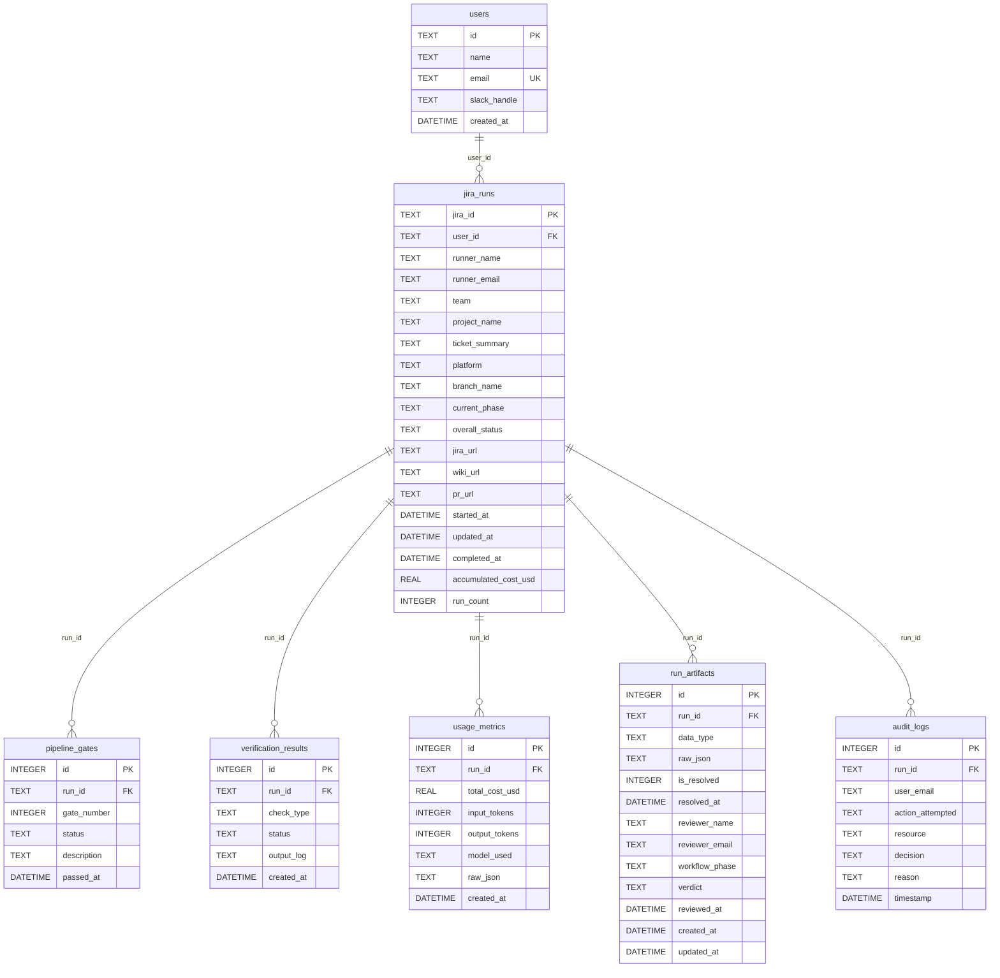

# ER Diagram Report

## Metadata

| Field | Value |
|-------|-------|
| **Agent name** | repo-er-diagram |
| **Started at** | 2026-06-16T09:00:00.000Z |
| **Completed at** | 2026-06-16T09:02:15.000Z |
| **Duration** | 2m 15s |
| **Repository** | /Users/divyanshupatel/Desktop/mf/aiAgents/pml-ai-agents |
| **Repo name** | pml-ai-agents |
| **Stack detected** | Node.js (Express dashboard) + SQLite3 (`sqlite3` npm package) |
| **Database engine** | SQLite (file: `fe_agents.db`, default path relative to `dashboard/server/db.js`) |
| **Schema sources found** | 2 (`init_db.sql`, runtime migrations in `dashboard/server/db.js`) |
| **Tables found** | 7 |
| **Entities found** | 7 |

## Summary

The pml-ai-agents repository persists pipeline run telemetry in a single SQLite database. Schema is declared in `init_db.sql` and applied at startup by `dashboard/server/db.js`. Seven active tables form a star schema around `jira_runs`: `users` is the parent of runs; `pipeline_gates`, `verification_results`, `usage_metrics`, `run_artifacts`, and `audit_logs` all reference runs via `run_id` → `jira_runs.jira_id`. The legacy `artifacts` table is explicitly dropped at startup and is excluded from this diagram.

## Tables & Entities

| # | Name | Kind | Primary key | Source |
|---|------|------|-------------|--------|
| 1 | users | table | id (TEXT) | aiAgents/pml-ai-agents/init_db.sql:2 |
| 2 | jira_runs | table | jira_id (TEXT) | aiAgents/pml-ai-agents/init_db.sql:11 |
| 3 | pipeline_gates | table | id (INTEGER AUTOINCREMENT) | aiAgents/pml-ai-agents/init_db.sql:35 |
| 4 | verification_results | table | id (INTEGER AUTOINCREMENT) | aiAgents/pml-ai-agents/init_db.sql:47 |
| 5 | usage_metrics | table | id (INTEGER) | aiAgents/pml-ai-agents/init_db.sql:58 |
| 6 | run_artifacts | table | id (INTEGER AUTOINCREMENT) | aiAgents/pml-ai-agents/init_db.sql:71 |
| 7 | audit_logs | table | id (INTEGER AUTOINCREMENT) | aiAgents/pml-ai-agents/init_db.sql:108 |

### users

**Source:** `aiAgents/pml-ai-agents/init_db.sql:2`

| Column | Type | Nullable | Default | Constraints | Source |
|--------|------|----------|---------|-------------|--------|
| id | TEXT | NO | — | PRIMARY KEY (UUID) | init_db.sql:3 |
| name | TEXT | NO | — | NOT NULL | init_db.sql:4 |
| email | TEXT | NO | — | NOT NULL, UNIQUE | init_db.sql:5 |
| slack_handle | TEXT | YES | — | — | init_db.sql:6 |
| created_at | DATETIME | YES | CURRENT_TIMESTAMP | — | init_db.sql:7 |

**Primary key:** `id` — `init_db.sql:3`

**Foreign keys:** none

**Inferred relationships:** none

**Application usage:** `dashboard/server/queries/users.js:6` (`INSERT OR IGNORE INTO users`)

---

### jira_runs

**Source:** `aiAgents/pml-ai-agents/init_db.sql:11`

| Column | Type | Nullable | Default | Constraints | Source |
|--------|------|----------|---------|-------------|--------|
| jira_id | TEXT | NO | — | PRIMARY KEY | init_db.sql:12 |
| user_id | TEXT | YES | — | FK → users.id | init_db.sql:13, :31 |
| runner_name | TEXT | YES | — | — | init_db.sql:14 |
| runner_email | TEXT | YES | — | — | init_db.sql:15 |
| team | TEXT | YES | — | — | init_db.sql:16 |
| project_name | TEXT | YES | — | — | init_db.sql:17 |
| ticket_summary | TEXT | YES | — | — | init_db.sql:18 |
| platform | TEXT | YES | — | CHECK IN ('react','flutter','android','ios','java-spring','unknown') | init_db.sql:19 |
| branch_name | TEXT | YES | — | — | init_db.sql:20 |
| current_phase | TEXT | YES | — | — | init_db.sql:21 |
| overall_status | TEXT | YES | in_progress | CHECK IN ('in_progress','completed','failed','blocked') | init_db.sql:22 |
| jira_url | TEXT | YES | — | — | init_db.sql:23 |
| wiki_url | TEXT | YES | — | — | init_db.sql:24 |
| pr_url | TEXT | YES | — | — | init_db.sql:25 |
| started_at | DATETIME | YES | CURRENT_TIMESTAMP | — | init_db.sql:26 |
| updated_at | DATETIME | YES | CURRENT_TIMESTAMP | — | init_db.sql:27 |
| completed_at | DATETIME | YES | — | — | init_db.sql:28 |
| accumulated_cost_usd | REAL | YES | 0 | — | init_db.sql:29 |
| run_count | INTEGER | YES | 1 | — | init_db.sql:30 |

**Primary key:** `jira_id` — `init_db.sql:12`

**Foreign keys:**

| Column | References | On delete/update | Source |
|--------|------------|------------------|--------|
| user_id | users.id | not specified | init_db.sql:31 |

**Inferred relationships:**

| From | To | Basis | Source |
|------|----|-------|--------|
| jira_runs.user_id | users.id | explicit FK + `LEFT JOIN users u ON r.user_id = u.id` | init_db.sql:31; dashboard/server/queries/runs.js:53 |

**Application usage:** `dashboard/server/queries/runs.js:8` (`INSERT INTO jira_runs`), `runs.js:52` (`FROM jira_runs r`)

---

### pipeline_gates

**Source:** `aiAgents/pml-ai-agents/init_db.sql:35`

| Column | Type | Nullable | Default | Constraints | Source |
|--------|------|----------|---------|-------------|--------|
| id | INTEGER | NO | AUTOINCREMENT | PRIMARY KEY | init_db.sql:36 |
| run_id | TEXT | YES | — | FK → jira_runs.jira_id | init_db.sql:37, :43 |
| gate_number | INTEGER | YES | — | CHECK BETWEEN 1 AND 8 | init_db.sql:38 |
| status | TEXT | YES | — | CHECK IN ('pending','in_progress','passed','blocked') | init_db.sql:39 |
| description | TEXT | YES | — | — | init_db.sql:40 |
| passed_at | DATETIME | YES | — | — | init_db.sql:41 |

**Primary key:** `id` — `init_db.sql:36`

**Unique constraints:** `(run_id, gate_number)` — `init_db.sql:42`

**Foreign keys:**

| Column | References | On delete/update | Source |
|--------|------------|------------------|--------|
| run_id | jira_runs.jira_id | not specified | init_db.sql:43 |

**Inferred relationships:**

| From | To | Basis | Source |
|------|----|-------|--------|
| pipeline_gates.run_id | jira_runs.jira_id | explicit FK + `WHERE run_id = ?` queries | init_db.sql:43; dashboard/server/queries/gates.js:15 |

**Application usage:** `dashboard/server/queries/gates.js:5` (`INSERT INTO pipeline_gates`)

---

### verification_results

**Source:** `aiAgents/pml-ai-agents/init_db.sql:47`

| Column | Type | Nullable | Default | Constraints | Source |
|--------|------|----------|---------|-------------|--------|
| id | INTEGER | NO | AUTOINCREMENT | PRIMARY KEY | init_db.sql:48 |
| run_id | TEXT | YES | — | FK → jira_runs.jira_id | init_db.sql:49, :54 |
| check_type | TEXT | YES | — | CHECK IN ('types','lint','tests','build','a11y') | init_db.sql:50 |
| status | TEXT | YES | — | CHECK IN ('pass','fail','warn') | init_db.sql:51 |
| output_log | TEXT | YES | — | — | init_db.sql:52 |
| created_at | DATETIME | YES | CURRENT_TIMESTAMP | — | init_db.sql:53 |

**Primary key:** `id` — `init_db.sql:48`

**Foreign keys:**

| Column | References | On delete/update | Source |
|--------|------------|------------------|--------|
| run_id | jira_runs.jira_id | not specified | init_db.sql:54 |

**Inferred relationships:** none beyond explicit FK (no application queries found in repo)

**Application usage:** none found — table is defined in schema only

---

### usage_metrics

**Source:** `aiAgents/pml-ai-agents/init_db.sql:58`

| Column | Type | Nullable | Default | Constraints | Source |
|--------|------|----------|---------|-------------|--------|
| id | INTEGER | NO | — | PRIMARY KEY | init_db.sql:59 |
| run_id | TEXT | YES | — | FK → jira_runs.jira_id | init_db.sql:60, :67 |
| total_cost_usd | REAL | YES | — | — | init_db.sql:61 |
| input_tokens | INTEGER | YES | — | — | init_db.sql:62 |
| output_tokens | INTEGER | YES | — | — | init_db.sql:63 |
| model_used | TEXT | YES | — | — | init_db.sql:64 |
| raw_json | TEXT | YES | — | — | init_db.sql:65 |
| created_at | DATETIME | YES | CURRENT_TIMESTAMP | — | init_db.sql:66 |

**Primary key:** `id` — `init_db.sql:59`

**Foreign keys:**

| Column | References | On delete/update | Source |
|--------|------------|------------------|--------|
| run_id | jira_runs.jira_id | not specified | init_db.sql:67 |

**Inferred relationships:**

| From | To | Basis | Source |
|------|----|-------|--------|
| usage_metrics.run_id | jira_runs.jira_id | explicit FK + subquery `WHERE run_id = r.jira_id` | init_db.sql:67; dashboard/server/queries/runs.js:46 |

**Application usage:** `dashboard/server/queries/usage.js:5` (`INSERT INTO usage_metrics`)

---

### run_artifacts

**Source:** `aiAgents/pml-ai-agents/init_db.sql:71` (rebuild migration mirrors same shape at `dashboard/server/db.js:49`)

| Column | Type | Nullable | Default | Constraints | Source |
|--------|------|----------|---------|-------------|--------|
| id | INTEGER | NO | AUTOINCREMENT | PRIMARY KEY | init_db.sql:72 |
| run_id | TEXT | NO | — | FK → jira_runs.jira_id, NOT NULL | init_db.sql:73, :91 |
| data_type | TEXT | NO | — | NOT NULL, CHECK (11 allowed values incl. `code-review`) | init_db.sql:74-78; db.js:52-55 |
| raw_json | TEXT | NO | — | NOT NULL | init_db.sql:79 |
| is_resolved | INTEGER | YES | 0 | — | init_db.sql:80 |
| resolved_at | DATETIME | YES | — | — | init_db.sql:81 |
| reviewer_name | TEXT | YES | — | added via migration | init_db.sql:83; db.js:60 |
| reviewer_email | TEXT | YES | — | added via migration | init_db.sql:84; db.js:61 |
| workflow_phase | TEXT | YES | — | added via migration | init_db.sql:85; db.js:62 |
| verdict | TEXT | YES | — | added via migration | init_db.sql:86; db.js:63 |
| reviewed_at | DATETIME | YES | — | added via migration | init_db.sql:87; db.js:64 |
| created_at | DATETIME | YES | CURRENT_TIMESTAMP | — | init_db.sql:88 |
| updated_at | DATETIME | YES | CURRENT_TIMESTAMP | — | init_db.sql:89 |

**Primary key:** `id` — `init_db.sql:72`

**Unique constraints:** `(run_id, data_type)` — `init_db.sql:90`

**Foreign keys:**

| Column | References | On delete/update | Source |
|--------|------------|------------------|--------|
| run_id | jira_runs.jira_id | not specified | init_db.sql:91 |

**Inferred relationships:**

| From | To | Basis | Source |
|------|----|-------|--------|
| run_artifacts.run_id | jira_runs.jira_id | explicit FK + `LEFT JOIN jira_runs r ON r.jira_id = a.run_id` | init_db.sql:91; dashboard/server/routes/reviews.js:77 |

**Application usage:** `dashboard/server/queries/artifacts.js:17` (`INSERT INTO run_artifacts`)

---

### audit_logs

**Source:** `aiAgents/pml-ai-agents/init_db.sql:108`

| Column | Type | Nullable | Default | Constraints | Source |
|--------|------|----------|---------|-------------|--------|
| id | INTEGER | NO | AUTOINCREMENT | PRIMARY KEY | init_db.sql:109 |
| run_id | TEXT | YES | — | FK → jira_runs.jira_id | init_db.sql:110, :117 |
| user_email | TEXT | YES | — | — | init_db.sql:111 |
| action_attempted | TEXT | YES | — | — | init_db.sql:112 |
| resource | TEXT | YES | — | — | init_db.sql:113 |
| decision | TEXT | YES | — | — | init_db.sql:114 |
| reason | TEXT | YES | — | — | init_db.sql:115 |
| timestamp | DATETIME | YES | CURRENT_TIMESTAMP | — | init_db.sql:116 |

**Primary key:** `id` — `init_db.sql:109`

**Foreign keys:**

| Column | References | On delete/update | Source |
|--------|------------|------------------|--------|
| run_id | jira_runs.jira_id | not specified | init_db.sql:117 |

**Inferred relationships:** none beyond explicit FK

**Application usage:** `dashboard/server/queries/audit.js:5` (`INSERT INTO audit_logs`)

---

## Relationships Summary

| # | Parent | Child | Cardinality | Type | Source |
|---|--------|-------|-------------|------|--------|
| 1 | users | jira_runs | 1:N | explicit FK (`user_id`) | init_db.sql:31 |
| 2 | jira_runs | pipeline_gates | 1:N | explicit FK (`run_id`) | init_db.sql:43 |
| 3 | jira_runs | verification_results | 1:N | explicit FK (`run_id`) | init_db.sql:54 |
| 4 | jira_runs | usage_metrics | 1:N | explicit FK (`run_id`) | init_db.sql:67 |
| 5 | jira_runs | run_artifacts | 1:N | explicit FK (`run_id`) | init_db.sql:91 |
| 6 | jira_runs | audit_logs | 1:N | explicit FK (`run_id`) | init_db.sql:117 |

## Mermaid ER Diagram

## Discovery Notes

### Files examined

- `aiAgents/pml-ai-agents/init_db.sql` — canonical schema (7 `CREATE TABLE` statements, 5 indexes)
- `aiAgents/pml-ai-agents/dashboard/server/db.js` — DB connection, `init_db.sql` execution, idempotent migrations, dropped `artifacts` table
- `aiAgents/pml-ai-agents/dashboard/server/queries/users.js` — `users` inserts
- `aiAgents/pml-ai-agents/dashboard/server/queries/runs.js` — `jira_runs` CRUD and JOIN to `users`
- `aiAgents/pml-ai-agents/dashboard/server/queries/gates.js` — `pipeline_gates` upserts
- `aiAgents/pml-ai-agents/dashboard/server/queries/usage.js` — `usage_metrics` inserts
- `aiAgents/pml-ai-agents/dashboard/server/queries/artifacts.js` — `run_artifacts` upserts
- `aiAgents/pml-ai-agents/dashboard/server/queries/audit.js` — `audit_logs` inserts
- `aiAgents/pml-ai-agents/dashboard/server/routes/reviews.js` — JOIN `run_artifacts` ↔ `jira_runs`
- `aiAgents/pml-ai-agents/dashboard/scripts/seed-dummy-data.js` — seed/delete patterns confirming table names

### Deprecated / dropped objects

- **`artifacts` table** — explicitly dropped at startup (`DROP TABLE IF EXISTS artifacts`) because it was superseded by `run_artifacts`. Source: `dashboard/server/db.js:18-22`. Not included in active ER diagram.

### Ambiguities & gaps

- **`verification_results`** is defined in `init_db.sql:47-55` with a foreign key to `jira_runs`, but no `INSERT`, `SELECT`, or `UPDATE` against this table was found anywhere in the repository. It appears to be schema prepared for future use.
- **`usage_metrics.id`** is `INTEGER PRIMARY KEY` without `AUTOINCREMENT` in `init_db.sql:59`; the application does not show how `id` values are assigned on insert (`usage.js:5` omits `id` from the column list).
- **ON DELETE / ON UPDATE** behavior is not specified on any foreign key constraint.

### Workspace scan (sibling repos)

A repo-wide search for `CREATE TABLE` and `@Entity` under `/Users/divyanshupatel/Desktop/mf` found **only** `aiAgents/pml-ai-agents/init_db.sql`. Other workspace packages (`mf-h5`, `mf-api-mock-service`, `paytm-wealth-mock-api-service`, `sip-product-frontend`, `pml-widget-eq`, `Task/Basics/B4`, `Task/Basics/B5`) contain no SQL migrations or ORM entity definitions. `Task/Basics/B4` uses in-memory Pydantic models (`app/models.py`) with no database persistence.
