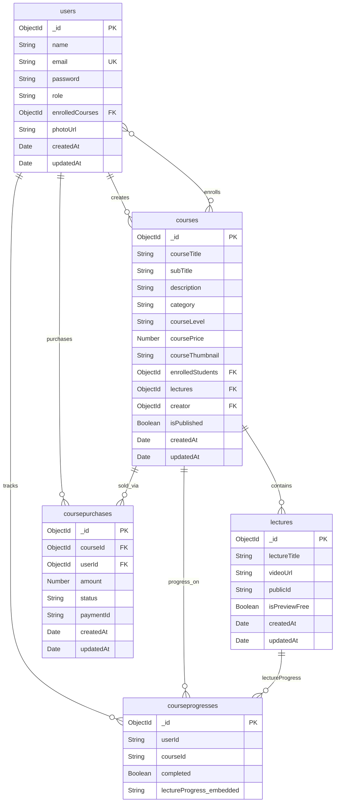

# ER Diagram Report

## Metadata

| Field | Value |
|-------|-------|
| **Agent name** | repo-er-diagram |
| **Started at** | 2026-06-16T13:45:00Z |
| **Completed at** | 2026-06-16T13:47:14Z |
| **Duration** | 2m 14s |
| **Repository** | ./rabbit |
| **Repo name** | rabbit |
| **Stack detected** | Node.js + Express.js (backend), React + Redux Toolkit (frontend) |
| **Database engine** | MongoDB (Mongoose ORM v8.9.2) |
| **Schema sources found** | 5 |
| **Tables found** | 5 |
| **Entities found** | 5 |

## Summary

The **rabbit** LMS repository persists all application data in **MongoDB** via **Mongoose** schemas in `backend/models/`. There are five collections (`users`, `courses`, `lectures`, `coursepurchases`, `courseprogresses`) with no SQL migrations or separate schema files. **User** and **Course** form the hub of the graph: users create courses, enroll via bidirectional array references, purchase through **CoursePurchase**, and track viewing via **CourseProgress**. **Lecture** documents are referenced from the `courses.lectures` array rather than storing a back-reference on the lecture document.

## Tables & Entities

| # | Name | Kind | Primary key | Source |
|---|------|------|-------------|--------|
| 1 | users | table / entity | `_id` (ObjectId) | backend/models/user.model.js:34 |
| 2 | courses | table / entity | `_id` (ObjectId) | backend/models/course.model.js:53 |
| 3 | lectures | table / entity | `_id` (ObjectId) | backend/models/lecture.model.js:22 |
| 4 | coursepurchases | table / entity | `_id` (ObjectId) | backend/models/purchaseCourse.model.js:32 |
| 5 | courseprogresses | table / entity | `_id` (ObjectId) | backend/models/courseProgress.model.js:15 |

> Mongoose collection names are inferred from model names using default pluralization (`User` → `users`, `CoursePurchase` → `coursepurchases`). No explicit `collection` option is set in any schema.

### users

**Source:** `backend/models/user.model.js:3`

| Column | Type | Nullable | Default | Constraints | Source |
|--------|------|----------|---------|-------------|--------|
| _id | ObjectId | NO | auto | PRIMARY KEY (MongoDB default) | MongoDB default |
| name | String | NO | — | required (schema typo: `requried`) | user.model.js:4-6 |
| email | String | NO | — | required, UNIQUE | user.model.js:8-11 |
| password | String | NO | — | required (schema typo: `requried`) | user.model.js:13-15 |
| role | String | YES | `'student'` | enum: `instructor`, `student` | user.model.js:17-20 |
| enrolledCourses | [ObjectId] | YES | `[]` | ref: `Course` | user.model.js:22-26 |
| photoUrl | String | YES | `""` | — | user.model.js:28-30 |
| createdAt | Date | NO | auto | timestamps | user.model.js:32 |
| updatedAt | Date | NO | auto | timestamps | user.model.js:32 |

**Primary key:** `_id` — MongoDB default ObjectId

**Foreign keys:**

| Column | References | On delete/update | Source |
|--------|------------|------------------|--------|
| enrolledCourses[] | courses._id | — | user.model.js:24-25 |

**Inferred relationships:** —

### courses

**Source:** `backend/models/course.model.js:3`

| Column | Type | Nullable | Default | Constraints | Source |
|--------|------|----------|---------|-------------|--------|
| _id | ObjectId | NO | auto | PRIMARY KEY | MongoDB default |
| courseTitle | String | NO | — | required | course.model.js:5-7 |
| subTitle | String | YES | — | — | course.model.js:9-10 |
| description | String | YES | — | — | course.model.js:12-13 |
| category | String | NO | — | required | course.model.js:15-17 |
| courseLevel | String | YES | — | enum: `Beginner`, `Medium`, `Advance` | course.model.js:19-21 |
| coursePrice | Number | YES | — | — | course.model.js:23-24 |
| courseThumbnail | String | YES | — | — | course.model.js:26-27 |
| enrolledStudents | [ObjectId] | YES | `[]` | ref: `User` | course.model.js:29-33 |
| lectures | [ObjectId] | YES | `[]` | ref: `Lecture` | course.model.js:35-39 |
| creator | ObjectId | YES | — | ref: `User` | course.model.js:41-43 |
| isPublished | Boolean | YES | `false` | — | course.model.js:45-47 |
| createdAt | Date | NO | auto | timestamps | course.model.js:50 |
| updatedAt | Date | NO | auto | timestamps | course.model.js:50 |

**Primary key:** `_id` — MongoDB default ObjectId

**Foreign keys:**

| Column | References | On delete/update | Source |
|--------|------------|------------------|--------|
| enrolledStudents[] | users._id | — | course.model.js:31-32 |
| lectures[] | lectures._id | — | course.model.js:37-38 |
| creator | users._id | — | course.model.js:42-43 |

**Inferred relationships:** —

### lectures

**Source:** `backend/models/lecture.model.js:3`

| Column | Type | Nullable | Default | Constraints | Source |
|--------|------|----------|---------|-------------|--------|
| _id | ObjectId | NO | auto | PRIMARY KEY | MongoDB default |
| lectureTitle | String | NO | — | required | lecture.model.js:5-7 |
| videoUrl | String | YES | — | — | lecture.model.js:9-10 |
| publicId | String | YES | — | — | lecture.model.js:12-13 |
| isPreviewFree | Boolean | YES | — | — | lecture.model.js:15-16 |
| createdAt | Date | NO | auto | timestamps | lecture.model.js:19 |
| updatedAt | Date | NO | auto | timestamps | lecture.model.js:19 |

**Primary key:** `_id` — MongoDB default ObjectId

**Foreign keys:** — (parent relationship is on `courses.lectures`, not on this document)

**Inferred relationships:**

| From | To | Basis | Source |
|------|----|-------|--------|
| courses.lectures[] | lectures._id | explicit ref + push on create | course.controller.js:213-217 |
| courses.lectures[] | lectures._id | `$pull` on delete | course.controller.js:308-310 |

### coursepurchases

**Source:** `backend/models/purchaseCourse.model.js:3`

| Column | Type | Nullable | Default | Constraints | Source |
|--------|------|----------|---------|-------------|--------|
| _id | ObjectId | NO | auto | PRIMARY KEY | MongoDB default |
| courseId | ObjectId | NO | — | required, ref: `Course` | purchaseCourse.model.js:5-8 |
| userId | ObjectId | NO | — | required, ref: `User` | purchaseCourse.model.js:10-13 |
| amount | Number | NO | — | required | purchaseCourse.model.js:15-17 |
| status | String | YES | `'pending'` | enum: `pending`, `completed`, `failed` | purchaseCourse.model.js:19-22 |
| paymentId | String | NO | — | required | purchaseCourse.model.js:24-26 |
| createdAt | Date | NO | auto | timestamps | purchaseCourse.model.js:29 |
| updatedAt | Date | NO | auto | timestamps | purchaseCourse.model.js:29 |

**Primary key:** `_id` — MongoDB default ObjectId

**Foreign keys:**

| Column | References | On delete/update | Source |
|--------|------------|------------------|--------|
| courseId | courses._id | — | purchaseCourse.model.js:7 |
| userId | users._id | — | purchaseCourse.model.js:12 |

**Inferred relationships:** —

### courseprogresses

**Source:** `backend/models/courseProgress.model.js:8`

| Column | Type | Nullable | Default | Constraints | Source |
|--------|------|----------|---------|-------------|--------|
| _id | ObjectId | NO | auto | PRIMARY KEY | MongoDB default |
| userId | String | YES | — | — (no `ref` declared) | courseProgress.model.js:9 |
| courseId | String | YES | — | — (no `ref` declared) | courseProgress.model.js:10 |
| completed | Boolean | YES | — | — | courseProgress.model.js:11 |
| lectureProgress | [subdocument] | YES | `[]` | embedded schema | courseProgress.model.js:12 |

**Embedded subdocument `lectureProgress` fields** (`courseProgress.model.js:3-6`):

| Column | Type | Nullable | Default | Constraints | Source |
|--------|------|----------|---------|-------------|--------|
| _id | ObjectId | NO | auto | subdocument PK (Mongoose default) | Mongoose default |
| lectureId | String | YES | — | — | courseProgress.model.js:4 |
| viewed | Boolean | YES | — | — | courseProgress.model.js:5 |

**Primary key:** `_id` — MongoDB default ObjectId

**Foreign keys:** — (no `ref` annotations in schema)

**Inferred relationships:**

| From | To | Basis | Source |
|------|----|-------|--------|
| courseprogresses.userId | users._id | lookup key in `findOne({courseId, userId})` | courseProgress.controller.js:41 |
| courseprogresses.courseId | courses._id | lookup key in `findOne({courseId, userId})` | courseProgress.controller.js:41 |
| lectureProgress.lectureId | lectures._id | compared to `lectureId` route param on update | courseProgress.controller.js:51-57 |

## Relationships Summary

| # | Parent | Child | Cardinality | Type | Source |
|---|--------|-------|-------------|------|--------|
| 1 | users | courses | M:N | explicit ref (`enrolledCourses` / `enrolledStudents`) | user.model.js:22-26, course.model.js:29-33 |
| 2 | users | courses | 1:N | explicit ref (`creator`) | course.model.js:41-43 |
| 3 | courses | lectures | 1:N | explicit ref (`lectures` array) | course.model.js:35-39 |
| 4 | users | coursepurchases | 1:N | explicit FK (`userId`) | purchaseCourse.model.js:10-13 |
| 5 | courses | coursepurchases | 1:N | explicit FK (`courseId`) | purchaseCourse.model.js:5-8 |
| 6 | users | courseprogresses | 1:N | inferred (`userId` lookup) | courseProgress.controller.js:41 |
| 7 | courses | courseprogresses | 1:N | inferred (`courseId` lookup) | courseProgress.controller.js:41 |
| 8 | lectures | courseprogresses.lectureProgress | 1:N | inferred (`lectureId` in embedded array) | courseProgress.controller.js:51-57 |

Enrollment M:N is maintained bidirectionally on purchase completion:

```117:127:rabbit/backend/controllers/purchaseCourse.controller.js
      await User.findByIdAndUpdate(
        purchase.userId,
        { $addToSet: { enrolledCourses: purchase.courseId._id } }, 
        { new: true }
      );

      
      await Course.findByIdAndUpdate(
        purchase.courseId._id,
        { $addToSet: { enrolledStudents: purchase.userId } }, 
        { new: true }
      );
```

## Mermaid ER Diagram



## Discovery Notes

### Files examined

- `rabbit/README.md` — confirms MongoDB + Mongoose stack; no schema DDL
- `rabbit/package.json` — root monorepo scripts; `mongoose@^8.9.2`
- `rabbit/backend/database/db.js` — MongoDB connection via `MONGO_URI`; no runtime migrations
- `rabbit/backend/index.js` — Express entry; wires routes only
- `rabbit/backend/models/user.model.js` — User schema
- `rabbit/backend/models/course.model.js` — Course schema
- `rabbit/backend/models/lecture.model.js` — Lecture schema
- `rabbit/backend/models/purchaseCourse.model.js` — CoursePurchase schema
- `rabbit/backend/models/courseProgress.model.js` — CourseProgress schema + embedded lectureProgress
- `rabbit/backend/controllers/user.controller.js` — `populate("enrolledCourses")` at line 98
- `rabbit/backend/controllers/course.controller.js` — `populate('creator')`, `populate('lectures')`; lecture push/pull
- `rabbit/backend/controllers/purchaseCourse.controller.js` — purchase creation, `populate("courseId")`, enrollment updates
- `rabbit/backend/controllers/courseProgress.controller.js` — progress CRUD by `userId`/`courseId` strings
- `rabbit/frontend/package.json` — React client; no local persistence layer

### Deprecated / dropped objects

- None found. No `DROP TABLE`, migration rollbacks, or runtime collection drops in application code.

### Ambiguities & gaps

- **CourseProgress refs are strings, not ObjectIds.** `userId` and `courseId` are typed `String` with no `ref`, yet `getCourseProgress` calls `.populate("courseId")` (`courseProgress.controller.js:9`), which will not resolve without a `ref` definition.
- **Bidirectional enrollment arrays** (`users.enrolledCourses` and `courses.enrolledStudents`) can drift if updated independently; only the Stripe webhook path updates both.
- **README mentions Admin role** but `users.role` enum only allows `instructor` and `student` (`user.model.js:19`).
- **No explicit MongoDB indexes** beyond the implicit unique index on `users.email`.
- **`lectureProgress` is embedded**, not a separate collection; `lectureId` stores string IDs, not ObjectId refs.
- **No SQL, Prisma, Flyway, or Liquibase** artifacts anywhere in the repo.

### Repos / packages with no persistence layer

- `rabbit/frontend/` — React + Redux Toolkit SPA; all data fetched from backend APIs, no client-side database.
