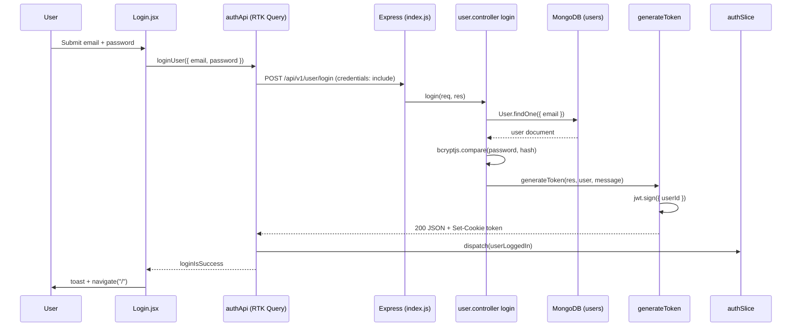

# E2E Flow Trace Report

## Metadata

| Field | Value |
|-------|-------|
| **Agent name** | repo-e2e-flow-tracer |
| **Started at** | 2026-06-16T10:00:00.000Z |
| **Completed at** | 2026-06-16T10:08:42.000Z |
| **Duration** | 8m 42s |
| **Repository** | `./rabbit` (`/Users/divyanshupatel/Desktop/mf/rabbit`) |
| **Repo name** | rabbit |
| **Flow traced** | `POST /api/v1/user/login` (user login — frontend form → Express API → MongoDB → JWT cookie) |
| **Flow kind** | `http-inbound` (with `http-outbound` frontend initiation) |
| **Stack detected** | React 18 + Vite + Redux Toolkit Query (frontend) · Node.js + Express 4 + Mongoose 8 (backend) · MongoDB |
| **Major steps documented** | 15 |
| **Side effects found** | 2 |

## Summary

No `flowTarget` was provided, so this report traces **`POST /api/v1/user/login`** — the most representative authenticated-entry flow in the repo. It is wired end-to-end from the React `Login` page through RTK Query to an Express route, `login` controller, MongoDB user lookup, bcrypt password verification, and JWT issuance via an httpOnly cookie. Terminal side effects are a **MongoDB read** on the `users` collection and a **Set-Cookie** response header; no database writes occur on the happy path.

## Entry Point

| Field | Value |
|-------|-------|
| **Kind** | `http-inbound` |
| **Identifier** | `POST /api/v1/user/login` |
| **File** | `backend/routes/user.route.js:8` |
| **Function** | `login` (imported from `user.controller.js`) |
| **Trigger** | User submits email/password on the Login page; frontend sends `POST` with JSON body and `credentials: 'include'` |

**Frontend initiation:** `frontend/src/pages/Login.jsx` → `handleRegistration('login')` → `useLoginUserMutation()` → RTK Query `loginUser` endpoint in `frontend/src/features/api/authApi.js`.

## Step-by-Step Call Path

| Step | File | Function | Role | Description | Next |
|------|------|----------|------|-------------|------|
| 1 | `frontend/src/pages/Login.jsx:64` | `handleRegistration` | UI handler | On login tab submit, calls `loginUser(loginInput)` with `{ email, password }` | `loginUser` mutation |
| 2 | `frontend/src/features/api/authApi.js:21` | `loginUser` (RTK endpoint) | API client | Builds `POST` to `login` relative URL on `USER_API` base | `fetchBaseQuery` |
| 3 | `frontend/src/features/api/authApi.js:8-11` | `fetchBaseQuery` config | HTTP transport | Sends request to `${VITE_BACKEND_URL}/api/v1/user/login` with `credentials: 'include'` | Express server |
| 4 | `backend/index.js:21-26` | `express.json()`, `cookieParser()`, `cors()` | middleware | Parses JSON body, reads cookies, applies CORS for `http://localhost:5173` | route dispatch |
| 5 | `backend/index.js:31` | `app.use("/api/v1/user", userRoute)` | router mount | Prefixes all user routes under `/api/v1/user` | `user.route.js` |
| 6 | `backend/routes/user.route.js:8` | `router.route("/login").post(login)` | route registration | Maps `POST /login` to `login` controller (no auth middleware) | `login()` |
| 7 | `backend/controllers/user.controller.js:44` | `login` | controller | Extracts `{ email, password }` from `req.body`; returns 401 if either missing | `User.findOne()` |
| 8 | `backend/controllers/user.controller.js:54` | `User.findOne({ email })` | repository / ORM | Queries MongoDB `users` collection for matching email | `bcryptjs.compare()` |
| 9 | `backend/controllers/user.controller.js:61` | `bcryptjs.compare(password, user.password)` | validation | Compares plaintext password to stored bcrypt hash | `generateToken()` |
| 10 | `backend/utils/generateToken.js:3` | `generateToken` | auth utility | Signs JWT and sets response cookie + JSON body | `jwt.sign()` |
| 11 | `backend/utils/generateToken.js:4` | `jwt.sign({ userId: user._id }, SECRET_KEY)` | token issuer | Creates 1-day JWT with `userId` claim | `res.cookie()` |
| 12 | `backend/utils/generateToken.js:8` | `res.cookie('token', token, …)` | response | Sets httpOnly `token` cookie (`sameSite: 'strict'`, 24h maxAge) and returns 200 JSON | HTTP response |
| 13 | `frontend/src/features/api/authApi.js:27` | `onQueryStarted` (loginUser) | client callback | On success, dispatches `userLoggedIn({ user: result.data.user })` to Redux | `userLoggedIn` |
| 14 | `frontend/src/features/authSlice.js:12` | `userLoggedIn` | state reducer | Stores `user` object in Redux `authSlice` state | UI re-render |
| 15 | `frontend/src/pages/Login.jsx:72` | `useEffect` (login success) | UI navigation | Shows success toast and `navigate('/')` on `loginIsSuccess` | — (flow ends) |

### Sub-call summaries

- **Step 4:** `connectDB()` runs at server boot (`backend/index.js:14`) via `mongoose.connect(process.env.MONGO_URI)` in `backend/database/db.js:5`, establishing the MongoDB connection pool used by step 8.
- **Step 8:** Mongoose model `User` is defined in `backend/models/user.model.js:34` against collection `users` (default pluralization).
- **Step 9:** On mismatch, controller returns 400 with `"Incorrect Password"` or `"Incorrect Email"` without reaching token generation.

## External Dependencies

| Dependency | Type | Used in | Purpose | Config source |
|------------|------|---------|---------|---------------|
| MongoDB (`users` collection) | database | `backend/controllers/user.controller.js:54` | Lookup user by email for credential verification | `process.env.MONGO_URI` — `backend/database/db.js:5` |
| `jsonwebtoken` | third-party-sdk | `backend/utils/generateToken.js:4` | Sign JWT with `userId` claim | `process.env.SECRET_KEY` — `backend/utils/generateToken.js:4` |
| `bcryptjs` | third-party-sdk | `backend/controllers/user.controller.js:61` | Compare submitted password to stored hash | N/A (in-process) |
| Backend API host | http-api | `frontend/src/features/api/authApi.js:4` | Frontend resolves login URL | `import.meta.env.VITE_BACKEND_URL` |
| CORS origin | other | `backend/index.js:23-26` | Allows browser credentialed requests from Vite dev server | Hardcoded `http://localhost:5173` |

## Side Effects

### Database

| Op | Target | Method / query | File | Confidence |
|----|--------|----------------|------|------------|
| READ | `users` | `User.findOne({ email })` → Mongoose `findOne` on `User` model | `backend/controllers/user.controller.js:54` | confirmed |

### Outbound APIs

_None on the login happy path._

### Queues / Events

_None._

### Other observable effects

| Effect | Target | Mechanism | File | Confidence |
|--------|--------|-----------|------|------------|
| WRITE (response header) | Browser cookie `token` | `res.cookie('token', token, { httpOnly: true, … })` | `backend/utils/generateToken.js:8` | confirmed |
| WRITE (in-memory) | Redux `authSlice.user` | `dispatch(userLoggedIn({ user }))` | `frontend/src/features/authSlice.js:12` | confirmed |

## Sequence Diagram

## Known Uncertainty

| # | Area | Description | What was tried |
|---|------|-------------|----------------|
| 1 | Env var naming | README documents `JWT_SECRET` but runtime code uses `process.env.SECRET_KEY` for signing and verification | Read `README.md:60`, `generateToken.js:4`, `isAuthenticated.js:13` |
| 2 | Password in API response | `login` passes the full Mongoose `user` document to `generateToken`, which serializes it in `res.json({ user })` without `.select('-password')` — password hash may be returned to the client | Traced `user.controller.js:68` → `generateToken.js:8-12` |
| 3 | `isAuthenticated` error path | `isAuthenticated` catch block logs but does not always send an HTTP response (unrelated to login route, but affects post-login protected calls) | Read `backend/middlewares/isAuthenticated.js:22-24` |
| 4 | Production API URL | `VITE_BACKEND_URL` value is not committed (env-only); actual deployed host is unknown | Checked `authApi.js:4`; no `.env` in repo |

### Files examined

- `README.md` — stack overview, env var docs
- `package.json` — root scripts and backend dependencies
- `frontend/package.json` — frontend stack (via glob)
- `backend/index.js` — Express bootstrap, middleware, route mounts
- `backend/database/db.js` — MongoDB connection
- `backend/routes/user.route.js` — login route registration
- `backend/controllers/user.controller.js` — login handler logic
- `backend/models/user.model.js` — User schema
- `backend/utils/generateToken.js` — JWT + cookie issuance
- `backend/middlewares/isAuthenticated.js` — auth middleware (context for post-login flows)
- `frontend/src/features/api/authApi.js` — RTK Query login client
- `frontend/src/pages/Login.jsx` — login UI and submit handler
- `frontend/src/features/authSlice.js` — Redux auth state
- `frontend/src/redux/store.js` — store wiring and `loadUser` on boot
- `backend/routes/course.route.js` — candidate flows reviewed during reconnaissance
- `backend/controllers/purchaseCourse.controller.js` — Stripe flow reviewed but not traced

### Not traced (out of scope)

- Stripe checkout / webhook purchase flow (`POST /api/v1/purchase/checkout/create-checkout-session`)
- Course CRUD, lecture management, media upload (Cloudinary)
- Protected routes using `isAuthenticated` after login (e.g. `GET /api/v1/user/profile`)
- MongoDB Atlas / Vercel deployment internals
- Frontend routing, protected route components, and unrelated UI sub-components
