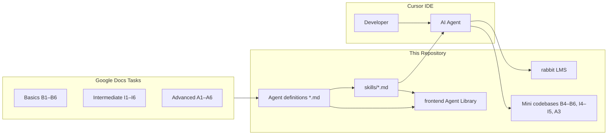

# Agent Task Library

A hands-on workspace for designing, documenting, and evaluating **Cursor AI agents**. Each agent is defined as a markdown prompt, paired with a **Cursor Skill** (`skills/`), sample output, and (where needed) a real codebase to run against.

**Live demo:** [Agent Library](https://task-phi-seven-94.vercel.app/) — browse all agent definitions, copy prompts, and view sample reports in the browser.

---

## What is in this repo?

| Folder | Purpose |
|--------|---------|
| [`Basics/`](Basics/) | **Beginner agent tasks** (Google Docs assignments) — read-only repo analysis agents |
| [`Intermediate/`](Intermediate/) | **Intermediate agent tasks** — deeper analysis, small code changes, bug diagnosis |
| [`Advanced/`](Advanced/) | **Advanced agent tasks** — modernization, PR review, parallel worktrees, multi-service systems |
| [`rabbit/`](rabbit/) | **Sample open-source repo** — a full-stack LMS used as the default target for most agents |
| [`frontend/`](frontend/) | **Agent Library web app** — Next.js UI deployed to Vercel |
| [`skills/`](skills/) | **Cursor Skills** — installable skill files that invoke each agent inside Cursor |

The **Basics**, **Intermediate**, and **Advanced** folders correspond to the task assignments documented in Google Docs. Each task folder typically contains:

- An **agent definition** (`*-agent.md`) — the full prompt/spec a developer (or Cursor) follows
- A **sample output report** — what a successful run looks like
- Sometimes a **mini codebase** (B4–B6, I4–I5, A3) — a small, self-contained project agents can analyze or modify

---

## Repository layout

```
task/
├── README.md                 ← you are here
├── Basics/                   ← Google Docs: beginner tasks
│   ├── B1/                   agent: Repo Structure Mapper + sample report
│   ├── B2/                   agent: Route & API Mapper + sample report
│   ├── B3/                   agent: Test Discovery + sample report
│   ├── B4/                   sample FastAPI Transaction Ledger API
│   ├── B5/                   sample Node.js Transaction Ledger API
│   └── B6/                   sample Rust log-counter CLI
├── Intermediate/             ← Google Docs: intermediate tasks
│   ├── I1/                   agent: ER Diagram + sample report
│   ├── I2/                   agent: E2E Flow Tracer + sample report
│   ├── I3/                   agent: Minimal Change + sample report
│   ├── I4/                   sample Currency Converter (FastAPI + Node CLI)
│   ├── I5/                   sample Currency Converter (Dockerized)
│   └── I6/                   agent: Seeded Bug Diagnosis + sample report
├── Advanced/                 ← Google Docs: advanced tasks
│   ├── A1/                   parallel worktree decomposition plan
│   ├── A2/                   parallel worktree execution report (demo)
│   ├── A3/                   Mini Fraud Score System (FastAPI + Node + Rust)
│   ├── A3-worktrees/         git worktree lane demos (service + scorer)
│   ├── A4/                   agent: Repo Modernization + sample report
│   ├── A5/                   agent: PR Review + sample report
│   └── A6/                   performance optimization report (rabbit)
├── rabbit/                   ← primary test target (LMS open-source repo)
├── frontend/                 ← Agent Library Next.js app → Vercel
└── skills/                   ← Cursor Skills (one per published agent)
```

---

## How the pieces connect



1. **Google Docs** defines what each task should accomplish and acceptance criteria.
2. **Agent definitions** (`Basics/B1/repo-structure-mapper-agent.md`, etc.) are the executable prompts.
3. **Cursor Skills** (`skills/`) wrap those prompts so you can invoke them with `/skill-name` or by having Cursor auto-load them.
4. **`rabbit/`** (and smaller sample repos) are real codebases agents analyze or patch.
5. **`frontend/`** publishes the agent catalog so anyone can browse definitions and demo outputs without opening the repo.

---

## Agent catalog

Nine agents are published in the [Agent Library](https://task-phi-seven-94.vercel.app/). Each maps 1:1 to a task folder and a Cursor Skill.

### Basics — read-only analysis

| ID | Agent | Skill folder | Target repo (sample run) | What it does |
|----|-------|--------------|--------------------------|--------------|
| **B1** | Repo Structure Mapper | `skills/basics-repo-structure-mapper/` | `rabbit/` | Inventories classes, services, controllers, models, configs, jobs, etc. Writes `repo-structure-map.md`. |
| **B2** | Route & API Mapper | `skills/basics-repo-route-api-mapper/` | `rabbit/` | Maps every frontend route and backend API endpoint. Writes `route-api-map.md`. |
| **B3** | Test Discovery | `skills/basics-repo-test-discovery/` | `rabbit/` | Detects test frameworks, runs tests, captures output. Writes `test-discovery-report.md`. |

### Intermediate — analysis + small changes

| ID | Agent | Skill folder | Target repo (sample run) | What it does |
|----|-------|--------------|--------------------------|--------------|
| **I1** | ER Diagram | `skills/intermediate-repo-er-diagram/` | `rabbit/` | Discovers MongoDB/Mongoose entities, keys, relationships. Outputs Mermaid ER diagram. |
| **I2** | E2E Flow Tracer | `skills/intermediate-repo-e2e-flow-tracer/` | `rabbit/` | Traces one HTTP/event/cron flow end-to-end with sequence diagram. |
| **I3** | Minimal Change | `skills/intermediate-repo-minimal-change/` | `rabbit/` | Picks an unfamiliar module, makes one surgical fix + test, writes change report. |
| **I6** | Bug Diagnosis | `skills/intermediate-repo-seeded-bug-diagnosis/` | `rabbit/` | Reproduces a seeded bug, finds root cause, applies minimal fix, verifies. |

### Advanced — modernization, review, orchestration

| ID | Agent | Skill folder | Target (sample run) | What it does |
|----|-------|--------------|---------------------|--------------|
| **A4** | Repo Modernization | `skills/advance-repo-modernization/` | `frontend/` | Audits deps/tooling/CI, prioritizes upgrades, implements highest-value lowest-risk step. |
| **A5** | PR Review | `skills/advance-pr-review/` | External PR (e.g. GitHub) | Structured review: correctness, security, tests, performance, maintainability. |

### Supporting tasks (not in the web UI yet)

These folders are part of the Google Docs curriculum but are **sample codebases** or **orchestration docs** rather than standalone published agents:

| ID | Folder | Contents |
|----|--------|----------|
| **B4** | `Basics/B4/` | FastAPI Transaction Ledger — deposits, withdrawals, balance |
| **B5** | `Basics/B5/` | Node.js version of the same ledger API |
| **B6** | `Basics/B6/` | Rust CLI that counts INFO/WARN/ERROR lines in log files |
| **I4** | `Intermediate/I4/` | Currency converter — FastAPI service + Node CLI client |
| **I5** | `Intermediate/I5/` | Dockerized currency converter (multi-stage build + compose) |
| **A1** | `Advanced/A1/` | Parallel worktree **plan** for building A3 without merge conflicts |
| **A2** | `Advanced/A2/` | Parallel worktree **execution report** — demo of lanes S + R merged |
| **A3** | `Advanced/A3/` | Mini Fraud Score System — FastAPI ingestion, Node worker, Rust scorer |
| **A6** | `Advanced/A6/` | Performance fix report — MongoDB text index for `rabbit` course search |

---

## `rabbit/` — the sample open-source repo

**rabbit** is a [Learning Management System (LMS)](rabbit/README.md) cloned/adapted from an open-source project. It is the **default sandbox** where most agents are tested.

| Layer | Stack |
|-------|-------|
| Frontend | React 18, Vite, Redux Toolkit, Tailwind CSS, shadcn/ui |
| Backend | Node.js (ESM), Express 4, Mongoose 8, JWT auth |
| Database | MongoDB |
| Features | Course CRUD, role-based access (Admin/Instructor/Student), Stripe payments, Cloudinary uploads |

**Why rabbit?** It is large enough to be realistic (controllers, models, middleware, frontend routes, tests) but small enough for an agent to scan in one session. Sample reports in B1–B3, I1–I3, and I6 all target `rabbit/`.

### Quick start (rabbit)

```bash
cd rabbit
npm install

# Configure MongoDB (see rabbit/README.md)
# Create .env with MONGO_URI, JWT_SECRET, etc.

npm run dev
# Frontend: http://localhost:5173 (Vite)
# Backend:  http://localhost:3000 (Express)
```

---

## `frontend/` — Agent Library (Vercel)

The **Agent Library** is a [Next.js 16](frontend/) app that renders every published agent definition and its sample output as readable markdown.

| | |
|---|---|
| **Live URL** | https://task-phi-seven-94.vercel.app/ |
| **Stack** | Next.js 16 (App Router), React 19, TypeScript, Tailwind CSS v4, react-markdown |
| **Node version** | 24+ (see `frontend/.nvmrc`) |

### Features

- Filter agents by category: **Basics**, **Intermediate**, **Advanced**
- **Preview** rendered markdown or view **Raw** source
- **Copy .md** or **Download** agent definitions
- Toggle between **Agent Definition** and **Demo Output** tabs

### Local development

```bash
cd frontend
nvm use          # Node 24+
npm install
npm run dev      # http://localhost:3000
```

### How it loads agents

Agent metadata lives in `frontend/src/lib/agents.ts`. At build/runtime, `frontend/src/lib/load-agents.ts` reads markdown files from the parent `task/` directory (one level up from `frontend/`). When deploying to Vercel, ensure the repo root includes both `frontend/` and the task folders so paths resolve correctly.

To add a new agent to the UI:

1. Create the agent definition + sample report in the appropriate `Basics/`, `Intermediate/`, or `Advanced/` folder.
2. Add a matching entry to `frontend/src/lib/agents.ts`.
3. Add a Cursor Skill under `skills/` (optional but recommended).

---

## `skills/` — Cursor Skills

Each subfolder under `skills/` contains a **`SKILL.md`** file — Cursor's format for reusable agent instructions. Skills mirror the agent definitions in the task folders but are optimized for invocation inside the IDE.

| Skill path | Invokes | Read-only? |
|------------|---------|------------|
| `skills/basics-repo-structure-mapper/SKILL.md` | B1 Repo Structure Mapper | Yes — only writes report |
| `skills/basics-repo-route-api-mapper/SKILL.md` | B2 Route & API Mapper | Yes |
| `skills/basics-repo-test-discovery/SKILL.md` | B3 Test Discovery | Yes (runs tests, no source edits) |
| `skills/intermediate-repo-er-diagram/SKILL.md` | I1 ER Diagram | Yes |
| `skills/intermediate-repo-e2e-flow-tracer/SKILL.md` | I2 E2E Flow Tracer | Yes |
| `skills/intermediate-repo-minimal-change/SKILL.md` | I3 Minimal Change | No — may edit source + tests |
| `skills/intermediate-repo-seeded-bug-diagnosis/SKILL.md` | I6 Bug Diagnosis | No — may edit source + tests |
| `skills/advance-repo-modernization/SKILL.md` | A4 Repo Modernization | No — implements one modernization step |
| `skills/advance-pr-review/SKILL.md` | A5 PR Review | Yes by default (fixes only if asked) |

### Installing skills in Cursor

Copy or symlink the skill folders into your Cursor skills directory, for example:

```bash
# User-level skills (available in all projects)
cp -R skills/basics-repo-structure-mapper ~/.cursor/skills/

# Or link the entire skills tree
ln -s "$(pwd)/skills/basics-repo-structure-mapper" ~/.cursor/skills/basics-repo-structure-mapper
```

After installation, Cursor can auto-suggest the skill when your prompt matches its description, or you can reference it explicitly in chat.

### Typical inputs

Most agents accept:

| Input | Required | Example |
|-------|----------|---------|
| `repoPath` | Yes | `./rabbit` or absolute path |
| `outputPath` | No | Defaults to a report inside the task folder |
| `scope` | No | Limit to `backend/` or a package in a monorepo |
| `flowTarget` | I2 only | `POST /api/v1/user/login` |
| `symptom` | I6 optional | `Invalid JWT causes middleware to hang` |
| PR URL | A5 | `https://github.com/org/repo/pull/123` |

---

## Google Docs task folders explained

The three top-level folders **Basics**, **Intermediate**, and **Advanced** are the structured curriculum from Google Docs. Difficulty increases along three axes:

```text
Basics        →  observe & document (no code changes)
Intermediate  →  analyze deeper + make minimal edits / fix bugs
Advanced      →  modernize, review PRs, orchestrate parallel work, multi-service builds
```

### Basics (`Basics/`)

**Goal:** Teach agents to **explore unfamiliar repos safely** without modifying code.

- **B1–B3** — Agent prompts + completed sample reports (all ran against `rabbit/`)
- **B4–B6** — Small standalone projects in Python, Node, and Rust for agents to map routes, structure, or tests when you want a lighter target than rabbit

### Intermediate (`Intermediate/`)

**Goal:** Teach agents to **reason about data, flows, and production-like fixes**.

- **I1–I3, I6** — Agent prompts + sample reports (mostly `rabbit/`)
- **I4–I5** — Progressive currency-converter exercise: bare FastAPI + CLI → Dockerized deployment

### Advanced (`Advanced/`)

**Goal:** Teach agents **multi-agent coordination, quality gates, and real-world engineering**.

- **A1–A2** — Documentation for running parallel git worktrees on the A3 fraud system
- **A3** — Three-language micro-pipeline (contract-first JSON schemas, FastAPI, Node worker, Rust scorer)
- **A4–A5** — Published agents with sample reports (modernization of `frontend/`, PR review of an external repo)
- **A6** — Performance optimization write-up for `rabbit` course search (MongoDB text index)

---

## Running an agent manually

You do not need the web UI or Cursor Skills to run an agent. Any LLM with repo access can follow the markdown spec:

```bash
# Example: run B1 manually in Cursor chat
# 1. Open Basics/B1/repo-structure-mapper-agent.md
# 2. Paste into chat with:
#    repoPath: ./rabbit
#    outputPath: ./Basics/B1/repo-structure-map.md
```

Compare your output to the included sample report in the same folder.

---

## Sample mini codebases (quick reference)

### B4 / B5 — Transaction Ledger

Identical REST API in two stacks — useful for comparing agent output across languages.

```bash
# FastAPI (B4)
cd Basics/B4 && python3 -m venv .venv && source .venv/bin/activate
pip install -r requirements.txt && uvicorn app.main:app --reload

# Node.js (B5)
cd Basics/B5 && npm install && npm start
```

Endpoints: `POST /transactions`, `GET /transactions`, `GET /balance`

### B6 — Rust Log Counter

```bash
cd Basics/B6 && cargo run -- examples/sample.log
```

### I4 / I5 — Currency Converter

```bash
# I4 — local FastAPI + Node CLI
cd Intermediate/I4/service && pip install -r requirements.txt && uvicorn app.main:app --reload
cd Intermediate/I4/client && npm install && node src/cli.js 100 USD EUR

# I5 — Docker
cd Intermediate/I5 && docker compose up --build
```

### A3 — Mini Fraud Score System

```bash
cd Advanced/A3/service && pip install -r requirements.txt && uvicorn app.main:app --reload
cd Advanced/A3/scorer && cargo build --release
cd Advanced/A3/worker && npm install && npm start
```

See [`Advanced/A3/README.md`](Advanced/A3/README.md) for the full contract and pipeline diagram.

---

## Contributing / extending

1. **New agent** — Add `*-agent.md` + sample report under the right tier folder.
2. **Cursor Skill** — Duplicate a `skills/*/SKILL.md` template and update the frontmatter `name` and `description`.
3. **Web UI** — Register in `frontend/src/lib/agents.ts`.
4. **Test target** — Use `rabbit/` for full-stack tasks or add a mini repo under Basics/Intermediate/Advanced.

Keep agent definitions **read-only** unless the task explicitly requires code changes (I3, I6, A4, A6). Always include metadata in reports: agent name, start/end time, duration, repo path, and verification evidence.

---

## Links

| Resource | URL |
|----------|-----|
| Agent Library (live) | https://task-phi-seven-94.vercel.app/ |
| rabbit upstream inspiration | https://github.com/abhishekprajapatt/rabbit |

---

**Made by Divyanshu Patel** · 9 published agents · 3 basics · 4 intermediate · 2 advanced
