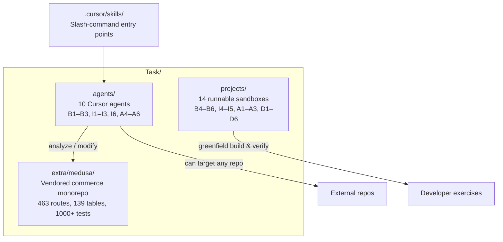
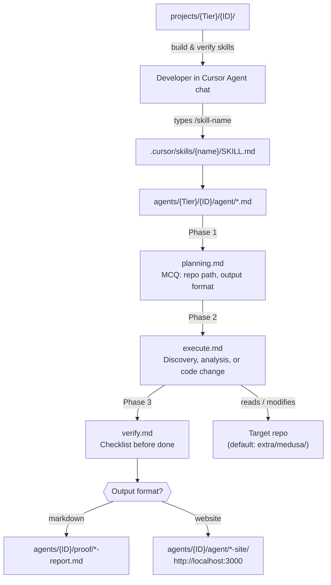
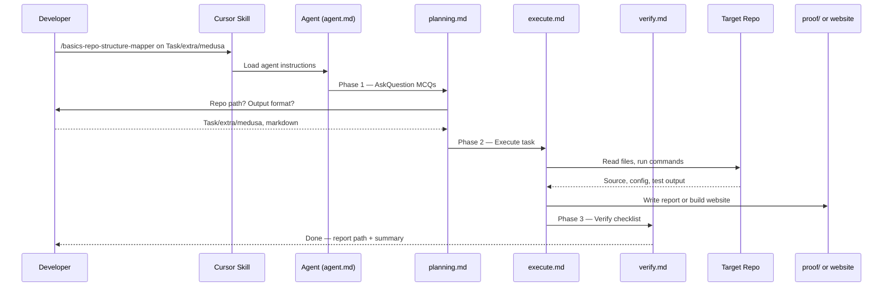
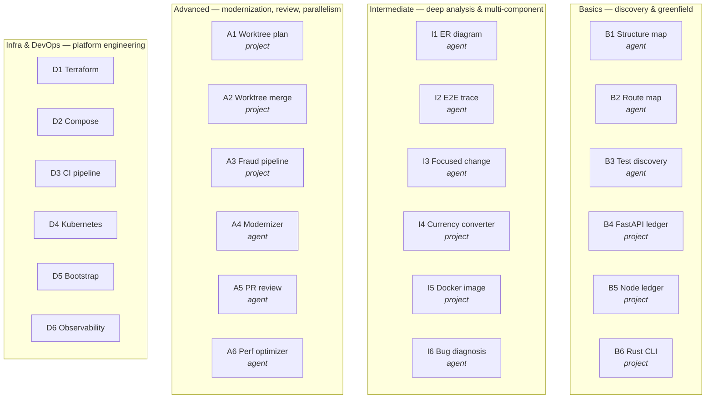
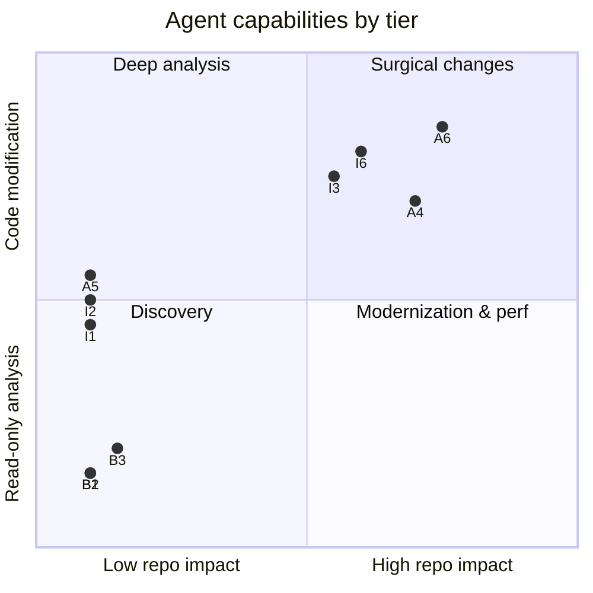
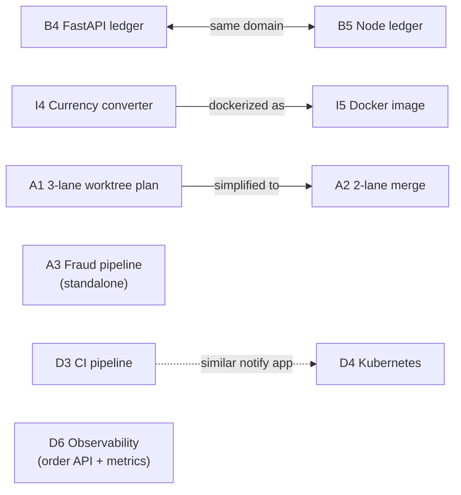
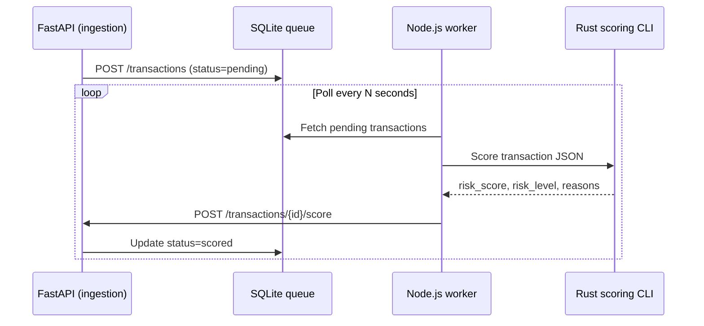
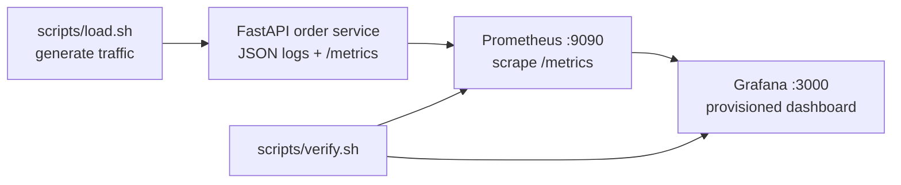
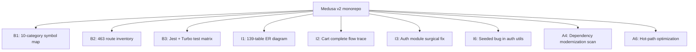

# Task

A hands-on evaluation library for **Cursor coding agents**: runnable sandboxes, structured agent workflows, and a real-world monorepo target. Together they answer the framework question *What can you do using a coding agent?* across **24 eval items** (B1–B6, I1–I6, A1–A6, D1–D6).

| Path | Role | Catalog |
|------|------|---------|
| [`agents/`](agents/README.md) | 10 Cursor slash-command agents — analyze or modify repos | [Agent library →](agents/README.md) |
| [`projects/`](projects/README.md) | 14 self-contained sandboxes — APIs, CLIs, infra stacks | [Project library →](projects/README.md) |
| [`extra/`](extra/) | Vendored Medusa monorepo + agent library showcase site | [Extra →](extra/) |

Cursor skill entry points live at [`.cursor/skills/`](../.cursor/skills/) in the workspace root (one skill per agent).

---

## Table of contents

1. [What we built](#what-we-built)
2. [Design approach](#design-approach)
3. [Repository layout](#repository-layout)
4. [How the three pillars connect](#how-the-three-pillars-connect)
5. [Agent workflow (Plan → Execute → Verify)](#agent-workflow-plan--execute--verify)
6. [Eval framework index (24 items)](#eval-framework-index-24-items)
7. [Agents — full catalog](#agents--full-catalog)
8. [Projects — full catalog](#projects--full-catalog)
9. [Medusa — analysis target](#medusa--analysis-target)
10. [Showcase frontend](#showcase-frontend)
11. [Quick start](#quick-start)
12. [Navigation index](#navigation-index)

---

## What we built

This repository packages three complementary deliverables:



| Deliverable | Count | What was done |
|-------------|-------|---------------|
| **Agents** | 10 | Each agent has a 3-phase workflow (`planning.md` → `execute.md` → `verify.md`), a dedicated Cursor skill, sample `proof/` reports, and optional Next.js website output |
| **Projects** | 14 | Each sandbox ships source, tests, README, and captured `proof/` artifacts (screenshots, logs, command output) |
| **Medusa** | 1 | Full vendored monorepo used as the realistic analysis target in agent proof reports |
| **Skills** | 10 | One `.cursor/skills/{name}/SKILL.md` per agent — invoke with `/skill-name` in Agent chat |

---

## Design approach

### Core principles

| Principle | How we applied it |
|-----------|-------------------|
| **Spec-first agents** | Every agent reads `agent/agent.md` then follows `planning.md` → `execute.md` → `verify.md` in order. No phase is skipped. |
| **Evidence over claims** | Reports cite `path:line`, config keys, and real command output. Gaps are marked `unknown` or `[NEEDS CLARIFICATION]`. |
| **Read-only by default** | 7 of 10 agents never edit source. Change-capable agents (I3, I6, A4, A6) stage edits but do not commit unless asked. |
| **Dual output format** | Every agent supports **markdown** (report in `proof/`) or **website** (Next.js dashboard copied from `agents/frontend/`). |
| **Runnable proof** | Projects include `proof/` with screenshots and logs. Agents include sample reports demonstrating Medusa analysis. |
| **Tiered difficulty** | Basics → Intermediate → Advanced → Infra & DevOps maps to increasing scope and risk. |

### Agent vs project split

```mermaid
flowchart LR
    subgraph Agents["agents/ — HOW to use a coding agent"]
        direction TB
        B1["B1 Structure map"]
        B2["B2 Route map"]
        B3["B3 Test discovery"]
        I1["I1 ER diagram"]
        I2["I2 E2E trace"]
        I3["I3 Focused change"]
        I6["I6 Bug diagnosis"]
        A4["A4 Modernizer"]
        A5["A5 PR review"]
        A6["A6 Perf optimizer"]
    end

    subgraph Projects["projects/ — WHAT to build & verify"]
        direction TB
        B4["B4 FastAPI ledger"]
        B5["B5 Node ledger"]
        B6["B6 Rust CLI"]
        I4["I4 Currency converter"]
        I5["I5 Docker image"]
        A1["A1 Worktree plan"]
        A2["A2 Worktree merge"]
        A3["A3 Fraud pipeline"]
        D1["D1 Terraform"]
        D2["D2 Compose"]
        D3["D3 CI pipeline"]
        D4["D4 Kubernetes"]
        D5["D5 Bootstrap"]
        D6["D6 Observability"]
    end

    Agents -->|"operate on"| Target["Any repo<br/>(default: extra/medusa/)"]
    Projects -->|"self-contained<br/>build targets"| Proof["proof/ artifacts"]
```



**Agents** define *how* a coding agent should behave when analyzing or changing a repository.  
**Projects** define *what* to build from scratch — greenfield APIs, polyglot pipelines, and infra stacks.  
**Medusa** (under `extra/medusa/`) is the shared realistic target for agent exercises at scale.

---

## Repository layout

```
Task/
├── README.md                          ← You are here
├── agents/
│   ├── README.md                      ← Agent library catalog + skill usage guide
│   ├── frontend/                      ← Shared Next.js template (copy only — DO NOT EDIT)
│   │   └── README.md
│   ├── Basics/
│   │   ├── B1/README.md               ← Repo Structure Mapper
│   │   ├── B2/README.md               ← Route & API Mapper
│   │   └── B3/README.md               ← Test Discovery
│   ├── Intermediate/
│   │   ├── I1/README.md               ← ER Diagram
│   │   ├── I2/README.md               ← E2E Flow Tracer
│   │   ├── I3/README.md               ← Focused Module Change
│   │   └── I6/README.md               ← Seeded Bug Diagnosis
│   └── Advanced/
│       ├── A4/README.md               ← Repo Modernizer
│       ├── A5/README.md               ← PR Review
│       └── A6/README.md               ← Performance Optimizer
├── projects/
│   ├── README.md                      ← Project library catalog
│   ├── Basics/
│   │   ├── B4/README.md               ← Transaction Ledger API (FastAPI)
│   │   ├── B5/README.md               ← Transaction Ledger API (Node.js)
│   │   └── B6/README.md               ← Log Counter CLI (Rust)
│   ├── Intermediate/
│   │   ├── I4/README.md               ← Currency Converter (FastAPI + Node CLI)
│   │   └── I5/README.md               ← Currency Converter Docker
│   ├── Advanced/
│   │   ├── A1/README.md               ← Multi-worktree parallel plan
│   │   ├── A2/README.md               ← Two-lane worktree execution
│   │   ├── A3/README.md               ← Fraud scoring pipeline
│   │   └── A3/contracts/README.md     ← JSON Schema data contract
│   └── InfraAndDevops/
│       ├── D1/README.md                 ← Terraform AWS stack
│       ├── D2/README.md                 ← Multi-service Docker Compose
│       ├── D3/README.md                 ← GitHub Actions CI pipeline
│       ├── D4/README.md                 ← Kubernetes manifests
│       ├── D5/README.md                 ← One-command bootstrap
│       └── D6/README.md                 ← Observability bolt-on
└── extra/                             ← Optional vendored target + showcase site
    ├── README.md                      ← Extra folder catalog
    ├── frontend/                      ← Agent & project library showcase (Next.js)
    │   └── README.md
    └── medusa/                        ← Vendored Medusa v2 monorepo
        └── README.md
```

### Per-agent internal layout

Every agent follows the same folder contract:

```
{Tier}/{ID}/
├── README.md              ← Human guide (purpose, usage, outputs)
├── agent/
│   ├── agent.md           ← Entry point — agent reads this first
│   ├── planning.md        ← Phase 1: MCQ inputs via AskQuestion
│   ├── execute.md         ← Phase 2: detailed task instructions
│   └── verify.md          ← Phase 3: completion checklist
└── proof/                 ← Sample markdown deliverables
    └── *-report.md
```

### Per-project internal layout

```
{Tier}/{ID}/
├── README.md              ← Install, run, test, proof instructions
├── {app,api,service}/     ← Source code (varies by project)
├── tests/                 ← Automated tests
├── proof/                 ← Screenshots, logs, captured output
└── scripts/               ← Proof regeneration, E2E, bootstrap helpers
```

---

## How the three pillars connect



| Relationship | Description |
|--------------|-------------|
| Skills → Agents | Each `/slash-command` loads one skill that points to one agent's `agent/` folder |
| Agents → Medusa | Default analysis target; proof reports demonstrate real Medusa discoveries |
| Agents → Any repo | All agents accept a custom repo path — Medusa is not required |
| Projects → Agents | Independent sandboxes for greenfield building; not agent instruction folders |
| `agents/frontend/` → Website output | Shared Next.js template copied per-agent for interactive dashboards |

---

## Agent workflow (Plan → Execute → Verify)



### Shared rules (all agents)

1. **Never edit `agents/frontend/`** — copy to `{agent}/agent/*-site/` for website output
2. **Reports go to `proof/`** — not inside the analyzed repository
3. **Evidence required** — cite `path:line`, config files, or command output
4. **Three phases mandatory** — Plan → Execute → Verify before claiming done
5. **Single deliverable** — markdown **or** website per run
6. **No commits by default** — change-capable agents stage edits but do not commit unless asked

Full usage guide: [`agents/README.md`](agents/README.md)

---

## Eval framework index (24 items)

The eval framework maps **agent capabilities** (read/analyze/modify) and **project deliverables** (build/deploy/verify) across four tiers.



| Tier | Agents | Projects | Focus |
|------|--------|----------|-------|
| **Basics** | [B1](agents/Basics/B1/README.md), [B2](agents/Basics/B2/README.md), [B3](agents/Basics/B3/README.md) | [B4](projects/Basics/B4/README.md), [B5](projects/Basics/B5/README.md), [B6](projects/Basics/B6/README.md) | Repo discovery; single-language greenfield apps |
| **Intermediate** | [I1](agents/Intermediate/I1/README.md), [I2](agents/Intermediate/I2/README.md), [I3](agents/Intermediate/I3/README.md), [I6](agents/Intermediate/I6/README.md) | [I4](projects/Intermediate/I4/README.md), [I5](projects/Intermediate/I5/README.md) | Schema/flow analysis; small code changes; multi-service + Docker |
| **Advanced** | [A4](agents/Advanced/A4/README.md), [A5](agents/Advanced/A5/README.md), [A6](agents/Advanced/A6/README.md) | [A1](projects/Advanced/A1/README.md), [A2](projects/Advanced/A2/README.md), [A3](projects/Advanced/A3/README.md) | Modernization, PR review, perf; git worktrees; polyglot pipelines |
| **Infra & DevOps** | — | [D1](projects/InfraAndDevops/D1/README.md)–[D6](projects/InfraAndDevops/D6/README.md) | Terraform, Compose, CI, K8s, bootstrap, observability |

---

## Agents — full catalog

> Detailed catalog and skill usage: [`agents/README.md`](agents/README.md)

### Basics — read-only discovery

| ID | Name | Slash command | Modifies repo? | Approach | What was done | Docs |
|----|------|---------------|----------------|----------|---------------|------|
| **B1** | Repo Structure Mapper | `/basics-repo-structure-mapper` | No | Glob + grep symbol discovery across 10 categories; Mermaid layer diagrams | Inventories classes, services, controllers, models, repos, jobs, consumers, configs, utilities with `path:line` citations | [B1/README.md](agents/Basics/B1/README.md) |
| **B2** | Route & API Mapper | `/basics-route-api-mapper` | No | Framework-aware route parsing (React Router, Next.js, Spring, Express) + API correlation | Maps frontend routes, inbound/outbound HTTP endpoints, and route↔API confidence table | [B2/README.md](agents/Basics/B2/README.md) |
| **B3** | Test Discovery | `/basics-test-discovery` | No* | CI/script mining → run real test commands → classify failures | Finds frameworks, test files, exact commands, and captures stdout/stderr | [B3/README.md](agents/Basics/B3/README.md) |

\* B3 may run dependency install to enable tests; does not edit source.

#### B1 — Repo Structure Mapper

- **Approach:** Ten-category symbol inventory → layer relationship mapping → Mermaid flowchart + pie chart
- **Output:** [`proof/repo-structure-map.md`](agents/Basics/B1/proof/repo-structure-map.md)
- **Sample result:** 310 controllers, 111 services, 124 models on Medusa; API routes → workflows → module services → DML
- **Agent files:** [`agent.md`](agents/Basics/B1/agent/agent.md) · [`planning.md`](agents/Basics/B1/agent/planning.md) · [`execute.md`](agents/Basics/B1/agent/execute.md) · [`verify.md`](agents/Basics/B1/agent/verify.md)
- **Skill:** [`.cursor/skills/basics-repo-structure-mapper/SKILL.md`](../.cursor/skills/basics-repo-structure-mapper/SKILL.md)

#### B2 — Route & API Mapper

- **Approach:** Parse routing config + controller annotations → correlate UI pages to API calls
- **Output:** [`proof/route-api-map.md`](agents/Basics/B2/proof/route-api-map.md)
- **Agent files:** [`agent.md`](agents/Basics/B2/agent/agent.md) · [`planning.md`](agents/Basics/B2/agent/planning.md) · [`execute.md`](agents/Basics/B2/agent/execute.md) · [`verify.md`](agents/Basics/B2/agent/verify.md)
- **Skill:** [`.cursor/skills/basics-route-api-mapper/SKILL.md`](../.cursor/skills/basics-route-api-mapper/SKILL.md)

#### B3 — Test Discovery

- **Approach:** Detect framework → find test roots → extract CI commands → execute and interpret
- **Output:** [`proof/test-discovery-report.md`](agents/Basics/B3/proof/test-discovery-report.md)
- **Agent files:** [`agent.md`](agents/Basics/B3/agent/agent.md) · [`planning.md`](agents/Basics/B3/agent/planning.md) · [`execute.md`](agents/Basics/B3/agent/execute.md) · [`verify.md`](agents/Basics/B3/agent/verify.md)
- **Skill:** [`.cursor/skills/basics-test-discovery/SKILL.md`](../.cursor/skills/basics-test-discovery/SKILL.md)

---

### Intermediate — analysis and small changes

| ID | Name | Slash command | Modifies repo? | Approach | What was done | Docs |
|----|------|---------------|----------------|----------|---------------|------|
| **I1** | ER Diagram | `/intermediate-repo-er-diagram` | No | ORM/migration/DDL parsing → relationship inference → Mermaid ER | Maps 139 Medusa tables with PKs, FKs, and confidence-rated relationships | [I1/README.md](agents/Intermediate/I1/README.md) |
| **I2** | E2E Flow Tracer | `/intermediate-repo-e2e-flow-tracer` | No | Single-entry call-chain walk → side-effect inventory → sequence diagram | Traces one HTTP/event/cron path from entry to final DB/API/queue write | [I2/README.md](agents/Intermediate/I2/README.md) |
| **I3** | Focused Module Change | `/intermediate-focused-module-change` | **Yes** | Pick unfamiliar module → TDD minimal fix → narrowest test run | Surgical diff (≤3 prod files); adds/updates one test; documents risk + rollback | [I3/README.md](agents/Intermediate/I3/README.md) |
| **I6** | Seeded Bug Diagnosis | `/intermediate-seeded-bug-diagnosis` | **Yes** | Reproduce → root-cause with citations → minimal fix → before/after verify | On-call style debugging; works for seeded eval bugs or real symptoms | [I6/README.md](agents/Intermediate/I6/README.md) |

#### I1 — ER Diagram

- **Approach:** Detect MikroORM/JPA/Prisma/TypeORM/Flyway → entity list → Mermaid `erDiagram`
- **Output:** [`proof/er-diagram-report.md`](agents/Intermediate/I1/proof/er-diagram-report.md)
- **Agent files:** [`agent.md`](agents/Intermediate/I1/agent/agent.md) · [`planning.md`](agents/Intermediate/I1/agent/planning.md) · [`execute.md`](agents/Intermediate/I1/agent/execute.md) · [`verify.md`](agents/Intermediate/I1/agent/verify.md)
- **Skill:** [`.cursor/skills/intermediate-repo-er-diagram/SKILL.md`](../.cursor/skills/intermediate-repo-er-diagram/SKILL.md)

#### I2 — E2E Flow Tracer

- **Approach:** User specifies one entry point → static call-graph walk → Mermaid sequence diagram
- **Extra input:** Flow target (endpoint, event handler, or cron job)
- **Output:** [`proof/e2e-flow-trace-report.md`](agents/Intermediate/I2/proof/e2e-flow-trace-report.md)
- **Agent files:** [`agent.md`](agents/Intermediate/I2/agent/agent.md) · [`planning.md`](agents/Intermediate/I2/agent/planning.md) · [`execute.md`](agents/Intermediate/I2/agent/execute.md) · [`verify.md`](agents/Intermediate/I2/agent/verify.md)
- **Skill:** [`.cursor/skills/intermediate-repo-e2e-flow-tracer/SKILL.md`](../.cursor/skills/intermediate-repo-e2e-flow-tracer/SKILL.md)

#### I3 — Focused Module Change

- **Approach:** Module recon → define acceptance criteria → write test → minimal prod diff → verify
- **Extra input:** Change scope (user-specified or agent selects)
- **Output:** [`proof/focused-module-change-report.md`](agents/Intermediate/I3/proof/focused-module-change-report.md)
- **Sample:** Auth utils — reject empty verification tokens in `hashVerificationToken`
- **Agent files:** [`agent.md`](agents/Intermediate/I3/agent/agent.md) · [`planning.md`](agents/Intermediate/I3/agent/planning.md) · [`execute.md`](agents/Intermediate/I3/agent/execute.md) · [`verify.md`](agents/Intermediate/I3/agent/verify.md)
- **Skill:** [`.cursor/skills/intermediate-focused-module-change/SKILL.md`](../.cursor/skills/intermediate-focused-module-change/SKILL.md)

#### I6 — Seeded Bug Diagnosis

- **Approach:** Symptom → reproduce with exact commands → cite root cause → fix → before/after output
- **Extra input:** Symptom / failure description
- **Output:** [`proof/bug-diagnosis-report.md`](agents/Intermediate/I6/proof/bug-diagnosis-report.md)
- **Agent files:** [`agent.md`](agents/Intermediate/I6/agent/agent.md) · [`planning.md`](agents/Intermediate/I6/agent/planning.md) · [`execute.md`](agents/Intermediate/I6/agent/execute.md) · [`verify.md`](agents/Intermediate/I6/agent/verify.md)
- **Skill:** [`.cursor/skills/intermediate-seeded-bug-diagnosis/SKILL.md`](../.cursor/skills/intermediate-seeded-bug-diagnosis/SKILL.md)

---

### Advanced — modernization, review, performance

| ID | Name | Slash command | Modifies repo? | Approach | What was done | Docs |
|----|------|---------------|----------------|----------|---------------|------|
| **A4** | Repo Modernizer | `/advance-repo-modernizer` | **Yes** (1 step) | Scan 10 modernization categories → score value×risk → implement #1 only | Full findings backlog + one reversible change + verification + rollback | [A4/README.md](agents/Advanced/A4/README.md) |
| **A5** | PR Review | `/advance-pr-review` | No | Five-dimension review (correctness, security, tests, perf, maintainability) → merge verdict | Structured issues with severity, blocking flag, suggested fix, verification steps | [A5/README.md](agents/Advanced/A5/README.md) |
| **A6** | Performance Optimizer | `/advance-perf-optimizer` | **Yes** | Baseline → profile hot path → surgical fix → re-measure delta | Before/after benchmarks on one bottleneck; tests must still pass | [A6/README.md](agents/Advanced/A6/README.md) |

#### A4 — Repo Modernizer

- **Approach:** Recon stack/CI/deps → scan 10 categories → rank findings → implement highest-value/lowest-risk step
- **Categories:** Dependencies, security, CI/CD, code quality, type safety, testing, architecture, performance, docs, tooling
- **Output:** [`proof/modernization-report.md`](agents/Advanced/A4/proof/modernization-report.md)
- **Agent files:** [`agent.md`](agents/Advanced/A4/agent/agent.md) · [`planning.md`](agents/Advanced/A4/agent/planning.md) · [`execute.md`](agents/Advanced/A4/agent/execute.md) · [`verify.md`](agents/Advanced/A4/agent/verify.md)
- **Skill:** [`.cursor/skills/advance-repo-modernizer/SKILL.md`](../.cursor/skills/advance-repo-modernizer/SKILL.md)

#### A5 — PR Review

- **Approach:** Diff scope → five-dimension analysis → issue table → APPROVE / REQUEST CHANGES / COMMENT
- **Extra input:** PR URL, branch name, or diff scope
- **Output:** [`proof/pr-review-report.md`](agents/Advanced/A5/proof/pr-review-report.md)
- **Agent files:** [`agent.md`](agents/Advanced/A5/agent/agent.md) · [`planning.md`](agents/Advanced/A5/agent/planning.md) · [`execute.md`](agents/Advanced/A5/agent/execute.md) · [`verify.md`](agents/Advanced/A5/agent/verify.md)
- **Skill:** [`.cursor/skills/advance-pr-review/SKILL.md`](../.cursor/skills/advance-pr-review/SKILL.md)

#### A6 — Performance Optimizer

- **Approach:** Document baseline → profile → explain → fix one hot path → re-measure with same harness
- **Output:** [`proof/performance-optimization-report.md`](agents/Advanced/A6/proof/performance-optimization-report.md)
- **Agent files:** [`agent.md`](agents/Advanced/A6/agent/agent.md) · [`planning.md`](agents/Advanced/A6/agent/planning.md) · [`execute.md`](agents/Advanced/A6/agent/execute.md) · [`verify.md`](agents/Advanced/A6/agent/verify.md)
- **Skill:** [`.cursor/skills/advance-perf-optimizer/SKILL.md`](../.cursor/skills/advance-perf-optimizer/SKILL.md)

---

### Agent capability matrix



---

## Projects — full catalog

> Detailed catalog with quick-start commands: [`projects/README.md`](projects/README.md)

### Project relationships



| From | To | Relationship |
|------|----|--------------|
| B4 | B5 | Same Transaction Ledger API, different language |
| I4 | I5 | I5 Docker image packages I4 FastAPI service |
| A1 | A2 | A1 plans 3-lane work; A2 executes simplified 2-lane merge |
| D3 | D4 | Similar notify-service pattern; D3 = CI, D4 = K8s deploy |

---

### Basics — greenfield single-language apps

| ID | Name | Stack | Approach | What was done | Tests | Docs |
|----|------|-------|----------|---------------|-------|------|
| **B4** | Transaction Ledger API | FastAPI, Pydantic, pytest | In-memory REST API with validation + business rules | `POST/GET /transactions`, `GET /balance`; rejects overdrafts | 17 pytest | [B4/README.md](projects/Basics/B4/README.md) |
| **B5** | Transaction Ledger API | Express, Zod, Vitest | Same domain as B4 in Node.js for cross-language comparison | Identical API shape and business rules to B4 | 16 Vitest | [B5/README.md](projects/Basics/B5/README.md) |
| **B6** | Log Counter CLI | Rust, Cargo | File I/O CLI with severity precedence rules | Counts INFO/WARN/ERROR lines; ERROR > WARN > INFO | 11 Cargo | [B6/README.md](projects/Basics/B6/README.md) |

---

### Intermediate — multi-component and container work

| ID | Name | Stack | Approach | What was done | Tests | Docs |
|----|------|-------|----------|---------------|-------|------|
| **I4** | Currency Converter | FastAPI + Node CLI | Two-terminal multi-service with HTTP contract | Service: `GET /health`, `GET /rates`, `POST /convert`; CLI: `convert <amount> <from> <to>` | 16 pytest + 9 Vitest | [I4/README.md](projects/Intermediate/I4/README.md) |
| **I5** | Currency Converter Docker | Docker, Python 3.11-slim | Containerize I4 service with health check | Image `currency-converter-api:i5`; build from `Intermediate/` parent | Smoke tests | [I5/README.md](projects/Intermediate/I5/README.md) |

---

### Advanced — parallel git worktrees and polyglot pipelines

| ID | Name | Stack | Approach | What was done | Proof | Docs |
|----|------|-------|----------|---------------|-------|------|
| **A1** | Multi-Worktree Parallel Plan | git worktrees (docs) | Decompose enrollment API into 3 parallel agent lanes | Contract freeze + parallel work plan + 45-min orchestration runbook | Plan docs | [A1/README.md](projects/Advanced/A1/README.md) |
| **A2** | Two-Lane Worktree Execution | FastAPI, SQLAlchemy, SQLite | Execute 2-lane split (persistence + HTTP) → clean merge | Merged app in `sandbox/enrollment-api/` with 7 pytest + curl logs | E2E proof | [A2/README.md](projects/Advanced/A2/README.md) |
| **A3** | Fraud Scoring Pipeline | FastAPI + Node worker + Rust CLI | Ingest → poll queue → score via Rust CLI → store results | `POST /transactions` → pending → worker → `POST /transactions/{id}/score` | 4 Rust + 11 pytest + 10 Jest | [A3/README.md](projects/Advanced/A3/README.md) |

**A3 data contract:** [`projects/Advanced/A3/contracts/README.md`](projects/Advanced/A3/contracts/README.md)

#### A3 — Fraud pipeline flow



---

### Infra & DevOps — infrastructure and platform engineering

| ID | Name | Stack | Approach | What was done | Docs |
|----|------|-------|----------|---------------|------|
| **D1** | Terraform AWS Stack | Terraform, LocalStack, Lambda | IaC with variables + local backend | S3 (versioned) + Lambda + IAM + API Gateway REST API | [D1/README.md](projects/InfraAndDevops/D1/README.md) |
| **D2** | Multi-Service Compose | Docker Compose, Postgres | Three-service job processing stack | API creates jobs; worker processes (`uppercase`, `reverse`) | [D2/README.md](projects/InfraAndDevops/D2/README.md) |
| **D3** | CI Pipeline | GitHub Actions, Ruff | Lint + test matrix (Python 3.9/3.11) + Docker build | Notify service CI; intentional failure demo in `demo/` | [D3/README.md](projects/InfraAndDevops/D3/README.md) |
| **D4** | Kubernetes Manifests | kind/minikube, kubectl | Deploy notify service to local cluster | Deployment (2 replicas) + ConfigMap + NodePort + optional Ingress | [D4/README.md](projects/InfraAndDevops/D4/README.md) |
| **D5** | One-Command Bootstrap | Makefile, mise, Dev Container | Eliminate implicit setup | `make bootstrap` → Python pin, venv, deps, tests | [D5/README.md](projects/InfraAndDevops/D5/README.md) |
| **D6** | Observability Bolt-on | Prometheus, Grafana | Structured JSON logging + `/metrics` middleware | Order API + Prometheus (:9090) + Grafana dashboard (:3000) | [D6/README.md](projects/InfraAndDevops/D6/README.md) |

#### D6 — Observability stack



---

### Tech stack summary

| Project | Languages | Frameworks / Tools | Database | Container |
|---------|-----------|-------------------|----------|-----------|
| B4 | Python | FastAPI, pytest | In-memory | — |
| B5 | JavaScript | Express, Vitest, Zod | In-memory | — |
| B6 | Rust | Cargo | File I/O | — |
| I4 | Python + JS | FastAPI + Node CLI | — | — |
| I5 | Python | FastAPI (in Docker) | — | Docker |
| A1 | — (docs) | git worktrees | — | — |
| A2 | Python | FastAPI, SQLAlchemy, SQLite | SQLite | — |
| A3 | Python + JS + Rust | FastAPI, Node worker, Rust CLI | SQLite | — |
| D1 | Python + HCL | Terraform, Lambda, LocalStack | S3 | Docker (LocalStack) |
| D2 | Python + SQL | FastAPI, Docker Compose | PostgreSQL | Docker Compose |
| D3 | Python | FastAPI, GitHub Actions, Ruff | — | Docker |
| D4 | Python + YAML | FastAPI, kubectl, kind | — | Docker + K8s |
| D5 | Python + Make | FastAPI, mise, Dev Container | — | Dev Container |
| D6 | Python + YAML | FastAPI, Prometheus, Grafana | — | Docker Compose |

---

## Medusa — analysis target

Vendored **Medusa v2** TypeScript commerce monorepo at [`extra/medusa/`](extra/medusa/). Default target for agent exercises; any repo path works.

| Property | Value |
|----------|-------|
| Stack | TypeScript, Yarn 3 workspaces, Turbo, Jest, MikroORM |
| Scale | 463 HTTP routes, 139 DB tables, 1000+ test files |
| Modules | cart, order, payment, product, auth, fulfillment, pricing, promotion, … |
| Docs | [extra/medusa/README.md](extra/medusa/README.md) |

### Why Medusa?



### Local run prerequisites

- Node ≥ 20, Yarn 3 (`corepack enable`)
- PostgreSQL and Redis for full integration tests

---

## Showcase frontend

The **agent & project library browser** lives at [`extra/frontend/`](extra/frontend/) — a Next.js site for exploring all 10 agents and 14 projects with architecture diagrams, stats, docs, and agent download bundles.

```bash
cd Task/extra/frontend
npm install
npm run dev
# Open http://localhost:3000 (or next available port)
```

This is separate from [`agents/frontend/`](agents/frontend/README.md), which is the **shared template** agents copy when producing per-agent website output.

---

## Quick start

### Run an agent

```text
# 1. Open Cursor → Agent mode (not Ask)
# 2. Type slash command + target repo:

/basics-repo-structure-mapper on Task/extra/medusa — markdown output

# 3. Answer planning MCQs (repo path, output format)
# 4. Read report:

Task/agents/Basics/B1/proof/repo-structure-map.md
```

### Run a project

```bash
# FastAPI ledger (B4)
cd Task/projects/Basics/B4
python3 -m venv .venv && source .venv/bin/activate
pip install -r requirements.txt && pytest -v

# Fraud pipeline integration (A3)
cd Task/projects/Advanced/A3
./scripts/run-integration.sh

# Observability stack (D6)
cd Task/projects/InfraAndDevops/D6
./scripts/up.sh && ./scripts/verify.sh
```

### Website output (any agent)

When you select **website** format, the agent copies [`agents/frontend/`](agents/frontend/README.md) into `{agent}/agent/*-site/` and serves an interactive dashboard at **http://localhost:3000**.

---

## Navigation index

### Top-level READMEs

| Document | Description |
|----------|-------------|
| [Task/README.md](README.md) | This file — overview, diagrams, full index |
| [agents/README.md](agents/README.md) | Agent library + Cursor skill usage guide |
| [projects/README.md](projects/README.md) | Project library + quick-start commands |
| [extra/README.md](extra/README.md) | Vendored Medusa target + showcase frontend |
| [extra/medusa/README.md](extra/medusa/README.md) | Vendored Medusa upstream README |
| [extra/frontend/README.md](extra/frontend/README.md) | Agent & project library showcase site |

### Agent READMEs

| Tier | Links |
|------|-------|
| Basics | [B1](agents/Basics/B1/README.md) · [B2](agents/Basics/B2/README.md) · [B3](agents/Basics/B3/README.md) |
| Intermediate | [I1](agents/Intermediate/I1/README.md) · [I2](agents/Intermediate/I2/README.md) · [I3](agents/Intermediate/I3/README.md) · [I6](agents/Intermediate/I6/README.md) |
| Advanced | [A4](agents/Advanced/A4/README.md) · [A5](agents/Advanced/A5/README.md) · [A6](agents/Advanced/A6/README.md) |

### Project READMEs

| Tier | Links |
|------|-------|
| Basics | [B4](projects/Basics/B4/README.md) · [B5](projects/Basics/B5/README.md) · [B6](projects/Basics/B6/README.md) |
| Intermediate | [I4](projects/Intermediate/I4/README.md) · [I5](projects/Intermediate/I5/README.md) |
| Advanced | [A1](projects/Advanced/A1/README.md) · [A2](projects/Advanced/A2/README.md) · [A3](projects/Advanced/A3/README.md) · [A3/contracts](projects/Advanced/A3/contracts/README.md) |
| Infra & DevOps | [D1](projects/InfraAndDevops/D1/README.md) · [D2](projects/InfraAndDevops/D2/README.md) · [D3](projects/InfraAndDevops/D3/README.md) · [D4](projects/InfraAndDevops/D4/README.md) · [D5](projects/InfraAndDevops/D5/README.md) · [D6](projects/InfraAndDevops/D6/README.md) |

### Cursor skills (slash commands)

| Skill file | Slash command |
|------------|---------------|
| [basics-repo-structure-mapper](../.cursor/skills/basics-repo-structure-mapper/SKILL.md) | `/basics-repo-structure-mapper` |
| [basics-route-api-mapper](../.cursor/skills/basics-route-api-mapper/SKILL.md) | `/basics-route-api-mapper` |
| [basics-test-discovery](../.cursor/skills/basics-test-discovery/SKILL.md) | `/basics-test-discovery` |
| [intermediate-repo-er-diagram](../.cursor/skills/intermediate-repo-er-diagram/SKILL.md) | `/intermediate-repo-er-diagram` |
| [intermediate-repo-e2e-flow-tracer](../.cursor/skills/intermediate-repo-e2e-flow-tracer/SKILL.md) | `/intermediate-repo-e2e-flow-tracer` |
| [intermediate-focused-module-change](../.cursor/skills/intermediate-focused-module-change/SKILL.md) | `/intermediate-focused-module-change` |
| [intermediate-seeded-bug-diagnosis](../.cursor/skills/intermediate-seeded-bug-diagnosis/SKILL.md) | `/intermediate-seeded-bug-diagnosis` |
| [advance-repo-modernizer](../.cursor/skills/advance-repo-modernizer/SKILL.md) | `/advance-repo-modernizer` |
| [advance-pr-review](../.cursor/skills/advance-pr-review/SKILL.md) | `/advance-pr-review` |
| [advance-perf-optimizer](../.cursor/skills/advance-perf-optimizer/SKILL.md) | `/advance-perf-optimizer` |

### Example invocations

```text
/basics-repo-structure-mapper on Task/extra/medusa — markdown output
/basics-route-api-mapper on my-app
/basics-test-discovery on Task/extra/medusa
/intermediate-repo-er-diagram on Task/extra/medusa
/intermediate-repo-e2e-flow-tracer on Task/extra/medusa
  Trace POST /store/carts/{id}/complete
/intermediate-focused-module-change on Task/extra/medusa
/intermediate-seeded-bug-diagnosis on Task/extra/medusa
  Symptom: verification token hash accepts empty string
/advance-repo-modernizer on Task/extra/medusa
/advance-pr-review
  Review branch feature/auth-fix vs main in Task/extra/medusa
/advance-perf-optimizer on Task/extra/medusa
```

---

## Author

Made by **Divyanshu Patel** — [t-divyanshu.patel@pmltp.com](mailto:t-divyanshu.patel@pmltp.com)

