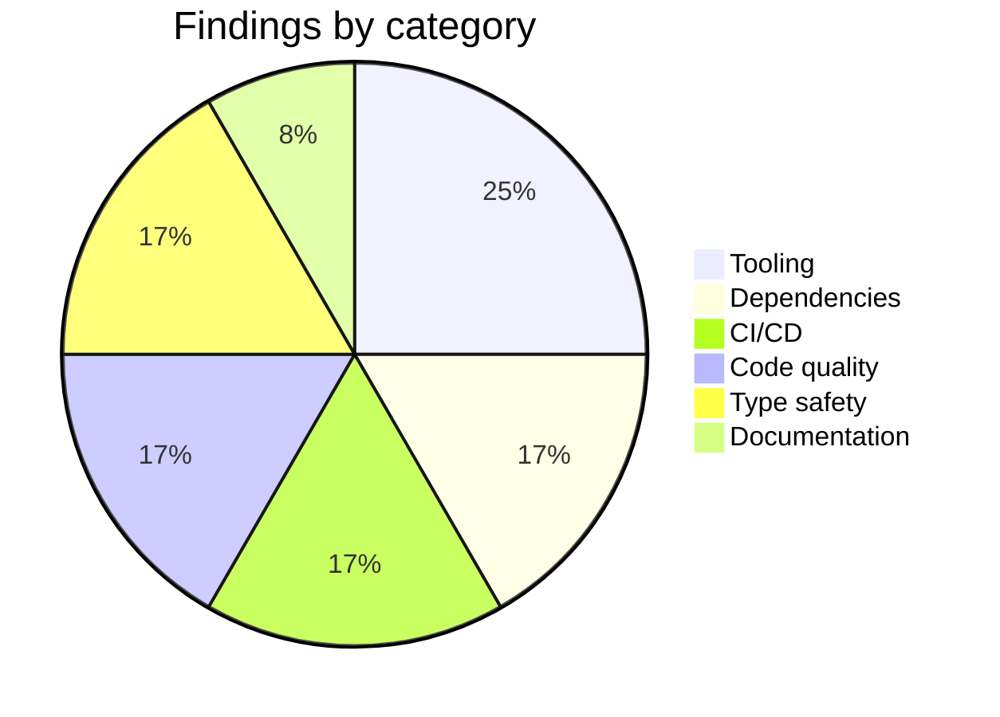
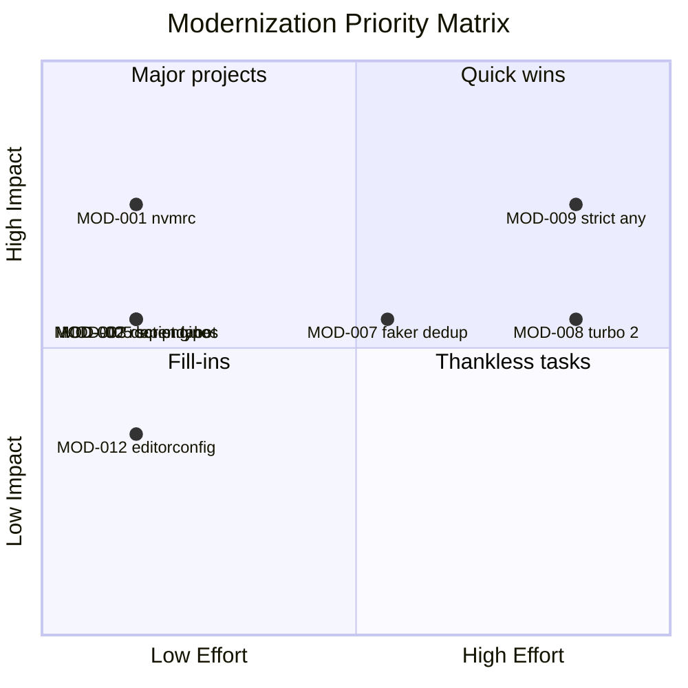

# Modernization Report

## Metadata

| Field | Value |
|-------|-------|
| **Agent name** | repo-modernizer |
| **Started at** | 2026-06-21T21:57:42Z |
| **Completed at** | 2026-06-21T21:58:16Z |
| **Duration** | 34s |
| **Repository** | Task/medusa |
| **Repo name** | medusa (Medusa v2 monorepo) |
| **Stack detected** | TypeScript 5.6, Node ≥20, Yarn 3.2.1 (Berry), Turbo 1.6, Jest/Vitest, ESLint 8 |
| **Scope** | full repo (excludes `www/`, `integration-tests/` deep scan) |
| **Findings count** | 12 |
| **First step implemented** | MOD-001 — Add `.nvmrc` pinning Node 20 |
| **Verification status** | pass (config validation; lint/test skipped — no `node_modules`) |

## Executive Summary

Medusa is a large Yarn-workspace monorepo with mature lint/test tooling but several **onboarding and consistency gaps** at the repo root. Child packages declare `engines.node >= 20` (e.g. `@medusajs/medusa`) while the root had **no `.nvmrc`, `.node-version`, or `engines` field**, making local Node version mismatches likely for contributors. The highest-value, lowest-risk fix — **adding `.nvmrc` with `20`** — was implemented. Full `yarn lint` / `yarn test` were not run because dependencies are not installed in this workspace clone; config-level verification passed.

## Findings

### Summary by category

| Category | Count | Highest severity |
|----------|-------|------------------|
| Tooling | 3 | medium |
| Dependencies | 2 | medium |
| CI/CD | 2 | medium |
| Code quality | 2 | low |
| Type safety | 2 | medium |
| Documentation | 1 | low |

### Findings chart



### Detailed findings

| ID | Category | Title | Severity | Impact | Effort | Risk | Evidence | Suggested fix |
|----|----------|-------|----------|--------|--------|------|----------|---------------|
| MOD-001 | Tooling | Missing `.nvmrc` / `.node-version` | medium | 4 | 1 | 1 | `packages/medusa/package.json:35-37` requires `node >= 20`; no `.nvmrc` at repo root | Add `.nvmrc` with `20` |
| MOD-002 | Tooling | Root `package.json` lacks `engines` | medium | 3 | 1 | 1 | Root `package.json:1-189` has no `engines`; child packages set `>=20` | Add `"engines": { "node": ">=20" }` to root |
| MOD-003 | CI/CD | No Dependabot / Renovate config | medium | 3 | 1 | 1 | No `.github/dependabot.yml` or `renovate.json` in repo | Add Dependabot for npm/yarn |
| MOD-004 | CI/CD | No `.github/workflows` in local clone | low | 2 | 1 | 1 | `.github/workflows/` directory absent | Confirm CI lives upstream; mirror locally if needed |
| MOD-005 | Code quality | Broken `release:next` script typo | medium | 3 | 1 | 1 | `package.json:163` — `"chgstangeset publish"` | Fix to `"changeset publish"` |
| MOD-006 | Code quality | `lint-staged` without git hook runner | low | 2 | 2 | 1 | `package.json:139-142` defines lint-staged; no husky/lefthook config | Add husky pre-commit hook |
| MOD-007 | Dependencies | Duplicate faker packages | medium | 3 | 3 | 2 | `package.json:24` `@faker-js/faker`; `package.json:93` deprecated `faker@^5.5.3` | Migrate usages to `@faker-js/faker`; remove `faker` |
| MOD-008 | Dependencies | Turbo 1.x while 2.x available | low | 3 | 4 | 4 | `package.json:128` — `"turbo": "^1.6.3"` | Plan Turbo 2 migration (breaking) |
| MOD-009 | Type safety | `noImplicitAny: false` in base TS config | medium | 4 | 5 | 4 | `_tsconfig.base.json:21` | Enable `noImplicitAny` incrementally per package |
| MOD-010 | Type safety | Widespread `@ts-ignore` usage | medium | 4 | 5 | 3 | 112 `@ts-ignore`/`@ts-nocheck` in `packages/` (excl. www) | Triage and replace with typed fixes |
| MOD-011 | Documentation | No root `.env.example` | low | 2 | 2 | 1 | No `.env.example` at repo root | Add documented env template for local dev |
| MOD-012 | Tooling | No `.editorconfig` | low | 2 | 1 | 1 | No `.editorconfig` at repo root | Add `.editorconfig` for indent/charset consistency |

## Prioritized Plan

### Priority score formula

```
priorityScore = (Impact × 2) - Effort - Risk
```

### Priority matrix



### Ranked backlog

| Rank | ID | Title | Priority score | Impact | Effort | Risk | Status |
|------|-----|-------|----------------|--------|--------|------|--------|
| 1 | MOD-001 | Add `.nvmrc` pinning Node 20 | **6** | 4 | 1 | 1 | **Implemented** |
| 2 | MOD-002 | Add root `engines.node` field | 5 | 3 | 1 | 1 | Backlog |
| 3 | MOD-003 | Add Dependabot config | 5 | 3 | 1 | 1 | Backlog |
| 4 | MOD-005 | Fix `release:next` script typo | 5 | 3 | 1 | 1 | Backlog |
| 5 | MOD-012 | Add `.editorconfig` | 4 | 2 | 1 | 1 | Backlog |
| 6 | MOD-004 | Confirm / add CI workflows | 4 | 2 | 1 | 1 | Backlog |
| 7 | MOD-006 | Wire husky for lint-staged | 3 | 2 | 2 | 1 | Backlog |
| 8 | MOD-011 | Add `.env.example` | 3 | 2 | 2 | 1 | Backlog |
| 9 | MOD-007 | Remove deprecated `faker` | 1 | 3 | 3 | 2 | Backlog |
| 10 | MOD-010 | Reduce `@ts-ignore` debt | 0 | 4 | 5 | 3 | Backlog |
| 11 | MOD-008 | Upgrade Turbo 1 → 2 | -2 | 3 | 4 | 4 | Backlog |
| 12 | MOD-009 | Enable `noImplicitAny` | -1 | 4 | 5 | 4 | Backlog |

## First Step Implemented

### Selected item

| Field | Value |
|-------|-------|
| **ID** | MOD-001 |
| **Title** | Add `.nvmrc` pinning Node 20 |
| **Why this first** | Highest priority score (6) among low-risk items; aligns local dev with `engines.node >= 20` already declared in `@medusajs/medusa` and 30+ workspace packages |
| **Category** | Tooling |

### Changes made

| File | Change summary |
|------|----------------|
| `.nvmrc` | Created with content `20` (matches LTS target for `>=20` engines constraint) |

### Diff summary

```
 Task/medusa/.nvmrc | 1 +
 1 file changed, 1 insertion(+)
```

```diff
+20
```

## Verification

| Command | Exit code | Result | Notes |
|---------|-----------|--------|-------|
| Config: `.nvmrc` satisfies `engines.node` | 0 | pass | Node script validated `20` satisfies `>=20` |
| `yarn lint` | — | skipped | `node_modules/` not present in clone |
| `yarn test` | — | skipped | `node_modules/` not present in clone |

### Output excerpt

```
nvmrc: 20 | engines: >=20 | satisfies: PASS
```

**Limitation:** Full lint/test suite requires `yarn install` (~large monorepo). Re-run after install:

```bash
cd Task/medusa && yarn install && yarn lint
```

## Rollback Notes

### Quick rollback

```bash
cd Task/medusa && git checkout -- .nvmrc
# or, if untracked:
rm Task/medusa/.nvmrc
```

### Files affected

- `.nvmrc` — delete file or restore previous state (file did not exist before)

### Post-rollback verification

```bash
test ! -f Task/medusa/.nvmrc && echo "rollback OK"
```

## Discovery Notes

### Files examined

- `Task/medusa/package.json` — scripts, devDependencies, lint-staged, packageManager
- `Task/medusa/packages/medusa/package.json:35-37` — `engines.node >= 20`
- `Task/medusa/_tsconfig.base.json:21` — `noImplicitAny: false`
- `Task/medusa/.yarnrc.yml:15` — Yarn 3.2.1 Berry config
- `Task/medusa/CONTRIBUTING.md` — local dev prerequisites (no explicit Node version at root)

### Excluded from scan

- `node_modules/` — not installed
- `www/` — separate docs monorepo within repo
- `integration-tests/` — test harnesses only

### Ambiguities & gaps

- `.github/workflows` absent in local clone — CI may exist only on GitHub remote; not verified against upstream
- `npm audit` / `yarn outdated` not run — no installed dependencies and network limits
- Current shell Node is v18.20.8; contributors using `.nvmrc` would switch to 20 — intentional improvement

### Recommended next steps

1. **MOD-005** — Fix `chgstangeset` typo in `package.json:163` (one-line, zero risk)
2. **MOD-003** — Add Dependabot for automated dependency PRs
3. **MOD-002** — Add root `engines` field to match child packages
