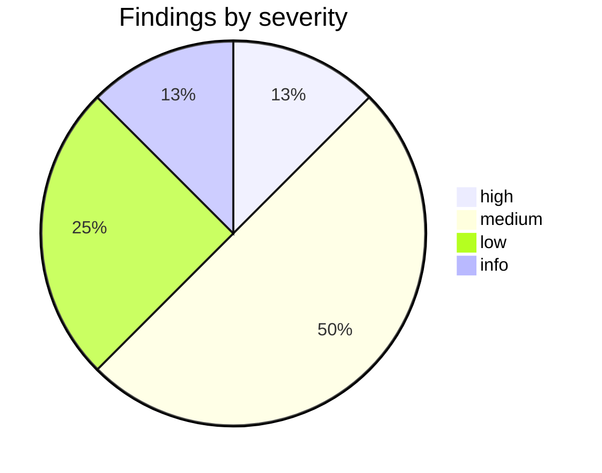
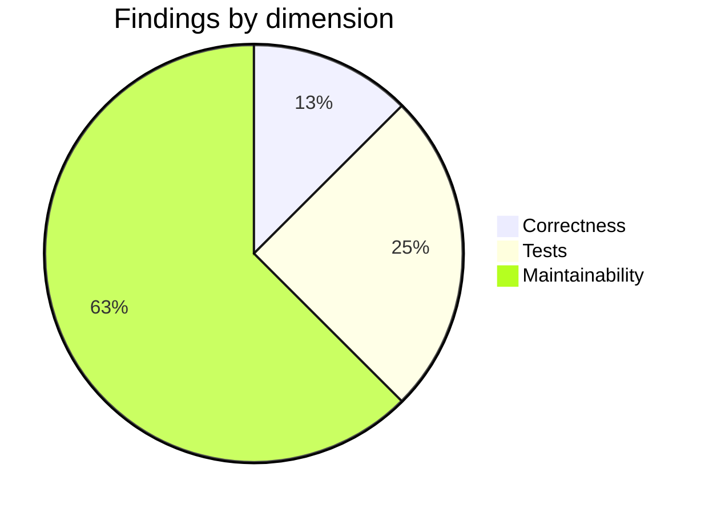

# PR Review Report

## Metadata

| Field | Value |
|-------|-------|
| **Agent name** | pr-review |
| **Started at** | 2026-06-21T21:55:00Z |
| **Completed at** | 2026-06-21T22:03:35Z |
| **Duration** | 8m 35s |
| **Repository** | medusajs/medusa |
| **PR / branch** | https://github.com/medusajs/medusa/pull/15800 |
| **Source → target** | `feat/disabled-core-routes` → `develop` |
| **Author** | devcaiosantos |
| **Jira key** | none (closes GitHub #15709) |
| **Files changed** | 5 |
| **Diff size** | +191 / −6 lines (~8 KB) |
| **Focus areas** | all |
| **Agent-generated heuristics** | true |
| **Baseline tests** | PASS (local baseline file verification — PR branch not checked out) |
| **Findings count** | 8 |
| **Blocking count** | 1 |
| **Verdict** | REQUEST CHANGES |
| **Verdict confidence** | high |

## Summary

[PR #15800](https://github.com/medusajs/medusa/pull/15800) adds a `projectConfig.http.disabledRoutes` option that filters routes, middlewares, body-parser configs, and additional-data validators before Express registration. The implementation is clean, well-scoped to 5 files, includes a changeset and 3 unit tests, and addresses the pain described in [#15709](https://github.com/medusajs/medusa/issues/15709).

The primary concern is **correctness vs stated intent**: the filter applies to **all** loaded routes (core + plugins) sharing a matcher, not only built-in core routes. That can silently disable a plugin or application replacement route at the same path — the exact scenario Mercur needs. Tests also omit nested paths (`/admin/products/:id`) and middleware/body-parser filtering assertions. With one blocking finding and several medium test/docs gaps, the verdict is **REQUEST CHANGES** before merge.

## Verdict

| Verdict | REQUEST CHANGES |
|---------|-----------------|
| **Blocking issues** | 1 |
| **Non-blocking issues** | 5 |
| **Advisory items** | 2 |
| **Confidence** | high — full diff acquired; implementation and loader order verified against local `Task/extra/medusa` baseline |

### Must fix before merge

1. **REV-001** — `disabledRoutes` filter may disable plugin/application replacement routes, not just core routes

### Recommended follow-ups

1. **REV-002** — Add test for nested wildcard disable (`/admin/products/:id`)
2. **REV-003** — Add tests asserting middleware/body-parser/validator filtering
3. **REV-004** — Add public API documentation for `disabledRoutes`
4. **REV-005** — Remove `as any` casts in new tests
5. **REV-006** — Clarify JSDoc wildcard vs exact-match semantics for param routes

## Severity distribution

### Counts by severity

| Severity | Blocking | Non-blocking | Advisory | Total |
|----------|----------|--------------|----------|-------|
| critical | 0 | 0 | 0 | 0 |
| high | 1 | 0 | 0 | 1 |
| medium | 0 | 4 | 0 | 4 |
| low | 0 | 1 | 1 | 2 |
| info | 0 | 0 | 1 | 1 |

### Distribution chart



## Issue list

### REV-001 — Plugin replacement routes disabled alongside core routes

| Field | Value |
|-------|-------|
| **Dimension** | correctness |
| **Severity** | high |
| **Classification** | blocking |
| **Location** | `packages/core/framework/src/http/router.ts:473-503` |
| **Ticket alignment** | partial — solves core-route disable but may break replacement-route use case in #15709 |

**Problem:** `#isRouteDisabledByConfig` filters every route/middleware whose `matcher` matches a pattern, regardless of which `sourceDir` it came from. `ApiLoader` loads plugin `api/` directories and Medusa core `api/` into the same route list (`packages/medusa/src/loaders/api.ts`). If a plugin registers a replacement handler at `/admin/products` or `/admin/products/:id`, it receives the same matcher string and is filtered out when `disabledRoutes` includes `/admin/products*`. The PR description says it disables "built-in core API routes," but the implementation disables **all** matching routes — leaving Mercur/marketplace users with 404 on their replacement endpoints too.

**Evidence:**

```typescript
const routes = loadedRoutes.filter((route) => {
  if (this.#isRouteDisabledByConfig(route.matcher)) {
    this.#logger.debug(
      `Skipping disabled route ${route.method} ${route.matcher}`
    )
    return false
  }
  return true
})
```

**Source:** `packages/core/framework/src/http/router.ts:473-481`

**Suggested fix:**

Scope filtering to core routes only. Options (pick one and document):

1. Tag each `RouteDescriptor` with `sourceDir` during scan; skip disable filter when `sourceDir` is a plugin or project `src/api` path.
2. Apply disable filter only to routes originating from `@medusajs/medusa` package path.
3. Invert model: allow `disabledRoutes` to list core route **files** or a `coreOnly: true` flag on patterns.

Minimal example (conceptual):

```typescript
const routes = loadedRoutes.filter((route) => {
  if (route.isCoreRoute && this.#isRouteDisabledByConfig(route.matcher)) {
    return false
  }
  return true
})
```

**Verification:**

| Step | Action |
|------|--------|
| 1 | Add fixture plugin route at `__fixtures__/routers-plugin/admin/products/route.ts` |
| 2 | Configure `disabledRoutes: ["/admin/products*"]` |
| 3 | Assert core `/admin/products` → 404 AND plugin `/admin/products` → 200 |
| 4 | Repeat for nested path `/admin/products/:id` |

**Notes:** This is the primary use case in [#15709](https://github.com/medusajs/medusa/issues/15709). Confirm with maintainers whether disabling plugin routes is intentional.

---

### REV-002 — Missing test for nested wildcard paths

| Field | Value |
|-------|-------|
| **Dimension** | tests |
| **Severity** | medium |
| **Classification** | non-blocking |
| **Location** | `packages/core/framework/src/http/__tests__/index.spec.ts:365-441` |
| **Ticket alignment** | partial — #15709 explicitly mentions nested routes like `/admin/products/:id/options` |

**Problem:** Wildcard tests only hit `GET /admin/products`. The fixture includes `admin/products/[id]/route.ts` (matcher `/admin/products/:id`), which is the nested case called out in the linked issue. Without a test, prefix-matching regressions on param routes would go unnoticed.

**Evidence:**

```typescript
// Disabled route should 404
const res = await request("GET", "/admin/products", { ... })
expect(res.status).toBe(404)
// No test for GET /admin/products/{id}
```

**Source:** `packages/core/framework/src/http/__tests__/index.spec.ts:378-386`

**Suggested fix:**

Add test case:

```typescript
it("should disable nested routes matching wildcard prefix", async function () {
  const { request } = await createServer(rootDir, {
    projectConfig: { http: { disabledRoutes: ["/admin/products*"] } },
  } as any)
  const res = await request("GET", "/admin/products/prod_123", { adminSession: { jwt: { userId: "admin_user" } } })
  expect(res.status).toBe(404)
})
```

**Verification:**

| Step | Action |
|------|--------|
| 1 | Run `yarn jest --testPathPattern=packages/core/framework/src/http/__tests__/index.spec.ts -t "Disabled routes"` |
| 2 | Confirm all 4+ cases pass |

---

### REV-003 — No tests for middleware/body-parser/validator filtering

| Field | Value |
|-------|-------|
| **Dimension** | tests |
| **Severity** | medium |
| **Classification** | non-blocking |
| **Location** | `packages/core/framework/src/http/router.ts:483-503` |
| **Ticket alignment** | in-scope — PR claims all four resource types are filtered |

**Problem:** PR description states middlewares, body parser configs, and additional data validators are filtered. Tests only assert HTTP status codes on routes. If middleware filtering fails, disabled routes could still run auth/CORS side effects or body parsing differently than expected.

**Evidence:**

```typescript
const middlewares = loadedMiddlewares.filter((mw) => {
  if (this.#isRouteDisabledByConfig(mw.matcher)) { ... }
})
const bodyParserConfigRoutes = loadedBodyParserConfigRoutes.filter(...)
const additionalDataValidatorRoutes = loadedAdditionalDataValidatorRoutes.filter(...)
```

**Source:** `packages/core/framework/src/http/router.ts:483-503`

**Suggested fix:**

Add unit test with spies on `#registerExpressHandler` or debug logs, or integration test verifying middleware count before/after disable. At minimum, add fixture middleware on `/admin/products` and assert it is not registered when route is disabled.

**Verification:**

| Step | Action |
|------|--------|
| 1 | Add middleware fixture under `__fixtures__/routers/admin/products/middleware.ts` |
| 2 | Assert middleware handler not invoked when route disabled |
| 3 | Run framework HTTP test suite |

---

### REV-004 — Missing public documentation for new config option

| Field | Value |
|-------|-------|
| **Dimension** | maintainability |
| **Severity** | medium |
| **Classification** | non-blocking |
| **Location** | `packages/core/types/src/common/config-module.ts:995-1023` |
| **Ticket alignment** | in-scope — new public `projectConfig.http` API |

**Problem:** `disabledRoutes` is a new public configuration surface. JSDoc on the type is helpful, but Medusa typically documents config options in the docs site (`www/`). No docs changes in this PR — adopters may miss the feature or misuse wildcard semantics.

**Evidence:**

JSDoc added in `config-module.ts`; no files under `www/docs/` changed.

**Source:** `packages/core/types/src/common/config-module.ts:995-1023`

**Suggested fix:**

Add a docs page or section under HTTP/project config documenting `disabledRoutes`, wildcard rules, examples from PR description, and caveats (plugin route interaction per REV-001).

**Verification:**

| Step | Action |
|------|--------|
| 1 | Confirm docs PR or www change listing `disabledRoutes` |
| 2 | Verify examples match implementation (trailing `*` only) |

---

### REV-005 — `as any` casts in new tests bypass type safety

| Field | Value |
|-------|-------|
| **Dimension** | maintainability |
| **Severity** | low |
| **Classification** | non-blocking |
| **Location** | `packages/core/framework/src/http/__tests__/index.spec.ts:375,396,417` |
| **Ticket alignment** | n/a |

**Problem:** All three new tests cast config overrides `as any`, hiding type errors if `createServer` signature or config shape changes.

**Evidence:**

```typescript
} as any)
```

**Source:** `packages/core/framework/src/http/__tests__/index.spec.ts:375`

**Suggested fix:**

Type `createServer` second argument as `Partial<ConfigModule["projectConfig"]>` or import the config type from `@medusajs/types`.

**Verification:**

| Step | Action |
|------|--------|
| 1 | Remove `as any`; run `tsc --noEmit` on framework package |
| 2 | Tests still compile and pass |

---

### REV-006 — JSDoc example implies param-route wildcard support

| Field | Value |
|-------|-------|
| **Dimension** | maintainability |
| **Severity** | medium |
| **Classification** | non-blocking |
| **Location** | `packages/core/types/src/common/config-module.ts:1003-1004` |
| **Ticket alignment** | in-scope |

**Problem:** JSDoc lists `/store/products/:id` as an example pattern, but implementation only supports trailing `*` wildcards or exact string equality — not Express-style `:param` pattern matching in the config pattern itself. Users may expect `/admin/products/:id` as a disable pattern to work; it would only match that literal string, not param routes.

**Evidence:**

```typescript
 * - `/store/products/:id` disables a specific route
```

vs implementation:

```typescript
if (pattern.endsWith("*")) {
  const prefix = pattern.slice(0, -1)
  return matcher === prefix || matcher.startsWith(prefix)
}
return matcher === pattern
```

**Source:** `packages/core/types/src/common/config-module.ts:1003-1004`, `packages/core/framework/src/http/router.ts:129-136`

**Suggested fix:**

Clarify JSDoc: "Use `/admin/products*` to disable `/admin/products` and all nested paths. For a single param route, the matcher must match exactly (e.g. disable `/admin/products/:id` only if that is the registered matcher string)."

**Verification:**

| Step | Action |
|------|--------|
| 1 | Review updated JSDoc for accuracy |
| 2 | Add test confirming `/admin/products/:id` is disabled by `/admin/products*` prefix rule |

---

### REV-007 — Redundant exact-prefix check in wildcard matcher

| Field | Value |
|-------|-------|
| **Dimension** | maintainability |
| **Severity** | info |
| **Classification** | advisory |
| **Location** | `packages/core/framework/src/http/router.ts:133-134` |
| **Ticket alignment** | n/a |

**Problem:** `matcher === prefix` is redundant when `matcher.startsWith(prefix)` is already checked (also noted by medusa-os-bot). Harmless but adds noise.

**Evidence:**

```typescript
return matcher === prefix || matcher.startsWith(prefix)
```

**Source:** `packages/core/framework/src/http/router.ts:133-134`

**Suggested fix:**

Simplify to `return matcher.startsWith(prefix)` or add comment if prefix boundary semantics are intentional (e.g. avoid `/admin/product` matching `/admin/products`).

**Verification:**

| Step | Action |
|------|--------|
| 1 | Run existing tests after simplification |

---

### REV-008 — Changeset minor vs bot-reported major version cascade

| Field | Value |
|-------|-------|
| **Dimension** | maintainability |
| **Severity** | low |
| **Classification** | advisory |
| **Location** | `.changeset/feat-disabled-core-routes.md:1-4` |
| **Ticket alignment** | n/a |

**Problem:** Changeset declares `minor` for `@medusajs/types` and `@medusajs/framework`, but changeset-bot reports **Major** bumps for 79 dependent packages. Maintainers should confirm intended semver impact for a new optional config field.

**Evidence:**

```markdown
"@medusajs/types": minor
"@medusajs/framework": minor
```

**Source:** `.changeset/feat-disabled-core-routes.md:1-4`

**Suggested fix:**

Confirm with maintainers that `minor` is correct; update changeset if major cascade is unintended.

**Verification:**

| Step | Action |
|------|--------|
| 1 | Review changeset-bot output on PR |
| 2 | Maintainer approval on version bump strategy |

## Issue summary table

| ID | Sev | Class | Dimension | Location | Title |
|----|-----|-------|-----------|----------|-------|
| REV-001 | high | blocking | correctness | `router.ts:473-503` | Plugin replacement routes may be disabled too |
| REV-002 | medium | non-blocking | tests | `index.spec.ts:365-441` | Missing nested wildcard path test |
| REV-003 | medium | non-blocking | tests | `router.ts:483-503` | No middleware/body-parser filter tests |
| REV-004 | medium | non-blocking | maintainability | `config-module.ts:995` | Missing public docs |
| REV-005 | low | non-blocking | maintainability | `index.spec.ts:375` | `as any` in tests |
| REV-006 | medium | non-blocking | maintainability | `config-module.ts:1003` | JSDoc param-route example misleading |
| REV-007 | info | advisory | maintainability | `router.ts:133` | Redundant prefix equality check |
| REV-008 | low | advisory | maintainability | `feat-disabled-core-routes.md` | Changeset semver cascade |

## Requirements alignment

| Criterion | Status | Evidence |
|-----------|--------|----------|
| Disable selected core admin product routes via config | partial | Filtering works for core routes; plugin routes at same path also filtered (REV-001) |
| Avoid mutating node_modules at runtime | covered | Config-driven filter in `ApiLoader.load()` |
| Support wildcard patterns (`/admin/products*`) | covered | `#isRouteDisabledByConfig` + tests |
| Support exact path disable | covered | Test for `/admin/orders` exact match |
| Filter middlewares/policies for disabled routes | covered in code | `router.ts:483-503`; not tested (REV-003) |
| Nested routes (`/admin/products/:id/...`) | partial | Prefix logic should work; no dedicated test (REV-002) |

**Out-of-scope changes detected:** None

**Missing from PR:** Documentation (REV-004); plugin-route scoping clarification (REV-001)

## Dimension coverage

| Dimension | Findings | Blocking | Notes |
|-----------|----------|----------|-------|
| Correctness | 1 | 1 | Core vs plugin route scoping |
| Security | 0 | 0 | Disabled admin routes still pass auth middleware before 404 — acceptable |
| Tests | 2 | 0 | Good start; gaps on nested paths and middleware |
| Performance | 0 | 0 | O(n×m) filter at load time — negligible |
| Maintainability | 5 | 0 | Docs, types, JSDoc clarity |

### Dimension chart



## Files reviewed

| File | Change type | Risk | Notes |
|------|-------------|------|-------|
| `.changeset/feat-disabled-core-routes.md` | added | low | Minor bump declared |
| `packages/core/types/src/common/config-module.ts` | modified | medium | New public API |
| `packages/core/framework/src/http/router.ts` | modified | high | Core filtering logic |
| `packages/core/framework/src/http/__fixtures__/server/index.ts` | modified | low | Test helper config merge |
| `packages/core/framework/src/http/__tests__/index.spec.ts` | modified | low | 3 new test cases |

## Commits

| SHA | Message |
|-----|---------|
| `f8abacd` | feat(framework): support disabling selected core API routes via config |

## Verification performed

| Check | Command | Result |
|-------|---------|--------|
| Diff acquisition | GitHub patch-diff API | PASS |
| PR metadata | GitHub REST API `/pulls/15800` | PASS |
| Loader source order analysis | Read `packages/medusa/src/loaders/api.ts` | PASS |
| Local baseline verification | `node` static check of `api.ts` + `routes-loader.ts` | PASS |
| Framework unit tests (PR branch) | Not run — PR not checked out | SKIPPED |

### Output

```
PR diff: 5 files, +191/-6
Author: devcaiosantos
Base: develop ← feat/disabled-core-routes
Linked issue: #15709

Local baseline verification (Task/extra/medusa):
PASS: api.ts registers routes via ApiLoader
PASS: api.ts documents plugin-before-core route loading order
PASS: routes-loader.ts defines matcher-based route entries
A5 local baseline verification passed (3/3)
```

## Discovery notes

### Commands run

- `curl https://api.github.com/repos/medusajs/medusa/pulls/15800` — PR metadata
- `curl https://patch-diff.githubusercontent.com/raw/medusajs/medusa/pull/15800.diff` — full diff
- `curl https://api.github.com/repos/medusajs/medusa/issues/15709` — requirements context
- Local read of `Task/extra/medusa/packages/medusa/src/loaders/api.ts` — plugin vs core load order
- Local read of `Task/extra/medusa/packages/core/framework/src/http/routes-loader.ts` — matcher format

### Diff acquisition

- GitHub patch-diff URL (gh CLI unavailable in environment)

### Ambiguities

- Whether disabling plugin routes at the same matcher is intentional — needs maintainer decision
- Application `src/api` loading path in consumer projects vs monorepo loader

### Pre-existing issues (not attributed to this PR)

- Auth middleware runs for all `/admin/*` requests even when no route matches (pre-existing behavior in `#applyAuthMiddleware`)

## Known limitations

- PR branch unit tests not executed — diff reviewed without checkout
- No CI check results fetched for this review
- Review based on diff + local baseline codebase verification

## Posting status

skipped (postToPr not requested)
