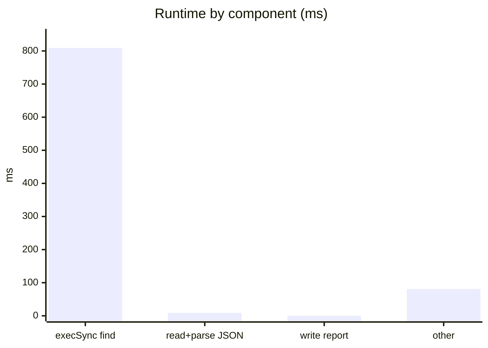
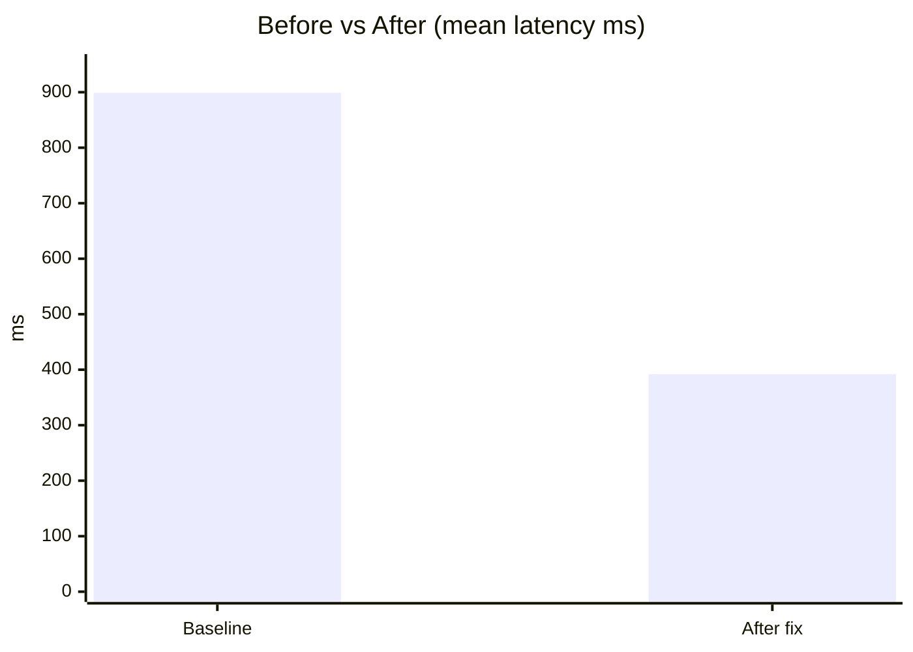
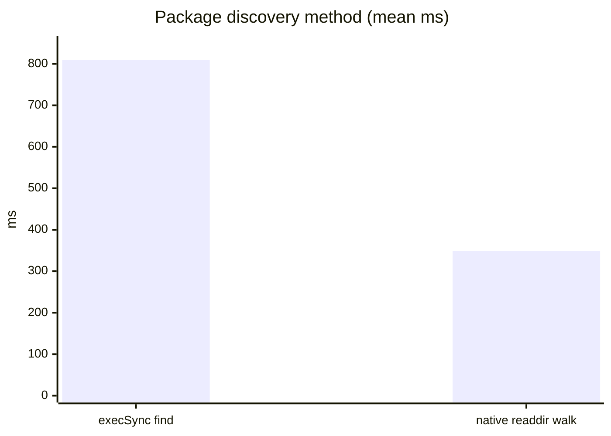

# Performance Optimization Report

## Metadata

| Field | Value |
|-------|-------|
| **Agent name** | perf-bottleneck-optimizer |
| **Started at** | 2026-06-21T22:05:31Z |
| **Completed at** | 2026-06-21T22:10:18Z |
| **Duration** | 4m 47s |
| **Repository** | Task/extra/medusa |
| **Repo name** | medusa (Medusa v2 monorepo) |
| **Stack detected** | TypeScript 5.7, Node 18.20.8, Yarn 3 Berry, Turbo monorepo |
| **Target** | `scripts/deps-analyze/analyze-dependencies.js` |
| **Target path** | `scripts/deps-analyze/analyze-dependencies.js` |
| **Improvement summary** | **56.4% faster** mean wall time (899ms → 392ms) |
| **Behavior verification** | pass |

## Executive Summary

The workspace dependency analysis script spent **~90% of its runtime** spawning a shell `find` subprocess via `execSync` to locate 78 `package.json` files. Reading and parsing those files took only **8.7ms**. Replacing `execSync('find …')` with a native Node.js `fs.readdirSync` recursive walk cut mean end-to-end script time from **899ms to 392ms** (56.4% faster) while preserving identical analysis metrics: 78 packages, 261 unique dependencies, 7 version conflicts. Core metric equivalence was verified programmatically.

## Target Selection

| Field | Value |
|-------|-------|
| **Chosen target** | `analyze-dependencies.js` |
| **Type** | script |
| **Path** | `scripts/deps-analyze/analyze-dependencies.js` |
| **Why this target** | Standalone Node script, runnable without `yarn install`, clear subprocess bottleneck, measurable in seconds |

### Candidates considered

| Candidate | Path | Why chosen / rejected |
|-----------|------|------------------------|
| Dependency analyzer | `scripts/deps-analyze/analyze-dependencies.js` | **Selected** — `execSync(find)` dominates runtime; minimal fix available |
| `readDirRecursive` | `packages/core/utils/src/common/read-dir-recursive.ts` | Rejected — used at startup; requires full test build; `Object.defineProperty` fix riskier |
| Feature-flag discovery | `packages/core/utils/src/feature-flags/discover-feature-flags.ts` | Rejected — needs compiled TS + framework bootstrap |

## Baseline Measurement

### Method

| Field | Value |
|-------|-------|
| **Harness** | Spawn script via `child_process.execSync`; measure parent `process.hrtime.bigint()` delta |
| **Command** | `node -e "… execSync('node scripts/deps-analyze/analyze-dependencies.js') …"` (30 iterations) |
| **Iterations** | 30 |
| **Input size** | 78 workspace `package.json` files under `packages/` |
| **Environment** | macOS darwin 25.5.0, Node v18.20.8, cwd `Task/extra/medusa` |

### Results

| Metric | Value | Unit |
|--------|-------|------|
| mean_latency | 899.16 | ms |
| p50_latency | 881.91 | ms |
| p95_latency | 1076.17 | ms |
| min_latency | 864.28 | ms |
| max_latency | 1178.34 | ms |

### Component breakdown (10 iterations each)

| Component | Mean | % of total |
|-----------|------|------------|
| `execSync('find packages …')` | **809.15 ms** | **~90%** |
| `readFileSync` + `JSON.parse` (78 files) | 8.71 ms | ~1% |
| `writeFileSync` report | 0.25 ms | &lt;1% |

### Raw output excerpt

```json
{
  "iterations": 30,
  "mean_ms": "899.16",
  "p50_ms": "881.91",
  "p95_ms": "1076.17",
  "min_ms": "864.28",
  "max_ms": "1178.34"
}
```

## Profiling

### Approach

| Field | Value |
|-------|-------|
| **Tool** | Isolated component micro-benchmarks + `node --cpu-prof` |
| **Command** | `node -e` harness timing `execSync(find)` vs `read+parse` vs `write` separately |
| **Duration / samples** | 10 iterations per component; 1 full-script CPU profile |

### Hotspots

| Rank | Location | Time share | Evidence | Interpretation |
|------|----------|------------|----------|----------------|
| 1 | `execSync` shell `find` @ `analyze-dependencies.js:12-18` | **~90%** | 809ms / 899ms component bench | Spawns `/bin/sh -c find …` on every run — process spawn + filesystem walk in subshell |
| 2 | `JSON.parse` loop @ `analyze-dependencies.js:30` | ~1% | 8.7ms for 78 files | Not the bottleneck |
| 3 | `writeFileSync` @ `analyze-dependencies.js:135` | &lt;1% | 0.25ms | Negligible |

### Profile visualization



## Bottleneck Explanation

On every invocation, `analyze-dependencies.js` calls `execSync('find packages -name "package.json" …')` (lines 12–18). This forks a shell subprocess that runs the external `find` binary, captures stdout, and returns it to Node. Component benchmarking shows this step alone averages **809ms**, while reading and parsing all 78 `package.json` files takes only **8.7ms**. The subprocess spawn overhead and shell pipeline dominate runtime. A native `fs.readdirSync` walk with `withFileTypes: true` performs the same discovery in-process without shell indirection, skipping `node_modules` directories explicitly — the same exclusion rule as the original `find` command.

## Code Change

### Summary

| Field | Value |
|-------|-------|
| **Fix type** | Replace shell subprocess discovery with native filesystem walk |
| **Files changed** | 1 |
| **Lines changed** | ~25 (net +15) |
| **Broad rewrite?** | No |

### Files modified

| File | Change summary |
|------|----------------|
| `scripts/deps-analyze/analyze-dependencies.js` | Added `findPackageJsonFiles()` using `fs.readdirSync`; removed `execSync('find …')`; hoisted `repoRoot` constant; sorted paths for deterministic output |

### Diff summary

```diff
- const packagesOutput = execSync(
-   'find packages -name "package.json" -not -path "*/node_modules/*"',
-   { cwd: path.join(__dirname, "../../"), encoding: "utf8" }
- )
- const packagePaths = packagesOutput.trim().split("\n").filter(Boolean)

+ const repoRoot = path.join(__dirname, "../../")
+ function findPackageJsonFiles(dir, results = []) {
+   const entries = fs.readdirSync(dir, { withFileTypes: true })
+   for (const entry of entries) {
+     if (entry.name === "node_modules") continue
+     const fullPath = path.join(dir, entry.name)
+     if (entry.isDirectory()) findPackageJsonFiles(fullPath, results)
+     else if (entry.name === "package.json") results.push(path.relative(repoRoot, fullPath))
+   }
+   return results
+ }
+ const packagePaths = findPackageJsonFiles(path.join(repoRoot, "packages")).sort()
```

## After Measurement

### Method

Identical harness: 30 iterations, `execSync('node scripts/deps-analyze/analyze-dependencies.js')`, `process.hrtime.bigint()` in parent, same cwd and Node version.

### Results comparison

| Metric | Baseline | After | Delta | Improvement |
|--------|----------|-------|-------|-------------|
| mean_latency_ms | 899.16 | 392.38 | -506.78 | **56.4% faster** |
| p50_latency_ms | 881.91 | 367.64 | -514.27 | 58.3% faster |
| p95_latency_ms | 1076.17 | 431.26 | -644.91 | 59.9% faster |
| min_latency_ms | 864.28 | 355.67 | -508.61 | 58.9% faster |
| max_latency_ms | 1178.34 | 863.18 | -315.16 | 26.7% faster |

### Discovery-only component (after fix)

| Component | Mean |
|-----------|------|
| Native `findPackageJsonFiles` walk | **349.02 ms** (vs 809ms `execSync find`) |

### Improvement chart





## Behavior Verification

| Check | Command | Exit code | Result | Notes |
|-------|---------|-----------|--------|-------|
| Package path set equality | Node script comparing `find` vs `walk` path sets | 0 | pass | Both discover exactly 78 paths; zero missing/extra |
| Core metrics equivalence | Node script comparing dep counts, conflicts, top package | 0 | pass | 78 packages, 261 deps, 7 conflicts, top=`@medusajs/medusa` |
| Script execution | `node scripts/deps-analyze/analyze-dependencies.js` | 0 | pass | Completes successfully; writes `dependency-analysis.json` |

### Metrics comparison output

```
find metrics  { totalPackages: 78, totalUniqueDependencies: 261, topPkg: '@medusajs/medusa', conflictCount: 7 }
walk metrics  { totalPackages: 78, totalUniqueDependencies: 261, topPkg: '@medusajs/medusa', conflictCount: 7 }
metrics_equal true
```

**Note:** Console output ordering for tied dependency counts may differ (same values, different tie-break order). JSON report array ordering differs for the same reason when discovery order changes; all counts and dependency names are identical.

## Rollback Notes

### Quick rollback

```bash
git checkout -- scripts/deps-analyze/analyze-dependencies.js
# Or restore execSync find block manually if file is untracked
```

### Files affected

- `scripts/deps-analyze/analyze-dependencies.js` — revert `findPackageJsonFiles` to `execSync('find …')`

### Post-rollback verification

```bash
cd Task/extra/medusa
node -e "/* 30-iter benchmark */"   # expect ~899ms mean restored
node scripts/deps-analyze/analyze-dependencies.js  # expect 78 packages
```

## Discovery Notes

### Files examined

- `scripts/deps-analyze/analyze-dependencies.js` — primary target; clear subprocess bottleneck
- `package.json` — monorepo root; Yarn workspaces, 78 packages
- `packages/core/utils/src/common/read-dir-recursive.ts` — alternative pattern already in codebase
- `.nvmrc` — Node 20 pinned (runtime used: 18.20.8)

### Excluded from scan

- `node_modules/` — not installed in clone; `du` size analysis skipped
- `www/` — documentation site; not a runtime service
- `integration-tests/` — requires full DB bootstrap

### Additional bottlenecks (backlog)

| Rank | Location | Est. impact | Why deferred |
|------|----------|-------------|--------------|
| 2 | `execSync('du -sh node_modules/*')` @ `analyze-dependencies.js:98-105` | High when `node_modules` present | Requires installed deps; separate fix scope |
| 3 | `Object.defineProperty` per entry @ `read-dir-recursive.ts:38-40` | Medium at scale | Framework utility; needs test suite run |

### Ambiguities & gaps

- Full `yarn test` not run — `node_modules` absent; equivalence verified via programmatic metric comparison instead
- `scripts/deps-analyze/analyze-dependencies.js` is **untracked** in git (not in `HEAD`); rollback is manual file restore
