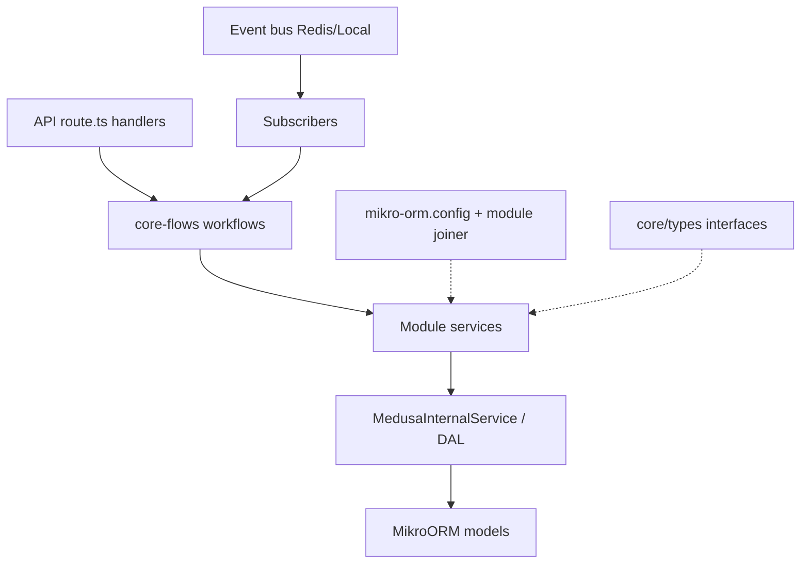
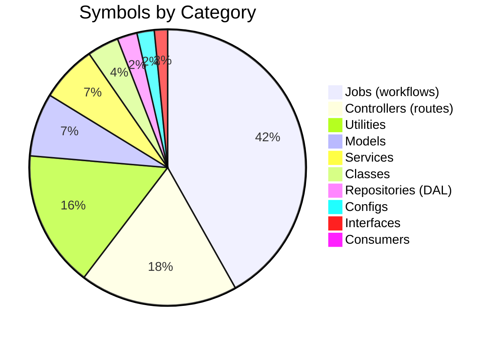
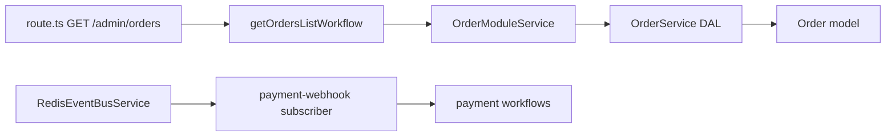

# Repo Structure Map Report

## Metadata

| Field | Value |
|-------|-------|
| **Agent name** | repo-structure-mapper |
| **Started at** | 2026-06-22T14:00:00Z |
| **Completed at** | 2026-06-22T14:22:15Z |
| **Duration** | 22m 15s |
| **Repository** | Task/extra/medusa |
| **Repo name** | Medusa |
| **Stack detected** | TypeScript monorepo — Yarn 3 workspaces, Node ≥20, Medusa v2 modular commerce, MikroORM, Jest |
| **Scope** | full repo (`packages/`) |
| **Output format** | markdown |
| **Files scanned** | 5,030 |
| **Symbols found** | 1,680 |
| **Controllers** | 310 |
| **Services** | 111 |
| **Repositories** | 39 |
| **Models** | 124 |
| **Jobs** | 701 |
| **Consumers** | 5 |
| **Configs** | 34 |
| **Utilities** | 268 |
| **Classes** | 62 |
| **Interfaces** | 26 |

## Summary

Medusa is a **modular digital-commerce platform** organized as a Yarn workspaces monorepo. HTTP entry points live in `packages/medusa/src/api/` as Next-style `route.ts` handlers (admin + store). Domain logic is split across **35 commerce modules** under `packages/modules/`, each exposing a `*ModuleService` backed by MikroORM models. Cross-cutting orchestration runs through **701 workflow files** in `packages/core/core-flows/`. Persistence uses **MedusaInternalService** (DAL) rather than classic `*Repository` classes. Event-driven hooks use Redis/local event-bus services plus a small set of subscribers. Shared helpers concentrate in `packages/core/utils/` (268 files).

## Architecture Overview

Medusa v2 follows a **module + workflow + API route** architecture:

```
packages/
├── medusa/              → HTTP API routes (admin/store), subscribers, loaders
├── modules/             → 35 domain modules (order, cart, product, payment, …)
│   └── providers/       → Pluggable Stripe, S3, SendGrid, auth, etc.
├── core/
│   ├── core-flows/      → Business workflows (cart, order, fulfillment, …)
│   ├── framework/       → HTTP, DI, subscribers, MikroORM integration
│   ├── types/           → I*ModuleService interfaces & DTOs
│   └── utils/           → Shared utilities (common, DML, DAL, totals, …)
├── admin/               → Admin dashboard packages
├── cli/                 → Medusa CLI tooling
└── design-system/       → UI components
```

**Layer flow:** API `route.ts` → core-flows **workflow** → module **service** → MikroORM **model** / internal DAL service → PostgreSQL.

### Layer diagram



### Category distribution



## Controllers

HTTP handlers are **exported route functions** (`GET`, `POST`, `PUT`, `DELETE`) in `packages/medusa/src/api/**/route.ts`.

### Summary by API surface

| Surface | Route files | Top-level areas |
|---------|-------------|-----------------|
| Admin API | 249 | 52 areas (orders, products, promotions, fulfillments, …) |
| Store API | 44 | 17 areas (carts, products, customers, shipping-options, …) |
| Other (auth, hooks, utils) | 17 | middlewares, validators, plugin hooks |
| **Total** | **310** | |

### Representative controllers

| # | Name | Package / Module | File | Description | Key dependencies | Notes |
|---|------|------------------|------|-------------|------------------|-------|
| 1 | GET orders (admin) | `@medusajs/medusa` admin | `packages/medusa/src/api/admin/orders/route.ts:8` | List orders via workflow | `getOrdersListWorkflow` | AuthenticatedMedusaRequest |
| 2 | GET products (admin) | admin | `packages/medusa/src/api/admin/products/route.ts` | Product listing | product workflows | — |
| 3 | POST carts (store) | store | `packages/medusa/src/api/store/carts/route.ts` | Create cart | cart module / workflows | — |
| 4 | GET shipping-options (store) | store | `packages/medusa/src/api/store/shipping-options/route.ts` | List shipping options | fulfillment module | — |
| 5 | Payment webhooks | hooks | `packages/medusa/src/api/hooks/payment/[provider]/route.ts` | Provider webhook ingress | payment module | dynamic provider segment |

### Admin API areas (52)

`api-keys`, `campaigns`, `claims`, `collections`, `currencies`, `customer-groups`, `customers`, `draft-orders`, `exchanges`, `feature-flags`, `fulfillment-providers`, `fulfillment-sets`, `fulfillments`, `index`, `inventory-items`, `invites`, `locales`, `notifications`, `order-changes`, `order-edits`, `orders`, `payment-collections`, `payments`, `plugins`, `price-lists`, `price-preferences`, `product-categories`, `product-tags`, `product-types`, `product-variants`, `products`, `promotions`, `property-labels`, `rbac`, `refund-reasons`, `regions`, `reservations`, `return-reasons`, `returns`, `sales-channels`, `shipping-option-types`, `shipping-options`, `shipping-profiles`, `stock-locations`, `stores`, `tax-providers`, `tax-rates`, `tax-regions`, `translations`, `uploads`, `users`, `views`, `workflows-executions`

### Store API areas (17)

`carts`, `collections`, `currencies`, `customers`, `locales`, `orders`, `payment-collections`, `payment-providers`, `product-categories`, `product-tags`, `product-types`, `product-variants`, `products`, `regions`, `return-reasons`, `returns`, `shipping-options`

## Services

Module services implement `I*ModuleService` from `@medusajs/framework/types` and are registered via module joiner configs.

### Per-module service count

| Module package | Service files | Primary module service |
|----------------|---------------|------------------------|
| order | 2 | `OrderModuleService` @ `order-module-service.ts:189` |
| product | 2 | `ProductModuleService` @ `product-module-service.ts:81` |
| cart | 1 | `CartModuleService` @ `cart-module.ts:70` |
| payment | 2 | `PaymentModuleService` @ `payment-module.ts:95` |
| customer | 1 | `CustomerModuleService` |
| auth | 4 | `AuthModuleService` @ `auth-module.ts:54` |
| fulfillment | 2 | `FulfillmentModuleService` @ `fulfillment-module-service.ts:81` |
| promotion | 1 | `PromotionModuleService` @ `promotion-module.ts:78` |
| inventory | 2 | `InventoryModuleService` @ `inventory-module.ts:51` |
| tax | 2 | `TaxModuleService` @ `tax-module-service.ts:41` |
| notification | 2 | `NotificationModuleService` @ `notification-module-service.ts:33` |
| user | 1 | `UserModuleService` @ `user-module.ts:38` |
| region | 1 | `RegionModuleService` @ `region-module.ts:39` |
| store | 1 | `StoreModuleService` |
| pricing | 1 | `PricingModuleService` |
| workflow-engine-* | 2 each | `WorkflowsModuleService` @ `workflows-module.ts:36` |
| providers/* | 21 | Stripe, S3, SendGrid, auth providers, etc. |
| **Total service files** | **111** | |

### Key services (sample)

| # | Name | Package / Module | File | Description | Key dependencies | Notes |
|---|------|------------------|------|-------------|------------------|-------|
| 1 | OrderModuleService | `@medusajs/order` | `packages/modules/order/src/services/order-module-service.ts:189` | Order CRUD, changes, returns | MikroORM, IOrderModuleService | Main order domain |
| 2 | OrderService | `@medusajs/order` | `packages/modules/order/src/services/order-service.ts:21` | Internal order DAL | MedusaInternalService | Repository-layer |
| 3 | ProductModuleService | `@medusajs/product` | `packages/modules/product/src/services/product-module-service.ts:81` | Product catalog | IProductModuleService | — |
| 4 | CartModuleService | `@medusajs/cart` | `packages/modules/cart/src/services/cart-module.ts:70` | Cart lifecycle | ICartModuleService | — |
| 5 | PaymentModuleService | `@medusajs/payment` | `packages/modules/payment/src/services/payment-module.ts:95` | Payments & captures | IPaymentModuleService | — |
| 6 | AuthModuleService | `@medusajs/auth` | `packages/modules/auth/src/services/auth-module.ts:54` | Auth identities, MFA | IAuthModuleService | — |
| 7 | WorkflowsModuleService | workflow-engine | `packages/modules/workflow-engine-redis/src/services/workflows-module.ts:39` | Workflow persistence | IWorkflowEngineService | Redis variant |
| 8 | RedisEventBusService | event-bus-redis | `packages/modules/event-bus-redis/src/services/event-bus-redis.ts:50` | Redis pub/sub events | AbstractEventBusModuleService | Consumer/producer |
| 9 | StripeProviderService | payment-stripe | `packages/modules/providers/payment-stripe/src/services/stripe-provider.ts` | Stripe payment provider | PaymentProviderService | Provider pattern |

## Repositories

Medusa v2 **does not use classic `*Repository` classes** widely. Data access is via **MedusaInternalService** subclasses and MikroORM model managers.

| # | Name | Package / Module | File | Description | Notes |
|---|------|------------------|------|-------------|-------|
| 1 | OrderService (DAL) | order | `packages/modules/order/src/services/order-service.ts:21` | Order entity internal service | extends MedusaInternalService |
| 2 | ProductCategoryService | product | `packages/modules/product/src/services/product-category.ts:31` | Category DAL | MedusaInternalService |
| 3 | PaymentProviderService | payment | `packages/modules/payment/src/services/payment-provider.ts:47` | Provider persistence | MedusaInternalService |
| 4 | NotificationProviderService | notification | `packages/modules/notification/src/services/notification-provider.ts:23` | Notification provider DAL | MedusaInternalService |
| 5 | InventoryLevelService | inventory | `packages/modules/inventory/src/services/inventory-level.ts:12` | Inventory level DAL | MedusaInternalService |
| 6 | FulfillmentProviderService | fulfillment | `packages/modules/fulfillment/src/services/fulfillment-provider.ts:31` | Fulfillment provider DAL | MedusaInternalService |
| 7 | TaxProviderService | tax | `packages/modules/tax/src/services/tax-provider.ts:12` | Tax provider DAL | MedusaInternalService |

**Pattern:** 39 internal DAL service classes identified across modules (extends `MedusaInternalService` or `ModulesSdkUtils.MedusaInternalService`). Only 4 files use `*repository*` naming — legacy or test utilities.

## Models

MikroORM entity models live in `packages/modules/<module>/src/models/`. **124 model files** across modules.

### Per-module model counts

| Module | Count | Sample entities |
|--------|-------|-----------------|
| order | 23 | Order, OrderItem, Return, Claim, Exchange |
| fulfillment | 12 | Fulfillment, ShippingOption, GeoZone |
| product | 10 | Product, ProductVariant, ProductCategory |
| cart | 9 | Cart, LineItem, ShippingMethod |
| payment | 8 | Payment, PaymentSession, Capture, Refund |
| promotion | 7 | Promotion, Campaign, ApplicationMethod |
| pricing | 6 | Price, PriceList, PricePreference |
| auth | 6 | AuthIdentity, ProviderIdentity |
| rbac | 5 | Role, Permission |
| tax | 4 | TaxRate, TaxRegion |
| customer | 4 | Customer, Address, CustomerGroup |
| others | 36 | store, settings, inventory, user, … |
| **Total** | **124** | |

### Representative models

| # | Name | Package / Module | File | Description | Notes |
|---|------|------------------|------|-------------|-------|
| 1 | Order | `@medusajs/order` | `packages/modules/order/src/models/order.ts:132` | Order aggregate root | `export const Order = _Order` |
| 2 | Product | `@medusajs/product` | `packages/modules/product/src/models/product.ts` | Product entity | — |
| 3 | Cart | `@medusajs/cart` | `packages/modules/cart/src/models/cart.ts` | Shopping cart | — |
| 4 | Payment | `@medusajs/payment` | `packages/modules/payment/src/models/payment.ts` | Payment record | — |
| 5 | Customer | `@medusajs/customer` | `packages/modules/customer/src/models/customer.ts` | Customer entity | — |
| 6 | Promotion | `@medusajs/promotion` | `packages/modules/promotion/src/models/promotion.ts` | Promotion rules | — |

## Jobs

No traditional cron/`@Scheduled` jobs found. **Background orchestration uses workflows** in `packages/core/core-flows/` — **701 workflow-related TypeScript files**.

### Workflow files by domain

| Domain | Files | Example |
|--------|-------|---------|
| order | 156 | `refundCapturedPaymentsWorkflow` @ `core-flows/src/order/workflows/payments/refund-captured-payments.ts:18` |
| product | 70 | product CRUD/import workflows |
| cart | 65 | `completeCartWorkflow`, `createCartWorkflow` |
| fulfillment | 40 | shipping, fulfillment creation |
| draft-order | 38 | draft order lifecycle |
| promotion | 26 | promotion application |
| rbac | 21 | role/permission workflows |
| common | 21 | shared steps |
| tax | 20 | tax calculation |
| inventory | 19 | reservation workflows |
| customer | 19 | customer management |
| other domains | 186 | payment-collection, user, pricing, … |
| **Total** | **701** | |

### Representative jobs (workflows)

| # | Name | Package / Module | File | Description | Trigger | Notes |
|---|------|------------------|------|-------------|---------|-------|
| 1 | refundCapturedPaymentsWorkflow | core-flows | `packages/core/core-flows/src/order/workflows/payments/refund-captured-payments.ts:18` | Refund captured payments on cancel | order cancel workflow | createWorkflow |
| 2 | getOrdersListWorkflow | core-flows | `packages/core/core-flows/src/order/workflows/` | Admin order list | API route GET | invoked from route.ts:20 |
| 3 | markPaymentCollectionAsPaid | core-flows | `packages/core/core-flows/src/order/workflows/mark-payment-collection-as-paid.ts:107` | Mark payment paid | admin action | — |
| 4 | completeCartWorkflow | core-flows | `packages/core/core-flows/src/cart/workflows/` | Complete cart → order | store checkout | — |

## Consumers

Event consumers include **event-bus module services** and **Medusa subscribers**.

| # | Name | Package / Module | File | Description | Topic / queue | Notes |
|---|------|------------------|------|-------------|---------------|-------|
| 1 | RedisEventBusService | event-bus-redis | `packages/modules/event-bus-redis/src/services/event-bus-redis.ts:50` | Redis-backed event bus | Redis channels | extends AbstractEventBusModuleService |
| 2 | LocalEventBusService | event-bus-local | `packages/modules/event-bus-local/src/services/event-bus-local.ts:24` | In-memory event bus | local emit | dev/test |
| 3 | paymentWebhookhandler | medusa | `packages/medusa/src/subscribers/payment-webhook.ts:18` | Payment webhook subscriber | payment events | export default async function |
| 4 | configurableNotifications | medusa | `packages/medusa/src/subscribers/configurable-notifications.ts:46` | Notification routing | notification events | export default async function |
| 5 | subscriber-loader | framework | `packages/core/framework/src/subscribers/subscriber-loader.ts` | Loads subscriber modules | — | framework infrastructure |

## Configs

| # | Name | Package / Module | File | Description | Notes |
|---|------|------------------|------|-------------|-------|
| 1 | mikro-orm.config (order) | order | `packages/modules/order/mikro-orm.config.dev.ts` | Order module DB config | per-module pattern |
| 2 | mikro-orm.config (product) | product | `packages/modules/product/mikro-orm.config.dev.ts` | Product module DB | — |
| 3 | mikro-orm.config (×26 modules) | various | `packages/modules/*/mikro-orm.config*.ts` | Module-scoped ORM | 26 files total |
| 4 | jest.config.js | root | `jest.config.js` | Monorepo test config | — |
| 5 | tsconfig (packages) | core | `packages/core/*/tsconfig.json` | TypeScript project refs | build graph |
| 6 | module joiner configs | modules | `packages/modules/*/src/joiner-config.ts` | Module registration & links | runtime wiring |

**Total config artifacts:** 34 (26 MikroORM + 8 build/test/tooling configs).

## Utilities

Shared utilities in `packages/core/utils/src/` — **268 files** excluding tests.

### Utilities by folder

| Folder | Files | Purpose |
|--------|-------|---------|
| common | 99 | `isPresent`, string helpers, object utils, validators |
| dml | 42 | Data modeling language helpers |
| modules-sdk | 37 | Module bootstrap, joiner, remote query |
| dal | 18 | Data access layer utilities |
| graphql | 6 | GraphQL schema helpers |
| totals | 4 | BigNumber totals, pricing math |
| pricing | 4 | Price rule utilities |
| payment | 4 | Payment helpers |
| fulfillment | 4 | Shipping/fulfillment utils |
| feature-flags | 4 | Feature flag helpers |
| event-bus | 4 | Event bus utilities |
| other | 42 | auth, order, link, orchestration, … |

### Representative utilities

| # | Name | Package / Module | File | Description | Notes |
|---|------|------------------|------|-------------|-------|
| 1 | isPresent | `@medusajs/utils` | `packages/core/utils/src/common/is-present.ts:5` | Null/empty check | widely imported |
| 2 | removeUndefined | `@medusajs/utils` | `packages/core/utils/src/common/remove-undefined.ts` | Strip undefined fields | MikroORM ops |
| 3 | upperCaseFirst | `@medusajs/utils` | `packages/core/utils/src/common/upper-case-first.ts` | String helper | — |
| 4 | createRawPropertiesFromBigNumber | `@medusajs/utils` | `packages/core/utils/src/totals/` | BigNumber serialization | order totals |

Module-local utilities also exist (e.g. `packages/modules/auth/src/utils/verification-token.ts`, `mfa.ts`, `totp.ts`).

## Classes

Significant **exported classes** beyond those already listed under Services (62 total including orchestrators and providers).

| # | Name | Package / Module | File | Description | Notes |
|---|------|------------------|------|-------------|-------|
| 1 | WorkflowOrchestratorService | workflow-engine | `packages/modules/workflow-engine-inmemory/src/services/workflow-orchestrator.ts:102` | Runs workflow steps | in-memory engine |
| 2 | DataSynchronizer | index | `packages/modules/index/src/services/data-synchronizer.ts:18` | Search index sync | index module |
| 3 | PostgresProvider | index | `packages/modules/index/src/services/postgres-provider.ts:43` | Index storage provider | implements StorageProvider |
| 4 | ApiKeyModuleService | api-key | `packages/modules/api-key/src/services/api-key-module-service.ts:44` | API key management | export class (non-default) |
| 5 | LockingModuleService | locking | `packages/modules/locking/src/services/locking-module.ts:18` | Distributed locking | — |

## Interfaces

Module contracts defined in `packages/core/types/src/`.

| # | Name | Package / Module | File | Description | Implemented by | Notes |
|---|------|------------------|------|-------------|----------------|-------|
| 1 | IModuleService | modules-sdk | `packages/core/types/src/modules-sdk/index.ts:322` | Base module contract | all module services | — |
| 2 | IOrderModuleService | order | `packages/core/types/src/order/service.ts:102` | Order module API | OrderModuleService | — |
| 3 | IProductModuleService | product | `packages/core/types/src/product/service.ts:51` | Product module API | ProductModuleService | — |
| 4 | ICartModuleService | cart | `packages/core/types/src/cart/service.ts:50` | Cart module API | CartModuleService | — |
| 5 | IPaymentModuleService | payment | `packages/core/types/src/payment/service.ts:46` | Payment module API | PaymentModuleService | — |
| 6 | IAuthModuleService | auth | `packages/core/types/src/auth/service.ts:43` | Auth module API | AuthModuleService | — |
| 7 | IFulfillmentModuleService | fulfillment | `packages/core/types/src/fulfillment/service.ts:53` | Fulfillment API | FulfillmentModuleService | — |
| 8 | IWorkflowEngineService | workflows-sdk | `packages/core/types/src/workflows-sdk/service.ts:47` | Workflow engine API | WorkflowsModuleService | — |
| 9 | IEventBusModuleService | event-bus | `packages/core/types/src/event-bus/event-bus-module.ts:8` | Event bus contract | Redis/Local event bus | — |
| 10 | IPromotionModuleService | promotion | `packages/core/types/src/promotion/service.ts:31` | Promotion API | PromotionModuleService | — |

**Total `I*ModuleService` interfaces:** 26 (one per commerce module + base types).

## Layer Relationships

| From | To | Relationship | Confidence |
|------|-----|--------------|------------|
| `admin/orders/route.ts` GET | `getOrdersListWorkflow` | invokes | explicit |
| `getOrdersListWorkflow` | `OrderModuleService` | module call via scope | explicit |
| `OrderModuleService` | `OrderService` (DAL) | internal delegation | explicit |
| `OrderService` | `Order` model | MikroORM persistence | explicit |
| `completeCartWorkflow` | `CartModuleService` | workflow step | explicit |
| `payment-webhook` subscriber | payment workflows | event handler | inferred |
| `RedisEventBusService` | subscribers | emit/subscribe | explicit |
| Admin API routes | core-flows workflows | primary pattern | explicit |



## Discovery notes

### Files examined

- `Task/extra/medusa/package.json` — Yarn workspaces layout, 35 modules
- `packages/medusa/src/api/` — 310 route.ts handlers
- `packages/modules/*/src/services/` — 111 service files
- `packages/modules/*/src/models/` — 124 model files
- `packages/core/core-flows/src/` — 701 workflow files
- `packages/core/types/src/*/service.ts` — I*ModuleService interfaces
- `packages/core/utils/src/` — 268 utility files

### Excluded from scan

- `node_modules/` — absent (install failed); third-party deps
- `**/__tests__/**`, `integration-tests/` — test code
- `www/` — documentation site (separate from commerce runtime)
- `packages/design-system/`, `packages/admin/` UI — component-level; not inventoried as domain services
- Generated `.next/` build artifacts

### Ambiguities & gaps

- **Repository vs DAL:** Medusa uses `MedusaInternalService` instead of `*Repository` naming; counted under Repositories with note.
- **Jobs vs Workflows:** No cron jobs; workflow files counted as Jobs (background orchestration).
- **Admin UI packages** under `packages/admin/` contain React components — classified as frontend, not controllers.
- **Dynamic plugin routes** may register at runtime; static scan covers core `packages/medusa/src/api` only.
- `node_modules` missing — could not verify import graph via TypeScript compiler.

### Recommendations

- Use `packages/core/types/src/*/service.ts` as the **contract index** when navigating modules.
- Trace features **API route → workflow → module service** for end-to-end understanding.
- Provider modules under `packages/modules/providers/` follow a consistent `*ProviderService` pattern for third-party integrations.
- Consider generating this map in CI from TypeScript AST for full export coverage on large repos.
