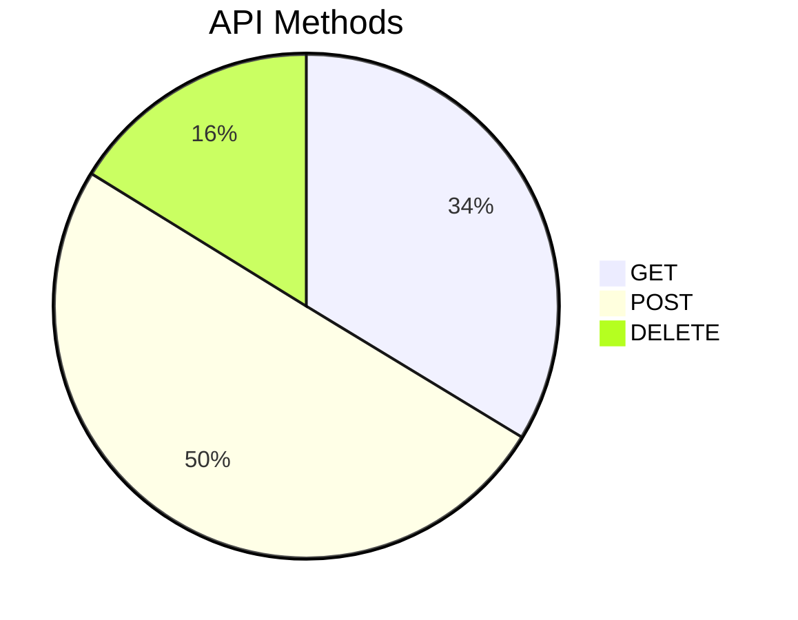
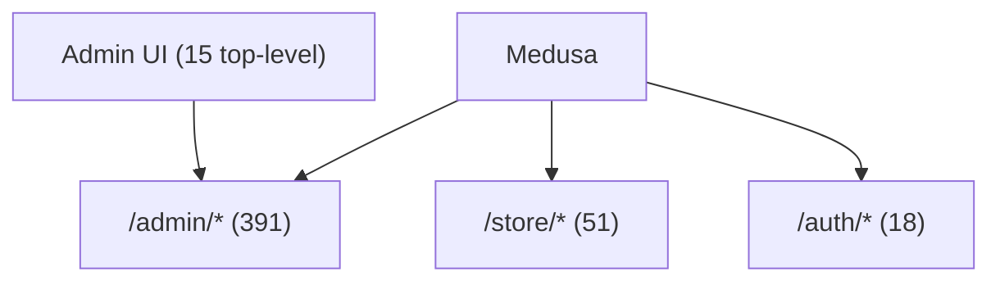

# Route & API Map Report

## Metadata

| Field | Value |
|-------|-------|
| **Agent name** | repo-route-api-mapper |
| **Started at** | 2026-06-21T22:25:52.819Z |
| **Completed at** | 2026-06-21T22:31:52.819Z |
| **Duration** | 6m 00s |
| **Repository** | Task/extra/medusa |
| **Repo name** | medusa |
| **Stack detected** | Medusa v2, TypeScript, file-based API routes, React Router admin dashboard |
| **Base URL / prefix** | `/` — admin: `/admin/*`, store: `/store/*`, auth: `/auth/*` |
| **Scope** | full repo |
| **Output format** | markdown |
| **Frontend routes (top-level)** | 15 |
| **API endpoints** | 463 |
| **Frontend→API mappings** | 419 |
| **GET** | 156 |
| **POST** | 232 |
| **DELETE** | 75 |

## Summary

Medusa exposes **463 HTTP API endpoints** in `packages/medusa/src/api/`: **391 admin**, **51 store**, **18 auth**, **1 hooks**, **2 cloud**. The admin dashboard defines **15 top-level UI routes** plus nested child segments in `get-route.map.tsx`. Mutations use **POST** (no PUT/PATCH route exports). Admin UI calls `/admin/*` via Medusa JS SDK.

## Route Architecture

```
Client
├── Admin UI (React Router)  → /products, /orders, /customers, …
│   └── sdk.admin.*          → /admin/*
├── Storefront               → /store/*
├── Auth                     → /auth/*
└── Webhooks                 → /hooks/payment/:provider
```

## Method Distribution



## Route Tree Overview



## Frontend Routes

### Top-level admin routes (15)

| # | Path | Page | Auth | File | Notes |
|---|---|---|---|---|---|
| 1 | /products | products | admin | packages/admin/dashboard/src/dashboard-app/routes/get-route.map.tsx:34 | Top-level React Router route |
| 2 | /categories | categories | admin | packages/admin/dashboard/src/dashboard-app/routes/get-route.map.tsx:230 | Top-level React Router route |
| 3 | /orders | orders | admin | packages/admin/dashboard/src/dashboard-app/routes/get-route.map.tsx:295 | Top-level React Router route |
| 4 | /promotions | promotions | admin | packages/admin/dashboard/src/dashboard-app/routes/get-route.map.tsx:407 | Top-level React Router route |
| 5 | /campaigns | campaigns | admin | packages/admin/dashboard/src/dashboard-app/routes/get-route.map.tsx:464 | Top-level React Router route |
| 6 | /collections | collections | admin | packages/admin/dashboard/src/dashboard-app/routes/get-route.map.tsx:524 | Top-level React Router route |
| 7 | /price-lists | price-lists | admin | packages/admin/dashboard/src/dashboard-app/routes/get-route.map.tsx:582 | Top-level React Router route |
| 8 | /customers | customers | admin | packages/admin/dashboard/src/dashboard-app/routes/get-route.map.tsx:654 | Top-level React Router route |
| 9 | /customer-groups | customer-groups | admin | packages/admin/dashboard/src/dashboard-app/routes/get-route.map.tsx:758 | Top-level React Router route |
| 10 | /reservations | reservations | admin | packages/admin/dashboard/src/dashboard-app/routes/get-route.map.tsx:822 | Top-level React Router route |
| 11 | /inventory | inventory | admin | packages/admin/dashboard/src/dashboard-app/routes/get-route.map.tsx:877 | Top-level React Router route |
| 12 | /settings | settings | admin | packages/admin/dashboard/src/dashboard-app/routes/get-route.map.tsx:964 | Top-level React Router route |
| 13 | /login | login | admin | packages/admin/dashboard/src/dashboard-app/routes/get-route.map.tsx:2089 | Top-level React Router route |
| 14 | /reset-password | reset-password | admin | packages/admin/dashboard/src/dashboard-app/routes/get-route.map.tsx:2093 | Top-level React Router route |
| 15 | /invite | invite | admin | packages/admin/dashboard/src/dashboard-app/routes/get-route.map.tsx:2097 | Top-level React Router route |


### Nested route segments (101 relative paths in route tree)

| # | Segment | File | Notes |
|---|---|---|---|
| 1 | create | packages/admin/dashboard/src/dashboard-app/routes/get-route.map.tsx:45 | Nested under parent route — see get-route.map.tsx tree |
| 2 | import | packages/admin/dashboard/src/dashboard-app/routes/get-route.map.tsx:50 | Nested under parent route — see get-route.map.tsx tree |
| 3 | export | packages/admin/dashboard/src/dashboard-app/routes/get-route.map.tsx:55 | Nested under parent route — see get-route.map.tsx tree |
| 4 | :id | packages/admin/dashboard/src/dashboard-app/routes/get-route.map.tsx:62 | Nested under parent route — see get-route.map.tsx tree |
| 5 | edit | packages/admin/dashboard/src/dashboard-app/routes/get-route.map.tsx:86 | Nested under parent route — see get-route.map.tsx tree |
| 6 | images/:image_id/variants | packages/admin/dashboard/src/dashboard-app/routes/get-route.map.tsx:129 | Nested under parent route — see get-route.map.tsx tree |
| 7 | options/:option_id/edit | packages/admin/dashboard/src/dashboard-app/routes/get-route.map.tsx:148 | Nested under parent route — see get-route.map.tsx tree |
| 8 | variants/:variant_id | packages/admin/dashboard/src/dashboard-app/routes/get-route.map.tsx:172 | Nested under parent route — see get-route.map.tsx tree |
| 9 | edit | packages/admin/dashboard/src/dashboard-app/routes/get-route.map.tsx:191 | Nested under parent route — see get-route.map.tsx tree |
| 10 | create | packages/admin/dashboard/src/dashboard-app/routes/get-route.map.tsx:241 | Nested under parent route — see get-route.map.tsx tree |
| 11 | :id | packages/admin/dashboard/src/dashboard-app/routes/get-route.map.tsx:253 | Nested under parent route — see get-route.map.tsx tree |
| 12 | edit | packages/admin/dashboard/src/dashboard-app/routes/get-route.map.tsx:271 | Nested under parent route — see get-route.map.tsx tree |
| 13 | export | packages/admin/dashboard/src/dashboard-app/routes/get-route.map.tsx:306 | Nested under parent route — see get-route.map.tsx tree |
| 14 | :id | packages/admin/dashboard/src/dashboard-app/routes/get-route.map.tsx:312 | Nested under parent route — see get-route.map.tsx tree |
| 15 | returns/:return_id/receive | packages/admin/dashboard/src/dashboard-app/routes/get-route.map.tsx:335 | Nested under parent route — see get-route.map.tsx tree |
| 16 | :f_id/create-shipment | packages/admin/dashboard/src/dashboard-app/routes/get-route.map.tsx:345 | Nested under parent route — see get-route.map.tsx tree |
| 17 | create | packages/admin/dashboard/src/dashboard-app/routes/get-route.map.tsx:418 | Nested under parent route — see get-route.map.tsx tree |
| 18 | :id | packages/admin/dashboard/src/dashboard-app/routes/get-route.map.tsx:423 | Nested under parent route — see get-route.map.tsx tree |
| 19 | edit | packages/admin/dashboard/src/dashboard-app/routes/get-route.map.tsx:441 | Nested under parent route — see get-route.map.tsx tree |
| 20 | :ruleType/edit | packages/admin/dashboard/src/dashboard-app/routes/get-route.map.tsx:455 | Nested under parent route — see get-route.map.tsx tree |
| 21 | create | packages/admin/dashboard/src/dashboard-app/routes/get-route.map.tsx:476 | Nested under parent route — see get-route.map.tsx tree |
| 22 | :id | packages/admin/dashboard/src/dashboard-app/routes/get-route.map.tsx:480 | Nested under parent route — see get-route.map.tsx tree |
| 23 | edit | packages/admin/dashboard/src/dashboard-app/routes/get-route.map.tsx:498 | Nested under parent route — see get-route.map.tsx tree |
| 24 | create | packages/admin/dashboard/src/dashboard-app/routes/get-route.map.tsx:536 | Nested under parent route — see get-route.map.tsx tree |
| 25 | :id | packages/admin/dashboard/src/dashboard-app/routes/get-route.map.tsx:543 | Nested under parent route — see get-route.map.tsx tree |
| 26 | edit | packages/admin/dashboard/src/dashboard-app/routes/get-route.map.tsx:561 | Nested under parent route — see get-route.map.tsx tree |
| 27 | create | packages/admin/dashboard/src/dashboard-app/routes/get-route.map.tsx:594 | Nested under parent route — see get-route.map.tsx tree |
| 28 | :id | packages/admin/dashboard/src/dashboard-app/routes/get-route.map.tsx:601 | Nested under parent route — see get-route.map.tsx tree |
| 29 | edit | packages/admin/dashboard/src/dashboard-app/routes/get-route.map.tsx:619 | Nested under parent route — see get-route.map.tsx tree |
| 30 | create | packages/admin/dashboard/src/dashboard-app/routes/get-route.map.tsx:665 | Nested under parent route — see get-route.map.tsx tree |
| 31 | :id | packages/admin/dashboard/src/dashboard-app/routes/get-route.map.tsx:679 | Nested under parent route — see get-route.map.tsx tree |
| 32 | edit | packages/admin/dashboard/src/dashboard-app/routes/get-route.map.tsx:697 | Nested under parent route — see get-route.map.tsx tree |
| 33 | :order_id/transfer | packages/admin/dashboard/src/dashboard-app/routes/get-route.map.tsx:737 | Nested under parent route — see get-route.map.tsx tree |
| 34 | create | packages/admin/dashboard/src/dashboard-app/routes/get-route.map.tsx:770 | Nested under parent route — see get-route.map.tsx tree |
| 35 | :id | packages/admin/dashboard/src/dashboard-app/routes/get-route.map.tsx:779 | Nested under parent route — see get-route.map.tsx tree |
| 36 | edit | packages/admin/dashboard/src/dashboard-app/routes/get-route.map.tsx:797 | Nested under parent route — see get-route.map.tsx tree |
| 37 | create | packages/admin/dashboard/src/dashboard-app/routes/get-route.map.tsx:834 | Nested under parent route — see get-route.map.tsx tree |
| 38 | :id | packages/admin/dashboard/src/dashboard-app/routes/get-route.map.tsx:841 | Nested under parent route — see get-route.map.tsx tree |
| 39 | edit | packages/admin/dashboard/src/dashboard-app/routes/get-route.map.tsx:859 | Nested under parent route — see get-route.map.tsx tree |
| 40 | create | packages/admin/dashboard/src/dashboard-app/routes/get-route.map.tsx:888 | Nested under parent route — see get-route.map.tsx tree |


_Full nested URL resolution: combine parent absolute path + child segments per `get-route.map.tsx` tree (e.g. `/products/:id/edit`)._

## API Endpoints

| Namespace | Count | Base |
|-----------|-------|------|
| Admin | 391 | `/admin/*` |
| Store | 51 | `/store/*` |
| Auth | 18 | `/auth/*` |
| Hooks | 1 | `/hooks/*` |
| Cloud | 2 | `/cloud/*` |

### Store API (51 — full listing)

| # | Method | Path | Auth | File |
|---|---|---|---|---|
| 1 | POST | /store/carts/:id/complete | store/public | packages/medusa/src/api/store/carts/[id]/complete/route.ts:13 |
| 2 | POST | /store/carts/:id/customer | store/public | packages/medusa/src/api/store/carts/[id]/customer/route.ts:12 |
| 3 | POST | /store/carts/:id/line-items/:line_id | store/public | packages/medusa/src/api/store/carts/[id]/line-items/[line_id]/route.ts:10 |
| 4 | DELETE | /store/carts/:id/line-items/:line_id | store/public | packages/medusa/src/api/store/carts/[id]/line-items/[line_id]/route.ts:36 |
| 5 | POST | /store/carts/:id/line-items | store/public | packages/medusa/src/api/store/carts/[id]/line-items/route.ts:8 |
| 6 | POST | /store/carts/:id/promotions | store/public | packages/medusa/src/api/store/carts/[id]/promotions/route.ts:7 |
| 7 | DELETE | /store/carts/:id/promotions | store/public | packages/medusa/src/api/store/carts/[id]/promotions/route.ts:35 |
| 8 | GET | /store/carts/:id | store/public | packages/medusa/src/api/store/carts/[id]/route.ts:8 |
| 9 | POST | /store/carts/:id | store/public | packages/medusa/src/api/store/carts/[id]/route.ts:21 |
| 10 | POST | /store/carts/:id/shipping-methods | store/public | packages/medusa/src/api/store/carts/[id]/shipping-methods/route.ts:6 |
| 11 | POST | /store/carts/:id/taxes | store/public | packages/medusa/src/api/store/carts/[id]/taxes/route.ts:6 |
| 12 | POST | /store/carts | store/public | packages/medusa/src/api/store/carts/route.ts:13 |
| 13 | GET | /store/collections/:id | store/public | packages/medusa/src/api/store/collections/[id]/route.ts:11 |
| 14 | GET | /store/collections | store/public | packages/medusa/src/api/store/collections/route.ts:9 |
| 15 | GET | /store/currencies/:code | store/public | packages/medusa/src/api/store/currencies/[code]/route.ts:9 |
| 16 | GET | /store/currencies | store/public | packages/medusa/src/api/store/currencies/route.ts:8 |
| 17 | GET | /store/customers/me/addresses/:address_id | store/public | packages/medusa/src/api/store/customers/me/addresses/[address_id]/route.ts:17 |
| 18 | POST | /store/customers/me/addresses/:address_id | store/public | packages/medusa/src/api/store/customers/me/addresses/[address_id]/route.ts:43 |
| 19 | DELETE | /store/customers/me/addresses/:address_id | store/public | packages/medusa/src/api/store/customers/me/addresses/[address_id]/route.ts:66 |
| 20 | GET | /store/customers/me/addresses | store/public | packages/medusa/src/api/store/customers/me/addresses/route.ts:14 |
| 21 | POST | /store/customers/me/addresses | store/public | packages/medusa/src/api/store/customers/me/addresses/route.ts:42 |
| 22 | GET | /store/customers/me | store/public | packages/medusa/src/api/store/customers/me/route.ts:10 |
| 23 | POST | /store/customers/me | store/public | packages/medusa/src/api/store/customers/me/route.ts:27 |
| 24 | POST | /store/customers | store/public | packages/medusa/src/api/store/customers/route.ts:11 |
| 25 | GET | /store/locales | store/public | packages/medusa/src/api/store/locales/route.ts:14 |
| 26 | GET | /store/orders/:id | store/public | packages/medusa/src/api/store/orders/[id]/route.ts:6 |
| 27 | POST | /store/orders/:id/transfer/accept | store/public | packages/medusa/src/api/store/orders/[id]/transfer/accept/route.ts:8 |
| 28 | POST | /store/orders/:id/transfer/cancel | store/public | packages/medusa/src/api/store/orders/[id]/transfer/cancel/route.ts:11 |
| 29 | POST | /store/orders/:id/transfer/decline | store/public | packages/medusa/src/api/store/orders/[id]/transfer/decline/route.ts:8 |
| 30 | POST | /store/orders/:id/transfer/request | store/public | packages/medusa/src/api/store/orders/[id]/transfer/request/route.ts:11 |
| 31 | GET | /store/orders | store/public | packages/medusa/src/api/store/orders/route.ts:8 |
| 32 | POST | /store/payment-collections/:id/payment-sessions | store/public | packages/medusa/src/api/store/payment-collections/[id]/payment-sessions/route.ts:9 |
| 33 | POST | /store/payment-collections | store/public | packages/medusa/src/api/store/payment-collections/route.ts:13 |
| 34 | GET | /store/payment-providers | store/public | packages/medusa/src/api/store/payment-providers/route.ts:13 |
| 35 | GET | /store/product-categories/:id | store/public | packages/medusa/src/api/store/product-categories/[id]/route.ts:12 |
| 36 | GET | /store/product-categories | store/public | packages/medusa/src/api/store/product-categories/route.ts:11 |
| 37 | GET | /store/product-tags/:id | store/public | packages/medusa/src/api/store/product-tags/[id]/route.ts:13 |
| 38 | GET | /store/product-tags | store/public | packages/medusa/src/api/store/product-tags/route.ts:8 |
| 39 | GET | /store/product-types/:id | store/public | packages/medusa/src/api/store/product-types/[id]/route.ts:13 |
| 40 | GET | /store/product-types | store/public | packages/medusa/src/api/store/product-types/route.ts:8 |
| 41 | GET | /store/product-variants/:id | store/public | packages/medusa/src/api/store/product-variants/[id]/route.ts:23 |
| 42 | GET | /store/product-variants | store/public | packages/medusa/src/api/store/product-variants/route.ts:20 |
| 43 | GET | /store/products/:id | store/public | packages/medusa/src/api/store/products/[id]/route.ts:15 |
| 44 | GET | /store/products | store/public | packages/medusa/src/api/store/products/route.ts:13 |
| 45 | GET | /store/regions/:id | store/public | packages/medusa/src/api/store/regions/[id]/route.ts:9 |
| 46 | GET | /store/regions | store/public | packages/medusa/src/api/store/regions/route.ts:8 |
| 47 | GET | /store/return-reasons/:id | store/public | packages/medusa/src/api/store/return-reasons/[id]/route.ts:8 |
| 48 | GET | /store/return-reasons | store/public | packages/medusa/src/api/store/return-reasons/route.ts:8 |
| 49 | POST | /store/returns | store/public | packages/medusa/src/api/store/returns/route.ts:8 |
| 50 | POST | /store/shipping-options/:id/calculate | store/public | packages/medusa/src/api/store/shipping-options/[id]/calculate/route.ts:6 |
| 51 | GET | /store/shipping-options | store/public | packages/medusa/src/api/store/shipping-options/route.ts:5 |


### Auth API (18 — full listing)

| # | Method | Path | Auth | File |
|---|---|---|---|---|
| 1 | GET | /auth/:actor_type/:auth_provider/callback | auth | packages/medusa/src/api/auth/[actor_type]/[auth_provider]/callback/route.ts:9 |
| 2 | POST | /auth/:actor_type/:auth_provider/callback | auth | packages/medusa/src/api/auth/[actor_type]/[auth_provider]/callback/route.ts:41 |
| 3 | POST | /auth/:actor_type/:auth_provider/register | auth | packages/medusa/src/api/auth/[actor_type]/[auth_provider]/register/route.ts:14 |
| 4 | POST | /auth/:actor_type/:auth_provider/reset-password | auth | packages/medusa/src/api/auth/[actor_type]/[auth_provider]/reset-password/route.ts:9 |
| 5 | GET | /auth/:actor_type/:auth_provider | auth | packages/medusa/src/api/auth/[actor_type]/[auth_provider]/route.ts:9 |
| 6 | POST | /auth/:actor_type/:auth_provider | auth | packages/medusa/src/api/auth/[actor_type]/[auth_provider]/route.ts:46 |
| 7 | POST | /auth/:actor_type/:auth_provider/update | auth | packages/medusa/src/api/auth/[actor_type]/[auth_provider]/update/route.ts:8 |
| 8 | POST | /auth/mfa/challenges/:id/verify | auth | packages/medusa/src/api/auth/mfa/challenges/[id]/verify/route.ts:14 |
| 9 | DELETE | /auth/mfa/factors/:id | auth | packages/medusa/src/api/auth/mfa/factors/[id]/route.ts:9 |
| 10 | POST | /auth/mfa/factors/:id/verify | auth | packages/medusa/src/api/auth/mfa/factors/[id]/verify/route.ts:9 |
| 11 | GET | /auth/mfa/factors | auth | packages/medusa/src/api/auth/mfa/factors/route.ts:9 |
| 12 | POST | /auth/mfa/factors | auth | packages/medusa/src/api/auth/mfa/factors/route.ts:21 |
| 13 | POST | /auth/mfa/recovery-codes | auth | packages/medusa/src/api/auth/mfa/recovery-codes/route.ts:9 |
| 14 | POST | /auth/session | auth | packages/medusa/src/api/auth/session/route.ts:7 |
| 15 | DELETE | /auth/session | auth | packages/medusa/src/api/auth/session/route.ts:16 |
| 16 | POST | /auth/token/refresh | auth | packages/medusa/src/api/auth/token/refresh/route.ts:18 |
| 17 | POST | /auth/verification/confirm | auth | packages/medusa/src/api/auth/verification/confirm/route.ts:10 |
| 18 | POST | /auth/verification/request | auth | packages/medusa/src/api/auth/verification/request/route.ts:8 |


### Hooks & Cloud

| # | Method | Path | Auth | File |
|---|---|---|---|---|
| 1 | GET | /cloud/auth | unknown | packages/medusa/src/api/cloud/auth/route.ts:4 |
| 2 | POST | /cloud/auth/users | unknown | packages/medusa/src/api/cloud/auth/users/route.ts:14 |
| 3 | POST | /hooks/payment/:provider | unknown | packages/medusa/src/api/hooks/payment/[provider]/route.ts:6 |


### Admin API (391 — first 75)

| # | Method | Path | Auth | File |
|---|---|---|---|---|
| 1 | POST | /admin/api-keys/:id/revoke | admin | packages/medusa/src/api/admin/api-keys/[id]/revoke/route.ts:9 |
| 2 | GET | /admin/api-keys/:id | admin | packages/medusa/src/api/admin/api-keys/[id]/route.ts:14 |
| 3 | POST | /admin/api-keys/:id | admin | packages/medusa/src/api/admin/api-keys/[id]/route.ts:34 |
| 4 | DELETE | /admin/api-keys/:id | admin | packages/medusa/src/api/admin/api-keys/[id]/route.ts:57 |
| 5 | POST | /admin/api-keys/:id/sales-channels | admin | packages/medusa/src/api/admin/api-keys/[id]/sales-channels/route.ts:10 |
| 6 | GET | /admin/api-keys | admin | packages/medusa/src/api/admin/api-keys/route.ts:13 |
| 7 | POST | /admin/api-keys | admin | packages/medusa/src/api/admin/api-keys/route.ts:38 |
| 8 | POST | /admin/campaigns/:id/promotions | admin | packages/medusa/src/api/admin/campaigns/[id]/promotions/route.ts:10 |
| 9 | GET | /admin/campaigns/:id | admin | packages/medusa/src/api/admin/campaigns/[id]/route.ts:14 |
| 10 | POST | /admin/campaigns/:id | admin | packages/medusa/src/api/admin/campaigns/[id]/route.ts:34 |
| 11 | DELETE | /admin/campaigns/:id | admin | packages/medusa/src/api/admin/campaigns/[id]/route.ts:72 |
| 12 | GET | /admin/campaigns | admin | packages/medusa/src/api/admin/campaigns/route.ts:13 |
| 13 | POST | /admin/campaigns | admin | packages/medusa/src/api/admin/campaigns/route.ts:38 |
| 14 | POST | /admin/claims/:id/cancel | admin | packages/medusa/src/api/admin/claims/[id]/cancel/route.ts:9 |
| 15 | POST | /admin/claims/:id/claim-items/:action_id | admin | packages/medusa/src/api/admin/claims/[id]/claim-items/[action_id]/route.ts:15 |
| 16 | DELETE | /admin/claims/:id/claim-items/:action_id | admin | packages/medusa/src/api/admin/claims/[id]/claim-items/[action_id]/route.ts:53 |
| 17 | POST | /admin/claims/:id/claim-items | admin | packages/medusa/src/api/admin/claims/[id]/claim-items/route.ts:12 |
| 18 | POST | /admin/claims/:id/inbound/items/:action_id | admin | packages/medusa/src/api/admin/claims/[id]/inbound/items/[action_id]/route.ts:18 |
| 19 | DELETE | /admin/claims/:id/inbound/items/:action_id | admin | packages/medusa/src/api/admin/claims/[id]/inbound/items/[action_id]/route.ts:64 |
| 20 | POST | /admin/claims/:id/inbound/items | admin | packages/medusa/src/api/admin/claims/[id]/inbound/items/route.ts:15 |
| 21 | POST | /admin/claims/:id/inbound/shipping-method/:action_id | admin | packages/medusa/src/api/admin/claims/[id]/inbound/shipping-method/[action_id]/route.ts:16 |
| 22 | DELETE | /admin/claims/:id/inbound/shipping-method/:action_id | admin | packages/medusa/src/api/admin/claims/[id]/inbound/shipping-method/[action_id]/route.ts:67 |
| 23 | POST | /admin/claims/:id/inbound/shipping-method | admin | packages/medusa/src/api/admin/claims/[id]/inbound/shipping-method/route.ts:15 |
| 24 | POST | /admin/claims/:id/outbound/items/:action_id | admin | packages/medusa/src/api/admin/claims/[id]/outbound/items/[action_id]/route.ts:15 |
| 25 | DELETE | /admin/claims/:id/outbound/items/:action_id | admin | packages/medusa/src/api/admin/claims/[id]/outbound/items/[action_id]/route.ts:53 |
| 26 | POST | /admin/claims/:id/outbound/items | admin | packages/medusa/src/api/admin/claims/[id]/outbound/items/route.ts:13 |
| 27 | POST | /admin/claims/:id/outbound/shipping-method/:action_id | admin | packages/medusa/src/api/admin/claims/[id]/outbound/shipping-method/[action_id]/route.ts:15 |
| 28 | DELETE | /admin/claims/:id/outbound/shipping-method/:action_id | admin | packages/medusa/src/api/admin/claims/[id]/outbound/shipping-method/[action_id]/route.ts:53 |
| 29 | POST | /admin/claims/:id/outbound/shipping-method | admin | packages/medusa/src/api/admin/claims/[id]/outbound/shipping-method/route.ts:12 |
| 30 | POST | /admin/claims/:id/request | admin | packages/medusa/src/api/admin/claims/[id]/request/route.ts:16 |
| 31 | DELETE | /admin/claims/:id/request | admin | packages/medusa/src/api/admin/claims/[id]/request/route.ts:67 |
| 32 | GET | /admin/claims/:id | admin | packages/medusa/src/api/admin/claims/[id]/route.ts:9 |
| 33 | GET | /admin/claims | admin | packages/medusa/src/api/admin/claims/route.ts:14 |
| 34 | POST | /admin/claims | admin | packages/medusa/src/api/admin/claims/route.ts:41 |
| 35 | POST | /admin/collections/:id/products | admin | packages/medusa/src/api/admin/collections/[id]/products/route.ts:9 |
| 36 | GET | /admin/collections/:id | admin | packages/medusa/src/api/admin/collections/[id]/route.ts:15 |
| 37 | POST | /admin/collections/:id | admin | packages/medusa/src/api/admin/collections/[id]/route.ts:28 |
| 38 | DELETE | /admin/collections/:id | admin | packages/medusa/src/api/admin/collections/[id]/route.ts:64 |
| 39 | GET | /admin/collections | admin | packages/medusa/src/api/admin/collections/route.ts:14 |
| 40 | POST | /admin/collections | admin | packages/medusa/src/api/admin/collections/route.ts:39 |
| 41 | GET | /admin/currencies/:code | admin | packages/medusa/src/api/admin/currencies/[code]/route.ts:9 |
| 42 | GET | /admin/currencies | admin | packages/medusa/src/api/admin/currencies/route.ts:8 |
| 43 | POST | /admin/customer-groups/:id/customers | admin | packages/medusa/src/api/admin/customer-groups/[id]/customers/route.ts:10 |
| 44 | GET | /admin/customer-groups/:id | admin | packages/medusa/src/api/admin/customer-groups/[id]/route.ts:14 |
| 45 | POST | /admin/customer-groups/:id | admin | packages/medusa/src/api/admin/customer-groups/[id]/route.ts:34 |
| 46 | DELETE | /admin/customer-groups/:id | admin | packages/medusa/src/api/admin/customer-groups/[id]/route.ts:68 |
| 47 | GET | /admin/customer-groups | admin | packages/medusa/src/api/admin/customer-groups/route.ts:13 |
| 48 | POST | /admin/customer-groups | admin | packages/medusa/src/api/admin/customer-groups/route.ts:38 |
| 49 | GET | /admin/customers/:id/addresses/:address_id | admin | packages/medusa/src/api/admin/customers/[id]/addresses/[address_id]/route.ts:18 |
| 50 | POST | /admin/customers/:id/addresses/:address_id | admin | packages/medusa/src/api/admin/customers/[id]/addresses/[address_id]/route.ts:36 |
| 51 | DELETE | /admin/customers/:id/addresses/:address_id | admin | packages/medusa/src/api/admin/customers/[id]/addresses/[address_id]/route.ts:63 |
| 52 | GET | /admin/customers/:id/addresses | admin | packages/medusa/src/api/admin/customers/[id]/addresses/route.ts:14 |
| 53 | POST | /admin/customers/:id/addresses | admin | packages/medusa/src/api/admin/customers/[id]/addresses/route.ts:40 |
| 54 | POST | /admin/customers/:id/customer-groups | admin | packages/medusa/src/api/admin/customers/[id]/customer-groups/route.ts:11 |
| 55 | GET | /admin/customers/:id | admin | packages/medusa/src/api/admin/customers/[id]/route.ts:14 |
| 56 | POST | /admin/customers/:id | admin | packages/medusa/src/api/admin/customers/[id]/route.ts:34 |
| 57 | DELETE | /admin/customers/:id | admin | packages/medusa/src/api/admin/customers/[id]/route.ts:69 |
| 58 | GET | /admin/customers | admin | packages/medusa/src/api/admin/customers/route.ts:15 |
| 59 | POST | /admin/customers | admin | packages/medusa/src/api/admin/customers/route.ts:40 |
| 60 | POST | /admin/draft-orders/:id/convert-to-order | admin | packages/medusa/src/api/admin/draft-orders/[id]/convert-to-order/route.ts:6 |
| 61 | POST | /admin/draft-orders/:id/edit/confirm | admin | packages/medusa/src/api/admin/draft-orders/[id]/edit/confirm/route.ts:8 |
| 62 | POST | /admin/draft-orders/:id/edit/items/:action_id | admin | packages/medusa/src/api/admin/draft-orders/[id]/edit/items/[action_id]/route.ts:8 |
| 63 | DELETE | /admin/draft-orders/:id/edit/items/:action_id | admin | packages/medusa/src/api/admin/draft-orders/[id]/edit/items/[action_id]/route.ts:27 |
| 64 | POST | /admin/draft-orders/:id/edit/items/item/:item_id | admin | packages/medusa/src/api/admin/draft-orders/[id]/edit/items/item/[item_id]/route.ts:6 |
| 65 | POST | /admin/draft-orders/:id/edit/items | admin | packages/medusa/src/api/admin/draft-orders/[id]/edit/items/route.ts:6 |
| 66 | POST | /admin/draft-orders/:id/edit/promotions | admin | packages/medusa/src/api/admin/draft-orders/[id]/edit/promotions/route.ts:12 |
| 67 | DELETE | /admin/draft-orders/:id/edit/promotions | admin | packages/medusa/src/api/admin/draft-orders/[id]/edit/promotions/route.ts:30 |
| 68 | POST | /admin/draft-orders/:id/edit/request | admin | packages/medusa/src/api/admin/draft-orders/[id]/edit/request/route.ts:8 |
| 69 | POST | /admin/draft-orders/:id/edit | admin | packages/medusa/src/api/admin/draft-orders/[id]/edit/route.ts:8 |
| 70 | DELETE | /admin/draft-orders/:id/edit | admin | packages/medusa/src/api/admin/draft-orders/[id]/edit/route.ts:25 |
| 71 | POST | /admin/draft-orders/:id/edit/shipping-methods/:action_id | admin | packages/medusa/src/api/admin/draft-orders/[id]/edit/shipping-methods/[action_id]/route.ts:9 |
| 72 | DELETE | /admin/draft-orders/:id/edit/shipping-methods/:action_id | admin | packages/medusa/src/api/admin/draft-orders/[id]/edit/shipping-methods/[action_id]/route.ts:30 |
| 73 | POST | /admin/draft-orders/:id/edit/shipping-methods/method/:method_id | admin | packages/medusa/src/api/admin/draft-orders/[id]/edit/shipping-methods/method/[method_id]/route.ts:12 |
| 74 | DELETE | /admin/draft-orders/:id/edit/shipping-methods/method/:method_id | admin | packages/medusa/src/api/admin/draft-orders/[id]/edit/shipping-methods/method/[method_id]/route.ts:32 |
| 75 | POST | /admin/draft-orders/:id/edit/shipping-methods | admin | packages/medusa/src/api/admin/draft-orders/[id]/edit/shipping-methods/route.ts:6 |


## Frontend → API Call Map

Sample (419 total, first 40):

| # | Component | API / SDK | File | Confidence |
|---|---|---|---|---|
| 1 | notifications.tsx | sdk.admin.notification.list | packages/admin/dashboard/src/components/layout/notifications/notifications.tsx:93 | inferred |
| 2 | api-keys.tsx | sdk.admin.apiKey.retrieve | packages/admin/dashboard/src/hooks/api/api-keys.tsx:32 | inferred |
| 3 | api-keys.tsx | sdk.admin.apiKey.list | packages/admin/dashboard/src/hooks/api/api-keys.tsx:53 | inferred |
| 4 | api-keys.tsx | sdk.admin.apiKey.create | packages/admin/dashboard/src/hooks/api/api-keys.tsx:69 | inferred |
| 5 | api-keys.tsx | sdk.admin.apiKey.update | packages/admin/dashboard/src/hooks/api/api-keys.tsx:88 | inferred |
| 6 | api-keys.tsx | sdk.admin.apiKey.revoke | packages/admin/dashboard/src/hooks/api/api-keys.tsx:104 | inferred |
| 7 | api-keys.tsx | sdk.admin.apiKey.delete | packages/admin/dashboard/src/hooks/api/api-keys.tsx:123 | inferred |
| 8 | api-keys.tsx | sdk.admin.apiKey.batchSalesChannels | packages/admin/dashboard/src/hooks/api/api-keys.tsx:143 | inferred |
| 9 | api-keys.tsx | sdk.admin.apiKey.batchSalesChannels | packages/admin/dashboard/src/hooks/api/api-keys.tsx:167 | inferred |
| 10 | campaigns.tsx | sdk.admin.campaign.retrieve | packages/admin/dashboard/src/hooks/api/campaigns.tsx:33 | inferred |
| 11 | campaigns.tsx | sdk.admin.campaign.list | packages/admin/dashboard/src/hooks/api/campaigns.tsx:53 | inferred |
| 12 | campaigns.tsx | sdk.admin.campaign.create | packages/admin/dashboard/src/hooks/api/campaigns.tsx:69 | inferred |
| 13 | campaigns.tsx | sdk.admin.campaign.update | packages/admin/dashboard/src/hooks/api/campaigns.tsx:87 | inferred |
| 14 | campaigns.tsx | sdk.admin.campaign.delete | packages/admin/dashboard/src/hooks/api/campaigns.tsx:109 | inferred |
| 15 | campaigns.tsx | sdk.admin.campaign.batchPromotions | packages/admin/dashboard/src/hooks/api/campaigns.tsx:129 | inferred |
| 16 | categories.tsx | sdk.admin.productCategory.retrieve | packages/admin/dashboard/src/hooks/api/categories.tsx:36 | inferred |
| 17 | categories.tsx | sdk.admin.productCategory.list | packages/admin/dashboard/src/hooks/api/categories.tsx:57 | inferred |
| 18 | categories.tsx | sdk.admin.productCategory.list | packages/admin/dashboard/src/hooks/api/categories.tsx:87 | inferred |
| 19 | categories.tsx | sdk.admin.productCategory.create | packages/admin/dashboard/src/hooks/api/categories.tsx:101 | inferred |
| 20 | categories.tsx | sdk.admin.productCategory.update | packages/admin/dashboard/src/hooks/api/categories.tsx:120 | inferred |
| 21 | categories.tsx | sdk.admin.productCategory.delete | packages/admin/dashboard/src/hooks/api/categories.tsx:142 | inferred |
| 22 | categories.tsx | sdk.admin.productCategory.updateProducts | packages/admin/dashboard/src/hooks/api/categories.tsx:165 | inferred |
| 23 | claims.tsx | sdk.admin.claim.retrieve | packages/admin/dashboard/src/hooks/api/claims.tsx:34 | inferred |
| 24 | claims.tsx | sdk.admin.claim.list | packages/admin/dashboard/src/hooks/api/claims.tsx:55 | inferred |
| 25 | claims.tsx | sdk.admin.claim.create | packages/admin/dashboard/src/hooks/api/claims.tsx:73 | inferred |
| 26 | claims.tsx | sdk.admin.claim.cancel | packages/admin/dashboard/src/hooks/api/claims.tsx:99 | inferred |
| 27 | claims.tsx | sdk.admin.claim.addItems | packages/admin/dashboard/src/hooks/api/claims.tsx:133 | inferred |
| 28 | claims.tsx | sdk.admin.claim.updateItem | packages/admin/dashboard/src/hooks/api/claims.tsx:163 | inferred |
| 29 | claims.tsx | sdk.admin.return.removeReturnItem | packages/admin/dashboard/src/hooks/api/claims.tsx:191 | inferred |
| 30 | claims.tsx | sdk.admin.claim.addInboundItems | packages/admin/dashboard/src/hooks/api/claims.tsx:217 | inferred |
| 31 | claims.tsx | sdk.admin.claim.updateInboundItem | packages/admin/dashboard/src/hooks/api/claims.tsx:247 | inferred |
| 32 | claims.tsx | sdk.admin.claim.removeInboundItem | packages/admin/dashboard/src/hooks/api/claims.tsx:275 | inferred |
| 33 | claims.tsx | sdk.admin.claim.addInboundShipping | packages/admin/dashboard/src/hooks/api/claims.tsx:306 | inferred |
| 34 | claims.tsx | sdk.admin.claim.updateInboundShipping | packages/admin/dashboard/src/hooks/api/claims.tsx:336 | inferred |
| 35 | claims.tsx | sdk.admin.claim.deleteInboundShipping | packages/admin/dashboard/src/hooks/api/claims.tsx:363 | inferred |
| 36 | claims.tsx | sdk.admin.claim.addOutboundItems | packages/admin/dashboard/src/hooks/api/claims.tsx:390 | inferred |
| 37 | claims.tsx | sdk.admin.claim.updateOutboundItem | packages/admin/dashboard/src/hooks/api/claims.tsx:420 | inferred |
| 38 | claims.tsx | sdk.admin.claim.removeOutboundItem | packages/admin/dashboard/src/hooks/api/claims.tsx:444 | inferred |
| 39 | claims.tsx | sdk.admin.claim.addOutboundShipping | packages/admin/dashboard/src/hooks/api/claims.tsx:471 | inferred |
| 40 | claims.tsx | sdk.admin.claim.updateOutboundShipping | packages/admin/dashboard/src/hooks/api/claims.tsx:501 | inferred |


## OpenAPI Cross-Reference

| Spec | Path |
|------|------|
| Admin | `www/apps/api-reference/specs/admin/openapi.full.yaml` |
| Store | `www/apps/api-reference/specs/store/openapi.full.yaml` |

Discovered **463** code endpoints across 310 `route.ts` files.

## Discovery Notes

### Files examined
- `packages/medusa/src/api/**/route.ts` — 463 HTTP exports
- `packages/admin/dashboard/src/dashboard-app/routes/get-route.map.tsx`
- `packages/admin/dashboard/src/**` — SDK call sites

### Ambiguities
- Nested frontend URLs require combining parent + child segments from route tree
- Admin API listing truncated at 75 of 391
- SDK `sdk.admin.*` maps to `/admin/*` via js-sdk package

### Recommendations
- OpenAPI: `www/apps/api-reference/specs/admin/openapi.full.yaml`
- API handlers: `packages/medusa/src/api/`
- UI routes: `get-route.map.tsx`
