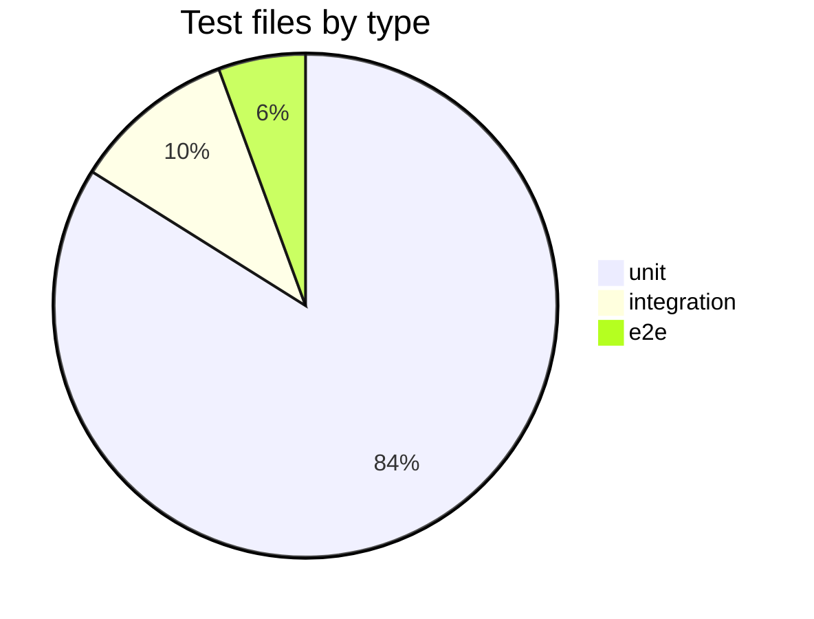
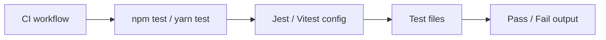

# Phase 2 — Execute

Run after [planning.md](./planning.md) inputs are confirmed. Detect test frameworks, find test files, run commands, capture output, and write the deliverable.

**Read-only on `repoPath` source/tests** — do not modify test or production code. Report writes go to `{proofDir}` and/or `{agentDir}/test-discovery-site/` only. Dependency install is allowed.

---

## Input (from planning)

| Field | Required | Description |
|-------|----------|-------------|
| `repoPath` | Yes | Repository root |
| `outputFormat` | Yes | `markdown` or `website` |
| `outputPath` | Yes | `{proofDir}/test-discovery-report.md` or `{agentDir}/test-discovery-site/` |
| `scope` | No | Subdirectory, package, or test type limit |
| `runTests` | No | `true` default — execute commands; `false` — discovery only |
| `maxTestFilesListed` | No | `75` default — summarize by directory when exceeded |

Record `startTime` (ISO 8601) if not already set.

---

## Step 1 — Repo reconnaissance

Before scanning tests, establish context:

1. Read `README.md`, `package.json`, `pom.xml`, `build.gradle`, `build.gradle.kts`, `pubspec.yaml`, `Cargo.toml`, `pyproject.toml`, `setup.cfg`, `Makefile`, or equivalent.
2. Detect stack(s), build tool, and runtime requirements (Node version, Java version, etc.).
3. Note monorepo layout — list top-level apps/packages if present.
4. Record: repo name, language(s), primary framework, package manager.
5. Check CI config for test commands: `.github/workflows/**`, `.gitlab-ci.yml`, `Jenkinsfile`, `bitbucket-pipelines.yml`, `azure-pipelines.yml`, `circleci/config.yml`.
6. Note directories to **exclude** from test file listing when not in scope: `node_modules/`, `vendor/`, `build/`, `dist/`, `.git/`, `target/`, `coverage/`.

Apply `scope` if provided — limit discovery and test runs to that subdirectory, package, or test type.

---

## Step 2 — Test framework detection

Identify **every test framework** in use. A repo may have more than one (e.g. Jest + Playwright, JUnit + Mockito).

### Where to look

| Stack | Framework signals | Config files |
|-------|-------------------|--------------|
| JavaScript / TypeScript | Jest, Vitest, Mocha, Jasmine, Ava, Playwright, Cypress, Testing Library | `jest.config.*`, `vitest.config.*`, `playwright.config.*`, `cypress.config.*`, `package.json` scripts & devDependencies |
| React / Next | RTL, Jest/Vitest | same as JS/TS |
| Java / Kotlin | JUnit 4/5, TestNG, Mockito, Spock | `build.gradle`, `pom.xml`, `src/test/**` |
| Spring Boot | `@SpringBootTest`, MockMvc | `build.gradle`, `application-test.yml` |
| Flutter / Dart | `flutter_test`, `integration_test`, `mocktail`, `bloc_test` | `pubspec.yaml` dev_dependencies, `test/`, `integration_test/` |
| Android | JUnit, Espresso, Robolectric, MockK | `build.gradle`, `src/test/`, `src/androidTest/` |
| iOS / Swift | XCTest, Quick/Nimble | `*.xcodeproj`, `Package.swift`, `*Tests/` |
| Python | pytest, unittest, nose | `pytest.ini`, `pyproject.toml`, `setup.cfg`, `conftest.py` |
| Go | `testing`, testify | `*_test.go`, `go.mod` |
| Rust | cargo test | `Cargo.toml`, `tests/` |

### For each framework found, capture

| Field | Description |
|-------|-------------|
| Framework name & version | From lockfile, package manager, or build file |
| Config file(s) | Path(s) with brief note on what they configure |
| Test runner entry | npm script name, Gradle task, Maven goal, `flutter test`, etc. |
| Test directory convention | e.g. `**/*.test.ts`, `src/test/java`, `test/` |
| Coverage tool | Istanbul/nyc, JaCoCo, lcov — if configured |

---

## Step 3 — Relevant test file discovery

Find **all test files** relevant to the repo (or `scope` if provided).

### File patterns to search

| Pattern | Typical framework |
|---------|-------------------|
| `**/*.{test,spec}.{js,ts,jsx,tsx}` | Jest, Vitest, Mocha |
| `**/__tests__/**` | Jest |
| `**/e2e/**`, `**/cypress/**`, `**/playwright/**` | E2E |
| `**/src/test/**`, `**/*Test.java`, `**/*Tests.java` | JUnit |
| `**/test/**`, `**/integration_test/**` | Flutter/Dart |
| `**/*_test.go` | Go |
| `**/tests/**`, `**/*_test.rs` | Rust |
| `**/conftest.py`, `**/test_*.py` | pytest |

### For each test file (or grouped by module), capture

| Column | Description |
|--------|-------------|
| Path | Relative path from repo root |
| Type | `unit` / `integration` / `e2e` / `snapshot` / `unknown` |
| Framework | Jest, JUnit, flutter_test, etc. |
| Tests what | Brief: module, class, or feature under test (from filename or imports) |
| Source under test | Corresponding production file if obvious |

Group by package/app in monorepos. Deduplicate. Count total test files.

If count exceeds `maxTestFilesListed` (default 75):

- Add per-directory count table at top of section
- List representative files per package; note total count

---

## Step 4 — Exact test commands

Derive **the exact shell commands** to run tests. Prefer evidence from the repo over assumptions.

### Priority order

1. **CI config** — copy the exact test step command(s).
2. **package.json / Makefile scripts** — `test`, `test:unit`, `test:ci`, `verify`, etc.
3. **Build tool tasks** — `./gradlew test`, `mvn test`, `cargo test`.
4. **Framework defaults** — only if no script exists (e.g. `npx vitest run`, `flutter test`).

### For each command, capture

| Field | Description |
|-------|-------------|
| Command | Full command string, ready to copy-paste |
| Purpose | What it runs (all unit tests, single module, e2e, etc.) |
| Prerequisites | Node version, Java version, env vars, `npm install`, emulator, etc. |
| Source | Where you found it (`package.json:scripts.test`, `.gitlab-ci.yml:line`) |
| Working directory | Repo root or subpackage path |

List a **primary command** (most common / CI-equivalent) and **optional variants** (single file, watch mode, coverage).

---

## Step 5 — Run tests and capture output

Skip this step only if `runTests` is explicitly `false`.

1. Install dependencies if needed (`npm ci`, `yarn install`, `./gradlew dependencies`, `flutter pub get`) — note what you ran.
2. Run the **primary test command** from the correct working directory.
3. If the primary command fails before tests execute (missing deps, wrong runtime, etc.), document the blocker, try one reasonable fix (e.g. install deps), then re-run once.
4. Optionally run a **scoped command** if `scope` was provided and a matching single-file or module command exists.
5. Capture **full terminal output** — stdout and stderr. Truncate only if output exceeds ~500 lines; then keep the summary block plus first/last failure sections and note truncation.

### Record per run

| Field | Description |
|-------|-------------|
| Command executed | Exact command |
| Exit code | 0 = success, non-zero = failure |
| Duration | Per-command wall time |
| Summary line | e.g. `Tests: 42 passed, 3 failed, 45 total` |
| Raw output | Fenced code block in report |

---

## Step 6 — Failure analysis and interpretation

If any test run failed or errored:

1. **List each failure** — test name, file, assertion/error message.
2. **Classify** — `test assertion failure`, `compile error`, `missing dependency`, `env/config`, `flaky/timeout`, `infrastructure`.
3. **Interpret** — 1–2 sentences per failure: likely cause based on message and repo context.
4. **Actionable next steps** — what a developer should check or fix.

If all tests passed, state that clearly and note any warnings or skipped tests.

If tests could not be run (no runtime, blocked install, missing secrets), explain why and what would be needed.

---

## Step 7 — Charts and diagrams (markdown)

Include Mermaid charts where data exists:





---

## Step 8 — Write deliverable

Record `endTime` and compute `duration` (human-readable, e.g. `2m 18s`).

Branch on `outputFormat`:

---

### Format A — Markdown (`outputFormat: markdown`)

Write to `{proofDir}/test-discovery-report.md`.

Use this exact structure:

```markdown
# Test Discovery Report

## Metadata

| Field | Value |
|-------|-------|
| **Agent name** | repo-test-discovery |
| **Started at** | {startTime ISO 8601} |
| **Completed at** | {endTime ISO 8601} |
| **Duration** | {duration} |
| **Repository** | {repoPath} |
| **Repo name** | {derived name} |
| **Stack detected** | {e.g. TypeScript monorepo — Jest + integration-tests} |
| **Scope** | {scope or "full repo"} |
| **Tests executed** | {yes / no — discovery only} |
| **Test files found** | {count} |
| **Frameworks found** | {count} |
| **Primary result** | {PASSED / FAILED / ERROR / NOT RUN} |

## Summary

{2–4 sentences: frameworks used, test organization, whether commands ran, pass/fail headline.}

## Test Framework & Configuration

| Framework | Version | Config file(s) | Test runner / script | Coverage tool |
|-----------|---------|----------------|----------------------|---------------|

### Config file details

#### `{path/to/config}`

{Brief bullets: test environment, setup files, coverage thresholds, test match globs.}

### Framework distribution

\`\`\`mermaid
pie title Test files by framework
  ...
\`\`\`

## Relevant Test Files

| # | Path | Type | Framework | Tests |
|---|------|------|-----------|-------|

### By directory

\`\`\`
test/
├── unit/
└── integration/
\`\`\`

## Exact Commands

| # | Command | Purpose | Working dir | Source |
|---|---------|---------|-------------|--------|

### Prerequisites

- {Node 18+, npm ci, env vars, etc.}

## Command Results

### Run 1 — {label}

| Field | Value |
|-------|-------|
| **Command** | `{exact command}` |
| **Exit code** | {0 or N} |
| **Duration** | {e.g. 45s} |
| **Result** | {PASSED / FAILED / ERROR / NOT RUN} |

\`\`\`
{raw terminal output}
\`\`\`

## Failures & Interpretation

{If none: "**All executed tests passed.**" plus warnings/skips.}

| # | Test / Error | File | Classification | Interpretation |
|---|--------------|------|----------------|----------------|

### Recommended next steps

1. {Actionable item}

## Discovery Notes

### Files examined
- `package.json` — scripts and devDependencies
- `.github/workflows/ci.yml` — CI test step

### Ambiguities & gaps
- {E2E requires Docker; secrets unavailable}

### CI vs local differences
- {If CI uses different command or env}
```

---

### Format B — Website (`outputFormat: website`)

Build at `{agentDir}/test-discovery-site/`.

#### Bootstrap (do not edit template)

```bash
cp -R Task/agents/frontend/. {agentDir}/test-discovery-site/
cd {agentDir}/test-discovery-site
npm install
```

**Never modify files under `Task/agents/frontend/`** — only files inside `test-discovery-site/`.

#### Required site features

1. **Overview page** — metadata, summary, framework stat cards, pass/fail badge
2. **Framework panel** — config paths, versions, runner scripts
3. **Test file explorer** — searchable table with type/framework filters
4. **Framework distribution chart** — bar or pie with real counts
5. **Commands panel** — copy-to-clipboard for each command
6. **Results viewer** — terminal output with exit code and duration
7. **Failures panel** — classification badges and interpretation text
8. **Test directory tree** — collapsible navigation
9. **Discovery notes** — blockers, CI vs local, ambiguities
10. **Responsive UI** — clean layout, dark/light friendly

#### Data layer

Generate `{agentDir}/test-discovery-site/data/test-discovery.json` (or typed TS constants) from discovery results. Website must reflect **same completeness** as markdown report.

#### Run locally

```bash
cd {agentDir}/test-discovery-site
npm run dev
```

Open **http://localhost:3000**. Fix build/lint errors until `npm run build` passes.

---

## Execution rules

1. **Run real commands** — when `runTests` is true (default), execute tests and paste actual output.
2. **Evidence required** — every framework and command traces to a config, script, or CI step.
3. **Prefer CI command** — primary run should match CI when possible.
4. **Monorepos** — detect per-package test commands; run from correct directory or use workspace flags.
5. **No source edits** — do not modify tests or production code to make them pass.
6. **No fabrication** — do not invent test results or file paths.

After writing deliverable, proceed to [verify.md](./verify.md).
