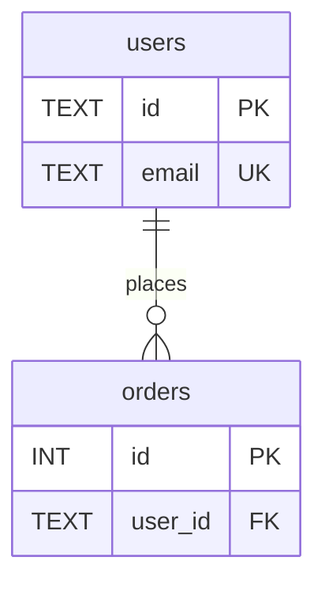

# Phase 3 — Verify

Run after [execute.md](./execute.md) deliverable is written. Fix any failing checks before telling the user the task is complete.

---

## Universal checks (both formats)

- [ ] Planning MCQ completed — `repoPath` and `outputFormat` were confirmed
- [ ] **Agent name** `repo-er-diagram` appears in deliverable metadata
- [ ] **Started at**, **Completed at**, **Duration** present
- [ ] **Repository** path matches user input
- [ ] Every table/entity has a **source file citation** (`path:line`)
- [ ] **Primary keys** documented per table (summary table + per-table section for markdown)
- [ ] **Foreign keys** listed with sources (explicit and inferred separately)
- [ ] **Inferred relationships** marked as inferred and backed by JOIN/query evidence
- [ ] **Relationships summary** table present with cardinality and type
- [ ] **Mermaid ER diagram** present and syntactically valid
- [ ] **Discovery Notes** include files examined; ambiguities explicit (empty only if fully resolved)
- [ ] **No conflict markers** or placeholder data (`TODO`, `example_table`) in deliverable
- [ ] **Target repo unchanged** — no edits in `repoPath`
- [ ] **Template unchanged** — `Task/agents/frontend/` was not modified (website format only)

---

## Markdown format checks

Deliverable: `{agentDir}/er-diagram-report.md`

- [ ] File exists at expected path
- [ ] Metadata table includes: stack, database engine, schema source count, table count, entity count, relationship count
- [ ] **Tables & Entities** section lists every discovered table with detail subsections
- [ ] **Primary Keys Summary** table present
- [ ] **Foreign Keys & Relationships Summary** table present
- [ ] **Relationship Matrix** (or equivalent cross-reference) present when ≥ 2 tables
- [ ] Mermaid block uses `erDiagram` syntax (not `graph` or `sequenceDiagram`)
- [ ] Counts in metadata match actual section contents

### Markdown spot-check

Grep the report for uncited claims:

```bash
# Every table name in inventory should appear near a source path
grep -E "Source:|init_|\.sql:|models\.|schema\.|@Entity" er-diagram-report.md
```

---

## Website format checks

Deliverable: `{agentDir}/er-diagram-site/`

- [ ] Directory exists; copied from `Task/agents/frontend/` template
- [ ] `Task/agents/frontend/` files were **not** edited
- [ ] `data/er-schema.json` (or equivalent) contains full discovery data
- [ ] `npm install` completed without errors
- [ ] `npm run build` passes
- [ ] `npm run dev` serves on **http://localhost:3000**
- [ ] Overview shows metadata and counts matching discovery
- [ ] Tables explorer lists all tables with search/filter
- [ ] ER diagram renders correctly in browser
- [ ] Source citations visible and copyable per table/column/FK
- [ ] UI is responsive (mobile + desktop)
- [ ] No default Next.js "edit page.tsx" placeholder content remains

### Website smoke test

1. Open http://localhost:3000
2. Confirm table count matches discovery
3. Click a table — verify columns, PK, FKs, source path
4. View ER diagram — all tables and major relationships visible
5. Search for a known table name — filter works

---

## Mermaid validation

Before marking complete, mentally verify the `erDiagram`:

- Entity blocks use `{ type name PK/FK/UK }` syntax
- Relationship lines use valid cardinality: `||--o{`, `||--||`, `}o--o{`
- No duplicate entity names
- Every relationship in summary appears in diagram (or note exception in Discovery Notes)

Example valid fragment:



---

## Failure handling

| Failure | Action |
|---------|--------|
| Missing source citation | Re-scan repo; add citation or move to Ambiguities |
| Invalid Mermaid | Fix syntax; re-render |
| Inferred FK without JOIN evidence | Remove from FK list or downgrade to Ambiguity |
| Website build fails | Fix errors in `er-diagram-site/` only |
| Table count mismatch | Reconcile inventory vs metadata counts |
| Default Next.js page still showing | Replace with ER diagram UI |

Do not report success until all applicable checks pass.

---

## Completion message

Tell the user:

1. **Output path** — `{agentDir}/er-diagram-report.md` or `http://localhost:3000`
2. **Headline stats** — e.g. "12 tables, 18 relationships, SQLite, 2m 05s"
3. **Notable findings** — hub tables, inferred relationships, gaps
4. **How to re-run** — invoke agent again with same or different repo/format

Example:

> ER diagram complete. Report: `Task/agents/Intermediate/I1/agent/er-diagram-report.md` — 8 tables, 11 relationships (3 inferred), PostgreSQL via Prisma, duration 1m 48s. See Discovery Notes for 1 ambiguity (`audit_log` defined but unused).
