# ER Diagram Report

## Metadata

| Field | Value |
| --- | --- |
| **Agent name** | repo-er-diagram |
| **Started at** | 2026-06-21T21:07:51Z |
| **Completed at** | 2026-06-21T21:07:51Z |
| **Duration** | 0s |
| **Repository** | Task/medusa |
| **Repo name** | Medusa |
| **Stack detected** | TypeScript monorepo, Medusa DML + MikroORM migrations |
| **Database engine** | PostgreSQL (primary; SQLite supported in dev) |
| **Output format** | markdown |
| **Schema sources found** | 206 migration files, 123 DML model files |
| **Tables found** | 139 |
| **Entities found** | 123 |
| **Relationships found** | 204 |

## Summary

Medusa is a TypeScript commerce monorepo with **139 database tables** across **26 modules**, defined via Medusa DML (`model.define`) entity files and MikroORM migration SQL. Core hubs include **product**, **order**, **cart**, **customer**, **payment**, and **pricing** modules. Relationships are predominantly one-to-many via `{entity}_id` foreign key columns, with many-to-many pivot tables for product tags, categories, and sales channels. Schema is modular — each commerce module owns its tables and migrations under `packages/modules/`.

## Schema Overview

```
packages/modules/{module}/
  src/models/*.ts     → DML entity definitions (tableName, fields, relations)
  src/migrations/*.ts → MikroORM SQL (CREATE TABLE, FK constraints)
packages/plugins/     → Optional plugin modules (loyalty, store-credit)
```

## Tables & Entities

| # | Name | Entity | Module | Primary key | FK count | Source |
| --- | --- | --- | --- | --- | --- | --- |
| 1 | account_holder | AccountHolder | payment | id | 2 | `packages/modules/payment/src/models/account-holder.ts` |
| 2 | api_key | ApiKey | api-key | id | 0 | `packages/modules/api-key/src/models/api-key.ts` |
| 3 | application_method_buy_rules | — | migration-only | application_method_id, promotion_rule_id | 0 | `packages/modules/promotion/src/migrations/Migration20240227120221.ts:70` |
| 4 | application_method_target_rules | — | migration-only | application_method_id, promotion_rule_id | 0 | `packages/modules/promotion/src/migrations/Migration20240227120221.ts:66` |
| 5 | auth_identity | auth_identity | auth | id | 0 | `packages/modules/auth/src/models/auth-identity.ts` |
| 6 | auth_mfa_factor | auth_mfa_factor | auth | id | 1 | `packages/modules/auth/src/models/auth-mfa-factor.ts` |
| 7 | auth_mfa_recovery_code | auth_mfa_recovery_code | auth | id | 1 | `packages/modules/auth/src/models/auth-mfa-recovery-code.ts` |
| 8 | auth_password_reset_token | auth_password_reset_token | auth | id | 3 | `packages/modules/auth/src/models/auth-password-reset-token.ts` |
| 9 | auth_verification | auth_verification | auth | id | 2 | `packages/modules/auth/src/models/auth-verification.ts` |
| 10 | auth_verification_token | — | migration-only | id | 0 | `packages/modules/auth/src/migrations/Migration20260525090000.ts:6` |
| 11 | capture | Capture | payment | id | 1 | `packages/modules/payment/src/models/capture.ts` |
| 12 | cart | Cart | cart | id | 5 | `packages/modules/cart/src/models/cart.ts` |
| 13 | cart_address | Address | cart | id | 1 | `packages/modules/cart/src/models/address.ts` |
| 14 | cart_line_item | LineItem | cart | id | 4 | `packages/modules/cart/src/models/line-item.ts` |
| 15 | cart_line_item_adjustment | LineItemAdjustment | cart | id | 4 | `packages/modules/cart/src/models/line-item-adjustment.ts` |
| 16 | cart_line_item_tax_line | LineItemTaxLine | cart | id | 4 | `packages/modules/cart/src/models/line-item-tax-line.ts` |
| 17 | cart_shipping_method | ShippingMethod | cart | id | 2 | `packages/modules/cart/src/models/shipping-method.ts` |
| 18 | cart_shipping_method_adjustment | ShippingMethodAdjustment | cart | id | 4 | `packages/modules/cart/src/models/shipping-method-adjustment.ts` |
| 19 | cart_shipping_method_tax_line | ShippingMethodTaxLine | cart | id | 4 | `packages/modules/cart/src/models/shipping-method-tax-line.ts` |
| 20 | credit_line | CreditLine | cart | id | 2 | `packages/modules/cart/src/models/credit-line.ts` |
| 21 | currency | currency | currency | code | 0 | `packages/modules/currency/src/models/currency.ts` |
| 22 | customer | Customer | customer | id | 0 | `packages/modules/customer/src/models/customer.ts` |
| 23 | customer_address | CustomerAddress | customer | id | 1 | `packages/modules/customer/src/models/address.ts` |
| 24 | customer_group | CustomerGroup | customer | id | 0 | `packages/modules/customer/src/models/customer-group.ts` |
| 25 | customer_group_customer | CustomerGroupCustomer | customer | id | 2 | `packages/modules/customer/src/models/customer-group-customer.ts` |
| 26 | fulfillment | fulfillment | fulfillment | id | 1 | `packages/modules/fulfillment/src/models/fulfillment.ts` |
| 27 | fulfillment_address | fulfillment_address | fulfillment | id | 0 | `packages/modules/fulfillment/src/models/address.ts` |
| 28 | fulfillment_item | fulfillment_item | fulfillment | id | 3 | `packages/modules/fulfillment/src/models/fulfillment-item.ts` |
| 29 | fulfillment_label | fulfillment_label | fulfillment | id | 1 | `packages/modules/fulfillment/src/models/fulfillment-label.ts` |
| 30 | fulfillment_provider | fulfillment_provider | fulfillment | id | 0 | `packages/modules/fulfillment/src/models/fulfillment-provider.ts` |
| 31 | fulfillment_set | fulfillment_set | fulfillment | id | 0 | `packages/modules/fulfillment/src/models/fulfillment-set.ts` |
| 32 | geo_zone | geo_zone | fulfillment | id | 0 | `packages/modules/fulfillment/src/models/geo-zone.ts` |
| 33 | image | ProductImage | product | id | 1 | `packages/modules/product/src/models/product-image.ts` |
| 34 | index_data | IndexData | index | id, name | 0 | `packages/modules/index/src/models/index-data.ts` |
| 35 | index_metadata | IndexMetadata | index | id | 0 | `packages/modules/index/src/models/index-metadata.ts` |
| 36 | index_relation | IndexRelation | index | id, pivot | 2 | `packages/modules/index/src/models/index-relation.ts` |
| 37 | index_sync | IndexSync | index | id | 0 | `packages/modules/index/src/models/index-sync.ts` |
| 38 | inventory_item | InventoryItem | inventory | id | 0 | `packages/modules/inventory/src/models/inventory-item.ts` |
| 39 | inventory_level | InventoryLevel | inventory | id | 2 | `packages/modules/inventory/src/models/inventory-level.ts` |
| 40 | invite | invite | user | id | 0 | `packages/modules/user/src/models/invite.ts` |
| 41 | locale | locale | translation | id | 0 | `packages/modules/translation/src/models/locale.ts` |
| 42 | locking | Locking | providers | id | 1 | `packages/modules/providers/locking-postgres/src/models/locking.ts` |
| 43 | loyalty_gift_card | — | migration-only | id | 0 | `packages/plugins/loyalty/src/modules/loyalty/migrations/Migration20250123130553.ts:6` |
| 44 | loyalty_gift_card_invitation | — | migration-only | id | 0 | `packages/plugins/loyalty/src/modules/loyalty/migrations/Migration20250617080328.ts:12` |
| 45 | money_amount | — | migration-only | id | 0 | `packages/modules/pricing/src/migrations/Migration20230929122253.ts:6` |
| 46 | notification | notification | notification | id | 4 | `packages/modules/notification/src/models/notification.ts` |
| 47 | notification_provider | notificationProvider | notification | id | 0 | `packages/modules/notification/src/models/notification-provider.ts` |
| 48 | order | Order | order | id | 5 | `packages/modules/order/src/models/order.ts` |
| 49 | order_address | OrderAddress | order | id | 1 | `packages/modules/order/src/models/address.ts` |
| 50 | order_change | OrderChange | order | id | 3 | `packages/modules/order/src/models/order-change.ts` |
| 51 | order_change_action | OrderChangeAction | order | id | 5 | `packages/modules/order/src/models/order-change-action.ts` |
| 52 | order_claim | OrderClaim | order | id | 1 | `packages/modules/order/src/models/claim.ts` |
| 53 | order_claim_item | OrderClaimItem | order | id | 0 | `packages/modules/order/src/models/claim-item.ts` |
| 54 | order_claim_item_image | OrderClaimItemImage | order | id | 0 | `packages/modules/order/src/models/claim-item-image.ts` |
| 55 | order_credit_line | OrderCreditLine | order | id | 2 | `packages/modules/order/src/models/credit-line.ts` |
| 56 | order_exchange | OrderExchange | order | id | 1 | `packages/modules/order/src/models/exchange.ts` |
| 57 | order_exchange_item | OrderExchangeItem | order | id | 0 | `packages/modules/order/src/models/exchange-item.ts` |
| 58 | order_item | OrderItem | order | id | 0 | `packages/modules/order/src/models/order-item.ts` |
| 59 | order_line_item | OrderLineItem | order | id | 3 | `packages/modules/order/src/models/line-item.ts` |
| 60 | order_line_item_adjustment | OrderLineItemAdjustment | order | id | 2 | `packages/modules/order/src/models/line-item-adjustment.ts` |
| 61 | order_line_item_tax_line | OrderLineItemTaxLine | order | id | 2 | `packages/modules/order/src/models/line-item-tax-line.ts` |
| 62 | order_shipping | OrderShipping | order | id | 0 | `packages/modules/order/src/models/order-shipping-method.ts` |
| 63 | order_shipping_method | OrderShippingMethod | order | id | 1 | `packages/modules/order/src/models/shipping-method.ts` |
| 64 | order_shipping_method_adjustment | OrderShippingMethodAdjustment | order | id | 2 | `packages/modules/order/src/models/shipping-method-adjustment.ts` |
| 65 | order_shipping_method_tax_line | OrderShippingMethodTaxLine | order | id | 2 | `packages/modules/order/src/models/shipping-method-tax-line.ts` |
| 66 | order_summary | OrderSummary | order | id | 0 | `packages/modules/order/src/models/order-summary.ts` |
| 67 | order_transaction | OrderTransaction | order | id | 1 | `packages/modules/order/src/models/transaction.ts` |
| 68 | payment | Payment | payment | id | 3 | `packages/modules/payment/src/models/payment.ts` |
| 69 | payment_collection | PaymentCollection | payment | id | 0 | `packages/modules/payment/src/models/payment-collection.ts` |
| 70 | payment_collection_payment_providers | — | migration-only | payment_collection_id, payment_provider_id | 0 | `packages/modules/payment/src/migrations/Migration20240225134525.ts:87` |
| 71 | payment_method_token | — | migration-only | id | 0 | `packages/modules/payment/src/migrations/Migration20250206105639.ts:10` |
| 72 | payment_provider | PaymentProvider | payment | id | 0 | `packages/modules/payment/src/models/payment-provider.ts` |
| 73 | payment_session | PaymentSession | payment | id | 1 | `packages/modules/payment/src/models/payment-session.ts` |
| 74 | price | Price | pricing | id | 1 | `packages/modules/pricing/src/models/price.ts` |
| 75 | price_list | PriceList | pricing | id | 0 | `packages/modules/pricing/src/models/price-list.ts` |
| 76 | price_list_rule | PriceListRule | pricing | id | 1 | `packages/modules/pricing/src/models/price-list-rule.ts` |
| 77 | price_preference | PricePreference | pricing | id | 0 | `packages/modules/pricing/src/models/price-preference.ts` |
| 78 | price_rule | PriceRule | pricing | id | 1 | `packages/modules/pricing/src/models/price-rule.ts` |
| 79 | price_set | PriceSet | pricing | id | 0 | `packages/modules/pricing/src/models/price-set.ts` |
| 80 | product | Product | product | id | 1 | `packages/modules/product/src/models/product.ts` |
| 81 | product_category | ProductCategory | product | id | 1 | `packages/modules/product/src/models/product-category.ts` |
| 82 | product_category_product | — | migration-only | product_id, product_category_id | 0 | `packages/modules/product/src/migrations/InitialSetup20240401153642.ts:145` |
| 83 | product_collection | ProductCollection | product | id | 1 | `packages/modules/product/src/models/product-collection.ts` |
| 84 | product_images | — | migration-only | product_id, image_id | 0 | `packages/modules/product/src/migrations/Migration20241122120331.ts:34` |
| 85 | product_option | ProductOption | product | id | 1 | `packages/modules/product/src/models/product-option.ts` |
| 86 | product_option_value | ProductOptionValue | product | id | 0 | `packages/modules/product/src/models/product-option-value.ts` |
| 87 | product_tag | ProductTag | product | id | 1 | `packages/modules/product/src/models/product-tag.ts` |
| 88 | product_tags | — | migration-only | product_id, product_tag_id | 0 | `packages/modules/product/src/migrations/InitialSetup20240401153642.ts:139` |
| 89 | product_type | ProductType | product | id | 1 | `packages/modules/product/src/models/product-type.ts` |
| 90 | product_variant | ProductVariant | product | id | 0 | `packages/modules/product/src/models/product-variant.ts` |
| 91 | product_variant_option | — | migration-only | variant_id, option_value_id | 0 | `packages/modules/product/src/migrations/InitialSetup20240401153642.ts:148` |
| 92 | product_variant_product_image | ProductVariantProductImage | product | id | 2 | `packages/modules/product/src/models/product-variant-product-image.ts` |
| 93 | promotion | Promotion | promotion | id | 0 | `packages/modules/promotion/src/models/promotion.ts` |
| 94 | promotion_application_method | ApplicationMethod | promotion | id | 1 | `packages/modules/promotion/src/models/application-method.ts` |
| 95 | promotion_campaign | Campaign | promotion | id | 0 | `packages/modules/promotion/src/models/campaign.ts` |
| 96 | promotion_campaign_budget | CampaignBudget | promotion | id | 1 | `packages/modules/promotion/src/models/campaign-budget.ts` |
| 97 | promotion_campaign_budget_usage | CampaignBudgetUsage | promotion | id | 1 | `packages/modules/promotion/src/models/campaign-budget-usage.ts` |
| 98 | promotion_promotion_rule | — | migration-only | promotion_id, promotion_rule_id | 0 | `packages/modules/promotion/src/migrations/Migration20240227120221.ts:62` |
| 99 | promotion_rule | PromotionRule | promotion | id | 0 | `packages/modules/promotion/src/models/promotion-rule.ts` |
| 100 | promotion_rule_value | PromotionRuleValue | promotion | id | 1 | `packages/modules/promotion/src/models/promotion-rule-value.ts` |
| 101 | property_label | property_label | settings | id | 0 | `packages/modules/settings/src/models/property-label.ts` |
| 102 | provider_identity | provider_identity | auth | id | 2 | `packages/modules/auth/src/models/provider-identity.ts` |
| 103 | rbac_policy | rbac_policy | rbac | id | 0 | `packages/modules/rbac/src/models/rbac-policy.ts` |
| 104 | rbac_role | rbac_role | rbac | id | 0 | `packages/modules/rbac/src/models/rbac-role.ts` |
| 105 | rbac_role_inheritance | rbac_role_inheritance | rbac | id | 2 | `packages/modules/rbac/src/models/rbac-role-inheritance.ts` |
| 106 | rbac_role_parent | rbac_role_parent | rbac | id | 2 | `packages/modules/rbac/src/models/rbac-role-parent.ts` |
| 107 | rbac_role_policy | rbac_role_policy | rbac | id | 2 | `packages/modules/rbac/src/models/rbac-role-policy.ts` |
| 108 | refund | Refund | payment | id | 1 | `packages/modules/payment/src/models/refund.ts` |
| 109 | refund_reason | RefundReason | payment | id | 0 | `packages/modules/payment/src/models/refund-reason.ts` |
| 110 | region | region | region | id | 0 | `packages/modules/region/src/models/region.ts` |
| 111 | region_country | Country | region | iso_2 | 1 | `packages/modules/region/src/models/country.ts` |
| 112 | reservation_item | ReservationItem | inventory | id | 3 | `packages/modules/inventory/src/models/reservation-item.ts` |
| 113 | return | Return | order | id | 2 | `packages/modules/order/src/models/return.ts` |
| 114 | return_item | ReturnItem | order | id | 0 | `packages/modules/order/src/models/return-item.ts` |
| 115 | return_reason | ReturnReason | order | id | 0 | `packages/modules/order/src/models/return-reason.ts` |
| 116 | sales_channel | SalesChannel | sales-channel | id | 0 | `packages/modules/sales-channel/src/models/sales-channel.ts` |
| 117 | service_zone | service_zone | fulfillment | id | 0 | `packages/modules/fulfillment/src/models/service-zone.ts` |
| 118 | shipping_option | shipping_option | fulfillment | id | 3 | `packages/modules/fulfillment/src/models/shipping-option.ts` |
| 119 | shipping_option_rule | shipping_option_rule | fulfillment | id | 1 | `packages/modules/fulfillment/src/models/shipping-option-rule.ts` |
| 120 | shipping_option_type | shipping_option_type | fulfillment | id | 0 | `packages/modules/fulfillment/src/models/shipping-option-type.ts` |
| 121 | shipping_profile | shipping_profile | fulfillment | id | 0 | `packages/modules/fulfillment/src/models/shipping-profile.ts` |
| 122 | stock_location | StockLocation | stock-location | id | 0 | `packages/modules/stock-location/src/models/stock-location.ts` |
| 123 | stock_location_address | StockLocationAddress | stock-location | id | 0 | `packages/modules/stock-location/src/models/stock-location-address.ts` |
| 124 | store | Store | store | id | 3 | `packages/modules/store/src/models/store.ts` |
| 125 | store_credit_account | — | migration-only | id | 0 | `packages/plugins/loyalty/src/modules/store-credit/migrations/Migration20250129115518.ts:6` |
| 126 | store_credit_account_transaction | — | migration-only | id | 0 | `packages/plugins/loyalty/src/modules/store-credit/migrations/Migration20250130220640.ts:6` |
| 127 | store_credit_transaction_group | — | migration-only | id | 0 | `packages/plugins/loyalty/src/modules/store-credit/migrations/Migration20250130213237.ts:6` |
| 128 | store_currency | StoreCurrency | store | id | 0 | `packages/modules/store/src/models/currency.ts` |
| 129 | store_locale | StoreLocale | store | id | 0 | `packages/modules/store/src/models/locale.ts` |
| 130 | tax_provider | TaxProvider | tax | id | 0 | `packages/modules/tax/src/models/tax-provider.ts` |
| 131 | tax_rate | TaxRate | tax | id | 1 | `packages/modules/tax/src/models/tax-rate.ts` |
| 132 | tax_rate_rule | TaxRateRule | tax | id | 2 | `packages/modules/tax/src/models/tax-rate-rule.ts` |
| 133 | tax_region | TaxRegion | tax | id | 2 | `packages/modules/tax/src/models/tax-region.ts` |
| 134 | translation | translation | translation | id | 1 | `packages/modules/translation/src/models/translation.ts` |
| 135 | translation_settings | translation_settings | translation | id | 0 | `packages/modules/translation/src/models/settings.ts` |
| 136 | user | user | user | id | 0 | `packages/modules/user/src/models/user.ts` |
| 137 | user_preference | user_preference | settings | id | 1 | `packages/modules/settings/src/models/user-preference.ts` |
| 138 | view_configuration | view_configuration | settings | id | 1 | `packages/modules/settings/src/models/view-configuration.ts` |
| 139 | workflow_execution | workflow_execution | workflow-engine-redis | id | 3 | `packages/modules/workflow-engine-redis/src/models/workflow-execution.ts` |

## Tables by Module

### api-key (1 tables)

#### api_key

**Source:** `packages/modules/api-key/src/models/api-key.ts`

**Primary key:** `id` — `packages/modules/api-key/src/models/api-key.ts`

| Column | Type | Source |
| --- | --- | --- |
| id | text | `packages/modules/api-key/src/models/api-key.ts` |
| token | text | `packages/modules/api-key/src/models/api-key.ts` |
| salt | text | `packages/modules/api-key/src/models/api-key.ts` |
| redacted | text | `packages/modules/api-key/src/models/api-key.ts` |
| title | text | `packages/modules/api-key/src/models/api-key.ts` |
| type | text | `packages/modules/api-key/src/models/api-key.ts` |
| last_used_at | timestamptz | `packages/modules/api-key/src/models/api-key.ts` |
| created_by | text | `packages/modules/api-key/src/models/api-key.ts` |
| created_at | timestamptz | `packages/modules/api-key/src/models/api-key.ts` |
| revoked_by | text | `packages/modules/api-key/src/models/api-key.ts` |
| revoked_at | timestamptz | `packages/modules/api-key/src/models/api-key.ts` |

### auth (6 tables)

#### auth_identity

**Source:** `packages/modules/auth/src/models/auth-identity.ts`

**Primary key:** `id` — `packages/modules/auth/src/models/auth-identity.ts`

| Column | Type | Source |
| --- | --- | --- |
| id | text | `packages/modules/auth/src/models/auth-identity.ts` |
| entity_id | text | `packages/modules/auth/src/models/auth-identity.ts` |
| provider | text | `packages/modules/auth/src/models/auth-identity.ts` |
| user_metadata | jsonb | `packages/modules/auth/src/models/auth-identity.ts` |
| app_metadata | jsonb | `packages/modules/auth/src/models/auth-identity.ts` |
| provider_metadata | jsonb | `packages/modules/auth/src/models/auth-identity.ts` |

#### auth_mfa_factor

**Source:** `packages/modules/auth/src/models/auth-mfa-factor.ts`

**Primary key:** `id` — `packages/modules/auth/src/models/auth-mfa-factor.ts`

| Column | Type | Source |
| --- | --- | --- |
| id | text | `packages/modules/auth/src/models/auth-mfa-factor.ts` |
| auth_identity_id | text | `packages/modules/auth/src/models/auth-mfa-factor.ts` |
| provider | text | `packages/modules/auth/src/models/auth-mfa-factor.ts` |
| status | text | `packages/modules/auth/src/models/auth-mfa-factor.ts` |
| provider_metadata | jsonb | `packages/modules/auth/src/models/auth-mfa-factor.ts` |
| metadata | jsonb | `packages/modules/auth/src/models/auth-mfa-factor.ts` |
| created_at | timestamptz | `packages/modules/auth/src/models/auth-mfa-factor.ts` |
| updated_at | timestamptz | `packages/modules/auth/src/models/auth-mfa-factor.ts` |
| deleted_at | timestamptz | `packages/modules/auth/src/models/auth-mfa-factor.ts` |

**Foreign keys:**

| Column | References | Type | Source |
| --- | --- | --- | --- |
| auth_identity_id | auth_identity.id | explicit | `packages/modules/auth/src/models/auth-mfa-factor.ts:7` |

#### auth_mfa_recovery_code

**Source:** `packages/modules/auth/src/models/auth-mfa-recovery-code.ts`

**Primary key:** `id` — `packages/modules/auth/src/models/auth-mfa-recovery-code.ts`

| Column | Type | Source |
| --- | --- | --- |
| id | text | `packages/modules/auth/src/models/auth-mfa-recovery-code.ts` |
| auth_identity_id | text | `packages/modules/auth/src/models/auth-mfa-recovery-code.ts` |
| code_hash | text | `packages/modules/auth/src/models/auth-mfa-recovery-code.ts` |
| created_at | timestamptz | `packages/modules/auth/src/models/auth-mfa-recovery-code.ts` |
| updated_at | timestamptz | `packages/modules/auth/src/models/auth-mfa-recovery-code.ts` |
| deleted_at | timestamptz | `packages/modules/auth/src/models/auth-mfa-recovery-code.ts` |

**Foreign keys:**

| Column | References | Type | Source |
| --- | --- | --- | --- |
| auth_identity_id | auth_identity.id | explicit | `packages/modules/auth/src/models/auth-mfa-recovery-code.ts:7` |

#### auth_password_reset_token

**Source:** `packages/modules/auth/src/models/auth-password-reset-token.ts`

**Primary key:** `id` — `packages/modules/auth/src/models/auth-password-reset-token.ts`

| Column | Type | Source |
| --- | --- | --- |
| id | text | `packages/modules/auth/src/models/auth-password-reset-token.ts` |
| auth_identity_id | text | `packages/modules/auth/src/models/auth-password-reset-token.ts` |
| provider_identity_id | text | `packages/modules/auth/src/models/auth-password-reset-token.ts` |
| entity_id | text | `packages/modules/auth/src/models/auth-password-reset-token.ts` |
| token_hash | text | `packages/modules/auth/src/models/auth-password-reset-token.ts` |
| expires_at | timestamptz | `packages/modules/auth/src/models/auth-password-reset-token.ts` |
| created_at | timestamptz | `packages/modules/auth/src/models/auth-password-reset-token.ts` |
| updated_at | timestamptz | `packages/modules/auth/src/models/auth-password-reset-token.ts` |
| deleted_at | timestamptz | `packages/modules/auth/src/models/auth-password-reset-token.ts` |

**Foreign keys:**

| Column | References | Type | Source |
| --- | --- | --- | --- |
| auth_identity_id | auth_identity.id | explicit | `packages/modules/auth/src/models/auth-password-reset-token.ts:8` |
| provider_identity_id | provider_identity.id | explicit | `packages/modules/auth/src/models/auth-password-reset-token.ts:11` |
| entity_id | entity.id | inferred | `packages/modules/auth/src/models/auth-password-reset-token.ts:14` |

#### auth_verification

**Source:** `packages/modules/auth/src/models/auth-verification.ts`

**Primary key:** `id` — `packages/modules/auth/src/models/auth-verification.ts`

| Column | Type | Source |
| --- | --- | --- |
| id | text | `packages/modules/auth/src/models/auth-verification.ts` |
| auth_identity_id | text | `packages/modules/auth/src/models/auth-verification.ts` |
| entity_id | text | `packages/modules/auth/src/models/auth-verification.ts` |
| entity_type | text | `packages/modules/auth/src/models/auth-verification.ts` |
| code_provider | text | `packages/modules/auth/src/models/auth-verification.ts` |
| verified_at | timestamptz | `packages/modules/auth/src/models/auth-verification.ts` |
| requested_at | timestamptz | `packages/modules/auth/src/models/auth-verification.ts` |
| provider_metadata | jsonb | `packages/modules/auth/src/models/auth-verification.ts` |
| metadata | jsonb | `packages/modules/auth/src/models/auth-verification.ts` |
| created_at | timestamptz | `packages/modules/auth/src/models/auth-verification.ts` |
| updated_at | timestamptz | `packages/modules/auth/src/models/auth-verification.ts` |
| deleted_at | timestamptz | `packages/modules/auth/src/models/auth-verification.ts` |

**Foreign keys:**

| Column | References | Type | Source |
| --- | --- | --- | --- |
| auth_identity_id | auth_identity.id | explicit | `packages/modules/auth/src/models/auth-verification.ts:7` |
| entity_id | entity.id | inferred | `packages/modules/auth/src/models/auth-verification.ts:10` |

#### provider_identity

**Source:** `packages/modules/auth/src/models/provider-identity.ts`

**Primary key:** `id` — `packages/modules/auth/src/models/provider-identity.ts`

| Column | Type | Source |
| --- | --- | --- |
| id | text | `packages/modules/auth/src/models/provider-identity.ts` |
| entity_id | text | `packages/modules/auth/src/models/provider-identity.ts` |
| provider | text | `packages/modules/auth/src/models/provider-identity.ts` |
| auth_identity_id | text | `packages/modules/auth/src/models/provider-identity.ts` |
| user_metadata | jsonb | `packages/modules/auth/src/models/provider-identity.ts` |
| provider_metadata | jsonb | `packages/modules/auth/src/models/provider-identity.ts` |
| created_at | timestamptz | `packages/modules/auth/src/models/provider-identity.ts` |
| updated_at | timestamptz | `packages/modules/auth/src/models/provider-identity.ts` |

**Foreign keys:**

| Column | References | Type | Source |
| --- | --- | --- | --- |
| auth_identity_id | auth_identity.id | explicit | `packages/modules/auth/src/models/provider-identity.ts:10` |
| entity_id | entity.id | inferred | `packages/modules/auth/src/models/provider-identity.ts:8` |

### cart (9 tables)

#### cart

**Source:** `packages/modules/cart/src/models/cart.ts`

**Primary key:** `id` — `packages/modules/cart/src/models/cart.ts`

| Column | Type | Source |
| --- | --- | --- |
| id | TEXT | `packages/modules/cart/src/models/cart.ts` |
| region_id | TEXT | `packages/modules/cart/src/models/cart.ts` |
| customer_id | TEXT | `packages/modules/cart/src/models/cart.ts` |
| sales_channel_id | TEXT | `packages/modules/cart/src/models/cart.ts` |
| email | TEXT | `packages/modules/cart/src/models/cart.ts` |
| currency_code | TEXT | `packages/modules/cart/src/models/cart.ts` |
| shipping_address_id | TEXT | `packages/modules/cart/src/models/cart.ts` |
| billing_address_id | TEXT | `packages/modules/cart/src/models/cart.ts` |
| metadata | JSONB | `packages/modules/cart/src/models/cart.ts` |
| created_at | TIMESTAMPTZ | `packages/modules/cart/src/models/cart.ts` |
| updated_at | TIMESTAMPTZ | `packages/modules/cart/src/models/cart.ts` |
| deleted_at | TIMESTAMPTZ | `packages/modules/cart/src/models/cart.ts` |

**Foreign keys:**

| Column | References | Type | Source |
| --- | --- | --- | --- |
| shipping_address_id | cart_address.id | explicit | `packages/modules/cart/src/migrations/Migration20240222170223.ts:96` |
| billing_address_id | cart_address.id | explicit | `packages/modules/cart/src/migrations/Migration20240222170223.ts:97` |
| region_id | region.id | inferred | `packages/modules/cart/src/models/cart.ts:19` |
| customer_id | customer.id | inferred | `packages/modules/cart/src/models/cart.ts:23` |
| sales_channel_id | sales_channel.id | inferred | `packages/modules/cart/src/models/cart.ts:27` |

#### cart_address

**Source:** `packages/modules/cart/src/models/address.ts`

**Primary key:** `id` — `packages/modules/cart/src/models/address.ts`

| Column | Type | Source |
| --- | --- | --- |
| id | TEXT | `packages/modules/cart/src/models/address.ts` |
| customer_id | TEXT | `packages/modules/cart/src/models/address.ts` |
| company | TEXT | `packages/modules/cart/src/models/address.ts` |
| first_name | TEXT | `packages/modules/cart/src/models/address.ts` |
| last_name | TEXT | `packages/modules/cart/src/models/address.ts` |
| address_1 | TEXT | `packages/modules/cart/src/models/address.ts` |
| address_2 | TEXT | `packages/modules/cart/src/models/address.ts` |
| city | TEXT | `packages/modules/cart/src/models/address.ts` |
| country_code | TEXT | `packages/modules/cart/src/models/address.ts` |
| province | TEXT | `packages/modules/cart/src/models/address.ts` |
| postal_code | TEXT | `packages/modules/cart/src/models/address.ts` |
| phone | TEXT | `packages/modules/cart/src/models/address.ts` |
| metadata | JSONB | `packages/modules/cart/src/models/address.ts` |
| created_at | TIMESTAMPTZ | `packages/modules/cart/src/models/address.ts` |
| updated_at | TIMESTAMPTZ | `packages/modules/cart/src/models/address.ts` |
| … | (1 more columns) | `packages/modules/cart/src/models/address.ts` |

**Foreign keys:**

| Column | References | Type | Source |
| --- | --- | --- | --- |
| customer_id | customer.id | inferred | `packages/modules/cart/src/models/address.ts:7` |

#### cart_line_item

**Source:** `packages/modules/cart/src/models/line-item.ts`

**Primary key:** `id` — `packages/modules/cart/src/models/line-item.ts`

| Column | Type | Source |
| --- | --- | --- |
| id | TEXT | `packages/modules/cart/src/models/line-item.ts` |
| cart_id | TEXT | `packages/modules/cart/src/models/line-item.ts` |
| title | TEXT | `packages/modules/cart/src/models/line-item.ts` |
| subtitle | TEXT | `packages/modules/cart/src/models/line-item.ts` |
| thumbnail | TEXT | `packages/modules/cart/src/models/line-item.ts` |
| quantity | INTEGER | `packages/modules/cart/src/models/line-item.ts` |
| variant_id | TEXT | `packages/modules/cart/src/models/line-item.ts` |
| product_id | TEXT | `packages/modules/cart/src/models/line-item.ts` |
| product_title | TEXT | `packages/modules/cart/src/models/line-item.ts` |
| product_description | TEXT | `packages/modules/cart/src/models/line-item.ts` |
| product_subtitle | TEXT | `packages/modules/cart/src/models/line-item.ts` |
| product_type | TEXT | `packages/modules/cart/src/models/line-item.ts` |
| product_collection | TEXT | `packages/modules/cart/src/models/line-item.ts` |
| product_handle | TEXT | `packages/modules/cart/src/models/line-item.ts` |
| variant_sku | TEXT | `packages/modules/cart/src/models/line-item.ts` |
| … | (15 more columns) | `packages/modules/cart/src/models/line-item.ts` |

**Foreign keys:**

| Column | References | Type | Source |
| --- | --- | --- | --- |
| cart_id | cart.id | explicit | `packages/modules/cart/src/migrations/Migration20240222170223.ts:200` |
| variant_id | variant.id | inferred | `packages/modules/cart/src/models/line-item.ts:15` |
| product_id | product.id | inferred | `packages/modules/cart/src/models/line-item.ts:16` |
| product_type_id | product_type.id | inferred | `packages/modules/cart/src/models/line-item.ts:21` |

#### cart_line_item_adjustment

**Source:** `packages/modules/cart/src/models/line-item-adjustment.ts`

**Primary key:** `id` — `packages/modules/cart/src/models/line-item-adjustment.ts`

| Column | Type | Source |
| --- | --- | --- |
| id | TEXT | `packages/modules/cart/src/models/line-item-adjustment.ts` |
| description | TEXT | `packages/modules/cart/src/models/line-item-adjustment.ts` |
| promotion_id | TEXT | `packages/modules/cart/src/models/line-item-adjustment.ts` |
| code | TEXT | `packages/modules/cart/src/models/line-item-adjustment.ts` |
| amount | NUMERIC | `packages/modules/cart/src/models/line-item-adjustment.ts` |
| raw_amount | JSONB | `packages/modules/cart/src/models/line-item-adjustment.ts` |
| provider_id | TEXT | `packages/modules/cart/src/models/line-item-adjustment.ts` |
| metadata | JSONB | `packages/modules/cart/src/models/line-item-adjustment.ts` |
| created_at | TIMESTAMPTZ | `packages/modules/cart/src/models/line-item-adjustment.ts` |
| updated_at | TIMESTAMPTZ | `packages/modules/cart/src/models/line-item-adjustment.ts` |
| deleted_at | TIMESTAMPTZ | `packages/modules/cart/src/models/line-item-adjustment.ts` |
| item_id | TEXT | `packages/modules/cart/src/models/line-item-adjustment.ts` |
| cart_line_item_adjustment_pkey | PRIMARY | `packages/modules/cart/src/models/line-item-adjustment.ts` |

**Foreign keys:**

| Column | References | Type | Source |
| --- | --- | --- | --- |
| item_id | cart_line_item.id | explicit | `packages/modules/cart/src/migrations/Migration20240222170223.ts:201` |
| item_id | line_item.id | explicit | `packages/modules/cart/src/models/line-item-adjustment.ts:16` |
| provider_id | provider.id | inferred | `packages/modules/cart/src/models/line-item-adjustment.ts:13` |
| promotion_id | promotion.id | inferred | `packages/modules/cart/src/models/line-item-adjustment.ts:14` |

#### cart_line_item_tax_line

**Source:** `packages/modules/cart/src/models/line-item-tax-line.ts`

**Primary key:** `id` — `packages/modules/cart/src/models/line-item-tax-line.ts`

| Column | Type | Source |
| --- | --- | --- |
| id | TEXT | `packages/modules/cart/src/models/line-item-tax-line.ts` |
| description | TEXT | `packages/modules/cart/src/models/line-item-tax-line.ts` |
| tax_rate_id | TEXT | `packages/modules/cart/src/models/line-item-tax-line.ts` |
| code | TEXT | `packages/modules/cart/src/models/line-item-tax-line.ts` |
| rate | NUMERIC | `packages/modules/cart/src/models/line-item-tax-line.ts` |
| provider_id | TEXT | `packages/modules/cart/src/models/line-item-tax-line.ts` |
| metadata | JSONB | `packages/modules/cart/src/models/line-item-tax-line.ts` |
| created_at | TIMESTAMPTZ | `packages/modules/cart/src/models/line-item-tax-line.ts` |
| updated_at | TIMESTAMPTZ | `packages/modules/cart/src/models/line-item-tax-line.ts` |
| deleted_at | TIMESTAMPTZ | `packages/modules/cart/src/models/line-item-tax-line.ts` |
| item_id | TEXT | `packages/modules/cart/src/models/line-item-tax-line.ts` |

**Foreign keys:**

| Column | References | Type | Source |
| --- | --- | --- | --- |
| item_id | cart_line_item.id | explicit | `packages/modules/cart/src/migrations/Migration20240222170223.ts:202` |
| item_id | line_item.id | explicit | `packages/modules/cart/src/models/line-item-tax-line.ts:18` |
| provider_id | provider.id | inferred | `packages/modules/cart/src/models/line-item-tax-line.ts:15` |
| tax_rate_id | tax_rate.id | inferred | `packages/modules/cart/src/models/line-item-tax-line.ts:17` |

#### cart_shipping_method

**Source:** `packages/modules/cart/src/models/shipping-method.ts`

**Primary key:** `id` — `packages/modules/cart/src/models/shipping-method.ts`

| Column | Type | Source |
| --- | --- | --- |
| id | TEXT | `packages/modules/cart/src/models/shipping-method.ts` |
| cart_id | TEXT | `packages/modules/cart/src/models/shipping-method.ts` |
| name | TEXT | `packages/modules/cart/src/models/shipping-method.ts` |
| description | JSONB | `packages/modules/cart/src/models/shipping-method.ts` |
| amount | NUMERIC | `packages/modules/cart/src/models/shipping-method.ts` |
| raw_amount | JSONB | `packages/modules/cart/src/models/shipping-method.ts` |
| is_tax_inclusive | BOOLEAN | `packages/modules/cart/src/models/shipping-method.ts` |
| shipping_option_id | TEXT | `packages/modules/cart/src/models/shipping-method.ts` |
| data | JSONB | `packages/modules/cart/src/models/shipping-method.ts` |
| metadata | JSONB | `packages/modules/cart/src/models/shipping-method.ts` |
| created_at | TIMESTAMPTZ | `packages/modules/cart/src/models/shipping-method.ts` |
| updated_at | TIMESTAMPTZ | `packages/modules/cart/src/models/shipping-method.ts` |
| deleted_at | TIMESTAMPTZ | `packages/modules/cart/src/models/shipping-method.ts` |
| cart_shipping_method_pkey | PRIMARY | `packages/modules/cart/src/models/shipping-method.ts` |

**Foreign keys:**

| Column | References | Type | Source |
| --- | --- | --- | --- |
| cart_id | cart.id | explicit | `packages/modules/cart/src/migrations/Migration20240222170223.ts:203` |
| shipping_option_id | shipping_option.id | inferred | `packages/modules/cart/src/models/shipping-method.ts:18` |

#### cart_shipping_method_adjustment

**Source:** `packages/modules/cart/src/models/shipping-method-adjustment.ts`

**Primary key:** `id` — `packages/modules/cart/src/models/shipping-method-adjustment.ts`

| Column | Type | Source |
| --- | --- | --- |
| id | TEXT | `packages/modules/cart/src/models/shipping-method-adjustment.ts` |
| description | TEXT | `packages/modules/cart/src/models/shipping-method-adjustment.ts` |
| promotion_id | TEXT | `packages/modules/cart/src/models/shipping-method-adjustment.ts` |
| code | TEXT | `packages/modules/cart/src/models/shipping-method-adjustment.ts` |
| amount | NUMERIC | `packages/modules/cart/src/models/shipping-method-adjustment.ts` |
| raw_amount | JSONB | `packages/modules/cart/src/models/shipping-method-adjustment.ts` |
| provider_id | TEXT | `packages/modules/cart/src/models/shipping-method-adjustment.ts` |
| metadata | JSONB | `packages/modules/cart/src/models/shipping-method-adjustment.ts` |
| created_at | TIMESTAMPTZ | `packages/modules/cart/src/models/shipping-method-adjustment.ts` |
| updated_at | TIMESTAMPTZ | `packages/modules/cart/src/models/shipping-method-adjustment.ts` |
| deleted_at | TIMESTAMPTZ | `packages/modules/cart/src/models/shipping-method-adjustment.ts` |
| shipping_method_id | TEXT | `packages/modules/cart/src/models/shipping-method-adjustment.ts` |

**Foreign keys:**

| Column | References | Type | Source |
| --- | --- | --- | --- |
| shipping_method_id | cart_shipping_method.id | explicit | `packages/modules/cart/src/migrations/Migration20240222170223.ts:204` |
| shipping_method_id | shipping_method.id | explicit | `packages/modules/cart/src/models/shipping-method-adjustment.ts:18` |
| provider_id | provider.id | inferred | `packages/modules/cart/src/models/shipping-method-adjustment.ts:15` |
| promotion_id | promotion.id | inferred | `packages/modules/cart/src/models/shipping-method-adjustment.ts:17` |

#### cart_shipping_method_tax_line

**Source:** `packages/modules/cart/src/models/shipping-method-tax-line.ts`

**Primary key:** `id` — `packages/modules/cart/src/models/shipping-method-tax-line.ts`

| Column | Type | Source |
| --- | --- | --- |
| id | TEXT | `packages/modules/cart/src/models/shipping-method-tax-line.ts` |
| description | TEXT | `packages/modules/cart/src/models/shipping-method-tax-line.ts` |
| tax_rate_id | TEXT | `packages/modules/cart/src/models/shipping-method-tax-line.ts` |
| code | TEXT | `packages/modules/cart/src/models/shipping-method-tax-line.ts` |
| rate | NUMERIC | `packages/modules/cart/src/models/shipping-method-tax-line.ts` |
| provider_id | TEXT | `packages/modules/cart/src/models/shipping-method-tax-line.ts` |
| metadata | JSONB | `packages/modules/cart/src/models/shipping-method-tax-line.ts` |
| created_at | TIMESTAMPTZ | `packages/modules/cart/src/models/shipping-method-tax-line.ts` |
| updated_at | TIMESTAMPTZ | `packages/modules/cart/src/models/shipping-method-tax-line.ts` |
| deleted_at | TIMESTAMPTZ | `packages/modules/cart/src/models/shipping-method-tax-line.ts` |
| shipping_method_id | TEXT | `packages/modules/cart/src/models/shipping-method-tax-line.ts` |

**Foreign keys:**

| Column | References | Type | Source |
| --- | --- | --- | --- |
| shipping_method_id | cart_shipping_method.id | explicit | `packages/modules/cart/src/migrations/Migration20240222170223.ts:205` |
| shipping_method_id | shipping_method.id | explicit | `packages/modules/cart/src/models/shipping-method-tax-line.ts:18` |
| provider_id | provider.id | inferred | `packages/modules/cart/src/models/shipping-method-tax-line.ts:15` |
| tax_rate_id | tax_rate.id | inferred | `packages/modules/cart/src/models/shipping-method-tax-line.ts:16` |

#### credit_line

**Source:** `packages/modules/cart/src/models/credit-line.ts`

**Primary key:** `id` — `packages/modules/cart/src/models/credit-line.ts`

| Column | Type | Source |
| --- | --- | --- |
| id | text | `packages/modules/cart/src/models/credit-line.ts` |
| cart_id | text | `packages/modules/cart/src/models/credit-line.ts` |
| reference | text | `packages/modules/cart/src/models/credit-line.ts` |
| reference_id | text | `packages/modules/cart/src/models/credit-line.ts` |
| amount | numeric | `packages/modules/cart/src/models/credit-line.ts` |
| raw_amount | jsonb | `packages/modules/cart/src/models/credit-line.ts` |
| metadata | jsonb | `packages/modules/cart/src/models/credit-line.ts` |
| created_at | timestamptz | `packages/modules/cart/src/models/credit-line.ts` |
| updated_at | timestamptz | `packages/modules/cart/src/models/credit-line.ts` |
| deleted_at | timestamptz | `packages/modules/cart/src/models/credit-line.ts` |

**Foreign keys:**

| Column | References | Type | Source |
| --- | --- | --- | --- |
| cart_id | cart.id | explicit | `packages/modules/cart/src/models/credit-line.ts:7` |
| reference_id | reference.id | inferred | `packages/modules/cart/src/models/credit-line.ts:11` |

### currency (1 tables)

#### currency

**Source:** `packages/modules/currency/src/models/currency.ts`

**Primary key:** `code` — `packages/modules/currency/src/models/currency.ts`

| Column | Type | Source |
| --- | --- | --- |
| code | text | `packages/modules/currency/src/models/currency.ts` |
| symbol | text | `packages/modules/currency/src/models/currency.ts` |
| symbol_native | text | `packages/modules/currency/src/models/currency.ts` |
| decimal_digits | int | `packages/modules/currency/src/models/currency.ts` |
| rounding | numeric | `packages/modules/currency/src/models/currency.ts` |
| raw_rounding | jsonb | `packages/modules/currency/src/models/currency.ts` |
| name | text | `packages/modules/currency/src/models/currency.ts` |
| created_at | timestamptz | `packages/modules/currency/src/models/currency.ts` |
| updated_at | timestamptz | `packages/modules/currency/src/models/currency.ts` |

### customer (4 tables)

#### customer

**Source:** `packages/modules/customer/src/models/customer.ts`

**Primary key:** `id` — `packages/modules/customer/src/models/customer.ts`

| Column | Type | Source |
| --- | --- | --- |
| id | text | `packages/modules/customer/src/models/customer.ts` |
| company_name | text | `packages/modules/customer/src/models/customer.ts` |
| first_name | text | `packages/modules/customer/src/models/customer.ts` |
| last_name | text | `packages/modules/customer/src/models/customer.ts` |
| email | text | `packages/modules/customer/src/models/customer.ts` |
| phone | text | `packages/modules/customer/src/models/customer.ts` |
| has_account | boolean | `packages/modules/customer/src/models/customer.ts` |
| metadata | jsonb | `packages/modules/customer/src/models/customer.ts` |
| created_at | timestamptz | `packages/modules/customer/src/models/customer.ts` |
| updated_at | timestamptz | `packages/modules/customer/src/models/customer.ts` |
| deleted_at | timestamptz | `packages/modules/customer/src/models/customer.ts` |
| created_by | text | `packages/modules/customer/src/models/customer.ts` |

#### customer_address

**Source:** `packages/modules/customer/src/models/address.ts`

**Primary key:** `id` — `packages/modules/customer/src/models/address.ts`

| Column | Type | Source |
| --- | --- | --- |
| id | text | `packages/modules/customer/src/models/address.ts` |
| customer_id | text | `packages/modules/customer/src/models/address.ts` |
| address_name | text | `packages/modules/customer/src/models/address.ts` |
| is_default_shipping | boolean | `packages/modules/customer/src/models/address.ts` |
| is_default_billing | boolean | `packages/modules/customer/src/models/address.ts` |
| company | text | `packages/modules/customer/src/models/address.ts` |
| first_name | text | `packages/modules/customer/src/models/address.ts` |
| last_name | text | `packages/modules/customer/src/models/address.ts` |
| address_1 | text | `packages/modules/customer/src/models/address.ts` |
| address_2 | text | `packages/modules/customer/src/models/address.ts` |
| city | text | `packages/modules/customer/src/models/address.ts` |
| country_code | text | `packages/modules/customer/src/models/address.ts` |
| province | text | `packages/modules/customer/src/models/address.ts` |
| postal_code | text | `packages/modules/customer/src/models/address.ts` |
| phone | text | `packages/modules/customer/src/models/address.ts` |
| … | (3 more columns) | `packages/modules/customer/src/models/address.ts` |

**Foreign keys:**

| Column | References | Type | Source |
| --- | --- | --- | --- |
| customer_id | customer.id | explicit | `packages/modules/customer/src/migrations/Migration20240124154000.ts:60` |

#### customer_group

**Source:** `packages/modules/customer/src/models/customer-group.ts`

**Primary key:** `id` — `packages/modules/customer/src/models/customer-group.ts`

| Column | Type | Source |
| --- | --- | --- |
| id | text | `packages/modules/customer/src/models/customer-group.ts` |
| name | text | `packages/modules/customer/src/models/customer-group.ts` |
| metadata | jsonb | `packages/modules/customer/src/models/customer-group.ts` |
| created_by | text | `packages/modules/customer/src/models/customer-group.ts` |
| created_at | timestamptz | `packages/modules/customer/src/models/customer-group.ts` |
| updated_at | timestamptz | `packages/modules/customer/src/models/customer-group.ts` |
| deleted_at | timestamptz | `packages/modules/customer/src/models/customer-group.ts` |

#### customer_group_customer

**Source:** `packages/modules/customer/src/models/customer-group-customer.ts`

**Primary key:** `id` — `packages/modules/customer/src/models/customer-group-customer.ts`

| Column | Type | Source |
| --- | --- | --- |
| id | text | `packages/modules/customer/src/models/customer-group-customer.ts` |
| customer_id | text | `packages/modules/customer/src/models/customer-group-customer.ts` |
| customer_group_id | text | `packages/modules/customer/src/models/customer-group-customer.ts` |
| metadata | jsonb | `packages/modules/customer/src/models/customer-group-customer.ts` |
| created_at | timestamptz | `packages/modules/customer/src/models/customer-group-customer.ts` |
| updated_at | timestamptz | `packages/modules/customer/src/models/customer-group-customer.ts` |
| created_by | text | `packages/modules/customer/src/models/customer-group-customer.ts` |

**Foreign keys:**

| Column | References | Type | Source |
| --- | --- | --- | --- |
| customer_group_id | customer_group.id | explicit | `packages/modules/customer/src/migrations/Migration20240124154000.ts:63` |
| customer_id | customer.id | explicit | `packages/modules/customer/src/migrations/Migration20240124154000.ts:66` |

### fulfillment (12 tables)

#### fulfillment

**Source:** `packages/modules/fulfillment/src/models/fulfillment.ts`

**Primary key:** `id` — `packages/modules/fulfillment/src/models/fulfillment.ts`

| Column | Type | Source |
| --- | --- | --- |
| id | text | `packages/modules/fulfillment/src/models/fulfillment.ts` |
| location_id | text | `packages/modules/fulfillment/src/models/fulfillment.ts` |
| packed_at | timestamptz | `packages/modules/fulfillment/src/models/fulfillment.ts` |
| shipped_at | timestamptz | `packages/modules/fulfillment/src/models/fulfillment.ts` |
| delivered_at | timestamptz | `packages/modules/fulfillment/src/models/fulfillment.ts` |
| canceled_at | timestamptz | `packages/modules/fulfillment/src/models/fulfillment.ts` |
| data | jsonb | `packages/modules/fulfillment/src/models/fulfillment.ts` |
| provider_id | text | `packages/modules/fulfillment/src/models/fulfillment.ts` |
| shipping_option_id | text | `packages/modules/fulfillment/src/models/fulfillment.ts` |
| metadata | jsonb | `packages/modules/fulfillment/src/models/fulfillment.ts` |
| delivery_address_id | text | `packages/modules/fulfillment/src/models/fulfillment.ts` |
| created_at | timestamptz | `packages/modules/fulfillment/src/models/fulfillment.ts` |
| updated_at | timestamptz | `packages/modules/fulfillment/src/models/fulfillment.ts` |
| deleted_at | timestamptz | `packages/modules/fulfillment/src/models/fulfillment.ts` |

**Foreign keys:**

| Column | References | Type | Source |
| --- | --- | --- | --- |
| location_id | location.id | inferred | `packages/modules/fulfillment/src/models/fulfillment.ts:12` |

#### fulfillment_address

**Source:** `packages/modules/fulfillment/src/models/address.ts`

**Primary key:** `id` — `packages/modules/fulfillment/src/models/address.ts`

| Column | Type | Source |
| --- | --- | --- |
| id | text | `packages/modules/fulfillment/src/models/address.ts` |
| company | text | `packages/modules/fulfillment/src/models/address.ts` |
| first_name | text | `packages/modules/fulfillment/src/models/address.ts` |
| last_name | text | `packages/modules/fulfillment/src/models/address.ts` |
| address_1 | text | `packages/modules/fulfillment/src/models/address.ts` |
| address_2 | text | `packages/modules/fulfillment/src/models/address.ts` |
| city | text | `packages/modules/fulfillment/src/models/address.ts` |
| country_code | text | `packages/modules/fulfillment/src/models/address.ts` |
| province | text | `packages/modules/fulfillment/src/models/address.ts` |
| postal_code | text | `packages/modules/fulfillment/src/models/address.ts` |
| phone | text | `packages/modules/fulfillment/src/models/address.ts` |
| metadata | jsonb | `packages/modules/fulfillment/src/models/address.ts` |
| created_at | timestamptz | `packages/modules/fulfillment/src/models/address.ts` |
| updated_at | timestamptz | `packages/modules/fulfillment/src/models/address.ts` |
| deleted_at | timestamptz | `packages/modules/fulfillment/src/models/address.ts` |

#### fulfillment_item

**Source:** `packages/modules/fulfillment/src/models/fulfillment-item.ts`

**Primary key:** `id` — `packages/modules/fulfillment/src/models/fulfillment-item.ts`

| Column | Type | Source |
| --- | --- | --- |
| id | text | `packages/modules/fulfillment/src/models/fulfillment-item.ts` |
| title | text | `packages/modules/fulfillment/src/models/fulfillment-item.ts` |
| sku | text | `packages/modules/fulfillment/src/models/fulfillment-item.ts` |
| barcode | text | `packages/modules/fulfillment/src/models/fulfillment-item.ts` |
| quantity | numeric | `packages/modules/fulfillment/src/models/fulfillment-item.ts` |
| raw_quantity | jsonb | `packages/modules/fulfillment/src/models/fulfillment-item.ts` |
| line_item_id | text | `packages/modules/fulfillment/src/models/fulfillment-item.ts` |
| inventory_item_id | text | `packages/modules/fulfillment/src/models/fulfillment-item.ts` |
| fulfillment_id | text | `packages/modules/fulfillment/src/models/fulfillment-item.ts` |
| created_at | timestamptz | `packages/modules/fulfillment/src/models/fulfillment-item.ts` |
| updated_at | timestamptz | `packages/modules/fulfillment/src/models/fulfillment-item.ts` |
| deleted_at | timestamptz | `packages/modules/fulfillment/src/models/fulfillment-item.ts` |

**Foreign keys:**

| Column | References | Type | Source |
| --- | --- | --- | --- |
| fulfillment_id | fulfillment.id | explicit | `packages/modules/fulfillment/src/models/fulfillment-item.ts:14` |
| line_item_id | line_item.id | inferred | `packages/modules/fulfillment/src/models/fulfillment-item.ts:12` |
| inventory_item_id | inventory_item.id | inferred | `packages/modules/fulfillment/src/models/fulfillment-item.ts:13` |

#### fulfillment_label

**Source:** `packages/modules/fulfillment/src/models/fulfillment-label.ts`

**Primary key:** `id` — `packages/modules/fulfillment/src/models/fulfillment-label.ts`

| Column | Type | Source |
| --- | --- | --- |
| id | text | `packages/modules/fulfillment/src/models/fulfillment-label.ts` |
| tracking_number | text | `packages/modules/fulfillment/src/models/fulfillment-label.ts` |
| tracking_url | text | `packages/modules/fulfillment/src/models/fulfillment-label.ts` |
| label_url | text | `packages/modules/fulfillment/src/models/fulfillment-label.ts` |
| fulfillment_id | text | `packages/modules/fulfillment/src/models/fulfillment-label.ts` |
| created_at | timestamptz | `packages/modules/fulfillment/src/models/fulfillment-label.ts` |
| updated_at | timestamptz | `packages/modules/fulfillment/src/models/fulfillment-label.ts` |
| deleted_at | timestamptz | `packages/modules/fulfillment/src/models/fulfillment-label.ts` |

**Foreign keys:**

| Column | References | Type | Source |
| --- | --- | --- | --- |
| fulfillment_id | fulfillment.id | explicit | `packages/modules/fulfillment/src/models/fulfillment-label.ts:10` |

#### fulfillment_provider

**Source:** `packages/modules/fulfillment/src/models/fulfillment-provider.ts`

**Primary key:** `id` — `packages/modules/fulfillment/src/models/fulfillment-provider.ts`

| Column | Type | Source |
| --- | --- | --- |
| id | text | `packages/modules/fulfillment/src/models/fulfillment-provider.ts` |
| is_enabled | boolean | `packages/modules/fulfillment/src/models/fulfillment-provider.ts` |

#### fulfillment_set

**Source:** `packages/modules/fulfillment/src/models/fulfillment-set.ts`

**Primary key:** `id` — `packages/modules/fulfillment/src/models/fulfillment-set.ts`

| Column | Type | Source |
| --- | --- | --- |
| id | text | `packages/modules/fulfillment/src/models/fulfillment-set.ts` |
| name | text | `packages/modules/fulfillment/src/models/fulfillment-set.ts` |
| type | text | `packages/modules/fulfillment/src/models/fulfillment-set.ts` |
| metadata | jsonb | `packages/modules/fulfillment/src/models/fulfillment-set.ts` |
| created_at | timestamptz | `packages/modules/fulfillment/src/models/fulfillment-set.ts` |
| updated_at | timestamptz | `packages/modules/fulfillment/src/models/fulfillment-set.ts` |
| deleted_at | timestamptz | `packages/modules/fulfillment/src/models/fulfillment-set.ts` |

#### geo_zone

**Source:** `packages/modules/fulfillment/src/models/geo-zone.ts`

**Primary key:** `id` — `packages/modules/fulfillment/src/models/geo-zone.ts`

| Column | Type | Source |
| --- | --- | --- |
| id | text | `packages/modules/fulfillment/src/models/geo-zone.ts` |
| type | text | `packages/modules/fulfillment/src/models/geo-zone.ts` |
| country_code | text | `packages/modules/fulfillment/src/models/geo-zone.ts` |
| province_code | text | `packages/modules/fulfillment/src/models/geo-zone.ts` |
| city | text | `packages/modules/fulfillment/src/models/geo-zone.ts` |
| service_zone_id | text | `packages/modules/fulfillment/src/models/geo-zone.ts` |
| postal_expression | jsonb | `packages/modules/fulfillment/src/models/geo-zone.ts` |
| metadata | jsonb | `packages/modules/fulfillment/src/models/geo-zone.ts` |
| created_at | timestamptz | `packages/modules/fulfillment/src/models/geo-zone.ts` |
| updated_at | timestamptz | `packages/modules/fulfillment/src/models/geo-zone.ts` |
| deleted_at | timestamptz | `packages/modules/fulfillment/src/models/geo-zone.ts` |

#### service_zone

**Source:** `packages/modules/fulfillment/src/models/service-zone.ts`

**Primary key:** `id` — `packages/modules/fulfillment/src/models/service-zone.ts`

| Column | Type | Source |
| --- | --- | --- |
| id | text | `packages/modules/fulfillment/src/models/service-zone.ts` |
| name | text | `packages/modules/fulfillment/src/models/service-zone.ts` |
| metadata | jsonb | `packages/modules/fulfillment/src/models/service-zone.ts` |
| fulfillment_set_id | text | `packages/modules/fulfillment/src/models/service-zone.ts` |
| created_at | timestamptz | `packages/modules/fulfillment/src/models/service-zone.ts` |
| updated_at | timestamptz | `packages/modules/fulfillment/src/models/service-zone.ts` |
| deleted_at | timestamptz | `packages/modules/fulfillment/src/models/service-zone.ts` |

#### shipping_option

**Source:** `packages/modules/fulfillment/src/models/shipping-option.ts`

**Primary key:** `id` — `packages/modules/fulfillment/src/models/shipping-option.ts`

| Column | Type | Source |
| --- | --- | --- |
| id | text | `packages/modules/fulfillment/src/models/shipping-option.ts` |
| name | text | `packages/modules/fulfillment/src/models/shipping-option.ts` |
| price_type | text | `packages/modules/fulfillment/src/models/shipping-option.ts` |
| service_zone_id | text | `packages/modules/fulfillment/src/models/shipping-option.ts` |
| shipping_profile_id | text | `packages/modules/fulfillment/src/models/shipping-option.ts` |
| provider_id | text | `packages/modules/fulfillment/src/models/shipping-option.ts` |
| data | jsonb | `packages/modules/fulfillment/src/models/shipping-option.ts` |
| metadata | jsonb | `packages/modules/fulfillment/src/models/shipping-option.ts` |
| shipping_option_type_id | text | `packages/modules/fulfillment/src/models/shipping-option.ts` |
| created_at | timestamptz | `packages/modules/fulfillment/src/models/shipping-option.ts` |
| updated_at | timestamptz | `packages/modules/fulfillment/src/models/shipping-option.ts` |
| deleted_at | timestamptz | `packages/modules/fulfillment/src/models/shipping-option.ts` |

**Foreign keys:**

| Column | References | Type | Source |
| --- | --- | --- | --- |
| service_zone_id | service_zone.id | explicit | `packages/modules/fulfillment/src/models/shipping-option.ts:19` |
| provider_id | fulfillment_provider.id | explicit | `packages/modules/fulfillment/src/models/shipping-option.ts:27` |
| type_id | shipping_option_type.id | explicit | `packages/modules/fulfillment/src/models/shipping-option.ts:28` |

#### shipping_option_rule

**Source:** `packages/modules/fulfillment/src/models/shipping-option-rule.ts`

**Primary key:** `id` — `packages/modules/fulfillment/src/models/shipping-option-rule.ts`

| Column | Type | Source |
| --- | --- | --- |
| id | text | `packages/modules/fulfillment/src/models/shipping-option-rule.ts` |
| attribute | text | `packages/modules/fulfillment/src/models/shipping-option-rule.ts` |
| operator | text | `packages/modules/fulfillment/src/models/shipping-option-rule.ts` |
| value | jsonb | `packages/modules/fulfillment/src/models/shipping-option-rule.ts` |
| shipping_option_id | text | `packages/modules/fulfillment/src/models/shipping-option-rule.ts` |
| created_at | timestamptz | `packages/modules/fulfillment/src/models/shipping-option-rule.ts` |
| updated_at | timestamptz | `packages/modules/fulfillment/src/models/shipping-option-rule.ts` |
| deleted_at | timestamptz | `packages/modules/fulfillment/src/models/shipping-option-rule.ts` |

**Foreign keys:**

| Column | References | Type | Source |
| --- | --- | --- | --- |
| shipping_option_id | shipping_option.id | explicit | `packages/modules/fulfillment/src/models/shipping-option-rule.ts:9` |

#### shipping_option_type

**Source:** `packages/modules/fulfillment/src/models/shipping-option-type.ts`

**Primary key:** `id` — `packages/modules/fulfillment/src/models/shipping-option-type.ts`

| Column | Type | Source |
| --- | --- | --- |
| id | text | `packages/modules/fulfillment/src/models/shipping-option-type.ts` |
| label | text | `packages/modules/fulfillment/src/models/shipping-option-type.ts` |
| description | text | `packages/modules/fulfillment/src/models/shipping-option-type.ts` |
| code | text | `packages/modules/fulfillment/src/models/shipping-option-type.ts` |
| created_at | timestamptz | `packages/modules/fulfillment/src/models/shipping-option-type.ts` |
| updated_at | timestamptz | `packages/modules/fulfillment/src/models/shipping-option-type.ts` |
| deleted_at | timestamptz | `packages/modules/fulfillment/src/models/shipping-option-type.ts` |

#### shipping_profile

**Source:** `packages/modules/fulfillment/src/models/shipping-profile.ts`

**Primary key:** `id` — `packages/modules/fulfillment/src/models/shipping-profile.ts`

| Column | Type | Source |
| --- | --- | --- |
| id | text | `packages/modules/fulfillment/src/models/shipping-profile.ts` |
| name | text | `packages/modules/fulfillment/src/models/shipping-profile.ts` |
| type | text | `packages/modules/fulfillment/src/models/shipping-profile.ts` |
| metadata | jsonb | `packages/modules/fulfillment/src/models/shipping-profile.ts` |
| created_at | timestamptz | `packages/modules/fulfillment/src/models/shipping-profile.ts` |
| updated_at | timestamptz | `packages/modules/fulfillment/src/models/shipping-profile.ts` |
| deleted_at | timestamptz | `packages/modules/fulfillment/src/models/shipping-profile.ts` |

### index (4 tables)

#### index_data

**Source:** `packages/modules/index/src/models/index-data.ts`

**Primary key:** `id, name` — `packages/modules/index/src/models/index-data.ts`

| Column | Type | Source |
| --- | --- | --- |
| id | text | `packages/modules/index/src/models/index-data.ts` |
| name | text | `packages/modules/index/src/models/index-data.ts` |
| data | jsonb | `packages/modules/index/src/models/index-data.ts` |
| index_data_pkey | primary | `packages/modules/index/src/models/index-data.ts` |

#### index_metadata

**Source:** `packages/modules/index/src/models/index-metadata.ts`

**Primary key:** `id` — `packages/modules/index/src/models/index-metadata.ts`

| Column | Type | Source |
| --- | --- | --- |
| id | text | `packages/modules/index/src/models/index-metadata.ts` |
| entity | text | `packages/modules/index/src/models/index-metadata.ts` |
| fields | text | `packages/modules/index/src/models/index-metadata.ts` |
| fields_hash | text | `packages/modules/index/src/models/index-metadata.ts` |
| status | text | `packages/modules/index/src/models/index-metadata.ts` |
| created_at | timestamptz | `packages/modules/index/src/models/index-metadata.ts` |
| updated_at | timestamptz | `packages/modules/index/src/models/index-metadata.ts` |
| deleted_at | timestamptz | `packages/modules/index/src/models/index-metadata.ts` |

#### index_relation

**Source:** `packages/modules/index/src/models/index-relation.ts`

**Primary key:** `id, pivot` — `packages/modules/index/src/models/index-relation.ts`

| Column | Type | Source |
| --- | --- | --- |
| id | bigserial | `packages/modules/index/src/models/index-relation.ts` |
| pivot | text | `packages/modules/index/src/models/index-relation.ts` |
| parent_id | text | `packages/modules/index/src/models/index-relation.ts` |
| parent_name | text | `packages/modules/index/src/models/index-relation.ts` |
| child_id | text | `packages/modules/index/src/models/index-relation.ts` |
| child_name | text | `packages/modules/index/src/models/index-relation.ts` |
| index_relation_pkey | primary | `packages/modules/index/src/models/index-relation.ts` |

**Foreign keys:**

| Column | References | Type | Source |
| --- | --- | --- | --- |
| parent_id | parent.id | inferred | `packages/modules/index/src/models/index-relation.ts:7` |
| child_id | child.id | inferred | `packages/modules/index/src/models/index-relation.ts:9` |

#### index_sync

**Source:** `packages/modules/index/src/models/index-sync.ts`

**Primary key:** `id` — `packages/modules/index/src/models/index-sync.ts`

| Column | Type | Source |
| --- | --- | --- |
| id | text | `packages/modules/index/src/models/index-sync.ts` |
| entity | text | `packages/modules/index/src/models/index-sync.ts` |
| last_key | text | `packages/modules/index/src/models/index-sync.ts` |
| created_at | timestamptz | `packages/modules/index/src/models/index-sync.ts` |
| updated_at | timestamptz | `packages/modules/index/src/models/index-sync.ts` |
| deleted_at | timestamptz | `packages/modules/index/src/models/index-sync.ts` |

### inventory (3 tables)

#### inventory_item

**Source:** `packages/modules/inventory/src/models/inventory-item.ts`

**Primary key:** `id` — `packages/modules/inventory/src/models/inventory-item.ts`

| Column | Type | Source |
| --- | --- | --- |
| id | text | `packages/modules/inventory/src/models/inventory-item.ts` |
| created_at | timestamptz | `packages/modules/inventory/src/models/inventory-item.ts` |
| updated_at | timestamptz | `packages/modules/inventory/src/models/inventory-item.ts` |
| deleted_at | timestamptz | `packages/modules/inventory/src/models/inventory-item.ts` |
| sku | text | `packages/modules/inventory/src/models/inventory-item.ts` |
| origin_country | text | `packages/modules/inventory/src/models/inventory-item.ts` |
| hs_code | text | `packages/modules/inventory/src/models/inventory-item.ts` |
| mid_code | text | `packages/modules/inventory/src/models/inventory-item.ts` |
| material | text | `packages/modules/inventory/src/models/inventory-item.ts` |
| weight | int | `packages/modules/inventory/src/models/inventory-item.ts` |
| length | int | `packages/modules/inventory/src/models/inventory-item.ts` |
| height | int | `packages/modules/inventory/src/models/inventory-item.ts` |
| width | int | `packages/modules/inventory/src/models/inventory-item.ts` |
| requires_shipping | boolean | `packages/modules/inventory/src/models/inventory-item.ts` |
| description | text | `packages/modules/inventory/src/models/inventory-item.ts` |
| … | (3 more columns) | `packages/modules/inventory/src/models/inventory-item.ts` |

#### inventory_level

**Source:** `packages/modules/inventory/src/models/inventory-level.ts`

**Primary key:** `id` — `packages/modules/inventory/src/models/inventory-level.ts`

| Column | Type | Source |
| --- | --- | --- |
| id | text | `packages/modules/inventory/src/models/inventory-level.ts` |
| created_at | timestamptz | `packages/modules/inventory/src/models/inventory-level.ts` |
| updated_at | timestamptz | `packages/modules/inventory/src/models/inventory-level.ts` |
| deleted_at | timestamptz | `packages/modules/inventory/src/models/inventory-level.ts` |
| inventory_item_id | text | `packages/modules/inventory/src/models/inventory-level.ts` |
| location_id | text | `packages/modules/inventory/src/models/inventory-level.ts` |
| stocked_quantity | int | `packages/modules/inventory/src/models/inventory-level.ts` |
| reserved_quantity | int | `packages/modules/inventory/src/models/inventory-level.ts` |
| incoming_quantity | int | `packages/modules/inventory/src/models/inventory-level.ts` |
| metadata | jsonb | `packages/modules/inventory/src/models/inventory-level.ts` |

**Foreign keys:**

| Column | References | Type | Source |
| --- | --- | --- | --- |
| inventory_item_id | inventory_item.id | explicit | `packages/modules/inventory/src/models/inventory-level.ts:12` |
| location_id | location.id | inferred | `packages/modules/inventory/src/models/inventory-level.ts:7` |

#### reservation_item

**Source:** `packages/modules/inventory/src/models/reservation-item.ts`

**Primary key:** `id` — `packages/modules/inventory/src/models/reservation-item.ts`

| Column | Type | Source |
| --- | --- | --- |
| id | text | `packages/modules/inventory/src/models/reservation-item.ts` |
| created_at | timestamptz | `packages/modules/inventory/src/models/reservation-item.ts` |
| updated_at | timestamptz | `packages/modules/inventory/src/models/reservation-item.ts` |
| deleted_at | timestamptz | `packages/modules/inventory/src/models/reservation-item.ts` |
| line_item_id | text | `packages/modules/inventory/src/models/reservation-item.ts` |
| location_id | text | `packages/modules/inventory/src/models/reservation-item.ts` |
| quantity | integer | `packages/modules/inventory/src/models/reservation-item.ts` |
| external_id | text | `packages/modules/inventory/src/models/reservation-item.ts` |
| description | text | `packages/modules/inventory/src/models/reservation-item.ts` |
| created_by | text | `packages/modules/inventory/src/models/reservation-item.ts` |
| metadata | jsonb | `packages/modules/inventory/src/models/reservation-item.ts` |
| inventory_item_id | text | `packages/modules/inventory/src/models/reservation-item.ts` |

**Foreign keys:**

| Column | References | Type | Source |
| --- | --- | --- | --- |
| line_item_id | line_item.id | inferred | `packages/modules/inventory/src/models/reservation-item.ts:7` |
| location_id | location.id | inferred | `packages/modules/inventory/src/models/reservation-item.ts:9` |
| external_id | external.id | inferred | `packages/modules/inventory/src/models/reservation-item.ts:12` |

### migration-only (16 tables)

#### application_method_buy_rules

**Source:** `packages/modules/promotion/src/migrations/Migration20240227120221.ts:70`

**Primary key:** `application_method_id, promotion_rule_id` — `packages/modules/promotion/src/migrations/Migration20240227120221.ts:70`

| Column | Type | Source |
| --- | --- | --- |
| application_method_id | text | `packages/modules/promotion/src/migrations/Migration20240227120221.ts:70` |
| promotion_rule_id | text | `packages/modules/promotion/src/migrations/Migration20240227120221.ts:70` |
| application_method_buy_rules_pkey | primary | `packages/modules/promotion/src/migrations/Migration20240227120221.ts:70` |

#### application_method_target_rules

**Source:** `packages/modules/promotion/src/migrations/Migration20240227120221.ts:66`

**Primary key:** `application_method_id, promotion_rule_id` — `packages/modules/promotion/src/migrations/Migration20240227120221.ts:66`

| Column | Type | Source |
| --- | --- | --- |
| application_method_id | text | `packages/modules/promotion/src/migrations/Migration20240227120221.ts:66` |
| promotion_rule_id | text | `packages/modules/promotion/src/migrations/Migration20240227120221.ts:66` |
| application_method_target_rules_pkey | primary | `packages/modules/promotion/src/migrations/Migration20240227120221.ts:66` |

#### auth_verification_token

**Source:** `packages/modules/auth/src/migrations/Migration20260525090000.ts:6`

**Primary key:** `id` — `packages/modules/auth/src/migrations/Migration20260525090000.ts:6`

| Column | Type | Source |
| --- | --- | --- |
| id | text | `packages/modules/auth/src/migrations/Migration20260525090000.ts:6` |
| auth_identity_id | text | `packages/modules/auth/src/migrations/Migration20260525090000.ts:6` |
| provider_identity_id | text | `packages/modules/auth/src/migrations/Migration20260525090000.ts:6` |
| entity_id | text | `packages/modules/auth/src/migrations/Migration20260525090000.ts:6` |
| token_hash | text | `packages/modules/auth/src/migrations/Migration20260525090000.ts:6` |
| expires_at | timestamptz | `packages/modules/auth/src/migrations/Migration20260525090000.ts:6` |
| metadata | jsonb | `packages/modules/auth/src/migrations/Migration20260525090000.ts:6` |
| created_at | timestamptz | `packages/modules/auth/src/migrations/Migration20260525090000.ts:6` |
| updated_at | timestamptz | `packages/modules/auth/src/migrations/Migration20260525090000.ts:6` |
| deleted_at | timestamptz | `packages/modules/auth/src/migrations/Migration20260525090000.ts:6` |

#### loyalty_gift_card

**Source:** `packages/plugins/loyalty/src/modules/loyalty/migrations/Migration20250123130553.ts:6`

**Primary key:** `id` — `packages/plugins/loyalty/src/modules/loyalty/migrations/Migration20250123130553.ts:6`

| Column | Type | Source |
| --- | --- | --- |
| id | text | `packages/plugins/loyalty/src/modules/loyalty/migrations/Migration20250123130553.ts:6` |
| status | text | `packages/plugins/loyalty/src/modules/loyalty/migrations/Migration20250123130553.ts:6` |
| value | numeric | `packages/plugins/loyalty/src/modules/loyalty/migrations/Migration20250123130553.ts:6` |
| code | text | `packages/plugins/loyalty/src/modules/loyalty/migrations/Migration20250123130553.ts:6` |
| currency_code | text | `packages/plugins/loyalty/src/modules/loyalty/migrations/Migration20250123130553.ts:6` |
| expires_at | timestamptz | `packages/plugins/loyalty/src/modules/loyalty/migrations/Migration20250123130553.ts:6` |
| line_item_id | text | `packages/plugins/loyalty/src/modules/loyalty/migrations/Migration20250123130553.ts:6` |
| customer_id | text | `packages/plugins/loyalty/src/modules/loyalty/migrations/Migration20250123130553.ts:6` |
| note | text | `packages/plugins/loyalty/src/modules/loyalty/migrations/Migration20250123130553.ts:6` |
| metadata | jsonb | `packages/plugins/loyalty/src/modules/loyalty/migrations/Migration20250123130553.ts:6` |
| raw_value | jsonb | `packages/plugins/loyalty/src/modules/loyalty/migrations/Migration20250123130553.ts:6` |
| created_at | timestamptz | `packages/plugins/loyalty/src/modules/loyalty/migrations/Migration20250123130553.ts:6` |
| updated_at | timestamptz | `packages/plugins/loyalty/src/modules/loyalty/migrations/Migration20250123130553.ts:6` |
| deleted_at | timestamptz | `packages/plugins/loyalty/src/modules/loyalty/migrations/Migration20250123130553.ts:6` |

#### loyalty_gift_card_invitation

**Source:** `packages/plugins/loyalty/src/modules/loyalty/migrations/Migration20250617080328.ts:12`

**Primary key:** `id` — `packages/plugins/loyalty/src/modules/loyalty/migrations/Migration20250617080328.ts:12`

| Column | Type | Source |
| --- | --- | --- |
| id | text | `packages/plugins/loyalty/src/modules/loyalty/migrations/Migration20250617080328.ts:12` |
| email | text | `packages/plugins/loyalty/src/modules/loyalty/migrations/Migration20250617080328.ts:12` |
| code | text | `packages/plugins/loyalty/src/modules/loyalty/migrations/Migration20250617080328.ts:12` |
| status | text | `packages/plugins/loyalty/src/modules/loyalty/migrations/Migration20250617080328.ts:12` |
| expires_at | timestamptz | `packages/plugins/loyalty/src/modules/loyalty/migrations/Migration20250617080328.ts:12` |
| gift_card_id | text | `packages/plugins/loyalty/src/modules/loyalty/migrations/Migration20250617080328.ts:12` |
| metadata | jsonb | `packages/plugins/loyalty/src/modules/loyalty/migrations/Migration20250617080328.ts:12` |
| created_at | timestamptz | `packages/plugins/loyalty/src/modules/loyalty/migrations/Migration20250617080328.ts:12` |
| updated_at | timestamptz | `packages/plugins/loyalty/src/modules/loyalty/migrations/Migration20250617080328.ts:12` |
| deleted_at | timestamptz | `packages/plugins/loyalty/src/modules/loyalty/migrations/Migration20250617080328.ts:12` |

#### money_amount

**Source:** `packages/modules/pricing/src/migrations/Migration20230929122253.ts:6`

**Primary key:** `id` — `packages/modules/pricing/src/migrations/Migration20230929122253.ts:6`

| Column | Type | Source |
| --- | --- | --- |
| id | text | `packages/modules/pricing/src/migrations/Migration20230929122253.ts:6` |
| currency_code | text | `packages/modules/pricing/src/migrations/Migration20230929122253.ts:6` |
| amount | numeric | `packages/modules/pricing/src/migrations/Migration20230929122253.ts:6` |
| min_quantity | numeric | `packages/modules/pricing/src/migrations/Migration20230929122253.ts:6` |
| max_quantity | numeric | `packages/modules/pricing/src/migrations/Migration20230929122253.ts:6` |
| created_at | timestamptz | `packages/modules/pricing/src/migrations/Migration20230929122253.ts:6` |
| updated_at | timestamptz | `packages/modules/pricing/src/migrations/Migration20230929122253.ts:6` |
| deleted_at | timestamptz | `packages/modules/pricing/src/migrations/Migration20230929122253.ts:6` |

#### payment_collection_payment_providers

**Source:** `packages/modules/payment/src/migrations/Migration20240225134525.ts:87`

**Primary key:** `payment_collection_id, payment_provider_id` — `packages/modules/payment/src/migrations/Migration20240225134525.ts:87`

| Column | Type | Source |
| --- | --- | --- |
| payment_collection_id | TEXT | `packages/modules/payment/src/migrations/Migration20240225134525.ts:87` |
| payment_provider_id | TEXT | `packages/modules/payment/src/migrations/Migration20240225134525.ts:87` |
| payment_collection_payment_providers_pkey | PRIMARY | `packages/modules/payment/src/migrations/Migration20240225134525.ts:87` |

#### payment_method_token

**Source:** `packages/modules/payment/src/migrations/Migration20250206105639.ts:10`

**Primary key:** `id` — `packages/modules/payment/src/migrations/Migration20250206105639.ts:10`

| Column | Type | Source |
| --- | --- | --- |
| id | text | `packages/modules/payment/src/migrations/Migration20250206105639.ts:10` |
| provider_id | text | `packages/modules/payment/src/migrations/Migration20250206105639.ts:10` |
| data | jsonb | `packages/modules/payment/src/migrations/Migration20250206105639.ts:10` |
| name | text | `packages/modules/payment/src/migrations/Migration20250206105639.ts:10` |
| type_detail | text | `packages/modules/payment/src/migrations/Migration20250206105639.ts:10` |
| description_detail | text | `packages/modules/payment/src/migrations/Migration20250206105639.ts:10` |
| metadata | jsonb | `packages/modules/payment/src/migrations/Migration20250206105639.ts:10` |
| created_at | timestamptz | `packages/modules/payment/src/migrations/Migration20250206105639.ts:10` |
| updated_at | timestamptz | `packages/modules/payment/src/migrations/Migration20250206105639.ts:10` |
| deleted_at | timestamptz | `packages/modules/payment/src/migrations/Migration20250206105639.ts:10` |

#### product_category_product

**Source:** `packages/modules/product/src/migrations/InitialSetup20240401153642.ts:145`

**Primary key:** `product_id, product_category_id` — `packages/modules/product/src/migrations/InitialSetup20240401153642.ts:145`

| Column | Type | Source |
| --- | --- | --- |
| product_id | text | `packages/modules/product/src/migrations/InitialSetup20240401153642.ts:145` |
| product_category_id | text | `packages/modules/product/src/migrations/InitialSetup20240401153642.ts:145` |
| product_category_product_pkey | primary | `packages/modules/product/src/migrations/InitialSetup20240401153642.ts:145` |

#### product_images

**Source:** `packages/modules/product/src/migrations/Migration20241122120331.ts:34`

**Primary key:** `product_id, image_id` — `packages/modules/product/src/migrations/Migration20241122120331.ts:34`

| Column | Type | Source |
| --- | --- | --- |
| product_id | text | `packages/modules/product/src/migrations/Migration20241122120331.ts:34` |
| image_id | text | `packages/modules/product/src/migrations/Migration20241122120331.ts:34` |
| product_images_pkey | primary | `packages/modules/product/src/migrations/Migration20241122120331.ts:34` |

#### product_tags

**Source:** `packages/modules/product/src/migrations/InitialSetup20240401153642.ts:139`

**Primary key:** `product_id, product_tag_id` — `packages/modules/product/src/migrations/InitialSetup20240401153642.ts:139`

| Column | Type | Source |
| --- | --- | --- |
| product_id | text | `packages/modules/product/src/migrations/InitialSetup20240401153642.ts:139` |
| product_tag_id | text | `packages/modules/product/src/migrations/InitialSetup20240401153642.ts:139` |
| product_tags_pkey | primary | `packages/modules/product/src/migrations/InitialSetup20240401153642.ts:139` |

#### product_variant_option

**Source:** `packages/modules/product/src/migrations/InitialSetup20240401153642.ts:148`

**Primary key:** `variant_id, option_value_id` — `packages/modules/product/src/migrations/InitialSetup20240401153642.ts:148`

| Column | Type | Source |
| --- | --- | --- |
| variant_id | text | `packages/modules/product/src/migrations/InitialSetup20240401153642.ts:148` |
| option_value_id | text | `packages/modules/product/src/migrations/InitialSetup20240401153642.ts:148` |
| product_variant_option_pkey | primary | `packages/modules/product/src/migrations/InitialSetup20240401153642.ts:148` |

#### promotion_promotion_rule

**Source:** `packages/modules/promotion/src/migrations/Migration20240227120221.ts:62`

**Primary key:** `promotion_id, promotion_rule_id` — `packages/modules/promotion/src/migrations/Migration20240227120221.ts:62`

| Column | Type | Source |
| --- | --- | --- |
| promotion_id | text | `packages/modules/promotion/src/migrations/Migration20240227120221.ts:62` |
| promotion_rule_id | text | `packages/modules/promotion/src/migrations/Migration20240227120221.ts:62` |
| promotion_promotion_rule_pkey | primary | `packages/modules/promotion/src/migrations/Migration20240227120221.ts:62` |

#### store_credit_account

**Source:** `packages/plugins/loyalty/src/modules/store-credit/migrations/Migration20250129115518.ts:6`

**Primary key:** `id` — `packages/plugins/loyalty/src/modules/store-credit/migrations/Migration20250129115518.ts:6`

| Column | Type | Source |
| --- | --- | --- |
| id | text | `packages/plugins/loyalty/src/modules/store-credit/migrations/Migration20250129115518.ts:6` |
| currency_code | text | `packages/plugins/loyalty/src/modules/store-credit/migrations/Migration20250129115518.ts:6` |
| customer_id | text | `packages/plugins/loyalty/src/modules/store-credit/migrations/Migration20250129115518.ts:6` |
| metadata | jsonb | `packages/plugins/loyalty/src/modules/store-credit/migrations/Migration20250129115518.ts:6` |
| created_at | timestamptz | `packages/plugins/loyalty/src/modules/store-credit/migrations/Migration20250129115518.ts:6` |
| updated_at | timestamptz | `packages/plugins/loyalty/src/modules/store-credit/migrations/Migration20250129115518.ts:6` |
| deleted_at | timestamptz | `packages/plugins/loyalty/src/modules/store-credit/migrations/Migration20250129115518.ts:6` |

#### store_credit_account_transaction

**Source:** `packages/plugins/loyalty/src/modules/store-credit/migrations/Migration20250130220640.ts:6`

**Primary key:** `id` — `packages/plugins/loyalty/src/modules/store-credit/migrations/Migration20250130220640.ts:6`

| Column | Type | Source |
| --- | --- | --- |
| id | text | `packages/plugins/loyalty/src/modules/store-credit/migrations/Migration20250130220640.ts:6` |
| amount | numeric | `packages/plugins/loyalty/src/modules/store-credit/migrations/Migration20250130220640.ts:6` |
| type | text | `packages/plugins/loyalty/src/modules/store-credit/migrations/Migration20250130220640.ts:6` |
| reference | text | `packages/plugins/loyalty/src/modules/store-credit/migrations/Migration20250130220640.ts:6` |
| reference_id | text | `packages/plugins/loyalty/src/modules/store-credit/migrations/Migration20250130220640.ts:6` |
| note | text | `packages/plugins/loyalty/src/modules/store-credit/migrations/Migration20250130220640.ts:6` |
| account_id | text | `packages/plugins/loyalty/src/modules/store-credit/migrations/Migration20250130220640.ts:6` |
| transaction_group_id | text | `packages/plugins/loyalty/src/modules/store-credit/migrations/Migration20250130220640.ts:6` |
| metadata | jsonb | `packages/plugins/loyalty/src/modules/store-credit/migrations/Migration20250130220640.ts:6` |
| raw_amount | jsonb | `packages/plugins/loyalty/src/modules/store-credit/migrations/Migration20250130220640.ts:6` |
| created_at | timestamptz | `packages/plugins/loyalty/src/modules/store-credit/migrations/Migration20250130220640.ts:6` |
| updated_at | timestamptz | `packages/plugins/loyalty/src/modules/store-credit/migrations/Migration20250130220640.ts:6` |
| deleted_at | timestamptz | `packages/plugins/loyalty/src/modules/store-credit/migrations/Migration20250130220640.ts:6` |

#### store_credit_transaction_group

**Source:** `packages/plugins/loyalty/src/modules/store-credit/migrations/Migration20250130213237.ts:6`

**Primary key:** `id` — `packages/plugins/loyalty/src/modules/store-credit/migrations/Migration20250130213237.ts:6`

| Column | Type | Source |
| --- | --- | --- |
| id | text | `packages/plugins/loyalty/src/modules/store-credit/migrations/Migration20250130213237.ts:6` |
| code | text | `packages/plugins/loyalty/src/modules/store-credit/migrations/Migration20250130213237.ts:6` |
| account_id | text | `packages/plugins/loyalty/src/modules/store-credit/migrations/Migration20250130213237.ts:6` |
| metadata | jsonb | `packages/plugins/loyalty/src/modules/store-credit/migrations/Migration20250130213237.ts:6` |
| created_at | timestamptz | `packages/plugins/loyalty/src/modules/store-credit/migrations/Migration20250130213237.ts:6` |
| updated_at | timestamptz | `packages/plugins/loyalty/src/modules/store-credit/migrations/Migration20250130213237.ts:6` |
| deleted_at | timestamptz | `packages/plugins/loyalty/src/modules/store-credit/migrations/Migration20250130213237.ts:6` |

### notification (2 tables)

#### notification

**Source:** `packages/modules/notification/src/models/notification.ts`

**Primary key:** `id` — `packages/modules/notification/src/models/notification.ts`

| Column | Type | Source |
| --- | --- | --- |
| id | text | `packages/modules/notification/src/models/notification.ts` |
| to | text | `packages/modules/notification/src/models/notification.ts` |
| channel | text | `packages/modules/notification/src/models/notification.ts` |
| template | text | `packages/modules/notification/src/models/notification.ts` |
| data | jsonb | `packages/modules/notification/src/models/notification.ts` |
| trigger_type | text | `packages/modules/notification/src/models/notification.ts` |
| resource_id | text | `packages/modules/notification/src/models/notification.ts` |
| resource_type | text | `packages/modules/notification/src/models/notification.ts` |
| receiver_id | text | `packages/modules/notification/src/models/notification.ts` |
| original_notification_id | text | `packages/modules/notification/src/models/notification.ts` |
| idempotency_key | text | `packages/modules/notification/src/models/notification.ts` |
| external_id | text | `packages/modules/notification/src/models/notification.ts` |
| provider_id | text | `packages/modules/notification/src/models/notification.ts` |
| created_at | timestamptz | `packages/modules/notification/src/models/notification.ts` |

**Foreign keys:**

| Column | References | Type | Source |
| --- | --- | --- | --- |
| resource_id | resource.id | inferred | `packages/modules/notification/src/models/notification.ts:21` |
| receiver_id | receiver.id | inferred | `packages/modules/notification/src/models/notification.ts:25` |
| original_notification_id | original_notification.id | inferred | `packages/modules/notification/src/models/notification.ts:27` |
| external_id | external.id | inferred | `packages/modules/notification/src/models/notification.ts:30` |

#### notification_provider

**Source:** `packages/modules/notification/src/models/notification-provider.ts`

**Primary key:** `id` — `packages/modules/notification/src/models/notification-provider.ts`

| Column | Type | Source |
| --- | --- | --- |
| id | text | `packages/modules/notification/src/models/notification-provider.ts` |
| handle | text | `packages/modules/notification/src/models/notification-provider.ts` |
| name | text | `packages/modules/notification/src/models/notification-provider.ts` |
| is_enabled | boolean | `packages/modules/notification/src/models/notification-provider.ts` |
| channels | text[] | `packages/modules/notification/src/models/notification-provider.ts` |

### order (23 tables)

#### order

**Source:** `packages/modules/order/src/models/order.ts`

**Primary key:** `id` — `packages/modules/order/src/models/order.ts`

| Column | Type | Source |
| --- | --- | --- |
| id | TEXT | `packages/modules/order/src/models/order.ts` |
| region_id | TEXT | `packages/modules/order/src/models/order.ts` |
| display_id | SERIAL | `packages/modules/order/src/models/order.ts` |
| customer_id | TEXT | `packages/modules/order/src/models/order.ts` |
| version | INTEGER | `packages/modules/order/src/models/order.ts` |
| sales_channel_id | TEXT | `packages/modules/order/src/models/order.ts` |
| status | text | `packages/modules/order/src/models/order.ts` |
| is_draft_order | BOOLEAN | `packages/modules/order/src/models/order.ts` |
| email | text | `packages/modules/order/src/models/order.ts` |
| currency_code | text | `packages/modules/order/src/models/order.ts` |
| shipping_address_id | text | `packages/modules/order/src/models/order.ts` |
| billing_address_id | text | `packages/modules/order/src/models/order.ts` |
| no_notification | boolean | `packages/modules/order/src/models/order.ts` |
| metadata | jsonb | `packages/modules/order/src/models/order.ts` |
| created_at | timestamptz | `packages/modules/order/src/models/order.ts` |
| … | (3 more columns) | `packages/modules/order/src/models/order.ts` |

**Foreign keys:**

| Column | References | Type | Source |
| --- | --- | --- | --- |
| display_id | display.id | inferred | `packages/modules/order/src/models/order.ts:13` |
| custom_display_id | custom_display.id | inferred | `packages/modules/order/src/models/order.ts:14` |
| region_id | region.id | inferred | `packages/modules/order/src/models/order.ts:15` |
| customer_id | customer.id | inferred | `packages/modules/order/src/models/order.ts:16` |
| sales_channel_id | sales_channel.id | inferred | `packages/modules/order/src/models/order.ts:18` |

#### order_address

**Source:** `packages/modules/order/src/models/address.ts`

**Primary key:** `id` — `packages/modules/order/src/models/address.ts`

| Column | Type | Source |
| --- | --- | --- |
| id | TEXT | `packages/modules/order/src/models/address.ts` |
| customer_id | TEXT | `packages/modules/order/src/models/address.ts` |
| company | TEXT | `packages/modules/order/src/models/address.ts` |
| first_name | TEXT | `packages/modules/order/src/models/address.ts` |
| last_name | TEXT | `packages/modules/order/src/models/address.ts` |
| address_1 | TEXT | `packages/modules/order/src/models/address.ts` |
| address_2 | TEXT | `packages/modules/order/src/models/address.ts` |
| city | TEXT | `packages/modules/order/src/models/address.ts` |
| country_code | TEXT | `packages/modules/order/src/models/address.ts` |
| province | TEXT | `packages/modules/order/src/models/address.ts` |
| postal_code | TEXT | `packages/modules/order/src/models/address.ts` |
| phone | TEXT | `packages/modules/order/src/models/address.ts` |
| metadata | JSONB | `packages/modules/order/src/models/address.ts` |
| created_at | TIMESTAMPTZ | `packages/modules/order/src/models/address.ts` |
| updated_at | TIMESTAMPTZ | `packages/modules/order/src/models/address.ts` |

**Foreign keys:**

| Column | References | Type | Source |
| --- | --- | --- | --- |
| customer_id | customer.id | inferred | `packages/modules/order/src/models/address.ts:6` |

#### order_change

**Source:** `packages/modules/order/src/models/order-change.ts`

**Primary key:** `id` — `packages/modules/order/src/models/order-change.ts`

| Column | Type | Source |
| --- | --- | --- |
| id | TEXT | `packages/modules/order/src/models/order-change.ts` |
| order_id | TEXT | `packages/modules/order/src/models/order-change.ts` |
| version | INTEGER | `packages/modules/order/src/models/order-change.ts` |
| description | TEXT | `packages/modules/order/src/models/order-change.ts` |
| status | text | `packages/modules/order/src/models/order-change.ts` |
| internal_note | text | `packages/modules/order/src/models/order-change.ts` |
| created_by | text | `packages/modules/order/src/models/order-change.ts` |
| requested_by | text | `packages/modules/order/src/models/order-change.ts` |
| requested_at | timestamptz | `packages/modules/order/src/models/order-change.ts` |
| confirmed_by | text | `packages/modules/order/src/models/order-change.ts` |
| confirmed_at | timestamptz | `packages/modules/order/src/models/order-change.ts` |
| declined_by | text | `packages/modules/order/src/models/order-change.ts` |
| declined_reason | text | `packages/modules/order/src/models/order-change.ts` |
| metadata | jsonb | `packages/modules/order/src/models/order-change.ts` |
| declined_at | timestamptz | `packages/modules/order/src/models/order-change.ts` |
| … | (4 more columns) | `packages/modules/order/src/models/order-change.ts` |

**Foreign keys:**

| Column | References | Type | Source |
| --- | --- | --- | --- |
| return_id | return.id | inferred | `packages/modules/order/src/models/order-change.ts:8` |
| claim_id | claim.id | inferred | `packages/modules/order/src/models/order-change.ts:9` |
| exchange_id | exchange.id | inferred | `packages/modules/order/src/models/order-change.ts:10` |

#### order_change_action

**Source:** `packages/modules/order/src/models/order-change-action.ts`

**Primary key:** `id` — `packages/modules/order/src/models/order-change-action.ts`

| Column | Type | Source |
| --- | --- | --- |
| id | TEXT | `packages/modules/order/src/models/order-change-action.ts` |
| order_id | TEXT | `packages/modules/order/src/models/order-change-action.ts` |
| version | INTEGER | `packages/modules/order/src/models/order-change-action.ts` |
| ordering | BIGSERIAL | `packages/modules/order/src/models/order-change-action.ts` |
| order_change_id | TEXT | `packages/modules/order/src/models/order-change-action.ts` |
| reference | TEXT | `packages/modules/order/src/models/order-change-action.ts` |
| reference_id | TEXT | `packages/modules/order/src/models/order-change-action.ts` |
| action | TEXT | `packages/modules/order/src/models/order-change-action.ts` |
| details | JSONB | `packages/modules/order/src/models/order-change-action.ts` |
| amount | NUMERIC | `packages/modules/order/src/models/order-change-action.ts` |
| raw_amount | JSONB | `packages/modules/order/src/models/order-change-action.ts` |
| internal_note | TEXT | `packages/modules/order/src/models/order-change-action.ts` |
| applied | BOOLEAN | `packages/modules/order/src/models/order-change-action.ts` |
| created_at | TIMESTAMPTZ | `packages/modules/order/src/models/order-change-action.ts` |
| updated_at | TIMESTAMPTZ | `packages/modules/order/src/models/order-change-action.ts` |

**Foreign keys:**

| Column | References | Type | Source |
| --- | --- | --- | --- |
| order_id | order.id | inferred | `packages/modules/order/src/models/order-change-action.ts:8` |
| return_id | return.id | inferred | `packages/modules/order/src/models/order-change-action.ts:9` |
| claim_id | claim.id | inferred | `packages/modules/order/src/models/order-change-action.ts:10` |
| exchange_id | exchange.id | inferred | `packages/modules/order/src/models/order-change-action.ts:11` |
| reference_id | reference.id | inferred | `packages/modules/order/src/models/order-change-action.ts:15` |

#### order_claim

**Source:** `packages/modules/order/src/models/claim.ts`

**Primary key:** `id` — `packages/modules/order/src/models/claim.ts`

| Column | Type | Source |
| --- | --- | --- |
| id | TEXT | `packages/modules/order/src/models/claim.ts` |
| order_id | TEXT | `packages/modules/order/src/models/claim.ts` |
| return_id | TEXT | `packages/modules/order/src/models/claim.ts` |
| order_version | INTEGER | `packages/modules/order/src/models/claim.ts` |
| display_id | SERIAL | `packages/modules/order/src/models/claim.ts` |
| type | order_claim_type_enum | `packages/modules/order/src/models/claim.ts` |
| no_notification | BOOLEAN | `packages/modules/order/src/models/claim.ts` |
| refund_amount | NUMERIC | `packages/modules/order/src/models/claim.ts` |
| raw_refund_amount | JSONB | `packages/modules/order/src/models/claim.ts` |
| metadata | JSONB | `packages/modules/order/src/models/claim.ts` |
| created_at | timestamptz | `packages/modules/order/src/models/claim.ts` |
| updated_at | timestamptz | `packages/modules/order/src/models/claim.ts` |
| deleted_at | timestamptz | `packages/modules/order/src/models/claim.ts` |
| canceled_at | timestamptz | `packages/modules/order/src/models/claim.ts` |

**Foreign keys:**

| Column | References | Type | Source |
| --- | --- | --- | --- |
| display_id | display.id | inferred | `packages/modules/order/src/models/claim.ts:12` |

#### order_claim_item

**Source:** `packages/modules/order/src/models/claim-item.ts`

**Primary key:** `id` — `packages/modules/order/src/models/claim-item.ts`

| Column | Type | Source |
| --- | --- | --- |
| id | TEXT | `packages/modules/order/src/models/claim-item.ts` |
| claim_id | TEXT | `packages/modules/order/src/models/claim-item.ts` |
| item_id | TEXT | `packages/modules/order/src/models/claim-item.ts` |
| is_additional_item | BOOLEAN | `packages/modules/order/src/models/claim-item.ts` |
| reason | claim_reason_enum | `packages/modules/order/src/models/claim-item.ts` |
| quantity | NUMERIC | `packages/modules/order/src/models/claim-item.ts` |
| raw_quantity | JSONB | `packages/modules/order/src/models/claim-item.ts` |
| note | TEXT | `packages/modules/order/src/models/claim-item.ts` |
| metadata | JSONB | `packages/modules/order/src/models/claim-item.ts` |
| created_at | timestamptz | `packages/modules/order/src/models/claim-item.ts` |
| updated_at | timestamptz | `packages/modules/order/src/models/claim-item.ts` |
| deleted_at | timestamptz | `packages/modules/order/src/models/claim-item.ts` |

#### order_claim_item_image

**Source:** `packages/modules/order/src/models/claim-item-image.ts`

**Primary key:** `id` — `packages/modules/order/src/models/claim-item-image.ts`

| Column | Type | Source |
| --- | --- | --- |
| id | TEXT | `packages/modules/order/src/models/claim-item-image.ts` |
| claim_item_id | TEXT | `packages/modules/order/src/models/claim-item-image.ts` |
| url | TEXT | `packages/modules/order/src/models/claim-item-image.ts` |
| metadata | JSONB | `packages/modules/order/src/models/claim-item-image.ts` |
| created_at | timestamptz | `packages/modules/order/src/models/claim-item-image.ts` |
| updated_at | timestamptz | `packages/modules/order/src/models/claim-item-image.ts` |
| deleted_at | timestamptz | `packages/modules/order/src/models/claim-item-image.ts` |

#### order_credit_line

**Source:** `packages/modules/order/src/models/credit-line.ts`

**Primary key:** `id` — `packages/modules/order/src/models/credit-line.ts`

| Column | Type | Source |
| --- | --- | --- |
| id | text | `packages/modules/order/src/models/credit-line.ts` |
| order_id | text | `packages/modules/order/src/models/credit-line.ts` |
| reference | text | `packages/modules/order/src/models/credit-line.ts` |
| reference_id | text | `packages/modules/order/src/models/credit-line.ts` |
| amount | numeric | `packages/modules/order/src/models/credit-line.ts` |
| raw_amount | jsonb | `packages/modules/order/src/models/credit-line.ts` |
| metadata | jsonb | `packages/modules/order/src/models/credit-line.ts` |
| created_at | timestamptz | `packages/modules/order/src/models/credit-line.ts` |
| updated_at | timestamptz | `packages/modules/order/src/models/credit-line.ts` |
| deleted_at | timestamptz | `packages/modules/order/src/models/credit-line.ts` |

**Foreign keys:**

| Column | References | Type | Source |
| --- | --- | --- | --- |
| order_id | order.id | explicit | `packages/modules/order/src/models/credit-line.ts:13` |
| reference_id | reference.id | inferred | `packages/modules/order/src/models/credit-line.ts:9` |

#### order_exchange

**Source:** `packages/modules/order/src/models/exchange.ts`

**Primary key:** `id` — `packages/modules/order/src/models/exchange.ts`

| Column | Type | Source |
| --- | --- | --- |
| id | TEXT | `packages/modules/order/src/models/exchange.ts` |
| order_id | TEXT | `packages/modules/order/src/models/exchange.ts` |
| return_id | TEXT | `packages/modules/order/src/models/exchange.ts` |
| order_version | INTEGER | `packages/modules/order/src/models/exchange.ts` |
| display_id | SERIAL | `packages/modules/order/src/models/exchange.ts` |
| no_notification | BOOLEAN | `packages/modules/order/src/models/exchange.ts` |
| allow_backorder | BOOLEAN | `packages/modules/order/src/models/exchange.ts` |
| difference_due | NUMERIC | `packages/modules/order/src/models/exchange.ts` |
| raw_difference_due | JSONB | `packages/modules/order/src/models/exchange.ts` |
| metadata | JSONB | `packages/modules/order/src/models/exchange.ts` |
| created_at | timestamptz | `packages/modules/order/src/models/exchange.ts` |
| updated_at | timestamptz | `packages/modules/order/src/models/exchange.ts` |
| deleted_at | timestamptz | `packages/modules/order/src/models/exchange.ts` |
| canceled_at | timestamptz | `packages/modules/order/src/models/exchange.ts` |

**Foreign keys:**

| Column | References | Type | Source |
| --- | --- | --- | --- |
| display_id | display.id | inferred | `packages/modules/order/src/models/exchange.ts:12` |

#### order_exchange_item

**Source:** `packages/modules/order/src/models/exchange-item.ts`

**Primary key:** `id` — `packages/modules/order/src/models/exchange-item.ts`

| Column | Type | Source |
| --- | --- | --- |
| id | TEXT | `packages/modules/order/src/models/exchange-item.ts` |
| exchange_id | TEXT | `packages/modules/order/src/models/exchange-item.ts` |
| item_id | TEXT | `packages/modules/order/src/models/exchange-item.ts` |
| quantity | NUMERIC | `packages/modules/order/src/models/exchange-item.ts` |
| raw_quantity | JSONB | `packages/modules/order/src/models/exchange-item.ts` |
| note | TEXT | `packages/modules/order/src/models/exchange-item.ts` |
| metadata | JSONB | `packages/modules/order/src/models/exchange-item.ts` |
| created_at | timestamptz | `packages/modules/order/src/models/exchange-item.ts` |
| updated_at | timestamptz | `packages/modules/order/src/models/exchange-item.ts` |
| deleted_at | timestamptz | `packages/modules/order/src/models/exchange-item.ts` |

#### order_item

**Source:** `packages/modules/order/src/models/order-item.ts`

**Primary key:** `id` — `packages/modules/order/src/models/order-item.ts`

| Column | Type | Source |
| --- | --- | --- |
| id | TEXT | `packages/modules/order/src/models/order-item.ts` |
| order_id | TEXT | `packages/modules/order/src/models/order-item.ts` |
| version | INTEGER | `packages/modules/order/src/models/order-item.ts` |
| item_id | TEXT | `packages/modules/order/src/models/order-item.ts` |
| quantity | NUMERIC | `packages/modules/order/src/models/order-item.ts` |
| raw_quantity | JSONB | `packages/modules/order/src/models/order-item.ts` |
| fulfilled_quantity | NUMERIC | `packages/modules/order/src/models/order-item.ts` |
| raw_fulfilled_quantity | JSONB | `packages/modules/order/src/models/order-item.ts` |
| shipped_quantity | NUMERIC | `packages/modules/order/src/models/order-item.ts` |
| raw_shipped_quantity | JSONB | `packages/modules/order/src/models/order-item.ts` |
| return_requested_quantity | NUMERIC | `packages/modules/order/src/models/order-item.ts` |
| raw_return_requested_quantity | JSONB | `packages/modules/order/src/models/order-item.ts` |
| return_received_quantity | NUMERIC | `packages/modules/order/src/models/order-item.ts` |
| raw_return_received_quantity | JSONB | `packages/modules/order/src/models/order-item.ts` |
| return_dismissed_quantity | NUMERIC | `packages/modules/order/src/models/order-item.ts` |
| … | (7 more columns) | `packages/modules/order/src/models/order-item.ts` |

#### order_line_item

**Source:** `packages/modules/order/src/models/line-item.ts`

**Primary key:** `id` — `packages/modules/order/src/models/line-item.ts`

| Column | Type | Source |
| --- | --- | --- |
| id | TEXT | `packages/modules/order/src/models/line-item.ts` |
| totals_id | TEXT | `packages/modules/order/src/models/line-item.ts` |
| title | TEXT | `packages/modules/order/src/models/line-item.ts` |
| subtitle | TEXT | `packages/modules/order/src/models/line-item.ts` |
| thumbnail | TEXT | `packages/modules/order/src/models/line-item.ts` |
| variant_id | TEXT | `packages/modules/order/src/models/line-item.ts` |
| product_id | TEXT | `packages/modules/order/src/models/line-item.ts` |
| product_title | TEXT | `packages/modules/order/src/models/line-item.ts` |
| product_description | TEXT | `packages/modules/order/src/models/line-item.ts` |
| product_subtitle | TEXT | `packages/modules/order/src/models/line-item.ts` |
| product_type | TEXT | `packages/modules/order/src/models/line-item.ts` |
| product_collection | TEXT | `packages/modules/order/src/models/line-item.ts` |
| product_handle | TEXT | `packages/modules/order/src/models/line-item.ts` |
| variant_sku | TEXT | `packages/modules/order/src/models/line-item.ts` |
| variant_barcode | TEXT | `packages/modules/order/src/models/line-item.ts` |
| … | (12 more columns) | `packages/modules/order/src/models/line-item.ts` |

**Foreign keys:**

| Column | References | Type | Source |
| --- | --- | --- | --- |
| variant_id | variant.id | inferred | `packages/modules/order/src/models/line-item.ts:11` |
| product_id | product.id | inferred | `packages/modules/order/src/models/line-item.ts:12` |
| product_type_id | product_type.id | inferred | `packages/modules/order/src/models/line-item.ts:17` |

#### order_line_item_adjustment

**Source:** `packages/modules/order/src/models/line-item-adjustment.ts`

**Primary key:** `id` — `packages/modules/order/src/models/line-item-adjustment.ts`

| Column | Type | Source |
| --- | --- | --- |
| id | TEXT | `packages/modules/order/src/models/line-item-adjustment.ts` |
| description | TEXT | `packages/modules/order/src/models/line-item-adjustment.ts` |
| promotion_id | TEXT | `packages/modules/order/src/models/line-item-adjustment.ts` |
| code | TEXT | `packages/modules/order/src/models/line-item-adjustment.ts` |
| amount | NUMERIC | `packages/modules/order/src/models/line-item-adjustment.ts` |
| raw_amount | JSONB | `packages/modules/order/src/models/line-item-adjustment.ts` |
| provider_id | TEXT | `packages/modules/order/src/models/line-item-adjustment.ts` |
| created_at | TIMESTAMPTZ | `packages/modules/order/src/models/line-item-adjustment.ts` |
| updated_at | TIMESTAMPTZ | `packages/modules/order/src/models/line-item-adjustment.ts` |
| item_id | TEXT | `packages/modules/order/src/models/line-item-adjustment.ts` |

**Foreign keys:**

| Column | References | Type | Source |
| --- | --- | --- | --- |
| promotion_id | promotion.id | inferred | `packages/modules/order/src/models/line-item-adjustment.ts:9` |
| provider_id | provider.id | inferred | `packages/modules/order/src/models/line-item-adjustment.ts:12` |

#### order_line_item_tax_line

**Source:** `packages/modules/order/src/models/line-item-tax-line.ts`

**Primary key:** `id` — `packages/modules/order/src/models/line-item-tax-line.ts`

| Column | Type | Source |
| --- | --- | --- |
| id | TEXT | `packages/modules/order/src/models/line-item-tax-line.ts` |
| description | TEXT | `packages/modules/order/src/models/line-item-tax-line.ts` |
| tax_rate_id | TEXT | `packages/modules/order/src/models/line-item-tax-line.ts` |
| code | TEXT | `packages/modules/order/src/models/line-item-tax-line.ts` |
| rate | NUMERIC | `packages/modules/order/src/models/line-item-tax-line.ts` |
| raw_rate | JSONB | `packages/modules/order/src/models/line-item-tax-line.ts` |
| provider_id | TEXT | `packages/modules/order/src/models/line-item-tax-line.ts` |
| created_at | TIMESTAMPTZ | `packages/modules/order/src/models/line-item-tax-line.ts` |
| updated_at | TIMESTAMPTZ | `packages/modules/order/src/models/line-item-tax-line.ts` |
| item_id | TEXT | `packages/modules/order/src/models/line-item-tax-line.ts` |

**Foreign keys:**

| Column | References | Type | Source |
| --- | --- | --- | --- |
| tax_rate_id | tax_rate.id | inferred | `packages/modules/order/src/models/line-item-tax-line.ts:8` |
| provider_id | provider.id | inferred | `packages/modules/order/src/models/line-item-tax-line.ts:11` |

#### order_shipping

**Source:** `packages/modules/order/src/models/order-shipping-method.ts`

**Primary key:** `id` — `packages/modules/order/src/models/order-shipping-method.ts`

| Column | Type | Source |
| --- | --- | --- |
| id | TEXT | `packages/modules/order/src/models/order-shipping-method.ts` |
| order_id | TEXT | `packages/modules/order/src/models/order-shipping-method.ts` |
| version | INTEGER | `packages/modules/order/src/models/order-shipping-method.ts` |
| shipping_method_id | TEXT | `packages/modules/order/src/models/order-shipping-method.ts` |
| created_at | TIMESTAMPTZ | `packages/modules/order/src/models/order-shipping-method.ts` |
| updated_at | TIMESTAMPTZ | `packages/modules/order/src/models/order-shipping-method.ts` |
| deleted_at | timestamptz | `packages/modules/order/src/models/order-shipping-method.ts` |

#### order_shipping_method

**Source:** `packages/modules/order/src/models/shipping-method.ts`

**Primary key:** `id` — `packages/modules/order/src/models/shipping-method.ts`

| Column | Type | Source |
| --- | --- | --- |
| id | TEXT | `packages/modules/order/src/models/shipping-method.ts` |
| name | TEXT | `packages/modules/order/src/models/shipping-method.ts` |
| description | JSONB | `packages/modules/order/src/models/shipping-method.ts` |
| amount | NUMERIC | `packages/modules/order/src/models/shipping-method.ts` |
| raw_amount | JSONB | `packages/modules/order/src/models/shipping-method.ts` |
| is_tax_inclusive | BOOLEAN | `packages/modules/order/src/models/shipping-method.ts` |
| shipping_option_id | TEXT | `packages/modules/order/src/models/shipping-method.ts` |
| data | JSONB | `packages/modules/order/src/models/shipping-method.ts` |
| metadata | JSONB | `packages/modules/order/src/models/shipping-method.ts` |
| created_at | TIMESTAMPTZ | `packages/modules/order/src/models/shipping-method.ts` |
| updated_at | TIMESTAMPTZ | `packages/modules/order/src/models/shipping-method.ts` |

**Foreign keys:**

| Column | References | Type | Source |
| --- | --- | --- | --- |
| shipping_option_id | shipping_option.id | inferred | `packages/modules/order/src/models/shipping-method.ts:13` |

#### order_shipping_method_adjustment

**Source:** `packages/modules/order/src/models/shipping-method-adjustment.ts`

**Primary key:** `id` — `packages/modules/order/src/models/shipping-method-adjustment.ts`

| Column | Type | Source |
| --- | --- | --- |
| id | TEXT | `packages/modules/order/src/models/shipping-method-adjustment.ts` |
| description | TEXT | `packages/modules/order/src/models/shipping-method-adjustment.ts` |
| promotion_id | TEXT | `packages/modules/order/src/models/shipping-method-adjustment.ts` |
| code | TEXT | `packages/modules/order/src/models/shipping-method-adjustment.ts` |
| amount | NUMERIC | `packages/modules/order/src/models/shipping-method-adjustment.ts` |
| raw_amount | JSONB | `packages/modules/order/src/models/shipping-method-adjustment.ts` |
| provider_id | TEXT | `packages/modules/order/src/models/shipping-method-adjustment.ts` |
| created_at | TIMESTAMPTZ | `packages/modules/order/src/models/shipping-method-adjustment.ts` |
| updated_at | TIMESTAMPTZ | `packages/modules/order/src/models/shipping-method-adjustment.ts` |
| shipping_method_id | TEXT | `packages/modules/order/src/models/shipping-method-adjustment.ts` |

**Foreign keys:**

| Column | References | Type | Source |
| --- | --- | --- | --- |
| promotion_id | promotion.id | inferred | `packages/modules/order/src/models/shipping-method-adjustment.ts:14` |
| provider_id | provider.id | inferred | `packages/modules/order/src/models/shipping-method-adjustment.ts:17` |

#### order_shipping_method_tax_line

**Source:** `packages/modules/order/src/models/shipping-method-tax-line.ts`

**Primary key:** `id` — `packages/modules/order/src/models/shipping-method-tax-line.ts`

| Column | Type | Source |
| --- | --- | --- |
| id | TEXT | `packages/modules/order/src/models/shipping-method-tax-line.ts` |
| description | TEXT | `packages/modules/order/src/models/shipping-method-tax-line.ts` |
| tax_rate_id | TEXT | `packages/modules/order/src/models/shipping-method-tax-line.ts` |
| code | TEXT | `packages/modules/order/src/models/shipping-method-tax-line.ts` |
| rate | NUMERIC | `packages/modules/order/src/models/shipping-method-tax-line.ts` |
| raw_rate | JSONB | `packages/modules/order/src/models/shipping-method-tax-line.ts` |
| provider_id | TEXT | `packages/modules/order/src/models/shipping-method-tax-line.ts` |
| created_at | TIMESTAMPTZ | `packages/modules/order/src/models/shipping-method-tax-line.ts` |
| updated_at | TIMESTAMPTZ | `packages/modules/order/src/models/shipping-method-tax-line.ts` |
| shipping_method_id | TEXT | `packages/modules/order/src/models/shipping-method-tax-line.ts` |

**Foreign keys:**

| Column | References | Type | Source |
| --- | --- | --- | --- |
| tax_rate_id | tax_rate.id | inferred | `packages/modules/order/src/models/shipping-method-tax-line.ts:13` |
| provider_id | provider.id | inferred | `packages/modules/order/src/models/shipping-method-tax-line.ts:16` |

#### order_summary

**Source:** `packages/modules/order/src/models/order-summary.ts`

**Primary key:** `id` — `packages/modules/order/src/models/order-summary.ts`

| Column | Type | Source |
| --- | --- | --- |
| id | TEXT | `packages/modules/order/src/models/order-summary.ts` |
| order_id | TEXT | `packages/modules/order/src/models/order-summary.ts` |
| version | INTEGER | `packages/modules/order/src/models/order-summary.ts` |
| totals | JSONB | `packages/modules/order/src/models/order-summary.ts` |
| created_at | TIMESTAMPTZ | `packages/modules/order/src/models/order-summary.ts` |
| updated_at | TIMESTAMPTZ | `packages/modules/order/src/models/order-summary.ts` |
| deleted_at | timestamptz | `packages/modules/order/src/models/order-summary.ts` |

#### order_transaction

**Source:** `packages/modules/order/src/models/transaction.ts`

**Primary key:** `id` — `packages/modules/order/src/models/transaction.ts`

| Column | Type | Source |
| --- | --- | --- |
| id | TEXT | `packages/modules/order/src/models/transaction.ts` |
| order_id | TEXT | `packages/modules/order/src/models/transaction.ts` |
| version | INTEGER | `packages/modules/order/src/models/transaction.ts` |
| amount | NUMERIC | `packages/modules/order/src/models/transaction.ts` |
| raw_amount | JSONB | `packages/modules/order/src/models/transaction.ts` |
| currency_code | TEXT | `packages/modules/order/src/models/transaction.ts` |
| reference | TEXT | `packages/modules/order/src/models/transaction.ts` |
| reference_id | TEXT | `packages/modules/order/src/models/transaction.ts` |
| created_at | TIMESTAMPTZ | `packages/modules/order/src/models/transaction.ts` |
| updated_at | TIMESTAMPTZ | `packages/modules/order/src/models/transaction.ts` |
| deleted_at | timestamptz | `packages/modules/order/src/models/transaction.ts` |

**Foreign keys:**

| Column | References | Type | Source |
| --- | --- | --- | --- |
| reference_id | reference.id | inferred | `packages/modules/order/src/models/transaction.ts:18` |

#### return

**Source:** `packages/modules/order/src/models/return.ts`

**Primary key:** `id` — `packages/modules/order/src/models/return.ts`

| Column | Type | Source |
| --- | --- | --- |
| id | TEXT | `packages/modules/order/src/models/return.ts` |
| order_id | TEXT | `packages/modules/order/src/models/return.ts` |
| claim_id | TEXT | `packages/modules/order/src/models/return.ts` |
| exchange_id | TEXT | `packages/modules/order/src/models/return.ts` |
| order_version | INTEGER | `packages/modules/order/src/models/return.ts` |
| display_id | SERIAL | `packages/modules/order/src/models/return.ts` |
| status | return_status_enum | `packages/modules/order/src/models/return.ts` |
| no_notification | boolean | `packages/modules/order/src/models/return.ts` |
| refund_amount | NUMERIC | `packages/modules/order/src/models/return.ts` |
| raw_refund_amount | JSONB | `packages/modules/order/src/models/return.ts` |
| metadata | jsonb | `packages/modules/order/src/models/return.ts` |
| created_at | timestamptz | `packages/modules/order/src/models/return.ts` |
| updated_at | timestamptz | `packages/modules/order/src/models/return.ts` |
| deleted_at | timestamptz | `packages/modules/order/src/models/return.ts` |
| received_at | timestamptz | `packages/modules/order/src/models/return.ts` |
| … | (1 more columns) | `packages/modules/order/src/models/return.ts` |

**Foreign keys:**

| Column | References | Type | Source |
| --- | --- | --- | --- |
| display_id | display.id | inferred | `packages/modules/order/src/models/return.ts:13` |
| location_id | location.id | inferred | `packages/modules/order/src/models/return.ts:15` |

#### return_item

**Source:** `packages/modules/order/src/models/return-item.ts`

**Primary key:** `id` — `packages/modules/order/src/models/return-item.ts`

| Column | Type | Source |
| --- | --- | --- |
| id | TEXT | `packages/modules/order/src/models/return-item.ts` |
| return_id | TEXT | `packages/modules/order/src/models/return-item.ts` |
| reason_id | TEXT | `packages/modules/order/src/models/return-item.ts` |
| item_id | TEXT | `packages/modules/order/src/models/return-item.ts` |
| quantity | NUMERIC | `packages/modules/order/src/models/return-item.ts` |
| raw_quantity | JSONB | `packages/modules/order/src/models/return-item.ts` |
| received_quantity | NUMERIC | `packages/modules/order/src/models/return-item.ts` |
| raw_received_quantity | JSONB | `packages/modules/order/src/models/return-item.ts` |
| note | TEXT | `packages/modules/order/src/models/return-item.ts` |
| metadata | JSONB | `packages/modules/order/src/models/return-item.ts` |
| created_at | timestamptz | `packages/modules/order/src/models/return-item.ts` |
| updated_at | timestamptz | `packages/modules/order/src/models/return-item.ts` |
| deleted_at | timestamptz | `packages/modules/order/src/models/return-item.ts` |

#### return_reason

**Source:** `packages/modules/order/src/models/return-reason.ts`

**Primary key:** `id` — `packages/modules/order/src/models/return-reason.ts`

| Column | Type | Source |
| --- | --- | --- |
| return_reason_pkey | PRIMARY | `packages/modules/order/src/models/return-reason.ts` |

### payment (8 tables)

#### account_holder

**Source:** `packages/modules/payment/src/models/account-holder.ts`

**Primary key:** `id` — `packages/modules/payment/src/models/account-holder.ts`

| Column | Type | Source |
| --- | --- | --- |
| id | text | `packages/modules/payment/src/models/account-holder.ts` |
| provider_id | text | `packages/modules/payment/src/models/account-holder.ts` |
| external_id | text | `packages/modules/payment/src/models/account-holder.ts` |
| email | text | `packages/modules/payment/src/models/account-holder.ts` |
| data | jsonb | `packages/modules/payment/src/models/account-holder.ts` |
| metadata | jsonb | `packages/modules/payment/src/models/account-holder.ts` |
| created_at | timestamptz | `packages/modules/payment/src/models/account-holder.ts` |
| updated_at | timestamptz | `packages/modules/payment/src/models/account-holder.ts` |
| deleted_at | timestamptz | `packages/modules/payment/src/models/account-holder.ts` |

**Foreign keys:**

| Column | References | Type | Source |
| --- | --- | --- | --- |
| provider_id | provider.id | inferred | `packages/modules/payment/src/models/account-holder.ts:6` |
| external_id | external.id | inferred | `packages/modules/payment/src/models/account-holder.ts:7` |

#### capture

**Source:** `packages/modules/payment/src/models/capture.ts`

**Primary key:** `id` — `packages/modules/payment/src/models/capture.ts`

| Column | Type | Source |
| --- | --- | --- |
| id | TEXT | `packages/modules/payment/src/models/capture.ts` |
| amount | NUMERIC | `packages/modules/payment/src/models/capture.ts` |
| raw_amount | JSONB | `packages/modules/payment/src/models/capture.ts` |
| payment_id | TEXT | `packages/modules/payment/src/models/capture.ts` |
| created_at | TIMESTAMPTZ | `packages/modules/payment/src/models/capture.ts` |
| updated_at | TIMESTAMPTZ | `packages/modules/payment/src/models/capture.ts` |
| deleted_at | TIMESTAMPTZ | `packages/modules/payment/src/models/capture.ts` |
| created_by | TEXT | `packages/modules/payment/src/models/capture.ts` |
| metadata | JSONB | `packages/modules/payment/src/models/capture.ts` |

**Foreign keys:**

| Column | References | Type | Source |
| --- | --- | --- | --- |
| payment_id | payment.id | explicit | `packages/modules/payment/src/models/capture.ts:8` |

#### payment

**Source:** `packages/modules/payment/src/models/payment.ts`

**Primary key:** `id` — `packages/modules/payment/src/models/payment.ts`

| Column | Type | Source |
| --- | --- | --- |
| id | TEXT | `packages/modules/payment/src/models/payment.ts` |
| amount | NUMERIC | `packages/modules/payment/src/models/payment.ts` |
| raw_amount | JSONB | `packages/modules/payment/src/models/payment.ts` |
| currency_code | TEXT | `packages/modules/payment/src/models/payment.ts` |
| provider_id | TEXT | `packages/modules/payment/src/models/payment.ts` |
| cart_id | TEXT | `packages/modules/payment/src/models/payment.ts` |
| order_id | TEXT | `packages/modules/payment/src/models/payment.ts` |
| customer_id | TEXT | `packages/modules/payment/src/models/payment.ts` |
| data | JSONB | `packages/modules/payment/src/models/payment.ts` |
| created_at | TIMESTAMPTZ | `packages/modules/payment/src/models/payment.ts` |
| updated_at | TIMESTAMPTZ | `packages/modules/payment/src/models/payment.ts` |
| deleted_at | TIMESTAMPTZ | `packages/modules/payment/src/models/payment.ts` |
| captured_at | TIMESTAMPTZ | `packages/modules/payment/src/models/payment.ts` |
| canceled_at | TIMESTAMPTZ | `packages/modules/payment/src/models/payment.ts` |
| payment_collection_id | TEXT | `packages/modules/payment/src/models/payment.ts` |
| … | (2 more columns) | `packages/modules/payment/src/models/payment.ts` |

**Foreign keys:**

| Column | References | Type | Source |
| --- | --- | --- | --- |
| payment_collection_id | payment_collection.id | explicit | `packages/modules/payment/src/models/payment.ts:19` |
| payment_session_id | payment_session.id | explicit | `packages/modules/payment/src/models/payment.ts:22` |
| provider_id | provider.id | inferred | `packages/modules/payment/src/models/payment.ts:14` |

#### payment_collection

**Source:** `packages/modules/payment/src/models/payment-collection.ts`

**Primary key:** `id` — `packages/modules/payment/src/models/payment-collection.ts`

| Column | Type | Source |
| --- | --- | --- |
| id | TEXT | `packages/modules/payment/src/models/payment-collection.ts` |
| currency_code | TEXT | `packages/modules/payment/src/models/payment-collection.ts` |
| amount | NUMERIC | `packages/modules/payment/src/models/payment-collection.ts` |
| raw_amount | JSONB | `packages/modules/payment/src/models/payment-collection.ts` |
| authorized_amount | NUMERIC | `packages/modules/payment/src/models/payment-collection.ts` |
| raw_authorized_amount | JSONB | `packages/modules/payment/src/models/payment-collection.ts` |
| captured_amount | NUMERIC | `packages/modules/payment/src/models/payment-collection.ts` |
| raw_captured_amount | JSONB | `packages/modules/payment/src/models/payment-collection.ts` |
| refunded_amount | NUMERIC | `packages/modules/payment/src/models/payment-collection.ts` |
| raw_refunded_amount | JSONB | `packages/modules/payment/src/models/payment-collection.ts` |
| region_id | TEXT | `packages/modules/payment/src/models/payment-collection.ts` |
| created_at | TIMESTAMPTZ | `packages/modules/payment/src/models/payment-collection.ts` |
| updated_at | TIMESTAMPTZ | `packages/modules/payment/src/models/payment-collection.ts` |
| deleted_at | TIMESTAMPTZ | `packages/modules/payment/src/models/payment-collection.ts` |
| completed_at | TIMESTAMPTZ | `packages/modules/payment/src/models/payment-collection.ts` |
| … | (2 more columns) | `packages/modules/payment/src/models/payment-collection.ts` |

#### payment_provider

**Source:** `packages/modules/payment/src/models/payment-provider.ts`

**Primary key:** `id` — `packages/modules/payment/src/models/payment-provider.ts`

| Column | Type | Source |
| --- | --- | --- |
| id | TEXT | `packages/modules/payment/src/models/payment-provider.ts` |
| is_enabled | BOOLEAN | `packages/modules/payment/src/models/payment-provider.ts` |

#### payment_session

**Source:** `packages/modules/payment/src/models/payment-session.ts`

**Primary key:** `id` — `packages/modules/payment/src/models/payment-session.ts`

| Column | Type | Source |
| --- | --- | --- |
| id | TEXT | `packages/modules/payment/src/models/payment-session.ts` |
| currency_code | TEXT | `packages/modules/payment/src/models/payment-session.ts` |
| amount | NUMERIC | `packages/modules/payment/src/models/payment-session.ts` |
| raw_amount | JSONB | `packages/modules/payment/src/models/payment-session.ts` |
| provider_id | TEXT | `packages/modules/payment/src/models/payment-session.ts` |
| data | JSONB | `packages/modules/payment/src/models/payment-session.ts` |
| context | JSONB | `packages/modules/payment/src/models/payment-session.ts` |
| status | TEXT | `packages/modules/payment/src/models/payment-session.ts` |
| authorized_at | TIMESTAMPTZ | `packages/modules/payment/src/models/payment-session.ts` |
| payment_collection_id | TEXT | `packages/modules/payment/src/models/payment-session.ts` |
| metadata | JSONB | `packages/modules/payment/src/models/payment-session.ts` |
| created_at | TIMESTAMPTZ | `packages/modules/payment/src/models/payment-session.ts` |
| updated_at | TIMESTAMPTZ | `packages/modules/payment/src/models/payment-session.ts` |
| deleted_at | TIMESTAMPTZ | `packages/modules/payment/src/models/payment-session.ts` |

**Foreign keys:**

| Column | References | Type | Source |
| --- | --- | --- | --- |
| provider_id | provider.id | inferred | `packages/modules/payment/src/models/payment-session.ts:10` |

#### refund

**Source:** `packages/modules/payment/src/models/refund.ts`

**Primary key:** `id` — `packages/modules/payment/src/models/refund.ts`

| Column | Type | Source |
| --- | --- | --- |
| id | TEXT | `packages/modules/payment/src/models/refund.ts` |
| amount | NUMERIC | `packages/modules/payment/src/models/refund.ts` |
| raw_amount | JSONB | `packages/modules/payment/src/models/refund.ts` |
| payment_id | TEXT | `packages/modules/payment/src/models/refund.ts` |
| created_at | TIMESTAMPTZ | `packages/modules/payment/src/models/refund.ts` |
| updated_at | TIMESTAMPTZ | `packages/modules/payment/src/models/refund.ts` |
| deleted_at | TIMESTAMPTZ | `packages/modules/payment/src/models/refund.ts` |
| created_by | TEXT | `packages/modules/payment/src/models/refund.ts` |
| metadata | JSONB | `packages/modules/payment/src/models/refund.ts` |

**Foreign keys:**

| Column | References | Type | Source |
| --- | --- | --- | --- |
| payment_id | payment.id | explicit | `packages/modules/payment/src/models/refund.ts:9` |

#### refund_reason

**Source:** `packages/modules/payment/src/models/refund-reason.ts`

**Primary key:** `id` — `packages/modules/payment/src/models/refund-reason.ts`

| Column | Type | Source |
| --- | --- | --- |
| id | text | `packages/modules/payment/src/models/refund-reason.ts` |
| label | text | `packages/modules/payment/src/models/refund-reason.ts` |
| description | text | `packages/modules/payment/src/models/refund-reason.ts` |
| metadata | jsonb | `packages/modules/payment/src/models/refund-reason.ts` |
| created_at | timestamptz | `packages/modules/payment/src/models/refund-reason.ts` |
| updated_at | timestamptz | `packages/modules/payment/src/models/refund-reason.ts` |
| deleted_at | timestamptz | `packages/modules/payment/src/models/refund-reason.ts` |

### pricing (6 tables)

#### price

**Source:** `packages/modules/pricing/src/models/price.ts`

**Primary key:** `id` — `packages/modules/pricing/src/models/price.ts`

**Foreign keys:**

| Column | References | Type | Source |
| --- | --- | --- | --- |
| price_set_id | price_set.id | explicit | `packages/modules/pricing/src/models/price.ts:15` |

#### price_list

**Source:** `packages/modules/pricing/src/models/price-list.ts`

**Primary key:** `id` — `packages/modules/pricing/src/models/price-list.ts`

| Column | Type | Source |
| --- | --- | --- |
| id | text | `packages/modules/pricing/src/models/price-list.ts` |
| status | text | `packages/modules/pricing/src/models/price-list.ts` |
| starts_at | timestamptz | `packages/modules/pricing/src/models/price-list.ts` |
| ends_at | timestamptz | `packages/modules/pricing/src/models/price-list.ts` |
| rules_count | integer | `packages/modules/pricing/src/models/price-list.ts` |

#### price_list_rule

**Source:** `packages/modules/pricing/src/models/price-list-rule.ts`

**Primary key:** `id` — `packages/modules/pricing/src/models/price-list-rule.ts`

**Foreign keys:**

| Column | References | Type | Source |
| --- | --- | --- | --- |
| price_list_id | price_list.id | explicit | `packages/modules/pricing/src/models/price-list-rule.ts:9` |

#### price_preference

**Source:** `packages/modules/pricing/src/models/price-preference.ts`

**Primary key:** `id` — `packages/modules/pricing/src/models/price-preference.ts`

| Column | Type | Source |
| --- | --- | --- |
| id | text | `packages/modules/pricing/src/models/price-preference.ts` |
| attribute | text | `packages/modules/pricing/src/models/price-preference.ts` |
| value | text | `packages/modules/pricing/src/models/price-preference.ts` |
| is_tax_inclusive | boolean | `packages/modules/pricing/src/models/price-preference.ts` |
| created_at | timestamptz | `packages/modules/pricing/src/models/price-preference.ts` |
| updated_at | timestamptz | `packages/modules/pricing/src/models/price-preference.ts` |
| deleted_at | timestamptz | `packages/modules/pricing/src/models/price-preference.ts` |

#### price_rule

**Source:** `packages/modules/pricing/src/models/price-rule.ts`

**Primary key:** `id` — `packages/modules/pricing/src/models/price-rule.ts`

**Foreign keys:**

| Column | References | Type | Source |
| --- | --- | --- | --- |
| price_id | price.id | explicit | `packages/modules/pricing/src/models/price-rule.ts:11` |

#### price_set

**Source:** `packages/modules/pricing/src/models/price-set.ts`

**Primary key:** `id` — `packages/modules/pricing/src/models/price-set.ts`

### product (10 tables)

#### image

**Source:** `packages/modules/product/src/models/product-image.ts`

**Primary key:** `id` — `packages/modules/product/src/models/product-image.ts`

| Column | Type | Source |
| --- | --- | --- |
| id | text | `packages/modules/product/src/models/product-image.ts` |
| url | text | `packages/modules/product/src/models/product-image.ts` |
| metadata | jsonb | `packages/modules/product/src/models/product-image.ts` |
| created_at | timestamptz | `packages/modules/product/src/models/product-image.ts` |
| updated_at | timestamptz | `packages/modules/product/src/models/product-image.ts` |
| deleted_at | timestamptz | `packages/modules/product/src/models/product-image.ts` |

**Foreign keys:**

| Column | References | Type | Source |
| --- | --- | --- | --- |
| product_id | product.id | explicit | `packages/modules/product/src/models/product-image.ts:14` |

#### product

**Source:** `packages/modules/product/src/models/product.ts`

**Primary key:** `id` — `packages/modules/product/src/models/product.ts`

| Column | Type | Source |
| --- | --- | --- |
| id | text | `packages/modules/product/src/models/product.ts` |
| title | text | `packages/modules/product/src/models/product.ts` |
| handle | text | `packages/modules/product/src/models/product.ts` |
| subtitle | text | `packages/modules/product/src/models/product.ts` |
| description | text | `packages/modules/product/src/models/product.ts` |
| is_giftcard | boolean | `packages/modules/product/src/models/product.ts` |
| status | text | `packages/modules/product/src/models/product.ts` |
| thumbnail | text | `packages/modules/product/src/models/product.ts` |
| weight | text | `packages/modules/product/src/models/product.ts` |
| length | text | `packages/modules/product/src/models/product.ts` |
| height | text | `packages/modules/product/src/models/product.ts` |
| width | text | `packages/modules/product/src/models/product.ts` |
| origin_country | text | `packages/modules/product/src/models/product.ts` |
| hs_code | text | `packages/modules/product/src/models/product.ts` |
| mid_code | text | `packages/modules/product/src/models/product.ts` |
| … | (9 more columns) | `packages/modules/product/src/models/product.ts` |

**Foreign keys:**

| Column | References | Type | Source |
| --- | --- | --- | --- |
| external_id | external.id | inferred | `packages/modules/product/src/models/product.ts:86` |

#### product_category

**Source:** `packages/modules/product/src/models/product-category.ts`

**Primary key:** `id` — `packages/modules/product/src/models/product-category.ts`

| Column | Type | Source |
| --- | --- | --- |
| id | text | `packages/modules/product/src/models/product-category.ts` |
| name | text | `packages/modules/product/src/models/product-category.ts` |
| description | text | `packages/modules/product/src/models/product-category.ts` |
| handle | text | `packages/modules/product/src/models/product-category.ts` |
| mpath | text | `packages/modules/product/src/models/product-category.ts` |
| is_active | boolean | `packages/modules/product/src/models/product-category.ts` |
| is_internal | boolean | `packages/modules/product/src/models/product-category.ts` |
| rank | numeric | `packages/modules/product/src/models/product-category.ts` |
| parent_category_id | text | `packages/modules/product/src/models/product-category.ts` |
| created_at | timestamptz | `packages/modules/product/src/models/product-category.ts` |
| updated_at | timestamptz | `packages/modules/product/src/models/product-category.ts` |
| deleted_at | timestamptz | `packages/modules/product/src/models/product-category.ts` |

**Foreign keys:**

| Column | References | Type | Source |
| --- | --- | --- | --- |
| external_id | external.id | inferred | `packages/modules/product/src/models/product-category.ts:14` |

#### product_collection

**Source:** `packages/modules/product/src/models/product-collection.ts`

**Primary key:** `id` — `packages/modules/product/src/models/product-collection.ts`

| Column | Type | Source |
| --- | --- | --- |
| id | text | `packages/modules/product/src/models/product-collection.ts` |
| title | text | `packages/modules/product/src/models/product-collection.ts` |
| handle | text | `packages/modules/product/src/models/product-collection.ts` |
| metadata | jsonb | `packages/modules/product/src/models/product-collection.ts` |
| created_at | timestamptz | `packages/modules/product/src/models/product-collection.ts` |
| updated_at | timestamptz | `packages/modules/product/src/models/product-collection.ts` |
| deleted_at | timestamptz | `packages/modules/product/src/models/product-collection.ts` |

**Foreign keys:**

| Column | References | Type | Source |
| --- | --- | --- | --- |
| external_id | external.id | inferred | `packages/modules/product/src/models/product-collection.ts:9` |

#### product_option

**Source:** `packages/modules/product/src/models/product-option.ts`

**Primary key:** `id` — `packages/modules/product/src/models/product-option.ts`

| Column | Type | Source |
| --- | --- | --- |
| id | text | `packages/modules/product/src/models/product-option.ts` |
| title | text | `packages/modules/product/src/models/product-option.ts` |
| product_id | text | `packages/modules/product/src/models/product-option.ts` |
| metadata | jsonb | `packages/modules/product/src/models/product-option.ts` |
| created_at | timestamptz | `packages/modules/product/src/models/product-option.ts` |
| updated_at | timestamptz | `packages/modules/product/src/models/product-option.ts` |
| deleted_at | timestamptz | `packages/modules/product/src/models/product-option.ts` |

**Foreign keys:**

| Column | References | Type | Source |
| --- | --- | --- | --- |
| product_id | product.id | explicit | `packages/modules/product/src/models/product-option.ts:10` |

#### product_option_value

**Source:** `packages/modules/product/src/models/product-option-value.ts`

**Primary key:** `id` — `packages/modules/product/src/models/product-option-value.ts`

| Column | Type | Source |
| --- | --- | --- |
| id | text | `packages/modules/product/src/models/product-option-value.ts` |
| value | text | `packages/modules/product/src/models/product-option-value.ts` |
| option_id | text | `packages/modules/product/src/models/product-option-value.ts` |
| metadata | jsonb | `packages/modules/product/src/models/product-option-value.ts` |
| created_at | timestamptz | `packages/modules/product/src/models/product-option-value.ts` |
| updated_at | timestamptz | `packages/modules/product/src/models/product-option-value.ts` |
| deleted_at | timestamptz | `packages/modules/product/src/models/product-option-value.ts` |

#### product_tag

**Source:** `packages/modules/product/src/models/product-tag.ts`

**Primary key:** `id` — `packages/modules/product/src/models/product-tag.ts`

| Column | Type | Source |
| --- | --- | --- |
| id | text | `packages/modules/product/src/models/product-tag.ts` |
| value | text | `packages/modules/product/src/models/product-tag.ts` |
| metadata | jsonb | `packages/modules/product/src/models/product-tag.ts` |
| created_at | timestamptz | `packages/modules/product/src/models/product-tag.ts` |
| updated_at | timestamptz | `packages/modules/product/src/models/product-tag.ts` |
| deleted_at | timestamptz | `packages/modules/product/src/models/product-tag.ts` |

**Foreign keys:**

| Column | References | Type | Source |
| --- | --- | --- | --- |
| external_id | external.id | inferred | `packages/modules/product/src/models/product-tag.ts:10` |

#### product_type

**Source:** `packages/modules/product/src/models/product-type.ts`

**Primary key:** `id` — `packages/modules/product/src/models/product-type.ts`

| Column | Type | Source |
| --- | --- | --- |
| id | text | `packages/modules/product/src/models/product-type.ts` |
| value | text | `packages/modules/product/src/models/product-type.ts` |
| metadata | json | `packages/modules/product/src/models/product-type.ts` |
| created_at | timestamptz | `packages/modules/product/src/models/product-type.ts` |
| updated_at | timestamptz | `packages/modules/product/src/models/product-type.ts` |
| deleted_at | timestamptz | `packages/modules/product/src/models/product-type.ts` |

**Foreign keys:**

| Column | References | Type | Source |
| --- | --- | --- | --- |
| external_id | external.id | inferred | `packages/modules/product/src/models/product-type.ts:8` |

#### product_variant

**Source:** `packages/modules/product/src/models/product-variant.ts`

**Primary key:** `id` — `packages/modules/product/src/models/product-variant.ts`

| Column | Type | Source |
| --- | --- | --- |
| id | text | `packages/modules/product/src/models/product-variant.ts` |
| title | text | `packages/modules/product/src/models/product-variant.ts` |
| sku | text | `packages/modules/product/src/models/product-variant.ts` |
| barcode | text | `packages/modules/product/src/models/product-variant.ts` |
| ean | text | `packages/modules/product/src/models/product-variant.ts` |
| upc | text | `packages/modules/product/src/models/product-variant.ts` |
| allow_backorder | boolean | `packages/modules/product/src/models/product-variant.ts` |
| manage_inventory | boolean | `packages/modules/product/src/models/product-variant.ts` |
| hs_code | text | `packages/modules/product/src/models/product-variant.ts` |
| origin_country | text | `packages/modules/product/src/models/product-variant.ts` |
| mid_code | text | `packages/modules/product/src/models/product-variant.ts` |
| material | text | `packages/modules/product/src/models/product-variant.ts` |
| weight | numeric | `packages/modules/product/src/models/product-variant.ts` |
| length | numeric | `packages/modules/product/src/models/product-variant.ts` |
| height | numeric | `packages/modules/product/src/models/product-variant.ts` |
| … | (7 more columns) | `packages/modules/product/src/models/product-variant.ts` |

#### product_variant_product_image

**Source:** `packages/modules/product/src/models/product-variant-product-image.ts`

**Primary key:** `id` — `packages/modules/product/src/models/product-variant-product-image.ts`

| Column | Type | Source |
| --- | --- | --- |
| id | text | `packages/modules/product/src/models/product-variant-product-image.ts` |
| variant_id | text | `packages/modules/product/src/models/product-variant-product-image.ts` |
| image_id | text | `packages/modules/product/src/models/product-variant-product-image.ts` |
| created_at | timestamptz | `packages/modules/product/src/models/product-variant-product-image.ts` |
| updated_at | timestamptz | `packages/modules/product/src/models/product-variant-product-image.ts` |
| deleted_at | timestamptz | `packages/modules/product/src/models/product-variant-product-image.ts` |
| product_variant_product_image_pkey | primary | `packages/modules/product/src/models/product-variant-product-image.ts` |

**Foreign keys:**

| Column | References | Type | Source |
| --- | --- | --- | --- |
| variant_id | product_variant.id | explicit | `packages/modules/product/src/models/product-variant-product-image.ts:10` |
| image_id | product_image.id | explicit | `packages/modules/product/src/models/product-variant-product-image.ts:13` |

### promotion (7 tables)

#### promotion

**Source:** `packages/modules/promotion/src/models/promotion.ts`

**Primary key:** `id` — `packages/modules/promotion/src/models/promotion.ts`

| Column | Type | Source |
| --- | --- | --- |
| id | text | `packages/modules/promotion/src/models/promotion.ts` |
| code | text | `packages/modules/promotion/src/models/promotion.ts` |
| campaign_id | text | `packages/modules/promotion/src/models/promotion.ts` |
| is_automatic | boolean | `packages/modules/promotion/src/models/promotion.ts` |
| type | text | `packages/modules/promotion/src/models/promotion.ts` |
| created_at | timestamptz | `packages/modules/promotion/src/models/promotion.ts` |
| updated_at | timestamptz | `packages/modules/promotion/src/models/promotion.ts` |
| deleted_at | timestamptz | `packages/modules/promotion/src/models/promotion.ts` |

#### promotion_application_method

**Source:** `packages/modules/promotion/src/models/application-method.ts`

**Primary key:** `id` — `packages/modules/promotion/src/models/application-method.ts`

| Column | Type | Source |
| --- | --- | --- |
| id | text | `packages/modules/promotion/src/models/application-method.ts` |
| value | numeric | `packages/modules/promotion/src/models/application-method.ts` |
| raw_value | jsonb | `packages/modules/promotion/src/models/application-method.ts` |
| max_quantity | numeric | `packages/modules/promotion/src/models/application-method.ts` |
| apply_to_quantity | numeric | `packages/modules/promotion/src/models/application-method.ts` |
| buy_rules_min_quantity | numeric | `packages/modules/promotion/src/models/application-method.ts` |
| type | text | `packages/modules/promotion/src/models/application-method.ts` |
| target_type | text | `packages/modules/promotion/src/models/application-method.ts` |
| allocation | text | `packages/modules/promotion/src/models/application-method.ts` |
| promotion_id | text | `packages/modules/promotion/src/models/application-method.ts` |
| created_at | timestamptz | `packages/modules/promotion/src/models/application-method.ts` |
| updated_at | timestamptz | `packages/modules/promotion/src/models/application-method.ts` |
| deleted_at | timestamptz | `packages/modules/promotion/src/models/application-method.ts` |

**Foreign keys:**

| Column | References | Type | Source |
| --- | --- | --- | --- |
| promotion_id | promotion.id | explicit | `packages/modules/promotion/src/models/application-method.ts:25` |

#### promotion_campaign

**Source:** `packages/modules/promotion/src/models/campaign.ts`

**Primary key:** `id` — `packages/modules/promotion/src/models/campaign.ts`

| Column | Type | Source |
| --- | --- | --- |
| id | text | `packages/modules/promotion/src/models/campaign.ts` |
| name | text | `packages/modules/promotion/src/models/campaign.ts` |
| description | text | `packages/modules/promotion/src/models/campaign.ts` |
| campaign_identifier | text | `packages/modules/promotion/src/models/campaign.ts` |
| starts_at | timestamptz | `packages/modules/promotion/src/models/campaign.ts` |
| ends_at | timestamptz | `packages/modules/promotion/src/models/campaign.ts` |
| created_at | timestamptz | `packages/modules/promotion/src/models/campaign.ts` |
| updated_at | timestamptz | `packages/modules/promotion/src/models/campaign.ts` |
| deleted_at | timestamptz | `packages/modules/promotion/src/models/campaign.ts` |

#### promotion_campaign_budget

**Source:** `packages/modules/promotion/src/models/campaign-budget.ts`

**Primary key:** `id` — `packages/modules/promotion/src/models/campaign-budget.ts`

| Column | Type | Source |
| --- | --- | --- |
| id | text | `packages/modules/promotion/src/models/campaign-budget.ts` |
| type | text | `packages/modules/promotion/src/models/campaign-budget.ts` |
| campaign_id | text | `packages/modules/promotion/src/models/campaign-budget.ts` |
| limit | numeric | `packages/modules/promotion/src/models/campaign-budget.ts` |
| raw_limit | jsonb | `packages/modules/promotion/src/models/campaign-budget.ts` |
| used | numeric | `packages/modules/promotion/src/models/campaign-budget.ts` |
| raw_used | jsonb | `packages/modules/promotion/src/models/campaign-budget.ts` |
| created_at | timestamptz | `packages/modules/promotion/src/models/campaign-budget.ts` |
| updated_at | timestamptz | `packages/modules/promotion/src/models/campaign-budget.ts` |
| deleted_at | timestamptz | `packages/modules/promotion/src/models/campaign-budget.ts` |

**Foreign keys:**

| Column | References | Type | Source |
| --- | --- | --- | --- |
| campaign_id | campaign.id | explicit | `packages/modules/promotion/src/models/campaign-budget.ts:16` |

#### promotion_campaign_budget_usage

**Source:** `packages/modules/promotion/src/models/campaign-budget-usage.ts`

**Primary key:** `id` — `packages/modules/promotion/src/models/campaign-budget-usage.ts`

| Column | Type | Source |
| --- | --- | --- |
| id | text | `packages/modules/promotion/src/models/campaign-budget-usage.ts` |
| attribute_value | text | `packages/modules/promotion/src/models/campaign-budget-usage.ts` |
| used | numeric | `packages/modules/promotion/src/models/campaign-budget-usage.ts` |
| budget_id | text | `packages/modules/promotion/src/models/campaign-budget-usage.ts` |
| raw_used | jsonb | `packages/modules/promotion/src/models/campaign-budget-usage.ts` |
| created_at | timestamptz | `packages/modules/promotion/src/models/campaign-budget-usage.ts` |
| updated_at | timestamptz | `packages/modules/promotion/src/models/campaign-budget-usage.ts` |
| deleted_at | timestamptz | `packages/modules/promotion/src/models/campaign-budget-usage.ts` |

**Foreign keys:**

| Column | References | Type | Source |
| --- | --- | --- | --- |
| budget_id | campaign_budget.id | explicit | `packages/modules/promotion/src/models/campaign-budget-usage.ts:17` |

#### promotion_rule

**Source:** `packages/modules/promotion/src/models/promotion-rule.ts`

**Primary key:** `id` — `packages/modules/promotion/src/models/promotion-rule.ts`

| Column | Type | Source |
| --- | --- | --- |
| id | text | `packages/modules/promotion/src/models/promotion-rule.ts` |
| description | text | `packages/modules/promotion/src/models/promotion-rule.ts` |
| attribute | text | `packages/modules/promotion/src/models/promotion-rule.ts` |
| operator | text | `packages/modules/promotion/src/models/promotion-rule.ts` |
| created_at | timestamptz | `packages/modules/promotion/src/models/promotion-rule.ts` |
| updated_at | timestamptz | `packages/modules/promotion/src/models/promotion-rule.ts` |
| deleted_at | timestamptz | `packages/modules/promotion/src/models/promotion-rule.ts` |

#### promotion_rule_value

**Source:** `packages/modules/promotion/src/models/promotion-rule-value.ts`

**Primary key:** `id` — `packages/modules/promotion/src/models/promotion-rule-value.ts`

| Column | Type | Source |
| --- | --- | --- |
| id | text | `packages/modules/promotion/src/models/promotion-rule-value.ts` |
| promotion_rule_id | text | `packages/modules/promotion/src/models/promotion-rule-value.ts` |
| value | text | `packages/modules/promotion/src/models/promotion-rule-value.ts` |
| created_at | timestamptz | `packages/modules/promotion/src/models/promotion-rule-value.ts` |
| updated_at | timestamptz | `packages/modules/promotion/src/models/promotion-rule-value.ts` |
| deleted_at | timestamptz | `packages/modules/promotion/src/models/promotion-rule-value.ts` |

**Foreign keys:**

| Column | References | Type | Source |
| --- | --- | --- | --- |
| promotion_rule_id | promotion_rule.id | explicit | `packages/modules/promotion/src/models/promotion-rule-value.ts:10` |

### providers (1 tables)

#### locking

**Source:** `packages/modules/providers/locking-postgres/src/models/locking.ts`

**Primary key:** `id` — `packages/modules/providers/locking-postgres/src/models/locking.ts`

| Column | Type | Source |
| --- | --- | --- |
| id | text | `packages/modules/providers/locking-postgres/src/models/locking.ts` |
| owner_id | text | `packages/modules/providers/locking-postgres/src/models/locking.ts` |
| expiration | timestamptz | `packages/modules/providers/locking-postgres/src/models/locking.ts` |

**Foreign keys:**

| Column | References | Type | Source |
| --- | --- | --- | --- |
| owner_id | owner.id | inferred | `packages/modules/providers/locking-postgres/src/models/locking.ts:5` |

### rbac (5 tables)

#### rbac_policy

**Source:** `packages/modules/rbac/src/models/rbac-policy.ts`

**Primary key:** `id` — `packages/modules/rbac/src/models/rbac-policy.ts`

| Column | Type | Source |
| --- | --- | --- |
| id | text | `packages/modules/rbac/src/models/rbac-policy.ts` |
| key | text | `packages/modules/rbac/src/models/rbac-policy.ts` |
| resource | text | `packages/modules/rbac/src/models/rbac-policy.ts` |
| operation | text | `packages/modules/rbac/src/models/rbac-policy.ts` |
| name | text | `packages/modules/rbac/src/models/rbac-policy.ts` |
| description | text | `packages/modules/rbac/src/models/rbac-policy.ts` |
| metadata | jsonb | `packages/modules/rbac/src/models/rbac-policy.ts` |
| created_at | timestamptz | `packages/modules/rbac/src/models/rbac-policy.ts` |
| updated_at | timestamptz | `packages/modules/rbac/src/models/rbac-policy.ts` |
| deleted_at | timestamptz | `packages/modules/rbac/src/models/rbac-policy.ts` |

#### rbac_role

**Source:** `packages/modules/rbac/src/models/rbac-role.ts`

**Primary key:** `id` — `packages/modules/rbac/src/models/rbac-role.ts`

| Column | Type | Source |
| --- | --- | --- |
| id | text | `packages/modules/rbac/src/models/rbac-role.ts` |
| name | text | `packages/modules/rbac/src/models/rbac-role.ts` |
| description | text | `packages/modules/rbac/src/models/rbac-role.ts` |
| metadata | jsonb | `packages/modules/rbac/src/models/rbac-role.ts` |
| created_at | timestamptz | `packages/modules/rbac/src/models/rbac-role.ts` |
| updated_at | timestamptz | `packages/modules/rbac/src/models/rbac-role.ts` |
| deleted_at | timestamptz | `packages/modules/rbac/src/models/rbac-role.ts` |

#### rbac_role_inheritance

**Source:** `packages/modules/rbac/src/models/rbac-role-inheritance.ts`

**Primary key:** `id` — `packages/modules/rbac/src/models/rbac-role-inheritance.ts`

**Foreign keys:**

| Column | References | Type | Source |
| --- | --- | --- | --- |
| role_id | rbac_role.id | explicit | `packages/modules/rbac/src/models/rbac-role-inheritance.ts:7` |
| inherited_role_id | rbac_role.id | explicit | `packages/modules/rbac/src/models/rbac-role-inheritance.ts:8` |

#### rbac_role_parent

**Source:** `packages/modules/rbac/src/models/rbac-role-parent.ts`

**Primary key:** `id` — `packages/modules/rbac/src/models/rbac-role-parent.ts`

| Column | Type | Source |
| --- | --- | --- |
| id | text | `packages/modules/rbac/src/models/rbac-role-parent.ts` |
| role_id | text | `packages/modules/rbac/src/models/rbac-role-parent.ts` |
| parent_id | text | `packages/modules/rbac/src/models/rbac-role-parent.ts` |
| metadata | jsonb | `packages/modules/rbac/src/models/rbac-role-parent.ts` |
| created_at | timestamptz | `packages/modules/rbac/src/models/rbac-role-parent.ts` |
| updated_at | timestamptz | `packages/modules/rbac/src/models/rbac-role-parent.ts` |
| deleted_at | timestamptz | `packages/modules/rbac/src/models/rbac-role-parent.ts` |

**Foreign keys:**

| Column | References | Type | Source |
| --- | --- | --- | --- |
| role_id | rbac_role.id | explicit | `packages/modules/rbac/src/models/rbac-role-parent.ts:7` |
| parent_id | rbac_role.id | explicit | `packages/modules/rbac/src/models/rbac-role-parent.ts:8` |

#### rbac_role_policy

**Source:** `packages/modules/rbac/src/models/rbac-role-policy.ts`

**Primary key:** `id` — `packages/modules/rbac/src/models/rbac-role-policy.ts`

| Column | Type | Source |
| --- | --- | --- |
| id | text | `packages/modules/rbac/src/models/rbac-role-policy.ts` |
| role_id | text | `packages/modules/rbac/src/models/rbac-role-policy.ts` |
| policy_id | text | `packages/modules/rbac/src/models/rbac-role-policy.ts` |
| metadata | jsonb | `packages/modules/rbac/src/models/rbac-role-policy.ts` |
| created_at | timestamptz | `packages/modules/rbac/src/models/rbac-role-policy.ts` |
| updated_at | timestamptz | `packages/modules/rbac/src/models/rbac-role-policy.ts` |
| deleted_at | timestamptz | `packages/modules/rbac/src/models/rbac-role-policy.ts` |

**Foreign keys:**

| Column | References | Type | Source |
| --- | --- | --- | --- |
| role_id | rbac_role.id | explicit | `packages/modules/rbac/src/models/rbac-role-policy.ts:8` |
| policy_id | rbac_policy.id | explicit | `packages/modules/rbac/src/models/rbac-role-policy.ts:9` |

### region (2 tables)

#### region

**Source:** `packages/modules/region/src/models/region.ts`

**Primary key:** `id` — `packages/modules/region/src/models/region.ts`

| Column | Type | Source |
| --- | --- | --- |
| id | text | `packages/modules/region/src/models/region.ts` |
| name | text | `packages/modules/region/src/models/region.ts` |
| currency_code | text | `packages/modules/region/src/models/region.ts` |
| metadata | jsonb | `packages/modules/region/src/models/region.ts` |
| created_at | timestamptz | `packages/modules/region/src/models/region.ts` |
| updated_at | timestamptz | `packages/modules/region/src/models/region.ts` |
| deleted_at | timestamptz | `packages/modules/region/src/models/region.ts` |

#### region_country

**Source:** `packages/modules/region/src/models/country.ts`

**Primary key:** `iso_2` — `packages/modules/region/src/models/country.ts`

| Column | Type | Source |
| --- | --- | --- |
| iso_2 | text | `packages/modules/region/src/models/country.ts` |
| iso_3 | text | `packages/modules/region/src/models/country.ts` |
| num_code | text | `packages/modules/region/src/models/country.ts` |
| name | text | `packages/modules/region/src/models/country.ts` |
| display_name | text | `packages/modules/region/src/models/country.ts` |
| region_id | text | `packages/modules/region/src/models/country.ts` |

**Foreign keys:**

| Column | References | Type | Source |
| --- | --- | --- | --- |
| region_id | region.id | explicit | `packages/modules/region/src/migrations/Migration20240205173216.ts:41` |

### sales-channel (1 tables)

#### sales_channel

**Source:** `packages/modules/sales-channel/src/models/sales-channel.ts`

**Primary key:** `id` — `packages/modules/sales-channel/src/models/sales-channel.ts`

| Column | Type | Source |
| --- | --- | --- |
| id | text | `packages/modules/sales-channel/src/models/sales-channel.ts` |
| name | text | `packages/modules/sales-channel/src/models/sales-channel.ts` |
| description | text | `packages/modules/sales-channel/src/models/sales-channel.ts` |
| is_disabled | boolean | `packages/modules/sales-channel/src/models/sales-channel.ts` |
| metadata | jsonb | `packages/modules/sales-channel/src/models/sales-channel.ts` |
| created_at | timestamptz | `packages/modules/sales-channel/src/models/sales-channel.ts` |
| updated_at | timestamptz | `packages/modules/sales-channel/src/models/sales-channel.ts` |
| deleted_at | timestamptz | `packages/modules/sales-channel/src/models/sales-channel.ts` |

### settings (3 tables)

#### property_label

**Source:** `packages/modules/settings/src/models/property-label.ts`

**Primary key:** `id` — `packages/modules/settings/src/models/property-label.ts`

| Column | Type | Source |
| --- | --- | --- |
| id | text | `packages/modules/settings/src/models/property-label.ts` |
| entity | text | `packages/modules/settings/src/models/property-label.ts` |
| property | text | `packages/modules/settings/src/models/property-label.ts` |
| label | text | `packages/modules/settings/src/models/property-label.ts` |
| description | text | `packages/modules/settings/src/models/property-label.ts` |
| created_at | timestamptz | `packages/modules/settings/src/models/property-label.ts` |
| updated_at | timestamptz | `packages/modules/settings/src/models/property-label.ts` |
| deleted_at | timestamptz | `packages/modules/settings/src/models/property-label.ts` |

#### user_preference

**Source:** `packages/modules/settings/src/models/user-preference.ts`

**Primary key:** `id` — `packages/modules/settings/src/models/user-preference.ts`

| Column | Type | Source |
| --- | --- | --- |
| id | text | `packages/modules/settings/src/models/user-preference.ts` |
| user_id | text | `packages/modules/settings/src/models/user-preference.ts` |
| key | text | `packages/modules/settings/src/models/user-preference.ts` |
| value | jsonb | `packages/modules/settings/src/models/user-preference.ts` |
| created_at | timestamptz | `packages/modules/settings/src/models/user-preference.ts` |
| updated_at | timestamptz | `packages/modules/settings/src/models/user-preference.ts` |
| deleted_at | timestamptz | `packages/modules/settings/src/models/user-preference.ts` |

**Foreign keys:**

| Column | References | Type | Source |
| --- | --- | --- | --- |
| user_id | user.id | inferred | `packages/modules/settings/src/models/user-preference.ts:6` |

#### view_configuration

**Source:** `packages/modules/settings/src/models/view-configuration.ts`

**Primary key:** `id` — `packages/modules/settings/src/models/view-configuration.ts`

| Column | Type | Source |
| --- | --- | --- |
| id | text | `packages/modules/settings/src/models/view-configuration.ts` |
| entity | text | `packages/modules/settings/src/models/view-configuration.ts` |
| name | text | `packages/modules/settings/src/models/view-configuration.ts` |
| user_id | text | `packages/modules/settings/src/models/view-configuration.ts` |
| is_system_default | boolean | `packages/modules/settings/src/models/view-configuration.ts` |
| configuration | jsonb | `packages/modules/settings/src/models/view-configuration.ts` |
| created_at | timestamptz | `packages/modules/settings/src/models/view-configuration.ts` |
| updated_at | timestamptz | `packages/modules/settings/src/models/view-configuration.ts` |
| deleted_at | timestamptz | `packages/modules/settings/src/models/view-configuration.ts` |

**Foreign keys:**

| Column | References | Type | Source |
| --- | --- | --- | --- |
| user_id | user.id | inferred | `packages/modules/settings/src/models/view-configuration.ts:8` |

### stock-location (2 tables)

#### stock_location

**Source:** `packages/modules/stock-location/src/models/stock-location.ts`

**Primary key:** `id` — `packages/modules/stock-location/src/models/stock-location.ts`

| Column | Type | Source |
| --- | --- | --- |
| id | text | `packages/modules/stock-location/src/models/stock-location.ts` |
| created_at | timestamptz | `packages/modules/stock-location/src/models/stock-location.ts` |
| updated_at | timestamptz | `packages/modules/stock-location/src/models/stock-location.ts` |
| deleted_at | timestamptz | `packages/modules/stock-location/src/models/stock-location.ts` |
| name | text | `packages/modules/stock-location/src/models/stock-location.ts` |
| address_id | text | `packages/modules/stock-location/src/models/stock-location.ts` |
| metadata | jsonb | `packages/modules/stock-location/src/models/stock-location.ts` |

#### stock_location_address

**Source:** `packages/modules/stock-location/src/models/stock-location-address.ts`

**Primary key:** `id` — `packages/modules/stock-location/src/models/stock-location-address.ts`

| Column | Type | Source |
| --- | --- | --- |
| id | text | `packages/modules/stock-location/src/models/stock-location-address.ts` |
| created_at | timestamptz | `packages/modules/stock-location/src/models/stock-location-address.ts` |
| updated_at | timestamptz | `packages/modules/stock-location/src/models/stock-location-address.ts` |
| deleted_at | timestamptz | `packages/modules/stock-location/src/models/stock-location-address.ts` |
| address_1 | text | `packages/modules/stock-location/src/models/stock-location-address.ts` |
| address_2 | text | `packages/modules/stock-location/src/models/stock-location-address.ts` |
| company | text | `packages/modules/stock-location/src/models/stock-location-address.ts` |
| city | text | `packages/modules/stock-location/src/models/stock-location-address.ts` |
| country_code | text | `packages/modules/stock-location/src/models/stock-location-address.ts` |
| phone | text | `packages/modules/stock-location/src/models/stock-location-address.ts` |
| province | text | `packages/modules/stock-location/src/models/stock-location-address.ts` |
| postal_code | text | `packages/modules/stock-location/src/models/stock-location-address.ts` |
| metadata | jsonb | `packages/modules/stock-location/src/models/stock-location-address.ts` |

### store (3 tables)

#### store

**Source:** `packages/modules/store/src/models/store.ts`

**Primary key:** `id` — `packages/modules/store/src/models/store.ts`

| Column | Type | Source |
| --- | --- | --- |
| id | text | `packages/modules/store/src/models/store.ts` |
| name | text | `packages/modules/store/src/models/store.ts` |
| supported_currency_codes | text[] | `packages/modules/store/src/models/store.ts` |
| default_currency_code | text | `packages/modules/store/src/models/store.ts` |
| default_sales_channel_id | text | `packages/modules/store/src/models/store.ts` |
| default_region_id | text | `packages/modules/store/src/models/store.ts` |
| default_location_id | text | `packages/modules/store/src/models/store.ts` |
| metadata | jsonb | `packages/modules/store/src/models/store.ts` |
| created_at | timestamptz | `packages/modules/store/src/models/store.ts` |
| updated_at | timestamptz | `packages/modules/store/src/models/store.ts` |
| deleted_at | timestamptz | `packages/modules/store/src/models/store.ts` |

**Foreign keys:**

| Column | References | Type | Source |
| --- | --- | --- | --- |
| default_sales_channel_id | default_sales_channel.id | inferred | `packages/modules/store/src/models/store.ts:9` |
| default_region_id | default_region.id | inferred | `packages/modules/store/src/models/store.ts:10` |
| default_location_id | default_location.id | inferred | `packages/modules/store/src/models/store.ts:11` |

#### store_currency

**Source:** `packages/modules/store/src/models/currency.ts`

**Primary key:** `id` — `packages/modules/store/src/models/currency.ts`

| Column | Type | Source |
| --- | --- | --- |
| id | text | `packages/modules/store/src/models/currency.ts` |
| currency_code | text | `packages/modules/store/src/models/currency.ts` |
| is_default | boolean | `packages/modules/store/src/models/currency.ts` |
| store_id | text | `packages/modules/store/src/models/currency.ts` |
| created_at | timestamptz | `packages/modules/store/src/models/currency.ts` |
| updated_at | timestamptz | `packages/modules/store/src/models/currency.ts` |
| deleted_at | timestamptz | `packages/modules/store/src/models/currency.ts` |

#### store_locale

**Source:** `packages/modules/store/src/models/locale.ts`

**Primary key:** `id` — `packages/modules/store/src/models/locale.ts`

| Column | Type | Source |
| --- | --- | --- |
| id | text | `packages/modules/store/src/models/locale.ts` |
| locale_code | text | `packages/modules/store/src/models/locale.ts` |
| is_default | boolean | `packages/modules/store/src/models/locale.ts` |
| store_id | text | `packages/modules/store/src/models/locale.ts` |
| created_at | timestamptz | `packages/modules/store/src/models/locale.ts` |
| updated_at | timestamptz | `packages/modules/store/src/models/locale.ts` |
| deleted_at | timestamptz | `packages/modules/store/src/models/locale.ts` |

### tax (4 tables)

#### tax_provider

**Source:** `packages/modules/tax/src/models/tax-provider.ts`

**Primary key:** `id` — `packages/modules/tax/src/models/tax-provider.ts`

| Column | Type | Source |
| --- | --- | --- |
| id | text | `packages/modules/tax/src/models/tax-provider.ts` |
| is_enabled | boolean | `packages/modules/tax/src/models/tax-provider.ts` |

#### tax_rate

**Source:** `packages/modules/tax/src/models/tax-rate.ts`

**Primary key:** `id` — `packages/modules/tax/src/models/tax-rate.ts`

| Column | Type | Source |
| --- | --- | --- |
| id | text | `packages/modules/tax/src/models/tax-rate.ts` |
| rate | real | `packages/modules/tax/src/models/tax-rate.ts` |
| code | text | `packages/modules/tax/src/models/tax-rate.ts` |
| name | text | `packages/modules/tax/src/models/tax-rate.ts` |
| is_default | bool | `packages/modules/tax/src/models/tax-rate.ts` |
| is_combinable | bool | `packages/modules/tax/src/models/tax-rate.ts` |
| tax_region_id | text | `packages/modules/tax/src/models/tax-rate.ts` |
| metadata | jsonb | `packages/modules/tax/src/models/tax-rate.ts` |
| created_at | timestamptz | `packages/modules/tax/src/models/tax-rate.ts` |
| updated_at | timestamptz | `packages/modules/tax/src/models/tax-rate.ts` |
| created_by | text | `packages/modules/tax/src/models/tax-rate.ts` |
| deleted_at | timestamptz | `packages/modules/tax/src/models/tax-rate.ts` |

**Foreign keys:**

| Column | References | Type | Source |
| --- | --- | --- | --- |
| tax_region_id | tax_region.id | explicit | `packages/modules/tax/src/migrations/Migration20240227090331.ts:97` |

#### tax_rate_rule

**Source:** `packages/modules/tax/src/models/tax-rate-rule.ts`

**Primary key:** `id` — `packages/modules/tax/src/models/tax-rate-rule.ts`

| Column | Type | Source |
| --- | --- | --- |
| id | text | `packages/modules/tax/src/models/tax-rate-rule.ts` |
| tax_rate_id | text | `packages/modules/tax/src/models/tax-rate-rule.ts` |
| reference_id | text | `packages/modules/tax/src/models/tax-rate-rule.ts` |
| reference | text | `packages/modules/tax/src/models/tax-rate-rule.ts` |
| metadata | jsonb | `packages/modules/tax/src/models/tax-rate-rule.ts` |
| created_at | timestamptz | `packages/modules/tax/src/models/tax-rate-rule.ts` |
| updated_at | timestamptz | `packages/modules/tax/src/models/tax-rate-rule.ts` |
| created_by | text | `packages/modules/tax/src/models/tax-rate-rule.ts` |
| deleted_at | timestamptz | `packages/modules/tax/src/models/tax-rate-rule.ts` |

**Foreign keys:**

| Column | References | Type | Source |
| --- | --- | --- | --- |
| tax_rate_id | tax_rate.id | explicit | `packages/modules/tax/src/migrations/Migration20240227090331.ts:100` |
| reference_id | reference.id | inferred | `packages/modules/tax/src/models/tax-rate-rule.ts:13` |

#### tax_region

**Source:** `packages/modules/tax/src/models/tax-region.ts`

**Primary key:** `id` — `packages/modules/tax/src/models/tax-region.ts`

| Column | Type | Source |
| --- | --- | --- |
| id | text | `packages/modules/tax/src/models/tax-region.ts` |
| provider_id | text | `packages/modules/tax/src/models/tax-region.ts` |
| country_code | text | `packages/modules/tax/src/models/tax-region.ts` |
| province_code | text | `packages/modules/tax/src/models/tax-region.ts` |
| parent_id | text | `packages/modules/tax/src/models/tax-region.ts` |
| metadata | jsonb | `packages/modules/tax/src/models/tax-region.ts` |
| created_at | timestamptz | `packages/modules/tax/src/models/tax-region.ts` |
| updated_at | timestamptz | `packages/modules/tax/src/models/tax-region.ts` |
| created_by | text | `packages/modules/tax/src/models/tax-region.ts` |
| deleted_at | timestamptz | `packages/modules/tax/src/models/tax-region.ts` |
| tax_region_pkey | PRIMARY | `packages/modules/tax/src/models/tax-region.ts` |
| CK_tax_region_country_top_level | CHECK | `packages/modules/tax/src/models/tax-region.ts` |

**Foreign keys:**

| Column | References | Type | Source |
| --- | --- | --- | --- |
| provider_id | tax_provider.id | explicit | `packages/modules/tax/src/migrations/Migration20240227090331.ts:91` |
| parent_id | tax_region.id | explicit | `packages/modules/tax/src/migrations/Migration20240227090331.ts:94` |

### translation (3 tables)

#### locale

**Source:** `packages/modules/translation/src/models/locale.ts`

**Primary key:** `id` — `packages/modules/translation/src/models/locale.ts`

| Column | Type | Source |
| --- | --- | --- |
| id | text | `packages/modules/translation/src/models/locale.ts` |
| code | text | `packages/modules/translation/src/models/locale.ts` |
| name | text | `packages/modules/translation/src/models/locale.ts` |
| created_at | timestamptz | `packages/modules/translation/src/models/locale.ts` |
| updated_at | timestamptz | `packages/modules/translation/src/models/locale.ts` |
| deleted_at | timestamptz | `packages/modules/translation/src/models/locale.ts` |

#### translation

**Source:** `packages/modules/translation/src/models/translation.ts`

**Primary key:** `id` — `packages/modules/translation/src/models/translation.ts`

| Column | Type | Source |
| --- | --- | --- |
| id | text | `packages/modules/translation/src/models/translation.ts` |
| reference_id | text | `packages/modules/translation/src/models/translation.ts` |
| reference | text | `packages/modules/translation/src/models/translation.ts` |
| locale_code | text | `packages/modules/translation/src/models/translation.ts` |
| translations | jsonb | `packages/modules/translation/src/models/translation.ts` |
| created_at | timestamptz | `packages/modules/translation/src/models/translation.ts` |
| updated_at | timestamptz | `packages/modules/translation/src/models/translation.ts` |
| deleted_at | timestamptz | `packages/modules/translation/src/models/translation.ts` |

**Foreign keys:**

| Column | References | Type | Source |
| --- | --- | --- | --- |
| reference_id | reference.id | inferred | `packages/modules/translation/src/models/translation.ts:9` |

#### translation_settings

**Source:** `packages/modules/translation/src/models/settings.ts`

**Primary key:** `id` — `packages/modules/translation/src/models/settings.ts`

| Column | Type | Source |
| --- | --- | --- |
| id | text | `packages/modules/translation/src/models/settings.ts` |
| entity_type | text | `packages/modules/translation/src/models/settings.ts` |
| fields | jsonb | `packages/modules/translation/src/models/settings.ts` |
| created_at | timestamptz | `packages/modules/translation/src/models/settings.ts` |
| updated_at | timestamptz | `packages/modules/translation/src/models/settings.ts` |
| deleted_at | timestamptz | `packages/modules/translation/src/models/settings.ts` |

### user (2 tables)

#### invite

**Source:** `packages/modules/user/src/models/invite.ts`

**Primary key:** `id` — `packages/modules/user/src/models/invite.ts`

| Column | Type | Source |
| --- | --- | --- |
| id | text | `packages/modules/user/src/models/invite.ts` |
| email | text | `packages/modules/user/src/models/invite.ts` |
| accepted | boolean | `packages/modules/user/src/models/invite.ts` |
| token | text | `packages/modules/user/src/models/invite.ts` |
| expires_at | timestamptz | `packages/modules/user/src/models/invite.ts` |
| metadata | jsonb | `packages/modules/user/src/models/invite.ts` |
| created_at | timestamptz | `packages/modules/user/src/models/invite.ts` |
| updated_at | timestamptz | `packages/modules/user/src/models/invite.ts` |
| deleted_at | timestamptz | `packages/modules/user/src/models/invite.ts` |

#### user

**Source:** `packages/modules/user/src/models/user.ts`

**Primary key:** `id` — `packages/modules/user/src/models/user.ts`

| Column | Type | Source |
| --- | --- | --- |
| id | text | `packages/modules/user/src/models/user.ts` |
| first_name | text | `packages/modules/user/src/models/user.ts` |
| last_name | text | `packages/modules/user/src/models/user.ts` |
| email | text | `packages/modules/user/src/models/user.ts` |
| avatar_url | text | `packages/modules/user/src/models/user.ts` |
| metadata | jsonb | `packages/modules/user/src/models/user.ts` |
| created_at | timestamptz | `packages/modules/user/src/models/user.ts` |
| updated_at | timestamptz | `packages/modules/user/src/models/user.ts` |
| deleted_at | timestamptz | `packages/modules/user/src/models/user.ts` |

### workflow-engine-redis (1 tables)

#### workflow_execution

**Source:** `packages/modules/workflow-engine-redis/src/models/workflow-execution.ts`

**Primary key:** `id` — `packages/modules/workflow-engine-redis/src/models/workflow-execution.ts`

**Foreign keys:**

| Column | References | Type | Source |
| --- | --- | --- | --- |
| workflow_id | workflow.id | inferred | `packages/modules/workflow-engine-redis/src/models/workflow-execution.ts:7` |
| transaction_id | transaction.id | inferred | `packages/modules/workflow-engine-redis/src/models/workflow-execution.ts:8` |
| run_id | run.id | inferred | `packages/modules/workflow-engine-redis/src/models/workflow-execution.ts:9` |

## Primary Keys Summary

| Table | Primary key column(s) | Type | Source |
| --- | --- | --- | --- |
| account_holder | id | TEXT (prefixed id) | `packages/modules/payment/src/models/account-holder.ts` |
| api_key | id | TEXT (prefixed id) | `packages/modules/api-key/src/models/api-key.ts` |
| application_method_buy_rules | application_method_id, promotion_rule_id | composite | `packages/modules/promotion/src/migrations/Migration20240227120221.ts:70` |
| application_method_target_rules | application_method_id, promotion_rule_id | composite | `packages/modules/promotion/src/migrations/Migration20240227120221.ts:66` |
| auth_identity | id | TEXT (prefixed id) | `packages/modules/auth/src/models/auth-identity.ts` |
| auth_mfa_factor | id | TEXT (prefixed id) | `packages/modules/auth/src/models/auth-mfa-factor.ts` |
| auth_mfa_recovery_code | id | TEXT (prefixed id) | `packages/modules/auth/src/models/auth-mfa-recovery-code.ts` |
| auth_password_reset_token | id | TEXT (prefixed id) | `packages/modules/auth/src/models/auth-password-reset-token.ts` |
| auth_verification | id | TEXT (prefixed id) | `packages/modules/auth/src/models/auth-verification.ts` |
| auth_verification_token | id | TEXT (prefixed id) | `packages/modules/auth/src/migrations/Migration20260525090000.ts:6` |
| capture | id | TEXT (prefixed id) | `packages/modules/payment/src/models/capture.ts` |
| cart | id | TEXT (prefixed id) | `packages/modules/cart/src/models/cart.ts` |
| cart_address | id | TEXT (prefixed id) | `packages/modules/cart/src/models/address.ts` |
| cart_line_item | id | TEXT (prefixed id) | `packages/modules/cart/src/models/line-item.ts` |
| cart_line_item_adjustment | id | TEXT (prefixed id) | `packages/modules/cart/src/models/line-item-adjustment.ts` |
| cart_line_item_tax_line | id | TEXT (prefixed id) | `packages/modules/cart/src/models/line-item-tax-line.ts` |
| cart_shipping_method | id | TEXT (prefixed id) | `packages/modules/cart/src/models/shipping-method.ts` |
| cart_shipping_method_adjustment | id | TEXT (prefixed id) | `packages/modules/cart/src/models/shipping-method-adjustment.ts` |
| cart_shipping_method_tax_line | id | TEXT (prefixed id) | `packages/modules/cart/src/models/shipping-method-tax-line.ts` |
| credit_line | id | TEXT (prefixed id) | `packages/modules/cart/src/models/credit-line.ts` |
| currency | code | composite | `packages/modules/currency/src/models/currency.ts` |
| customer | id | TEXT (prefixed id) | `packages/modules/customer/src/models/customer.ts` |
| customer_address | id | TEXT (prefixed id) | `packages/modules/customer/src/models/address.ts` |
| customer_group | id | TEXT (prefixed id) | `packages/modules/customer/src/models/customer-group.ts` |
| customer_group_customer | id | TEXT (prefixed id) | `packages/modules/customer/src/models/customer-group-customer.ts` |
| fulfillment | id | TEXT (prefixed id) | `packages/modules/fulfillment/src/models/fulfillment.ts` |
| fulfillment_address | id | TEXT (prefixed id) | `packages/modules/fulfillment/src/models/address.ts` |
| fulfillment_item | id | TEXT (prefixed id) | `packages/modules/fulfillment/src/models/fulfillment-item.ts` |
| fulfillment_label | id | TEXT (prefixed id) | `packages/modules/fulfillment/src/models/fulfillment-label.ts` |
| fulfillment_provider | id | TEXT (prefixed id) | `packages/modules/fulfillment/src/models/fulfillment-provider.ts` |
| fulfillment_set | id | TEXT (prefixed id) | `packages/modules/fulfillment/src/models/fulfillment-set.ts` |
| geo_zone | id | TEXT (prefixed id) | `packages/modules/fulfillment/src/models/geo-zone.ts` |
| image | id | TEXT (prefixed id) | `packages/modules/product/src/models/product-image.ts` |
| index_data | id, name | TEXT (prefixed id) | `packages/modules/index/src/models/index-data.ts` |
| index_metadata | id | TEXT (prefixed id) | `packages/modules/index/src/models/index-metadata.ts` |
| index_relation | id, pivot | TEXT (prefixed id) | `packages/modules/index/src/models/index-relation.ts` |
| index_sync | id | TEXT (prefixed id) | `packages/modules/index/src/models/index-sync.ts` |
| inventory_item | id | TEXT (prefixed id) | `packages/modules/inventory/src/models/inventory-item.ts` |
| inventory_level | id | TEXT (prefixed id) | `packages/modules/inventory/src/models/inventory-level.ts` |
| invite | id | TEXT (prefixed id) | `packages/modules/user/src/models/invite.ts` |
| locale | id | TEXT (prefixed id) | `packages/modules/translation/src/models/locale.ts` |
| locking | id | TEXT (prefixed id) | `packages/modules/providers/locking-postgres/src/models/locking.ts` |
| loyalty_gift_card | id | TEXT (prefixed id) | `packages/plugins/loyalty/src/modules/loyalty/migrations/Migration20250123130553.ts:6` |
| loyalty_gift_card_invitation | id | TEXT (prefixed id) | `packages/plugins/loyalty/src/modules/loyalty/migrations/Migration20250617080328.ts:12` |
| money_amount | id | TEXT (prefixed id) | `packages/modules/pricing/src/migrations/Migration20230929122253.ts:6` |
| notification | id | TEXT (prefixed id) | `packages/modules/notification/src/models/notification.ts` |
| notification_provider | id | TEXT (prefixed id) | `packages/modules/notification/src/models/notification-provider.ts` |
| order | id | TEXT (prefixed id) | `packages/modules/order/src/models/order.ts` |
| order_address | id | TEXT (prefixed id) | `packages/modules/order/src/models/address.ts` |
| order_change | id | TEXT (prefixed id) | `packages/modules/order/src/models/order-change.ts` |
| order_change_action | id | TEXT (prefixed id) | `packages/modules/order/src/models/order-change-action.ts` |
| order_claim | id | TEXT (prefixed id) | `packages/modules/order/src/models/claim.ts` |
| order_claim_item | id | TEXT (prefixed id) | `packages/modules/order/src/models/claim-item.ts` |
| order_claim_item_image | id | TEXT (prefixed id) | `packages/modules/order/src/models/claim-item-image.ts` |
| order_credit_line | id | TEXT (prefixed id) | `packages/modules/order/src/models/credit-line.ts` |
| order_exchange | id | TEXT (prefixed id) | `packages/modules/order/src/models/exchange.ts` |
| order_exchange_item | id | TEXT (prefixed id) | `packages/modules/order/src/models/exchange-item.ts` |
| order_item | id | TEXT (prefixed id) | `packages/modules/order/src/models/order-item.ts` |
| order_line_item | id | TEXT (prefixed id) | `packages/modules/order/src/models/line-item.ts` |
| order_line_item_adjustment | id | TEXT (prefixed id) | `packages/modules/order/src/models/line-item-adjustment.ts` |
| order_line_item_tax_line | id | TEXT (prefixed id) | `packages/modules/order/src/models/line-item-tax-line.ts` |
| order_shipping | id | TEXT (prefixed id) | `packages/modules/order/src/models/order-shipping-method.ts` |
| order_shipping_method | id | TEXT (prefixed id) | `packages/modules/order/src/models/shipping-method.ts` |
| order_shipping_method_adjustment | id | TEXT (prefixed id) | `packages/modules/order/src/models/shipping-method-adjustment.ts` |
| order_shipping_method_tax_line | id | TEXT (prefixed id) | `packages/modules/order/src/models/shipping-method-tax-line.ts` |
| order_summary | id | TEXT (prefixed id) | `packages/modules/order/src/models/order-summary.ts` |
| order_transaction | id | TEXT (prefixed id) | `packages/modules/order/src/models/transaction.ts` |
| payment | id | TEXT (prefixed id) | `packages/modules/payment/src/models/payment.ts` |
| payment_collection | id | TEXT (prefixed id) | `packages/modules/payment/src/models/payment-collection.ts` |
| payment_collection_payment_providers | payment_collection_id, payment_provider_id | composite | `packages/modules/payment/src/migrations/Migration20240225134525.ts:87` |
| payment_method_token | id | TEXT (prefixed id) | `packages/modules/payment/src/migrations/Migration20250206105639.ts:10` |
| payment_provider | id | TEXT (prefixed id) | `packages/modules/payment/src/models/payment-provider.ts` |
| payment_session | id | TEXT (prefixed id) | `packages/modules/payment/src/models/payment-session.ts` |
| price | id | TEXT (prefixed id) | `packages/modules/pricing/src/models/price.ts` |
| price_list | id | TEXT (prefixed id) | `packages/modules/pricing/src/models/price-list.ts` |
| price_list_rule | id | TEXT (prefixed id) | `packages/modules/pricing/src/models/price-list-rule.ts` |
| price_preference | id | TEXT (prefixed id) | `packages/modules/pricing/src/models/price-preference.ts` |
| price_rule | id | TEXT (prefixed id) | `packages/modules/pricing/src/models/price-rule.ts` |
| price_set | id | TEXT (prefixed id) | `packages/modules/pricing/src/models/price-set.ts` |
| product | id | TEXT (prefixed id) | `packages/modules/product/src/models/product.ts` |
| product_category | id | TEXT (prefixed id) | `packages/modules/product/src/models/product-category.ts` |
| product_category_product | product_id, product_category_id | composite | `packages/modules/product/src/migrations/InitialSetup20240401153642.ts:145` |
| product_collection | id | TEXT (prefixed id) | `packages/modules/product/src/models/product-collection.ts` |
| product_images | product_id, image_id | composite | `packages/modules/product/src/migrations/Migration20241122120331.ts:34` |
| product_option | id | TEXT (prefixed id) | `packages/modules/product/src/models/product-option.ts` |
| product_option_value | id | TEXT (prefixed id) | `packages/modules/product/src/models/product-option-value.ts` |
| product_tag | id | TEXT (prefixed id) | `packages/modules/product/src/models/product-tag.ts` |
| product_tags | product_id, product_tag_id | composite | `packages/modules/product/src/migrations/InitialSetup20240401153642.ts:139` |
| product_type | id | TEXT (prefixed id) | `packages/modules/product/src/models/product-type.ts` |
| product_variant | id | TEXT (prefixed id) | `packages/modules/product/src/models/product-variant.ts` |
| product_variant_option | variant_id, option_value_id | composite | `packages/modules/product/src/migrations/InitialSetup20240401153642.ts:148` |
| product_variant_product_image | id | TEXT (prefixed id) | `packages/modules/product/src/models/product-variant-product-image.ts` |
| promotion | id | TEXT (prefixed id) | `packages/modules/promotion/src/models/promotion.ts` |
| promotion_application_method | id | TEXT (prefixed id) | `packages/modules/promotion/src/models/application-method.ts` |
| promotion_campaign | id | TEXT (prefixed id) | `packages/modules/promotion/src/models/campaign.ts` |
| promotion_campaign_budget | id | TEXT (prefixed id) | `packages/modules/promotion/src/models/campaign-budget.ts` |
| promotion_campaign_budget_usage | id | TEXT (prefixed id) | `packages/modules/promotion/src/models/campaign-budget-usage.ts` |
| promotion_promotion_rule | promotion_id, promotion_rule_id | composite | `packages/modules/promotion/src/migrations/Migration20240227120221.ts:62` |
| promotion_rule | id | TEXT (prefixed id) | `packages/modules/promotion/src/models/promotion-rule.ts` |
| promotion_rule_value | id | TEXT (prefixed id) | `packages/modules/promotion/src/models/promotion-rule-value.ts` |
| property_label | id | TEXT (prefixed id) | `packages/modules/settings/src/models/property-label.ts` |
| provider_identity | id | TEXT (prefixed id) | `packages/modules/auth/src/models/provider-identity.ts` |
| rbac_policy | id | TEXT (prefixed id) | `packages/modules/rbac/src/models/rbac-policy.ts` |
| rbac_role | id | TEXT (prefixed id) | `packages/modules/rbac/src/models/rbac-role.ts` |
| rbac_role_inheritance | id | TEXT (prefixed id) | `packages/modules/rbac/src/models/rbac-role-inheritance.ts` |
| rbac_role_parent | id | TEXT (prefixed id) | `packages/modules/rbac/src/models/rbac-role-parent.ts` |
| rbac_role_policy | id | TEXT (prefixed id) | `packages/modules/rbac/src/models/rbac-role-policy.ts` |
| refund | id | TEXT (prefixed id) | `packages/modules/payment/src/models/refund.ts` |
| refund_reason | id | TEXT (prefixed id) | `packages/modules/payment/src/models/refund-reason.ts` |
| region | id | TEXT (prefixed id) | `packages/modules/region/src/models/region.ts` |
| region_country | iso_2 | composite | `packages/modules/region/src/models/country.ts` |
| reservation_item | id | TEXT (prefixed id) | `packages/modules/inventory/src/models/reservation-item.ts` |
| return | id | TEXT (prefixed id) | `packages/modules/order/src/models/return.ts` |
| return_item | id | TEXT (prefixed id) | `packages/modules/order/src/models/return-item.ts` |
| return_reason | id | TEXT (prefixed id) | `packages/modules/order/src/models/return-reason.ts` |
| sales_channel | id | TEXT (prefixed id) | `packages/modules/sales-channel/src/models/sales-channel.ts` |
| service_zone | id | TEXT (prefixed id) | `packages/modules/fulfillment/src/models/service-zone.ts` |
| shipping_option | id | TEXT (prefixed id) | `packages/modules/fulfillment/src/models/shipping-option.ts` |
| shipping_option_rule | id | TEXT (prefixed id) | `packages/modules/fulfillment/src/models/shipping-option-rule.ts` |
| shipping_option_type | id | TEXT (prefixed id) | `packages/modules/fulfillment/src/models/shipping-option-type.ts` |
| shipping_profile | id | TEXT (prefixed id) | `packages/modules/fulfillment/src/models/shipping-profile.ts` |
| stock_location | id | TEXT (prefixed id) | `packages/modules/stock-location/src/models/stock-location.ts` |
| stock_location_address | id | TEXT (prefixed id) | `packages/modules/stock-location/src/models/stock-location-address.ts` |
| store | id | TEXT (prefixed id) | `packages/modules/store/src/models/store.ts` |
| store_credit_account | id | TEXT (prefixed id) | `packages/plugins/loyalty/src/modules/store-credit/migrations/Migration20250129115518.ts:6` |
| store_credit_account_transaction | id | TEXT (prefixed id) | `packages/plugins/loyalty/src/modules/store-credit/migrations/Migration20250130220640.ts:6` |
| store_credit_transaction_group | id | TEXT (prefixed id) | `packages/plugins/loyalty/src/modules/store-credit/migrations/Migration20250130213237.ts:6` |
| store_currency | id | TEXT (prefixed id) | `packages/modules/store/src/models/currency.ts` |
| store_locale | id | TEXT (prefixed id) | `packages/modules/store/src/models/locale.ts` |
| tax_provider | id | TEXT (prefixed id) | `packages/modules/tax/src/models/tax-provider.ts` |
| tax_rate | id | TEXT (prefixed id) | `packages/modules/tax/src/models/tax-rate.ts` |
| tax_rate_rule | id | TEXT (prefixed id) | `packages/modules/tax/src/models/tax-rate-rule.ts` |
| tax_region | id | TEXT (prefixed id) | `packages/modules/tax/src/models/tax-region.ts` |
| translation | id | TEXT (prefixed id) | `packages/modules/translation/src/models/translation.ts` |
| translation_settings | id | TEXT (prefixed id) | `packages/modules/translation/src/models/settings.ts` |
| user | id | TEXT (prefixed id) | `packages/modules/user/src/models/user.ts` |
| user_preference | id | TEXT (prefixed id) | `packages/modules/settings/src/models/user-preference.ts` |
| view_configuration | id | TEXT (prefixed id) | `packages/modules/settings/src/models/view-configuration.ts` |
| workflow_execution | id | TEXT (prefixed id) | `packages/modules/workflow-engine-redis/src/models/workflow-execution.ts` |

## Foreign Keys & Relationships Summary

| # | Parent | Child | Column(s) | Cardinality | Type | Source |
| --- | --- | --- | --- | --- | --- | --- |
| 1 | auth_identity | auth_mfa_factor | auth_identity_id | 1:N | explicit | `packages/modules/auth/src/models/auth-mfa-factor.ts:7` |
| 2 | auth_identity | auth_mfa_factor | auth_identity_id (on child) | 1:N | explicit | `packages/modules/auth/src/models/auth-identity.ts:14` |
| 3 | auth_identity | auth_mfa_recovery_code | auth_identity_id | 1:N | explicit | `packages/modules/auth/src/models/auth-mfa-recovery-code.ts:7` |
| 4 | auth_identity | auth_mfa_recovery_code | auth_identity_id (on child) | 1:N | explicit | `packages/modules/auth/src/models/auth-identity.ts:17` |
| 5 | auth_identity | auth_password_reset_token | auth_identity_id | 1:N | explicit | `packages/modules/auth/src/models/auth-password-reset-token.ts:8` |
| 6 | auth_identity | auth_password_reset_token | auth_identity_id (on child) | 1:N | explicit | `packages/modules/auth/src/models/auth-identity.ts:23` |
| 7 | auth_identity | auth_verification | auth_identity_id | 1:N | explicit | `packages/modules/auth/src/models/auth-verification.ts:7` |
| 8 | auth_identity | auth_verification | auth_identity_id (on child) | 1:N | explicit | `packages/modules/auth/src/models/auth-identity.ts:20` |
| 9 | auth_identity | provider_identity | auth_identity_id | 1:N | explicit | `packages/modules/auth/src/models/provider-identity.ts:10` |
| 10 | auth_identity | provider_identity | auth_identity_id (on child) | 1:N | explicit | `packages/modules/auth/src/models/auth-identity.ts:11` |
| 11 | campaign | promotion_campaign_budget | campaign_id | 1:N | explicit | `packages/modules/promotion/src/models/campaign-budget.ts:16` |
| 12 | campaign_budget | promotion_campaign_budget_usage | budget_id | 1:N | explicit | `packages/modules/promotion/src/models/campaign-budget-usage.ts:17` |
| 13 | cart | cart_line_item | cart_id | 1:N | explicit | `packages/modules/cart/src/migrations/Migration20240222170223.ts:200` |
| 14 | cart | cart_shipping_method | cart_id | 1:N | explicit | `packages/modules/cart/src/migrations/Migration20240222170223.ts:203` |
| 15 | cart | credit_line | cart_id | 1:N | explicit | `packages/modules/cart/src/models/credit-line.ts:7` |
| 16 | cart | credit_line | cart_id (on child) | 1:N | explicit | `packages/modules/cart/src/models/cart.ts:80` |
| 17 | cart | line_item | cart_id (on child) | 1:N | explicit | `packages/modules/cart/src/models/cart.ts:74` |
| 18 | cart | shipping_method | cart_id (on child) | 1:N | explicit | `packages/modules/cart/src/models/cart.ts:86` |
| 19 | cart_address | cart | shipping_address_id | 1:N | explicit | `packages/modules/cart/src/migrations/Migration20240222170223.ts:96` |
| 20 | cart_address | cart | billing_address_id | 1:N | explicit | `packages/modules/cart/src/migrations/Migration20240222170223.ts:97` |
| 21 | cart_line_item | cart_line_item_adjustment | item_id | 1:N | explicit | `packages/modules/cart/src/migrations/Migration20240222170223.ts:201` |
| 22 | cart_line_item | cart_line_item_tax_line | item_id | 1:N | explicit | `packages/modules/cart/src/migrations/Migration20240222170223.ts:202` |
| 23 | cart_line_item | line_item_adjustment | cart_line_item_id (on child) | 1:N | explicit | `packages/modules/cart/src/models/line-item.ts:47` |
| 24 | cart_line_item | line_item_tax_line | cart_line_item_id (on child) | 1:N | explicit | `packages/modules/cart/src/models/line-item.ts:50` |
| 25 | cart_shipping_method | cart_shipping_method_adjustment | shipping_method_id | 1:N | explicit | `packages/modules/cart/src/migrations/Migration20240222170223.ts:204` |
| 26 | cart_shipping_method | cart_shipping_method_tax_line | shipping_method_id | 1:N | explicit | `packages/modules/cart/src/migrations/Migration20240222170223.ts:205` |
| 27 | cart_shipping_method | shipping_method_adjustment | cart_shipping_method_id (on child) | 1:N | explicit | `packages/modules/cart/src/models/shipping-method.ts:35` |
| 28 | cart_shipping_method | shipping_method_tax_line | cart_shipping_method_id (on child) | 1:N | explicit | `packages/modules/cart/src/models/shipping-method.ts:32` |
| 29 | child | index_relation | child_id | 1:N | inferred | `packages/modules/index/src/models/index-relation.ts:9` |
| 30 | claim | order_change | claim_id | 1:N | inferred | `packages/modules/order/src/models/order-change.ts:9` |
| 31 | claim | order_change_action | claim_id | 1:N | inferred | `packages/modules/order/src/models/order-change-action.ts:10` |
| 32 | custom_display | order | custom_display_id | 1:N | inferred | `packages/modules/order/src/models/order.ts:14` |
| 33 | customer | cart | customer_id | 1:N | inferred | `packages/modules/cart/src/models/cart.ts:23` |
| 34 | customer | cart_address | customer_id | 1:N | inferred | `packages/modules/cart/src/models/address.ts:7` |
| 35 | customer | customer_address | customer_id | 1:N | explicit | `packages/modules/customer/src/migrations/Migration20240124154000.ts:60` |
| 36 | customer | customer_address | customer_id (on child) | 1:N | explicit | `packages/modules/customer/src/models/customer.ts:21` |
| 37 | customer | customer_group_customer | customer_id | 1:N | explicit | `packages/modules/customer/src/migrations/Migration20240124154000.ts:66` |
| 38 | customer | order | customer_id | 1:N | inferred | `packages/modules/order/src/models/order.ts:16` |
| 39 | customer | order_address | customer_id | 1:N | inferred | `packages/modules/order/src/models/address.ts:6` |
| 40 | customer_group | customer_group_customer | customer_group_id | 1:N | explicit | `packages/modules/customer/src/migrations/Migration20240124154000.ts:63` |
| 41 | default_location | store | default_location_id | 1:N | inferred | `packages/modules/store/src/models/store.ts:11` |
| 42 | default_region | store | default_region_id | 1:N | inferred | `packages/modules/store/src/models/store.ts:10` |
| 43 | default_sales_channel | store | default_sales_channel_id | 1:N | inferred | `packages/modules/store/src/models/store.ts:9` |
| 44 | display | order | display_id | 1:N | inferred | `packages/modules/order/src/models/order.ts:13` |
| 45 | display | order_claim | display_id | 1:N | inferred | `packages/modules/order/src/models/claim.ts:12` |
| 46 | display | order_exchange | display_id | 1:N | inferred | `packages/modules/order/src/models/exchange.ts:12` |
| 47 | display | return | display_id | 1:N | inferred | `packages/modules/order/src/models/return.ts:13` |
| 48 | entity | auth_password_reset_token | entity_id | 1:N | inferred | `packages/modules/auth/src/models/auth-password-reset-token.ts:14` |
| 49 | entity | auth_verification | entity_id | 1:N | inferred | `packages/modules/auth/src/models/auth-verification.ts:10` |
| 50 | entity | provider_identity | entity_id | 1:N | inferred | `packages/modules/auth/src/models/provider-identity.ts:8` |
| 51 | exchange | order_change | exchange_id | 1:N | inferred | `packages/modules/order/src/models/order-change.ts:10` |
| 52 | exchange | order_change_action | exchange_id | 1:N | inferred | `packages/modules/order/src/models/order-change-action.ts:11` |
| 53 | external | account_holder | external_id | 1:N | inferred | `packages/modules/payment/src/models/account-holder.ts:7` |
| 54 | external | notification | external_id | 1:N | inferred | `packages/modules/notification/src/models/notification.ts:30` |
| 55 | external | product | external_id | 1:N | inferred | `packages/modules/product/src/models/product.ts:86` |
| 56 | external | product_category | external_id | 1:N | inferred | `packages/modules/product/src/models/product-category.ts:14` |
| 57 | external | product_collection | external_id | 1:N | inferred | `packages/modules/product/src/models/product-collection.ts:9` |
| 58 | external | product_tag | external_id | 1:N | inferred | `packages/modules/product/src/models/product-tag.ts:10` |
| 59 | external | product_type | external_id | 1:N | inferred | `packages/modules/product/src/models/product-type.ts:8` |
| 60 | external | reservation_item | external_id | 1:N | inferred | `packages/modules/inventory/src/models/reservation-item.ts:12` |
| 61 | fulfillment | fulfillment_item | fulfillment_id | 1:N | explicit | `packages/modules/fulfillment/src/models/fulfillment-item.ts:14` |
| 62 | fulfillment | fulfillment_item | fulfillment_id (on child) | 1:N | explicit | `packages/modules/fulfillment/src/models/fulfillment.ts:21` |
| 63 | fulfillment | fulfillment_label | fulfillment_id | 1:N | explicit | `packages/modules/fulfillment/src/models/fulfillment-label.ts:10` |
| 64 | fulfillment | fulfillment_label | fulfillment_id (on child) | 1:N | explicit | `packages/modules/fulfillment/src/models/fulfillment.ts:24` |
| 65 | fulfillment_provider | shipping_option | provider_id | 1:N | explicit | `packages/modules/fulfillment/src/models/shipping-option.ts:27` |
| 66 | fulfillment_set | service_zone | fulfillment_set_id (on child) | 1:N | explicit | `packages/modules/fulfillment/src/models/fulfillment-set.ts:10` |
| 67 | inventory_item | fulfillment_item | inventory_item_id | 1:N | inferred | `packages/modules/fulfillment/src/models/fulfillment-item.ts:13` |
| 68 | inventory_item | inventory_level | inventory_item_id | 1:N | explicit | `packages/modules/inventory/src/models/inventory-level.ts:12` |
| 69 | inventory_item | inventory_level | inventory_item_id (on child) | 1:N | explicit | `packages/modules/inventory/src/models/inventory-item.ts:22` |
| 70 | inventory_item | reservation_item | inventory_item_id (on child) | 1:N | explicit | `packages/modules/inventory/src/models/inventory-item.ts:25` |
| 71 | line_item | cart_line_item_adjustment | item_id | 1:N | explicit | `packages/modules/cart/src/models/line-item-adjustment.ts:16` |
| 72 | line_item | cart_line_item_tax_line | item_id | 1:N | explicit | `packages/modules/cart/src/models/line-item-tax-line.ts:18` |
| 73 | line_item | fulfillment_item | line_item_id | 1:N | inferred | `packages/modules/fulfillment/src/models/fulfillment-item.ts:12` |
| 74 | line_item | reservation_item | line_item_id | 1:N | inferred | `packages/modules/inventory/src/models/reservation-item.ts:7` |
| 75 | location | fulfillment | location_id | 1:N | inferred | `packages/modules/fulfillment/src/models/fulfillment.ts:12` |
| 76 | location | inventory_level | location_id | 1:N | inferred | `packages/modules/inventory/src/models/inventory-level.ts:7` |
| 77 | location | reservation_item | location_id | 1:N | inferred | `packages/modules/inventory/src/models/reservation-item.ts:9` |
| 78 | location | return | location_id | 1:N | inferred | `packages/modules/order/src/models/return.ts:15` |
| 79 | notification_provider | notification | notification_provider_id (on child) | 1:N | explicit | `packages/modules/notification/src/models/notification-provider.ts:10` |
| 80 | order | order_change_action | order_id | 1:N | inferred | `packages/modules/order/src/models/order-change-action.ts:8` |
| 81 | order | order_credit_line | order_id | 1:N | explicit | `packages/modules/order/src/models/credit-line.ts:13` |
| 82 | order | order_credit_line | order_id (on child) | 1:N | explicit | `packages/modules/order/src/models/order.ts:53` |
| 83 | order | order_item | order_id (on child) | 1:N | explicit | `packages/modules/order/src/models/order.ts:44` |
| 84 | order | order_shipping | order_id (on child) | 1:N | explicit | `packages/modules/order/src/models/order.ts:47` |
| 85 | order | order_summary | order_id (on child) | 1:N | explicit | `packages/modules/order/src/models/order.ts:41` |
| 86 | order | order_transaction | order_id (on child) | 1:N | explicit | `packages/modules/order/src/models/order.ts:50` |
| 87 | order | return | order_id (on child) | 1:N | explicit | `packages/modules/order/src/models/order.ts:56` |
| 88 | original_notification | notification | original_notification_id | 1:N | inferred | `packages/modules/notification/src/models/notification.ts:27` |
| 89 | owner | locking | owner_id | 1:N | inferred | `packages/modules/providers/locking-postgres/src/models/locking.ts:5` |
| 90 | parent | index_relation | parent_id | 1:N | inferred | `packages/modules/index/src/models/index-relation.ts:7` |
| 91 | payment | capture | payment_id | 1:N | explicit | `packages/modules/payment/src/models/capture.ts:8` |
| 92 | payment | capture | payment_id (on child) | 1:N | explicit | `packages/modules/payment/src/models/payment.ts:28` |
| 93 | payment | refund | payment_id | 1:N | explicit | `packages/modules/payment/src/models/refund.ts:9` |
| 94 | payment | refund | payment_id (on child) | 1:N | explicit | `packages/modules/payment/src/models/payment.ts:25` |
| 95 | payment_collection | payment | payment_collection_id | 1:N | explicit | `packages/modules/payment/src/models/payment.ts:19` |
| 96 | payment_collection | payment | payment_collection_id (on child) | 1:N | explicit | `packages/modules/payment/src/models/payment-collection.ts:25` |
| 97 | payment_collection | payment_session | payment_collection_id (on child) | 1:N | explicit | `packages/modules/payment/src/models/payment-collection.ts:22` |
| 98 | payment_session | payment | payment_session_id | 1:N | explicit | `packages/modules/payment/src/models/payment.ts:22` |
| 99 | price | price_rule | price_id | 1:N | explicit | `packages/modules/pricing/src/models/price-rule.ts:11` |
| 100 | price | price_rule | price_id (on child) | 1:N | explicit | `packages/modules/pricing/src/models/price.ts:18` |
| 101 | price_list | price | price_list_id (on child) | 1:N | explicit | `packages/modules/pricing/src/models/price-list.ts:19` |
| 102 | price_list | price_list_rule | price_list_id | 1:N | explicit | `packages/modules/pricing/src/models/price-list-rule.ts:9` |
| 103 | price_list | price_list_rule | price_list_id (on child) | 1:N | explicit | `packages/modules/pricing/src/models/price-list.ts:22` |
| 104 | price_set | price | price_set_id | 1:N | explicit | `packages/modules/pricing/src/models/price.ts:15` |
| 105 | price_set | price | price_set_id (on child) | 1:N | explicit | `packages/modules/pricing/src/models/price-set.ts:7` |
| 106 | product | cart_line_item | product_id | 1:N | inferred | `packages/modules/cart/src/models/line-item.ts:16` |
| 107 | product | image | product_id | 1:N | explicit | `packages/modules/product/src/models/product-image.ts:14` |
| 108 | product | order_line_item | product_id | 1:N | inferred | `packages/modules/order/src/models/line-item.ts:12` |
| 109 | product | product_category_product | product_category_product | M:N | pivot | `packages/modules/product/src/models/product.ts:137` |
| 110 | product | product_image | product_id (on child) | 1:N | explicit | `packages/modules/product/src/models/product.ts:123` |
| 111 | product | product_option | product_id | 1:N | explicit | `packages/modules/product/src/models/product-option.ts:10` |
| 112 | product | product_option | product_id (on child) | 1:N | explicit | `packages/modules/product/src/models/product.ts:117` |
| 113 | product | product_tags | product_tags | M:N | pivot | `packages/modules/product/src/models/product.ts:110` |
| 114 | product_category | product_category | product_category_id (on child) | 1:N | explicit | `packages/modules/product/src/models/product-category.ts:21` |
| 115 | product_collection | product | product_collection_id (on child) | 1:N | explicit | `packages/modules/product/src/models/product-collection.ts:11` |
| 116 | product_image | product_variant_product_image | image_id | 1:N | explicit | `packages/modules/product/src/models/product-variant-product-image.ts:13` |
| 117 | product_option | product_option_value | product_option_id (on child) | 1:N | explicit | `packages/modules/product/src/models/product-option.ts:13` |
| 118 | product_type | cart_line_item | product_type_id | 1:N | inferred | `packages/modules/cart/src/models/line-item.ts:21` |
| 119 | product_type | order_line_item | product_type_id | 1:N | inferred | `packages/modules/order/src/models/line-item.ts:17` |
| 120 | product_type | product | product_type_id (on child) | 1:N | explicit | `packages/modules/product/src/models/product-type.ts:10` |
| 121 | product_variant | product_variant_option | product_variant_option | M:N | pivot | `packages/modules/product/src/models/product-variant.ts:38` |
| 122 | product_variant | product_variant_product_image | variant_id | 1:N | explicit | `packages/modules/product/src/models/product-variant-product-image.ts:10` |
| 123 | promotion | cart_line_item_adjustment | promotion_id | 1:N | inferred | `packages/modules/cart/src/models/line-item-adjustment.ts:14` |
| 124 | promotion | cart_shipping_method_adjustment | promotion_id | 1:N | inferred | `packages/modules/cart/src/models/shipping-method-adjustment.ts:17` |
| 125 | promotion | order_line_item_adjustment | promotion_id | 1:N | inferred | `packages/modules/order/src/models/line-item-adjustment.ts:9` |
| 126 | promotion | order_shipping_method_adjustment | promotion_id | 1:N | inferred | `packages/modules/order/src/models/shipping-method-adjustment.ts:14` |
| 127 | promotion | promotion_application_method | promotion_id | 1:N | explicit | `packages/modules/promotion/src/models/application-method.ts:25` |
| 128 | promotion | promotion_promotion_rule | promotion_promotion_rule | M:N | pivot | `packages/modules/promotion/src/models/promotion.ts:35` |
| 129 | promotion_application_method | application_method_buy_rules | application_method_buy_rules | M:N | pivot | `packages/modules/promotion/src/models/application-method.ts:32` |
| 130 | promotion_application_method | application_method_target_rules | application_method_target_rules | M:N | pivot | `packages/modules/promotion/src/models/application-method.ts:28` |
| 131 | promotion_campaign | promotion | promotion_campaign_id (on child) | 1:N | explicit | `packages/modules/promotion/src/models/campaign.ts:20` |
| 132 | promotion_campaign_budget | campaign_budget_usage | promotion_campaign_budget_id (on child) | 1:N | explicit | `packages/modules/promotion/src/models/campaign-budget.ts:29` |
| 133 | promotion_rule | promotion_rule_value | promotion_rule_id | 1:N | explicit | `packages/modules/promotion/src/models/promotion-rule-value.ts:10` |
| 134 | promotion_rule | promotion_rule_value | promotion_rule_id (on child) | 1:N | explicit | `packages/modules/promotion/src/models/promotion-rule.ts:19` |
| 135 | provider | account_holder | provider_id | 1:N | inferred | `packages/modules/payment/src/models/account-holder.ts:6` |
| 136 | provider | cart_line_item_adjustment | provider_id | 1:N | inferred | `packages/modules/cart/src/models/line-item-adjustment.ts:13` |
| 137 | provider | cart_line_item_tax_line | provider_id | 1:N | inferred | `packages/modules/cart/src/models/line-item-tax-line.ts:15` |
| 138 | provider | cart_shipping_method_adjustment | provider_id | 1:N | inferred | `packages/modules/cart/src/models/shipping-method-adjustment.ts:15` |
| 139 | provider | cart_shipping_method_tax_line | provider_id | 1:N | inferred | `packages/modules/cart/src/models/shipping-method-tax-line.ts:15` |
| 140 | provider | order_line_item_adjustment | provider_id | 1:N | inferred | `packages/modules/order/src/models/line-item-adjustment.ts:12` |
| 141 | provider | order_line_item_tax_line | provider_id | 1:N | inferred | `packages/modules/order/src/models/line-item-tax-line.ts:11` |
| 142 | provider | order_shipping_method_adjustment | provider_id | 1:N | inferred | `packages/modules/order/src/models/shipping-method-adjustment.ts:17` |
| 143 | provider | order_shipping_method_tax_line | provider_id | 1:N | inferred | `packages/modules/order/src/models/shipping-method-tax-line.ts:16` |
| 144 | provider | payment | provider_id | 1:N | inferred | `packages/modules/payment/src/models/payment.ts:14` |
| 145 | provider | payment_session | provider_id | 1:N | inferred | `packages/modules/payment/src/models/payment-session.ts:10` |
| 146 | provider_identity | auth_password_reset_token | provider_identity_id | 1:N | explicit | `packages/modules/auth/src/models/auth-password-reset-token.ts:11` |
| 147 | provider_identity | auth_password_reset_token | provider_identity_id (on child) | 1:N | explicit | `packages/modules/auth/src/models/provider-identity.ts:13` |
| 148 | rbac_policy | rbac_role_policy | policy_id | 1:N | explicit | `packages/modules/rbac/src/models/rbac-role-policy.ts:9` |
| 149 | rbac_role | rbac_role_inheritance | role_id | 1:N | explicit | `packages/modules/rbac/src/models/rbac-role-inheritance.ts:7` |
| 150 | rbac_role | rbac_role_inheritance | inherited_role_id | 1:N | explicit | `packages/modules/rbac/src/models/rbac-role-inheritance.ts:8` |
| 151 | rbac_role | rbac_role_parent | role_id | 1:N | explicit | `packages/modules/rbac/src/models/rbac-role-parent.ts:7` |
| 152 | rbac_role | rbac_role_parent | parent_id | 1:N | explicit | `packages/modules/rbac/src/models/rbac-role-parent.ts:8` |
| 153 | rbac_role | rbac_role_parent | rbac_role_id (on child) | 1:N | explicit | `packages/modules/rbac/src/models/rbac-role.ts:14` |
| 154 | rbac_role | rbac_role_policy | role_id | 1:N | explicit | `packages/modules/rbac/src/models/rbac-role-policy.ts:8` |
| 155 | rbac_role | rbac_role_policy | rbac_role_id (on child) | 1:N | explicit | `packages/modules/rbac/src/models/rbac-role.ts:11` |
| 156 | receiver | notification | receiver_id | 1:N | inferred | `packages/modules/notification/src/models/notification.ts:25` |
| 157 | reference | credit_line | reference_id | 1:N | inferred | `packages/modules/cart/src/models/credit-line.ts:11` |
| 158 | reference | order_change_action | reference_id | 1:N | inferred | `packages/modules/order/src/models/order-change-action.ts:15` |
| 159 | reference | order_credit_line | reference_id | 1:N | inferred | `packages/modules/order/src/models/credit-line.ts:9` |
| 160 | reference | order_transaction | reference_id | 1:N | inferred | `packages/modules/order/src/models/transaction.ts:18` |
| 161 | reference | tax_rate_rule | reference_id | 1:N | inferred | `packages/modules/tax/src/models/tax-rate-rule.ts:13` |
| 162 | reference | translation | reference_id | 1:N | inferred | `packages/modules/translation/src/models/translation.ts:9` |
| 163 | refund_reason | refund | refund_reason_id (on child) | 1:N | explicit | `packages/modules/payment/src/models/refund-reason.ts:10` |
| 164 | region | cart | region_id | 1:N | inferred | `packages/modules/cart/src/models/cart.ts:19` |
| 165 | region | order | region_id | 1:N | inferred | `packages/modules/order/src/models/order.ts:15` |
| 166 | region | region_country | region_id | 1:N | explicit | `packages/modules/region/src/migrations/Migration20240205173216.ts:41` |
| 167 | region | region_country | region_id (on child) | 1:N | explicit | `packages/modules/region/src/models/region.ts:9` |
| 168 | resource | notification | resource_id | 1:N | inferred | `packages/modules/notification/src/models/notification.ts:21` |
| 169 | return | order_change | return_id | 1:N | inferred | `packages/modules/order/src/models/order-change.ts:8` |
| 170 | return | order_change_action | return_id | 1:N | inferred | `packages/modules/order/src/models/order-change-action.ts:9` |
| 171 | run | workflow_execution | run_id | 1:N | inferred | `packages/modules/workflow-engine-redis/src/models/workflow-execution.ts:9` |
| 172 | sales_channel | cart | sales_channel_id | 1:N | inferred | `packages/modules/cart/src/models/cart.ts:27` |
| 173 | sales_channel | order | sales_channel_id | 1:N | inferred | `packages/modules/order/src/models/order.ts:18` |
| 174 | service_zone | shipping_option | service_zone_id | 1:N | explicit | `packages/modules/fulfillment/src/models/shipping-option.ts:19` |
| 175 | shipping_method | cart_shipping_method_adjustment | shipping_method_id | 1:N | explicit | `packages/modules/cart/src/models/shipping-method-adjustment.ts:18` |
| 176 | shipping_method | cart_shipping_method_tax_line | shipping_method_id | 1:N | explicit | `packages/modules/cart/src/models/shipping-method-tax-line.ts:18` |
| 177 | shipping_option | cart_shipping_method | shipping_option_id | 1:N | inferred | `packages/modules/cart/src/models/shipping-method.ts:18` |
| 178 | shipping_option | fulfillment | shipping_option_id (on child) | 1:N | explicit | `packages/modules/fulfillment/src/models/shipping-option.ts:36` |
| 179 | shipping_option | order_shipping_method | shipping_option_id | 1:N | inferred | `packages/modules/order/src/models/shipping-method.ts:13` |
| 180 | shipping_option | shipping_option_rule | shipping_option_id | 1:N | explicit | `packages/modules/fulfillment/src/models/shipping-option-rule.ts:9` |
| 181 | shipping_option | shipping_option_rule | shipping_option_id (on child) | 1:N | explicit | `packages/modules/fulfillment/src/models/shipping-option.ts:33` |
| 182 | shipping_option_type | shipping_option | type_id | 1:N | explicit | `packages/modules/fulfillment/src/models/shipping-option.ts:28` |
| 183 | shipping_option_type | shipping_option | shipping_option_type_id (on child) | 1:N | explicit | `packages/modules/fulfillment/src/models/shipping-option-type.ts:10` |
| 184 | shipping_profile | shipping_option | shipping_profile_id (on child) | 1:N | explicit | `packages/modules/fulfillment/src/models/shipping-profile.ts:10` |
| 185 | store | store_currency | store_id (on child) | 1:N | explicit | `packages/modules/store/src/models/store.ts:13` |
| 186 | store | store_locale | store_id (on child) | 1:N | explicit | `packages/modules/store/src/models/store.ts:21` |
| 187 | tax_provider | tax_region | provider_id | 1:N | explicit | `packages/modules/tax/src/migrations/Migration20240227090331.ts:91` |
| 188 | tax_provider | tax_region | tax_provider_id (on child) | 1:N | explicit | `packages/modules/tax/src/models/tax-provider.ts:7` |
| 189 | tax_rate | cart_line_item_tax_line | tax_rate_id | 1:N | inferred | `packages/modules/cart/src/models/line-item-tax-line.ts:17` |
| 190 | tax_rate | cart_shipping_method_tax_line | tax_rate_id | 1:N | inferred | `packages/modules/cart/src/models/shipping-method-tax-line.ts:16` |
| 191 | tax_rate | order_line_item_tax_line | tax_rate_id | 1:N | inferred | `packages/modules/order/src/models/line-item-tax-line.ts:8` |
| 192 | tax_rate | order_shipping_method_tax_line | tax_rate_id | 1:N | inferred | `packages/modules/order/src/models/shipping-method-tax-line.ts:13` |
| 193 | tax_rate | tax_rate_rule | tax_rate_id | 1:N | explicit | `packages/modules/tax/src/migrations/Migration20240227090331.ts:100` |
| 194 | tax_rate | tax_rate_rule | tax_rate_id (on child) | 1:N | explicit | `packages/modules/tax/src/models/tax-rate.ts:16` |
| 195 | tax_region | tax_rate | tax_region_id | 1:N | explicit | `packages/modules/tax/src/migrations/Migration20240227090331.ts:97` |
| 196 | tax_region | tax_rate | tax_region_id (on child) | 1:N | explicit | `packages/modules/tax/src/models/tax-region.ts:30` |
| 197 | tax_region | tax_region | parent_id | 1:N | explicit | `packages/modules/tax/src/migrations/Migration20240227090331.ts:94` |
| 198 | tax_region | tax_region | tax_region_id (on child) | 1:N | explicit | `packages/modules/tax/src/models/tax-region.ts:27` |
| 199 | transaction | workflow_execution | transaction_id | 1:N | inferred | `packages/modules/workflow-engine-redis/src/models/workflow-execution.ts:8` |
| 200 | user | user_preference | user_id | 1:N | inferred | `packages/modules/settings/src/models/user-preference.ts:6` |
| 201 | user | view_configuration | user_id | 1:N | inferred | `packages/modules/settings/src/models/view-configuration.ts:8` |
| 202 | variant | cart_line_item | variant_id | 1:N | inferred | `packages/modules/cart/src/models/line-item.ts:15` |
| 203 | variant | order_line_item | variant_id | 1:N | inferred | `packages/modules/order/src/models/line-item.ts:11` |
| 204 | workflow | workflow_execution | workflow_id | 1:N | inferred | `packages/modules/workflow-engine-redis/src/models/workflow-execution.ts:7` |

## Relationship Matrix (Core Commerce)

| | cart | customer | fulfillment | inventory_item | order | order_item | payment | payment_collection | price_set | product | product_category | product_variant |
|---|---|---|---|---|---|---|---|---|---|---|---|---|
| **cart** | — | N:1 via customer_id |  |  |  |  |  |  |  |  |  |  |
| **customer** | 1:N via customer_id | — |  |  | 1:N via customer_id |  |  |  |  |  |  |  |
| **fulfillment** |  |  | — |  |  |  |  |  |  |  |  |  |
| **inventory_item** |  |  |  | — |  |  |  |  |  |  |  |  |
| **order** |  | N:1 via customer_id |  |  | — | 1:N via order_id (on child) |  |  |  |  |  |  |
| **order_item** |  |  |  |  | N:1 via order_id (on child) | — |  |  |  |  |  |  |
| **payment** |  |  |  |  |  |  | — | N:1 via payment_collection_id (on child) |  |  |  |  |
| **payment_collection** |  |  |  |  |  |  | 1:N via payment_collection_id (on child) | — |  |  |  |  |
| **price_set** |  |  |  |  |  |  |  |  | — |  |  |  |
| **product** |  |  |  |  |  |  |  |  |  | — |  |  |
| **product_category** |  |  |  |  |  |  |  |  |  |  | — |  |
| **product_variant** |  |  |  |  |  |  |  |  |  |  |  | — |

## Mermaid ER Diagram

### Core Commerce Entities

```mermaid
erDiagram
    product {
        TEXT id PK
        TEXT title
        TEXT handle
        TEXT subtitle
        TEXT description
        BOOLEAN is_giftcard
        TEXT status
        TEXT thumbnail
        TEXT external_id FK
    }
    product_variant {
        TEXT id PK
        TEXT title
        TEXT sku
        TEXT barcode
        TEXT ean
        TEXT upc
        BOOLEAN allow_backorder
        BOOLEAN manage_inventory
    }
    product_category {
        TEXT id PK
        TEXT name
        TEXT description
        TEXT handle
        TEXT mpath
        BOOLEAN is_active
        BOOLEAN is_internal
        NUMERIC rank
        TEXT external_id FK
    }
    cart {
        TEXT id PK
        TEXT region_id FK
        TEXT customer_id FK
        TEXT sales_channel_id FK
        TEXT email
        TEXT currency_code
        TEXT shipping_address_id FK
        TEXT billing_address_id FK
    }
    order {
        TEXT id PK
        TEXT region_id FK
        SERIAL display_id FK
        TEXT customer_id FK
        INTEGER version
        TEXT sales_channel_id FK
        TEXT status
        BOOLEAN is_draft_order
        TEXT custom_display_id FK
    }
    customer {
        TEXT id PK
        TEXT company_name
        TEXT first_name
        TEXT last_name
        TEXT email
        TEXT phone
        BOOLEAN has_account
        JSONB metadata
    }
    payment {
        TEXT id PK
        NUMERIC amount
        JSONB raw_amount
        TEXT currency_code
        TEXT provider_id FK
        TEXT cart_id
        TEXT order_id
        TEXT customer_id
        TEXT payment_collection_id FK
        TEXT payment_session_id FK
    }
    payment_collection {
        TEXT id PK
        TEXT currency_code
        NUMERIC amount
        JSONB raw_amount
        NUMERIC authorized_amount
        JSONB raw_authorized_amount
        NUMERIC captured_amount
        JSONB raw_captured_amount
    }
    region {
        TEXT id PK
        TEXT name
        TEXT currency_code
        JSONB metadata
        TIMESTAMP created_at
        TIMESTAMP updated_at
        TIMESTAMP deleted_at
    }
    store {
        TEXT id PK
        TEXT name
        TEXT[] supported_currency_codes
        TEXT default_currency_code
        TEXT default_sales_channel_id FK
        TEXT default_region_id FK
        TEXT default_location_id FK
        JSONB metadata
    }
    order_item {
        TEXT id PK
        TEXT order_id
        INTEGER version
        TEXT item_id
        NUMERIC quantity
        JSONB raw_quantity
        NUMERIC fulfilled_quantity
        JSONB raw_fulfilled_quantity
    }
    price_set {
        TEXT id PK
    }
    inventory_item {
        TEXT id PK
        TIMESTAMP created_at
        TIMESTAMP updated_at
        TIMESTAMP deleted_at
        TEXT sku
        TEXT origin_country
        TEXT hs_code
        TEXT mid_code
    }
    fulfillment {
        TEXT id PK
        TEXT location_id FK
        TIMESTAMP packed_at
        TIMESTAMP shipped_at
        TIMESTAMP delivered_at
        TIMESTAMP canceled_at
        JSONB data
        TEXT provider_id
    }
    promotion {
        TEXT id PK
        TEXT code
        TEXT campaign_id
        BOOLEAN is_automatic
        TEXT type
        TIMESTAMP created_at
        TIMESTAMP updated_at
        TIMESTAMP deleted_at
    }
    sales_channel {
        TEXT id PK
        TEXT name
        TEXT description
        BOOLEAN is_disabled
        JSONB metadata
        TIMESTAMP created_at
        TIMESTAMP updated_at
        TIMESTAMP deleted_at
    }
    region ||--o{ order : "region_id"
    customer ||--o{ order : "customer_id"
    sales_channel ||--o{ order : "sales_channel_id"
    payment_collection ||--o{ payment : "payment_collection_id"
    region ||--o{ cart : "region_id"
    customer ||--o{ cart : "customer_id"
    sales_channel ||--o{ cart : "sales_channel_id"
    order ||--o{ order_item : "order_id"
    payment_collection ||--o{ payment : "payment_collection_id"
    product_category ||--o{ product_category : "product_category_id"
```



### Full Schema (Module Groups)


## Discovery Notes

### Files examined

- `206` MikroORM migration files under `packages/modules/**/migrations/` and `packages/plugins/**/migrations/`
- `123` DML model files under `packages/modules/**/src/models/` and `packages/plugins/**/src/models/`
- `README.md` — repo overview and architecture pointers
- `package.json` / workspace config — monorepo structure

### Deprecated / dropped objects

- No explicitly dropped tables found in migration rollback scripts during this scan. Medusa uses soft-delete (`deleted_at`) on most entities.

### Ambiguities & gaps

- Some entity names differ from table names (e.g. `ProductImage` → `image`, `Address` → `cart_address`). Table names from migrations are authoritative.
- Cross-module references (e.g. `order.region_id`, `cart.customer_id`) are **inferred** scalar FKs — no DB-level FK constraint in all cases.
- `workflow-engine-inmemory` and `workflow-engine-redis` share the `workflow_execution` table pattern.
- Pivot/junction tables (`product_tags`, `product_category_product`, etc.) have composite PKs, not single `id` columns.

### Repos / packages with no persistence layer

- `www/` — documentation site (Docusaurus), no DB tables
- `packages/core/`, `packages/admin/`, `packages/design-system/`, `packages/medusa/` CLI — no owned commerce tables
- Integration test fixtures under `__fixtures__/` excluded from scope
