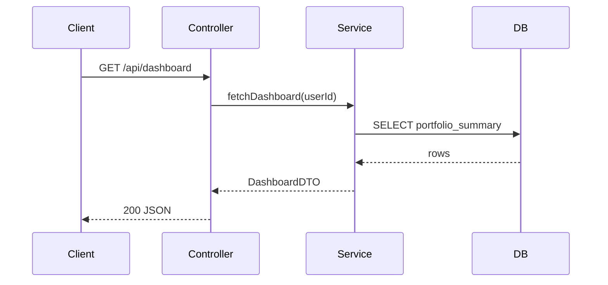

# Phase 3 — Verify

Run after [execute.md](./execute.md) deliverable is written. Fix any failing checks before telling the user the task is complete.

---

## Universal checks (both formats)

- [ ] Planning MCQ completed — `repoPath`, `flowTarget`, and `outputFormat` were confirmed
- [ ] **Agent name** `repo-e2e-flow-tracer` appears in deliverable metadata
- [ ] **Started at**, **Completed at**, **Duration** present
- [ ] **Repository** path matches user input
- [ ] **Flow traced** and **Flow kind** documented
- [ ] **Entry point** identified with file citation (`path:line`), function, and trigger
- [ ] **Step-by-step call path** has at least 3 major hops (or explains why fewer exist)
- [ ] Every step cites `path:line` — no uncited hops
- [ ] **External dependencies** listed with types and config sources
- [ ] **Side effects** documented (DB, API, and/or queue) with confidence levels
- [ ] **Mermaid sequence diagram** present and syntactically valid
- [ ] **Known uncertainty** section explicit (empty only if fully resolved)
- [ ] **Files examined** listed
- [ ] **No conflict markers** or placeholder data (`TODO`, `example_handler`) in deliverable
- [ ] **Target repo unchanged** — no edits in `repoPath`
- [ ] **Template unchanged** — `Task/agents/frontend/` was not modified (website format only)

---

## Markdown format checks

Deliverable: `{proofDir}/e2e-flow-trace-report.md`

- [ ] File exists at `Task/agents/Intermediate/I2/proof/e2e-flow-trace-report.md`
- [ ] Metadata table includes: stack, flow kind, step count, side-effect count, output format
- [ ] **Entry Point** table complete (Kind, Identifier, File, Function, Trigger)
- [ ] **Step-by-Step Call Path** table present with Role column
- [ ] **External Dependencies** table present
- [ ] **Side Effects** subsections (Database, Outbound APIs, Queues/Events) present when applicable
- [ ] **Side Effect Summary** table (or equivalent count chart) present
- [ ] Mermaid block uses `sequenceDiagram` syntax (not `erDiagram` or `graph`)
- [ ] Counts in metadata match actual section contents

### Markdown spot-check

Grep the report for evidence backing:

```bash
grep -E "Source:|path:line|\.java:|\.js:|\.ts:|\.py:" Task/agents/Intermediate/I2/proof/e2e-flow-trace-report.md
```

Every major step should appear near a file citation.

---

## Website format checks

Deliverable: `{agentDir}/e2e-flow-site/`

- [ ] Directory exists; copied from `Task/agents/frontend/` template
- [ ] `Task/agents/frontend/` files were **not** edited
- [ ] `data/e2e-flow-trace.json` (or equivalent) contains full trace data
- [ ] `npm install` completed without errors
- [ ] `npm run build` passes
- [ ] `npm run dev` serves on **http://localhost:3000**
- [ ] Overview shows metadata and counts matching trace
- [ ] Entry point card shows kind, identifier, file citation
- [ ] Call path timeline lists all major steps with role badges
- [ ] Sequence diagram renders correctly in browser
- [ ] Side effects tabs show DB/API/Queue entries with confidence badges
- [ ] External dependencies panel populated
- [ ] Known uncertainty section visible when gaps exist
- [ ] Source citations visible and copyable per step
- [ ] UI is responsive (mobile + desktop)
- [ ] No default Next.js "edit page.tsx" placeholder content remains

### Website smoke test

1. Open http://localhost:3000
2. Confirm flow name and step count match trace
3. Click through call path steps — verify file citations and roles
4. View sequence diagram — participants and side effects visible
5. Check side effects tab — DB/API/queue entries match markdown equivalent

---

## Mermaid validation

Before marking complete, mentally verify the `sequenceDiagram`:

- Participants declared before messages
- Arrow syntax valid (`->>`, `-->>`)
- At least one external system (DB, API, or Queue) if side effects exist
- Labels match function names or operations from call path
- No duplicate participant aliases

Example valid fragment:



---

## Failure handling

| Failure | Action |
|---------|--------|
| Entry point not found | Document in Known uncertainty; partial report OK if search path is listed |
| Missing source citation | Re-scan repo; add citation or move to Known uncertainty |
| Invalid Mermaid | Fix syntax; re-render |
| Inferred side effect without evidence | Remove or downgrade to Known uncertainty |
| Website build fails | Fix errors in `e2e-flow-site/` only |
| Step count mismatch | Reconcile call path vs metadata counts |
| Default Next.js page still showing | Replace with E2E flow explorer UI |
| Multiple flows in one report | Split to one flow only unless user requested chain |

Do not report success until all applicable checks pass.

---

## Completion message

Tell the user:

1. **Output path** — `Task/agents/Intermediate/I2/proof/e2e-flow-trace-report.md` or `http://localhost:3000`
2. **Headline stats** — e.g. "`GET /api/dashboard` — 8 steps, 3 side effects (2 DB read, 1 queue publish), Spring Boot 3, 2m 05s"
3. **Notable findings** — terminal side effects, cross-service calls, gaps
4. **How to re-run** — invoke agent again with same or different repo/flow/format

Example:

> E2E flow trace complete. Report: `Task/agents/Intermediate/I2/proof/e2e-flow-trace-report.md` — traced `POST /api/sync` through 11 steps to 2 DB writes and 1 Kafka publish, Node.js + Express, duration 1m 52s. See Known Uncertainty for 1 dynamic route resolution gap.
