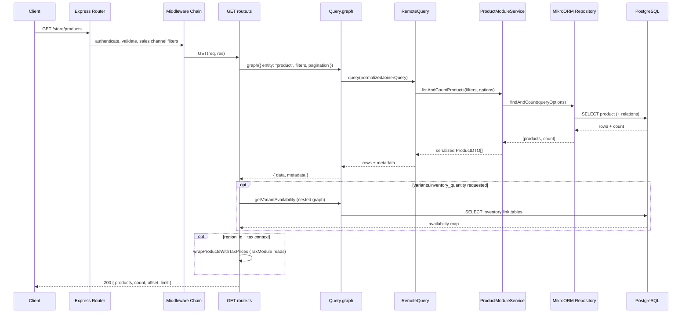

# E2E Flow Trace Report

## Metadata

| Field                      | Value                                              |
| -------------------------- | -------------------------------------------------- |
| **Agent name**             | repo-e2e-flow-tracer                               |
| **Started at**             | 2026-06-21T21:10:00Z                               |
| **Completed at**           | 2026-06-21T21:15:30Z                               |
| **Duration**               | 5m 30s                                             |
| **Repository**             | Task/medusa                                        |
| **Repo name**              | Medusa                                             |
| **Flow traced**            | `GET /store/products`                              |
| **Flow kind**              | http-inbound                                       |
| **Stack detected**         | TypeScript monorepo, Medusa v2, Express HTTP, MikroORM, PostgreSQL |
| **Output format**          | markdown                                           |
| **Major steps documented** | 14                                                 |
| **Side effects found**     | 6 (all DB reads)                                   |

## Summary

This report traces **`GET /store/products`** — the storefront endpoint that lists published products. It was chosen as a representative flow because it has a clear file-based route entry, a documented middleware chain, and a well-wired path through Medusa's Remote Query layer into the Product module and PostgreSQL.

The primary path uses **`query.graph`** (default when the index-engine feature flag is off or when `tags`/`categories` filters are present). The handler resolves products via **`RemoteQuery` → `ProductModuleService.listAndCountProducts` → MikroORM `findAndCount`** on the `product` table and related entities. Optional post-processing adds inventory quantities and tax-inclusive prices when the client requests those fields and provides the required context (`region_id`, `sales_channel_id`, etc.).

## Entry Point

| Field          | Value                                                                 |
| -------------- | --------------------------------------------------------------------- |
| **Kind**       | http-inbound                                                          |
| **Identifier** | `GET /store/products`                                                 |
| **File**       | `packages/medusa/src/api/store/products/route.ts:13`                  |
| **Function**   | `GET`                                                                 |
| **Trigger**    | Storefront HTTP request with `x-publishable-api-key` header           |

Routes are registered at startup by **`RoutesLoader.scanDir`** scanning `packages/medusa/src/api/**/route.ts` files and mapping directory paths to URL paths (`store/products` → `/store/products`). See `packages/core/framework/src/http/routes-loader.ts:48` and `router.ts:97`.

## Step-by-Step Call Path

| Step | File | Function | Role | Description | Next |
| ---- | ---- | -------- | ---- | ----------- | ---- |
| 1 | `packages/core/framework/src/http/router.ts:97` | `#loadHttpResources` | router bootstrap | Scans API dirs, registers routes and middlewares on Express app | `RoutesLoader.scanDir` |
| 2 | `packages/core/framework/src/http/routes-loader.ts:48` | `createRoutePath` | route registration | Maps `store/products/route.ts` → `/store/products` | Express route dispatch |
| 3 | `packages/medusa/src/api/middlewares.ts:138` | (spread) | middleware registry | Registers `storeProductRoutesMiddlewares` globally | middleware chain |
| 4 | `packages/medusa/src/api/store/products/middlewares.ts:65` | `storeProductRoutesMiddlewares` | middleware config | Defines GET `/store/products` middleware stack | `authenticate` |
| 5 | `packages/medusa/src/api/store/products/middlewares.ts:70` | `authenticate` | auth middleware | Allows unauthenticated access; attaches auth context if session/bearer present | `validateAndTransformQuery` |
| 6 | `packages/medusa/src/api/store/products/middlewares.ts:73` | `validateAndTransformQuery` | validation | Validates query params via `StoreGetProductsParams`; sets `req.queryConfig` and `req.filterableFields` | `filterByValidSalesChannels` |
| 7 | `packages/medusa/src/api/utils/middlewares/products/filter-by-valid-sales-channels.ts:52` | `filterByValidSalesChannels` | filter middleware | Resolves sales channel IDs from publishable key + query; sets `req.filterableFields.sales_channel_id` | `applyMaybeLinkFilterIfNecessary` |
| 8 | `packages/medusa/src/api/store/products/middlewares.ts:79` | `applyDefaultFilters` | filter middleware | Forces `status: PUBLISHED`; transforms `category_id` filter | `normalizeDataForContext` → `setPricingContext` → `setTaxContext` |
| 9 | `packages/medusa/src/api/store/products/route.ts:13` | `GET` | controller/handler | Entry handler; branches on index-engine feature flag | `getProducts` or `getProductsWithIndexEngine` |
| 10 | `packages/medusa/src/api/store/products/route.ts:112` | `getProducts` | handler (default path) | Resolves `QUERY` from DI container; builds pricing context | `query.graph` |
| 11 | `packages/core/modules-sdk/src/remote-query/query.ts:211` | `graph` | query layer | Converts entity query to RemoteJoiner query; applies caching and locale translations | `RemoteQuery.query` |
| 12 | `packages/core/modules-sdk/src/remote-query/remote-query.ts:283` | `remoteFetchData` → `executeFetchRequest` | remote joiner | Resolves product module; calls `listAndCountProducts` with filters + pagination | `ProductModuleService.listAndCountProducts` |
| 13 | `packages/modules/product/src/services/product-module-service.ts:265` | `listAndCountProducts` | module service | Delegates to internal product service; serializes DTOs | `productService_.listAndCount` |
| 14 | `packages/core/utils/src/modules-sdk/medusa-internal-service.ts:237` | `listAndCount` | repository layer | Builds MikroORM query via `buildQuery`; executes `findAndCount` | PostgreSQL |

### Optional post-processing (when requested fields/context present)

| Step | File | Function | Role | Description |
| ---- | ---- | -------- | ---- | ----------- |
| A | `packages/medusa/src/api/store/products/route.ts:150` | `wrapVariantsWithInventoryQuantityForSalesChannel` | enrichment | If `variants.inventory_quantity` requested — queries inventory link entities and computes availability |
| B | `packages/core/utils/src/product/get-variant-availability.ts:40` | `getVariantAvailability` | utility | Nested `query.graph` on `product_variant_inventory_items` and `sales_channel_locations` |
| C | `packages/medusa/src/api/store/products/helpers.ts:47` | `wrapProductsWithTaxPrices` | enrichment | If tax context present — calls Tax module `getTaxLines` and adjusts calculated prices |
| D | `packages/medusa/src/api/store/products/route.ts:158` | `res.json` | response | Returns `{ products, count, offset, limit }` JSON to client |

## Call Path Overview

```
HTTP Client
  → Express Router (RoutesLoader)
    → Middleware chain (auth → validate → sales channel → filters → pricing/tax context)
      → GET handler (route.ts)
        → Query.graph (Remote Query)
          → RemoteJoiner.fetch
            → ProductModuleService.listAndCountProducts
              → MedusaInternalService.listAndCount
                → MikroORM findAndCount → PostgreSQL (product + relations)
        → [optional] inventory enrichment → query.graph (inventory module tables)
        → [optional] tax enrichment → TaxModuleService.getTaxLines
      → res.json(200)
```

## External Dependencies

| Dependency | Type | Used in | Purpose | Config source |
| ---------- | ---- | ------- | ------- | ------------- |
| PostgreSQL | database | `medusa-internal-service.ts:247` (`findAndCount`) | Persist and read product catalog data | App `databaseUrl` / `DATABASE_URL` in medusa-config |
| Redis (optional) | cache | `query.ts:211` (`@Cached` on `graph`) | Cache remote-query graph results when caching module enabled | Caching module provider config |
| Publishable API Key context | auth/config | `filter-by-valid-sales-channels.ts:52` | Scope sales channels for the request | `x-publishable-api-key` header → API Key module |

## Side Effects

### Database

| Op | Target | Method / query | File | Confidence |
| -- | ------ | -------------- | ---- | ---------- |
| READ | `product` | `findAndCount` (MikroORM → SELECT) | `medusa-internal-service.ts:247` | confirmed |
| READ | `product_variant`, `product_option`, `product_image`, `product_tag`, `product_type`, `product_collection` | Joined via RemoteJoiner relation expands per `query-config.ts` default fields | `remote-query.ts:283` | confirmed |
| READ | `product_sales_channel` (link) | Filter via `maybeApplyLinkFilter` when multiple sales channels exist | `middlewares.ts:29` | confirmed |
| READ | `product_variant_inventory_item`, `inventory_level`, `sales_channel_location` | Nested `query.graph` when `variants.inventory_quantity` field requested | `get-variant-availability.ts:155` | confirmed |
| READ | `region`, `customer_group` | When `region_id` query param triggers pricing context middleware | `set-pricing-context.ts:28` | confirmed |
| READ | Tax rate tables | When tax context active — `taxService.getTaxLines()` | `helpers.ts:63` | inferred |

### Outbound APIs

| Method | Endpoint | Client | File | Confidence |
| ------ | -------- | ------ | ---- | ---------- |
| — | — | — | — | No outbound HTTP in default read path |

### Queues / Events

| Action | Target | Producer | File | Confidence |
| ------ | ------ | -------- | ---- | ---------- |
| — | — | — | — | No queue publish or event emit on this read path |

## Side Effect Summary

| Category | Read | Write | Publish | Total |
| -------- | ---- | ----- | ------- | ----- |
| Database | 6 | 0 | — | 6 |
| API | 0 | 0 | — | 0 |
| Queue | — | — | 0 | 0 |

## Sequence Diagram



## Known Uncertainty

| # | Area | Description | What was tried |
| - | ---- | ----------- | -------------- |
| 1 | Index engine branch | When `IndexEngineFeatureFlag` is enabled and no `tags`/`categories` filter, handler uses `getProductsWithIndexEngine` → `query.index` instead of `query.graph` | Read `route.ts:24-33` and `query.ts:index` method signature |
| 2 | Exact SQL shape | MikroORM generates dynamic SQL based on requested `fields` and relation expands; exact JOIN list varies per query | Traced to `buildQuery` + `findAndCount`; did not capture runtime SQL |
| 3 | Cache hit vs miss | `query.graph` uses `@Cached` decorator; whether Redis/in-memory cache is hit depends on deployment config | Read cache decorator in `query.ts:47-72` |
| 4 | Pricing module reads | When `calculated_price` fields are requested with `region_id`, additional reads hit Pricing module tables via RemoteJoiner — not fully expanded in this trace | Read `set-pricing-context.ts` and `QueryContext` in route handler |

### Files examined

- `packages/medusa/src/api/store/products/route.ts` — GET handler, getProducts, getProductsWithIndexEngine
- `packages/medusa/src/api/store/products/middlewares.ts` — middleware chain definition
- `packages/medusa/src/api/store/products/query-config.ts` — default fields and pagination config
- `packages/medusa/src/api/store/products/helpers.ts` — tax price wrapping
- `packages/medusa/src/api/middlewares.ts` — global middleware registration
- `packages/medusa/src/api/utils/middlewares/products/filter-by-valid-sales-channels.ts` — sales channel resolution
- `packages/medusa/src/api/utils/middlewares/products/set-pricing-context.ts` — pricing context middleware
- `packages/medusa/src/api/utils/middlewares/products/variant-inventory-quantity.ts` — inventory enrichment
- `packages/core/framework/src/http/routes-loader.ts` — file-based route registration
- `packages/core/framework/src/http/router.ts` — HTTP resource loading
- `packages/core/modules-sdk/src/remote-query/query.ts` — Query.graph implementation
- `packages/core/modules-sdk/src/remote-query/remote-query.ts` — RemoteQuery fetch + listAndCount dispatch
- `packages/modules/product/src/services/product-module-service.ts` — listAndCountProducts
- `packages/modules/product/src/joiner-config.ts` — product module joiner entity config
- `packages/modules/product/src/models/product.ts` — Product DML model (maps to `product` table)
- `packages/core/utils/src/modules-sdk/medusa-internal-service.ts` — MikroORM findAndCount
- `packages/core/utils/src/product/get-variant-availability.ts` — inventory availability computation

### Not traced (out of scope)

- Admin `GET /admin/products` (parallel admin route with similar structure)
- Index module internal indexing pipeline (`query.index` path)
- Frontend JS SDK client code that calls this endpoint
- Cart/checkout flows that mutate product inventory
- Workflow engine or event-bus side effects (none on this read path)
