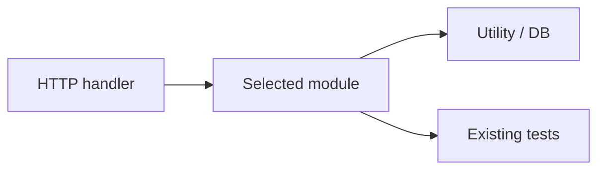

# Phase 2 — Execute

Run after [planning.md](./planning.md) inputs are confirmed. Pick an unfamiliar module, define a minimal change, add or update a test, implement, verify, and write the deliverable.

You **may edit source and test files** in `repoPath` for the change. Report writes go to `{proofDir}` and/or `{agentDir}/focused-change-site/` only.

---

## Input (from planning)

| Field | Required | Description |
|-------|----------|-------------|
| `repoPath` | Yes | Repository root |
| `changeScope` | Yes | `user-specified` (with description) or `agent-selects` |
| `outputFormat` | Yes | `markdown` or `website` |
| `outputPath` | Yes | `{proofDir}/focused-module-change-report.md` or `{agentDir}/focused-change-site/` |
| `changeHint` | No | Module, file, or behavior hint from user |
| `createBranch` | No | `false` default — work on current branch |
| `scope` | No | Subdirectory or package limit in monorepos |
| `allowNewDependency` | No | `false` default — no new packages |

Record `startTime` (ISO 8601) if not already set.

---

## Step 1 — Repo reconnaissance

Before picking a module, establish context:

1. Read `README.md`, build manifests, and CI config.
2. Detect stack(s), install commands, test runner, and source layout (monorepo packages, `src/` roots, module boundaries).
3. Record: repo name, stack, test command pattern, and how modules are organized (packages, layers, feature folders).
4. List **candidate modules** — directories or packages with clear boundaries (e.g. `src/services/billing/`, `packages/auth/`, `internal/validator/`).
5. Prefer modules that are:
   - **Self-contained** — few cross-module imports
   - **Testable in isolation** — existing or easy-to-add unit tests
   - **Unfamiliar** — not the obvious entry point (not `main`, not root `index`, not the file you opened first)
   - **Small enough** — one service, utility package, or handler group

Capture install and test commands with source citations (e.g. `package.json` scripts, `Makefile`, `pom.xml`).

---

## Step 2 — Pick an unfamiliar module

### Selection rules

1. If `changeHint` provided, start there but still document why the module was unfamiliar before this run.
2. If `user-specified` change, map the request to the smallest owning module.
3. If `agent-selects`, pick one module you have **not** read deeply yet and a change that is:
   - **Small** — one function, one branch, one validation, one constant fix
   - **Valuable** — fixes a real edge case, closes a test gap, or corrects observable behavior
   - **Safe** — low blast radius; no public API breakage without updating callers/tests

### Module record (required)

| Field | Value |
|-------|-------|
| **Module name** | e.g. `billing/currency-converter` |
| **Module path** | `src/billing/currency-converter/` |
| **Why unfamiliar** | e.g. "Not referenced in README; first opened during this run at Step 2" |
| **Primary exports / entry points** | Functions, classes, routes, or CLI commands |
| **Existing tests** | Test file paths or "none — will add" |
| **Dependencies in** | Who imports this module (1–3 callers max for report) |
| **Dependencies out** | Key imports this module uses |

Include a **module map** — Mermaid flowchart or table showing the module's place in the repo:



---

## Step 3 — Define the minimal change

State the change contract **before** editing code:

| Field | Value |
|-------|-------|
| **Change summary** | One sentence — what behavior changes |
| **Motivation** | Why this change is needed (user request, missing guard, failing edge case, test gap) |
| **Acceptance criteria** | Observable pass conditions — e.g. "returns 400 when amount is negative" |
| **Out of scope** | What you will **not** touch (refactors, other modules, deps, formatting) |
| **Estimated files** | Production + test file list |

If `user-specified` and the request is too large, **narrow** it in the report and implement only the smallest slice that satisfies the core ask. Mark deferred work in discovery notes.

Do **not** start editing until acceptance criteria are written.

---

## Step 4 — Test first (add or update)

Every run **must** add or update at least one relevant test.

### Test rules

1. **Prefer updating** an existing test file in or next to the module if one exists.
2. **Add one focused test** if none exists — name it after the behavior under change.
3. **Colocate** per repo convention (`*.test.ts`, `*_test.go`, `TestFoo.java`, `test_*.py`).
4. **Run the test before the fix** when practical — capture FAIL (proves the test detects the gap) or document why pre-fix run is N/A (e.g. new test for untested path).
5. Do **not** weaken assertions, skip tests, or delete coverage to make the change pass.

### Test record

| Field | Value |
|-------|-------|
| **Test file** | `path/to/module.test.ext` |
| **Test name** | Function or `-t` filter name |
| **Action** | `added` / `updated` |
| **What it proves** | One line — ties to acceptance criteria |

---

## Step 5 — Implement minimal change

### Implementation rules

1. **Minimal diff** — aim for ≤50 lines changed in production code; ≤3 production files.
2. **One concern** — one behavior change per run; defer extras to discovery backlog.
3. **Match conventions** — naming, imports, error types, logging, and patterns in surrounding code.
4. **No scope creep** — no formatting sweeps, renames, dependency bumps, or unrelated cleanup.
5. **No new dependencies** unless `allowNewDependency: true`.
6. **Comment only** when the change is non-obvious — prefer self-explanatory code.

### Optional branch

If `createBranch: true`:

```bash
git checkout -b agent/focused-change-$(date +%Y%m%d-%H%M%S)
```

Record branch name in the report. Otherwise record `current branch (uncommitted)`.

### Capture diff stats

After edits:

```bash
git diff --stat
git diff
```

Record: branch name (if any), files changed count, insertions, deletions.

---

## Step 6 — Run verification

Run the **narrowest** test command that proves the change.

### Verification order

1. The new or updated test from Step 4 (single test or `-t` filter).
2. Existing tests in the same module test file.
3. Broader suite only if the repo's CI requires it or the change touches shared types/utilities.

| Stack | Example narrow command |
|-------|------------------------|
| Jest / Vitest | `npm test -- path/to/module.test.ts -t "case name"` |
| pytest | `pytest path/to/test_module.py -v -k "case_name"` |
| Go | `go test ./internal/validator/... -run TestName -v` |
| JUnit / Gradle | `./gradlew test --tests com.example.FooTest.testBar` |
| Maven | `mvn test -Dtest=FooTest#testBar` |

Capture **full command**, **exit code**, and **stdout/stderr** (trim verbose pass output to last ~40 lines; keep failure stacks complete).

### Before vs after

| Check | Before change | After change |
|-------|---------------|--------------|
| Target test | {FAIL / not run / N/A} | {PASS / FAIL} |
| Exit code | {non-zero or 0} | {0 expected} |
| Key assertion / behavior | {wrong or untested} | {correct} |

If verification FAILs, iterate on the fix or document FAIL in the report — do not claim success.

---

## Step 7 — Why these files

For **each** changed file, write a one-line rationale:

| File | Role | Why changed |
|------|------|-------------|
| `{production file}` | {e.g. core logic} | {only file owning the behavior} |
| `{test file}` | {test} | {covers new edge case / updated assertion} |

Narrative section: 2–4 sentences explaining why no other files were needed, or why each additional file was unavoidable.

---

## Step 8 — Risk assessment

Fill before finishing:

| Dimension | Rating | Rationale |
|-----------|--------|-----------|
| Blast radius | low / medium / high | {callers, public API surface} |
| Change confidence | low / medium / high | {how well you understood the module} |
| Test confidence | low / medium / high | {how well the test covers the change} |
| Regression risk | low / medium / high | {shared code, implicit contracts} |

**Overall risk:** {low / medium / high} — {2–3 sentences}

---

## Step 9 — Agent vs manual verification

After automated verification, fill the comparison table. Set **Manually verified** columns to `pending` — the developer fills `yes`/`no` during review.

| Item | Agent suggested / verified | Manually verified |
|------|---------------------------|-------------------|
| Module choice is appropriate | {yes + note} | pending |
| Change is minimal and focused | {yes/no + line count} | pending |
| Diff matches stated files | {yes + git diff stat} | pending |
| Test command proves the change | {yes + command} | pending |
| No unrelated files changed | {yes/no} | pending |
| Safe to merge | {yes/no + why} | pending |

---

## Step 10 — Write deliverable

Record `endTime` and compute `duration` (human-readable, e.g. `8m 24s`; use `Ns` only if under 1 minute).

Branch on `outputFormat`:

---

### Format A — Markdown (`outputFormat: markdown`)

Write to `{proofDir}/focused-module-change-report.md`.

Use this exact structure:

```markdown
# Focused Module Change Report

## Metadata

| Field | Value |
|-------|-------|
| **Agent name** | focused-module-change |
| **Started at** | {startTime ISO 8601} |
| **Completed at** | {endTime ISO 8601} |
| **Duration** | {duration} |
| **Repository** | {repoPath} |
| **Repo name** | {derived name} |
| **Branch** | {branch name or "current branch (uncommitted)"} |
| **Stack detected** | {e.g. Node + Jest monorepo} |
| **Module changed** | `{module path}` |
| **Change summary** | {one line} |
| **Files changed** | {count} |
| **Lines changed** | +{insertions} / -{deletions} |
| **Test result** | {PASS / FAIL / NOT RUN} |

## Summary

{2–4 sentences: unfamiliar module chosen, what changed, why minimal, test outcome.}

## Module selection

### Why this module is unfamiliar

{2–3 sentences — what you had not explored before this run.}

### Module overview

| Field | Value |
|-------|-------|
| **Module name** | {name} |
| **Module path** | `{path}` |
| **Entry points** | {functions / routes / exports} |
| **Existing tests** | {paths or "added in this run"} |

### Module map

\`\`\`mermaid
flowchart LR
  {nodes and edges for module context}
\`\`\`

## Change definition

| Field | Value |
|-------|-------|
| **Change scope** | {user-specified / agent-selects} |
| **Motivation** | {why} |
| **Acceptance criteria** | {bullet or sentence} |
| **Out of scope** | {what was deferred} |

## Files changed

| # | File | Role | Lines (+/-) |
|---|------|------|-------------|
| 1 | `{path}` | {production / test} | {+n / -m} |

## Why these files

{Per-file rationale table from Step 7, plus 2–4 sentence narrative.}

## Diff or branch

### Branch

{branch name or "working tree on current branch"}

### Diff stats

\`\`\`
{output of `git diff --stat`}
\`\`\`

### Diff

\`\`\`diff
{paste `git diff` for all changed files}
\`\`\`

### Diff visualization

\`\`\`mermaid
xychart-beta
    title "Lines changed by file"
    x-axis [{file1}, {file2}]
    y-axis "Lines" 0 --> {max}
    bar [{insertions+deletions per file}]
\`\`\`

## Test

### Test added or updated

| Field | Value |
|-------|-------|
| **File** | `{test path}` |
| **Test name** | `{name}` |
| **Action** | added / updated |
| **Proves** | {acceptance criterion} |

### Test command

\`\`\`bash
{exact command}
\`\`\`

### Exit code

{0 or non-zero}

### Test output

\`\`\`
{verbatim or faithfully truncated output}
\`\`\`

### Before vs after

| Check | Before | After |
|-------|--------|-------|
| {target test} | {FAIL / N/A} | {PASS} |
| {exit code} | {…} | {0} |

## Risk assessment

| Dimension | Rating | Rationale |
|-----------|--------|-----------|
| Blast radius | {low/med/high} | {…} |
| Change confidence | {low/med/high} | {…} |
| Test confidence | {low/med/high} | {…} |
| Regression risk | {low/med/high} | {…} |

**Overall risk:** {low / medium / high} — {2–3 sentences}

## Agent suggested vs manually verified

| Item | Agent suggested / verified | Manually verified |
|------|---------------------------|-------------------|
| Module choice is appropriate | {…} | pending |
| Change is minimal and focused | {…} | pending |
| Diff matches stated files | {…} | pending |
| Test command proves the change | {…} | pending |
| No unrelated files changed | {…} | pending |
| Safe to merge | {…} | pending |

### What the agent verified

- {bullet — e.g. "Ran `npm test -- src/billing/converter.test.ts -t negative amount` — PASS"}
- {bullet — e.g. "Diff is 2 files, +18/-3 lines"}

### What requires human verification

- {bullet — e.g. "Full CI suite not run"}
- {bullet — e.g. "Cross-module integration in staging"}

## Rollback notes

\`\`\`bash
{git checkout -- path/to/file ... OR git reset / revert instructions}
\`\`\`

{1–2 sentences on how to undo safely.}

## Discovery notes

### Files examined

- `{path}` — {brief note}

### Alternatives considered

- {e.g. broader refactor in sibling module — rejected for scope}

### Ambiguities

- {e.g. rounding behavior undocumented — assumed from existing tests}

## Known limitations

{Empty if none — e.g. only single test run, lint not run}

## Blocked

{Only if agent could not complete — cannot run tests, change too large, requirements unclear}
```

---

### Format B — Website (`outputFormat: website`)

Build at `{agentDir}/focused-change-site/`.

#### Bootstrap (do not edit template)

```bash
cp -R Task/agents/frontend/. {agentDir}/focused-change-site/
cd {agentDir}/focused-change-site
npm install
```

**Never modify files under `Task/agents/frontend/`** — only files inside `focused-change-site/`.

#### Required site features

1. **Overview page** — metadata, summary, module name, change stats cards (files, lines, test status)
2. **Module selection panel** — unfamiliar-module rationale, module map diagram, entry points table
3. **Change definition** — motivation, acceptance criteria, out-of-scope list
4. **Files changed table** — with expandable "why this file" detail per row
5. **Diff viewer** — syntax-highlighted `git diff` or per-file tabs; branch badge
6. **Diff chart** — bar chart of lines changed per file
7. **Test panel** — command, exit code, output excerpt, pass/fail badge
8. **Before vs after cards** — assertion/behavior comparison
9. **Risk assessment** — dimension ratings with color badges and overall risk summary
10. **Agent vs manual verification** — table (agent column filled, manual = `pending`)
11. **Rollback section** — copy-to-clipboard undo commands
12. **Discovery notes** — files examined, alternatives, ambiguities
13. **Responsive UI** — clean layout, good visual hierarchy

#### Data layer

Generate `{agentDir}/focused-change-site/data/focused-change-report.json` (or typed TS constants) from execution results. Website must reflect **same completeness** as markdown report.

#### Run locally

```bash
cd {agentDir}/focused-change-site
npm run dev
```

Open **http://localhost:3000**. Fix build/lint errors until `npm run build` passes.

---

## Execution rules

1. **Unfamiliar module first** — document module choice before editing; do not change the most obvious file without justification.
2. **Test required** — add or update at least one relevant test; report command and real output.
3. **Minimal diff only** — one focused change; no drive-by refactors, formatting, or dependency changes.
4. **Evidence over claims** — paste real `git diff` and test output; never fabricate PASS results.
5. **Every file explained** — "why these files" must account for every path in the diff.
6. **No commit/push** — unless the user explicitly requests it.
7. **Stack-aware** — use the repo's install, run, and test commands; do not introduce new tooling.
8. **Blocked is OK** — if tests cannot run or scope is unclear, write partial report with **Blocked** section.

After writing deliverable, proceed to [verify.md](./verify.md).
