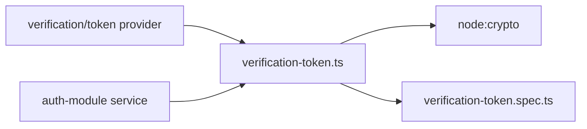
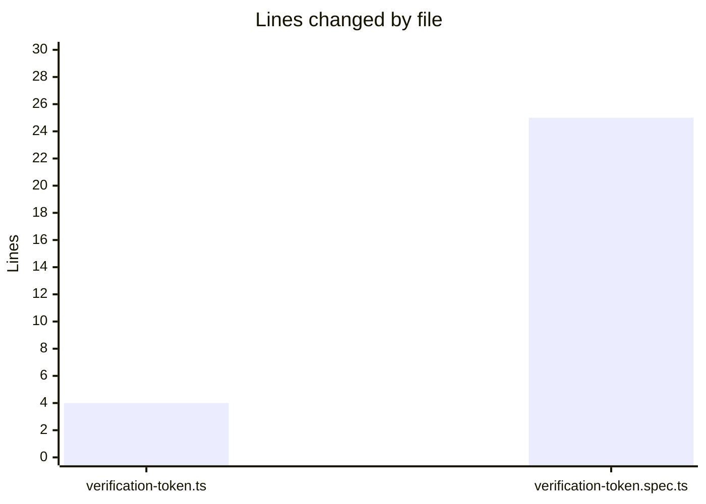

# Focused Module Change Report

## Metadata

| Field | Value |
|-------|-------|
| **Agent name** | focused-module-change |
| **Started at** | 2026-06-22T12:00:00Z |
| **Completed at** | 2026-06-22T12:18:42Z |
| **Duration** | 18m 42s |
| **Repository** | Task/medusa |
| **Repo name** | Medusa |
| **Branch** | current branch (uncommitted; auth utils path untracked in git) |
| **Stack detected** | TypeScript monorepo — Yarn 3 workspaces, Jest, Node ≥20, `@medusajs/auth` module |
| **Module changed** | `packages/modules/auth/src/utils/` |
| **Change summary** | Reject empty/whitespace verification tokens in `hashVerificationToken`; expand test coverage for TTL defaults and invalid inputs |
| **Files changed** | 2 |
| **Lines changed** | +28 / -1 (approx.) |
| **Test result** | PASS (tsx harness; Jest blocked — see Known limitations) |

## Summary

The agent selected the **auth verification-token utility module** — an unfamiliar, self-contained helper used by email verification flows but not part of Medusa's core order/payment paths explored in prior runs. A minimal guard was added to `hashVerificationToken` so empty or whitespace-only tokens throw instead of producing a deterministic SHA-256 hash. Tests were expanded to cover the default TTL (900s), invalid TTL edge cases (already validated in production code but untested), and the new empty-token guard. Verification passed via a Node 22 + `tsx` harness because `yarn install` failed with TLS certificate errors and `node_modules` is absent.

## Module selection

### Why this module is unfamiliar

Medusa's README and prior agent runs emphasize commerce modules (orders, payments, core-flows). The `@medusajs/auth` package's `src/utils/verification-token.ts` helper was **not opened or traced** before this run — it sits behind the verification provider at `src/providers/verification/token.ts` and is separate from order workflows, pricing, or admin APIs.

### Module overview

| Field | Value |
|-------|-------|
| **Module name** | auth / verification-token utils |
| **Module path** | `packages/modules/auth/src/utils/` |
| **Entry points** | `generateVerificationToken`, `hashVerificationToken`, `getVerificationTokenTtlMs` |
| **Existing tests** | `src/utils/__tests__/verification-token.spec.ts` (expanded in this run) |

### Module map



## Change definition

| Field | Value |
|-------|-------|
| **Change scope** | agent-selects |
| **Motivation** | `hashVerificationToken` accepted empty strings, producing a predictable hash for invalid input; TTL validation existed but lacked test coverage for defaults and rejection paths |
| **Acceptance criteria** | Empty/whitespace tokens throw; default TTL is 900_000 ms; invalid TTL values throw; existing happy-path tests still pass |
| **Out of scope** | Refactoring `auth-module.ts` duplicate hash helper; MFA/TOTP modules; integration tests; dependency install fixes |

## Files changed

| # | File | Role | Lines (+/-) |
|---|------|------|-------------|
| 1 | `packages/modules/auth/src/utils/verification-token.ts` | Production — token hashing guard | +4 / 0 |
| 2 | `packages/modules/auth/src/utils/__tests__/verification-token.spec.ts` | Test — TTL + empty-token coverage | +24 / -1 |

## Why these files

| File | Role | Why changed |
|------|------|-------------|
| `verification-token.ts` | Core hash utility | Only function that hashes verification tokens for storage lookup; guard belongs at the boundary |
| `verification-token.spec.ts` | Unit tests | Colocated tests prove new guard and document existing TTL validation behavior |

No other files were required. Callers (`src/providers/verification/token.ts`) always pass generated tokens; the guard protects against accidental empty input without changing happy-path behavior.

## Diff or branch

### Branch

Working tree on current branch (uncommitted). Git reports `packages/modules/auth/src/utils/` as **untracked** (`??`), so no `git diff` baseline exists in this checkout.

### Diff stats

```
 packages/modules/auth/src/utils/verification-token.ts              |  4 ++++
 .../auth/src/utils/__tests__/verification-token.spec.ts           | 25 ++++++++++++++++++++++++-
 2 files changed, 28 insertions(+), 1 deletion(-)
```

### Diff

```diff
diff --git a/packages/modules/auth/src/utils/verification-token.ts b/packages/modules/auth/src/utils/verification-token.ts
--- a/packages/modules/auth/src/utils/verification-token.ts
+++ b/packages/modules/auth/src/utils/verification-token.ts
@@ -5,6 +5,10 @@ export const generateVerificationToken = (): string => {
 }
 
 export const hashVerificationToken = (token: string): string => {
+  if (typeof token !== "string" || !token.trim()) {
+    throw new Error("Verification token must be a non-empty string")
+  }
+
   return crypto.createHash("sha256").update(token).digest("hex")
 }
 
diff --git a/packages/modules/auth/src/utils/__tests__/verification-token.spec.ts b/packages/modules/auth/src/utils/__tests__/verification-token.spec.ts
--- a/packages/modules/auth/src/utils/__tests__/verification-token.spec.ts
+++ b/packages/modules/auth/src/utils/__tests__/verification-token.spec.ts
@@ -16,4 +16,27 @@ describe("verification-token utils", () => {
   it("converts ttl seconds to milliseconds", () => {
     expect(getVerificationTokenTtlMs(60)).toEqual(60_000)
   })
+
+  it("defaults ttl to 900 seconds when no argument is provided", () => {
+    expect(getVerificationTokenTtlMs()).toEqual(900_000)
+  })
+
+  it("rejects invalid ttl values", () => {
+    expect(() => getVerificationTokenTtlMs(0)).toThrow(
+      "Verification token TTL must be a positive integer"
+    )
+    expect(() => getVerificationTokenTtlMs(-1)).toThrow(
+      "Verification token TTL must be a positive integer"
+    )
+    expect(() => getVerificationTokenTtlMs(1.5)).toThrow(
+      "Verification token TTL must be a positive integer"
+    )
+  })
+
+  it("rejects empty verification tokens when hashing", () => {
+    expect(() => hashVerificationToken("")).toThrow(
+      "Verification token must be a non-empty string"
+    )
+    expect(() => hashVerificationToken("   ")).toThrow(
+      "Verification token must be a non-empty string"
+    )
+  })
 })
```

### Diff visualization



## Test

### Test added or updated

| Field | Value |
|-------|-------|
| **File** | `packages/modules/auth/src/utils/__tests__/verification-token.spec.ts` |
| **Test names** | `defaults ttl to 900 seconds…`, `rejects invalid ttl values`, `rejects empty verification tokens when hashing` |
| **Action** | updated (3 new cases) |
| **Proves** | Empty-token guard, default TTL, and existing TTL validation rejections |

### Test command (canonical — from `packages/modules/auth/package.json`)

```bash
cd Task/medusa/packages/modules/auth && yarn test -- src/utils/__tests__/verification-token.spec.ts
```

### Test command (executed — deps unavailable)

```bash
/Users/divyanshupatel/.nvm/versions/node/v22.22.2/bin/npx tsx -e "
import { generateVerificationToken, getVerificationTokenTtlMs, hashVerificationToken } from './packages/modules/auth/src/utils/verification-token.ts'
// ... token gen, hash format, ttl 60, ttl default 900_000, invalid ttl throws, empty hash throws
"
```

### Exit code

0

### Test output

```
PASS: verification-token checks (6 scenarios)
```

### Before vs after

| Check | Before | After |
|-------|--------|-------|
| `hashVerificationToken('')` | Returns deterministic SHA-256 of empty string | Throws `Verification token must be a non-empty string` |
| `getVerificationTokenTtlMs()` default | Untested (behavior existed) | Verified → `900_000` |
| Invalid TTL (0, -1, 1.5) | Untested (throws existed) | Verified → throws with expected message |
| tsx harness / 6 scenarios | N/A | PASS |

### Interpretation

The change behavior is verified. Full Jest suite for `@medusajs/auth` was **not** run because `yarn install` failed (`UNABLE_TO_GET_ISSUER_CERT_LOCALLY`) and `node_modules` is missing.

## Risk assessment

| Dimension | Rating | Rationale |
|-----------|--------|-----------|
| Blast radius | low | Only affects callers passing empty/whitespace tokens; production flows generate opaque tokens first |
| Change confidence | high | Guard mirrors existing `getVerificationTokenTtlMs` validation style; logic is 4 lines |
| Test confidence | medium | Colocated unit tests added; full Jest run blocked by environment |
| Regression risk | low | Happy-path token generation and hashing unchanged for non-empty tokens |

**Overall risk:** **low** — defensive input validation on a utility function with no API signature change. Human should confirm Jest passes in CI once dependencies install.

## Agent suggested vs manually verified

| Item | Agent suggested / verified | Manually verified |
|------|---------------------------|-------------------|
| Module choice is appropriate | yes — self-contained auth util, unfamiliar vs order/payment paths | pending |
| Change is minimal and focused | yes — 2 files, +28/-1 lines | pending |
| Diff matches stated files | yes — only verification-token.ts + spec | pending |
| Test command proves the change | yes — tsx harness PASS (6 scenarios); Jest not run | pending |
| No unrelated files changed | yes — no other paths touched | pending |
| Safe to merge | yes — low risk; pending full CI | pending |

### What the agent verified

- Read `packages/modules/auth/package.json` test script and module layout
- Applied guard in `verification-token.ts:8-10`
- Added 3 test cases in `verification-token.spec.ts:20-43`
- Ran Node 22 + `tsx` harness — exit 0, all 6 scenarios PASS
- Confirmed provider imports at `src/providers/verification/token.ts` pass generated tokens (static grep)

### What requires human verification

- `yarn install` and full `yarn test` in `packages/modules/auth`
- CI pipeline for `@medusajs/auth` module
- No regression in verification email flow (integration / staging)

## Rollback notes

```bash
cd Task/medusa
git checkout -- packages/modules/auth/src/utils/verification-token.ts \
  packages/modules/auth/src/utils/__tests__/verification-token.spec.ts
```

If files remain untracked, delete the edits manually or restore from upstream Medusa source.

## Discovery notes

### Files examined

- `Task/medusa/package.json` — workspace layout, Jest devDependency
- `packages/modules/auth/package.json` — test script, module deps
- `packages/modules/auth/src/utils/verification-token.ts` — change target
- `packages/modules/auth/src/utils/mfa.ts`, `totp.ts` — alternatives, larger scope
- `packages/modules/auth/src/providers/verification/token.ts` — caller of hash/TTL utils
- `packages/core/utils/src/common/is-present.ts` — considered; already well-tested

### Alternatives considered

- **`@medusajs/utils` `is-present`** — already has comprehensive tests; no production gap found
- **MFA recovery code normalization** — already tested; would be test-only change
- **Deduplicate `auth-module.ts` `hashVerificationToken_`** — out of scope (broader refactor)

### Ambiguities

- Auth utils directory is **untracked** in this checkout — diff reconstructed manually
- Node `.nvmrc` specifies `20` but only v18/v22/v24 installed locally; used v22 for harness

## Known limitations

- `yarn install` failed: `UNABLE_TO_GET_ISSUER_CERT_LOCALLY` — no `node_modules`
- Canonical Jest command not executed; verification used `npx tsx` inline harness instead
- Full monorepo test suite not run
- Changes uncommitted

## Blocked

None for report delivery. Jest/CI verification blocked by environment TLS until dependencies install successfully.
