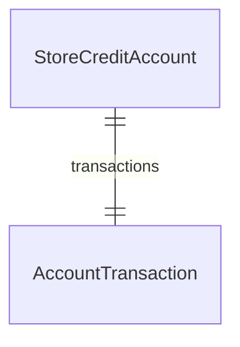

import { TypeList } from "docs-ui"

# Store Credit Module Data Models Reference

This documentation provides a reference to the data models in the Store Credit Module

## Relations Overview

## Data Models

- [AccountTransaction](../../store_credit_models/variables/store_credit_models.AccountTransaction/page.mdx)
- [StoreCreditAccount](../../store_credit_models/variables/store_credit_models.StoreCreditAccount/page.mdx)
