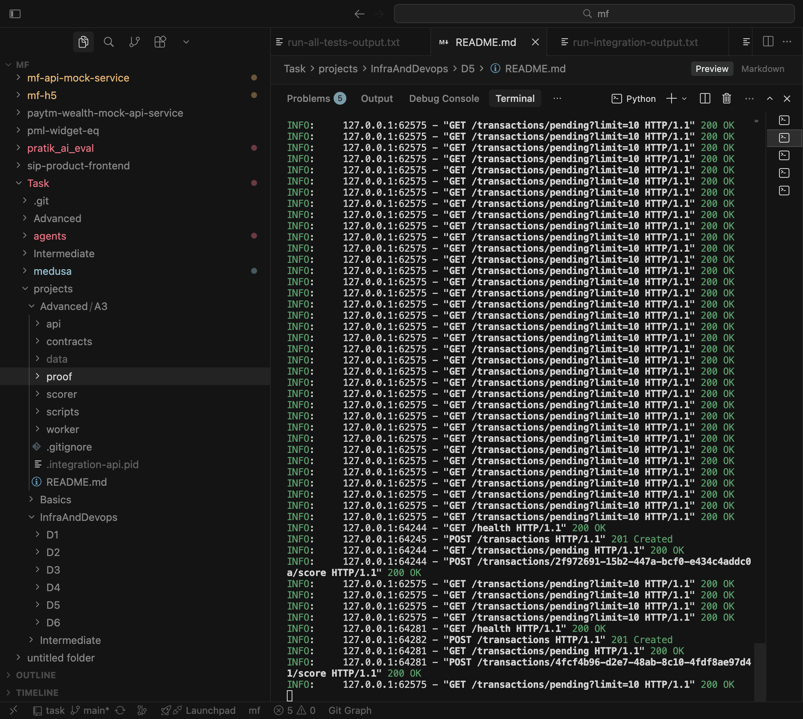
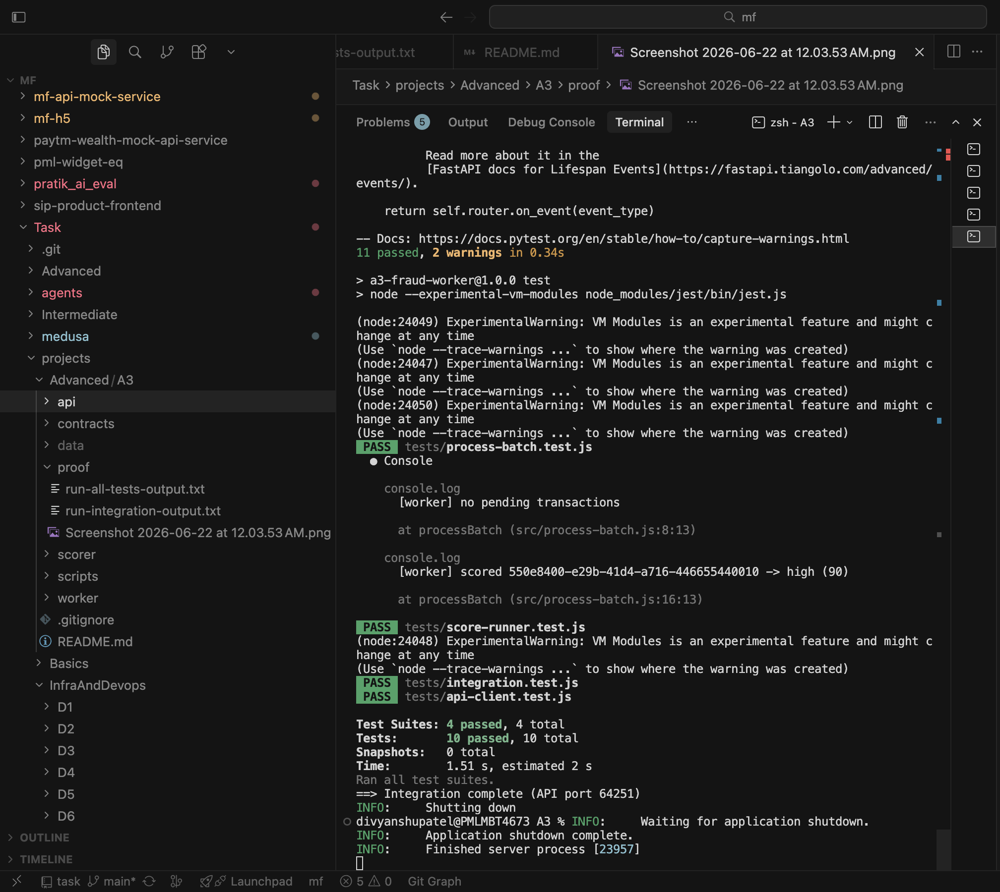

# A3 — Mini Fraud Score System (Python + Node.js + Rust)

A three-component fraud scoring pipeline:

| Component | Role |
|-----------|------|
| **FastAPI** (`api/`) | Ingests transactions, stores pending queue, accepts scores |
| **Node.js worker** (`worker/`) | Polls pending transactions, invokes Rust CLI, submits scores |
| **Rust scorer** (`scorer/`) | Computes `risk_score`, `risk_level`, and `reasons` |

## Requirements checklist

| Requirement | Location |
|-------------|----------|
| FastAPI ingestion endpoint | `POST /transactions` in `api/app/main.py` |
| Node.js worker process | `worker/src/worker.js` |
| Rust scoring CLI + library | `scorer/src/main.rs`, `scorer/src/lib.rs` |
| Data contract | `contracts/` (JSON Schema + README) |
| Core scoring tests | `scorer/src/lib.rs` (`cargo test`) |
| Integration path | `scripts/run-integration.sh`, `worker/tests/integration.test.js` |
| Unit test runner | `scripts/run-all-tests.sh` |
| Proof artifacts | `proof/` — see [Proof it works](#proof-it-works-screenshots) |
| README with run order | This file |

## Architecture

```
                    POST /transactions
 Client / curl  ──────────────────────►  FastAPI (SQLite)
                                              │ status=pending
                                              │
 Node worker  ◄──── GET /transactions/pending
     │
     │  stdin JSON
     ├──►  Rust CLI (fraud-scorer)
     │         │
     │◄── stdout JSON (FraudScoreResult)
     │
     └──►  POST /transactions/{id}/score  ──►  FastAPI (status=scored)
```

## Data contract

See [`contracts/README.md`](contracts/README.md) for field definitions and scoring rules.

**Transaction ingest** (API request / Rust stdin):

```json
{
  "transaction_id": "550e8400-e29b-41d4-a716-446655440000",
  "user_id": "user-42",
  "amount": 12500.0,
  "currency": "USD",
  "merchant_category": "crypto",
  "country_code": "NG",
  "device_id": "device-abc",
  "timestamp": "2026-06-21T12:00:00Z"
}
```

**Score result** (Rust stdout / worker → API):

```json
{
  "transaction_id": "550e8400-e29b-41d4-a716-446655440000",
  "risk_score": 90.0,
  "risk_level": "high",
  "reasons": ["high_amount", "high_risk_category", "high_risk_country"]
}
```

## Project layout

```
A3/
├── contracts/           # JSON Schema + contract docs
├── api/                 # FastAPI ingestion service
│   ├── app/
│   │   ├── main.py
│   │   ├── models.py
│   │   └── store.py
│   └── tests/
├── worker/              # Node.js polling worker
│   ├── src/
│   │   ├── worker.js
│   │   ├── score-runner.js
│   │   └── api-client.js
│   └── tests/
├── scorer/              # Rust library + CLI
│   └── src/
│       ├── lib.rs
│       └── main.rs
├── proof/               # Screenshots + captured test output
├── scripts/
│   ├── run-integration.sh
│   ├── run-all-tests.sh
│   └── capture-proof.sh
└── README.md
```

## Prerequisites

| Tool | Version |
|------|---------|
| Python | 3.9+ |
| Node.js | 18+ |
| Rust / Cargo | 1.70+ |

## Run order (three terminals)

### Terminal 1 — Build Rust scorer (once)

```bash
cd Task/projects/Advanced/A3/scorer
cargo build --release
```

Binary: `scorer/target/release/fraud-scorer`

Test the CLI directly:

```bash
echo '{"transaction_id":"550e8400-e29b-41d4-a716-446655440000","user_id":"u1","amount":15000,"currency":"USD","merchant_category":"crypto","country_code":"NG","device_id":"d1","timestamp":"2026-06-21T12:00:00Z"}' \
  | ./target/release/fraud-scorer
```

### Terminal 2 — Start FastAPI

```bash
cd Task/projects/Advanced/A3/api
python3 -m venv .venv
source .venv/bin/activate
pip install -r requirements-dev.txt
uvicorn app.main:app --reload --host 127.0.0.1 --port 8000
```

Ingest a transaction:

```bash
curl -s -X POST http://127.0.0.1:8000/transactions \
  -H "Content-Type: application/json" \
  -d '{
    "user_id": "user-1",
    "amount": 15000,
    "currency": "USD",
    "merchant_category": "crypto",
    "country_code": "NG",
    "device_id": "device-1",
    "timestamp": "2026-06-21T12:00:00Z"
  }' | python3 -m json.tool
```

### Terminal 3 — Start Node worker

```bash
cd Task/projects/Advanced/A3/worker
npm install
npm start
```

Process one batch and exit:

```bash
node src/worker.js --once
```

Verify scored result (replace `{id}` with `transaction_id` from step 2):

```bash
curl -s http://127.0.0.1:8000/transactions/{id} | python3 -m json.tool
```

## One-command integration

Runs build, starts API on a **free local port** (avoids conflicts with an existing dev server on `:8000`), ingests a transaction, runs worker once, verifies the score, and executes all unit tests:

```bash
cd Task/projects/Advanced/A3
./scripts/run-integration.sh
```

The script uses an isolated SQLite file at `data/integration-fraud.db` and tears down the API process on exit.

### Troubleshooting integration

| Symptom | Cause | Fix |
|---------|-------|-----|
| `address already in use` on `:8000` | Another uvicorn instance is running | Stop the other server, or rely on `run-integration.sh` (it picks a free port automatically) |
| `409 Transaction already scored or not pending` | Worker hit a stale server/DB or a background worker scored the tx first | Stop other workers/API instances; re-run `./scripts/run-integration.sh` |
| Worker cannot find scorer binary | Rust build not run | `cd scorer && cargo build --release` |

## Tests

### All unit tests (no live server)

```bash
cd Task/projects/Advanced/A3
./scripts/run-all-tests.sh
```

| Suite | Command | What it covers |
|-------|---------|----------------|
| Rust scoring | `cd scorer && cargo test` | Rule engine, risk levels, validation |
| FastAPI | `cd api && pytest -v` | Ingestion, pending queue, score submission, pipeline |
| Node worker | `cd worker && npm test` | Rust CLI invocation, batch logic, API client |
| Integration (optional) | Start API, then `npm run test:integration` | Full ingest → score → store path against live API |

### Test file map

| File | Covers |
|------|--------|
| `scorer/src/lib.rs` | Scoring rules (low / medium / high), invalid input |
| `api/tests/test_api.py` | HTTP endpoints, validation, 409 conflict |
| `api/tests/test_pipeline.py` | Ingest → pending → score → retrieve without live server |
| `worker/tests/score-runner.test.js` | Node → Rust CLI subprocess |
| `worker/tests/process-batch.test.js` | Worker batch loop (mocked API + scorer) |
| `worker/tests/api-client.test.js` | Fetch/submit/health retry behavior |
| `worker/tests/integration.test.js` | Live API + Rust CLI (skipped if API down) |

## API endpoints

| Method | Path | Description |
|--------|------|-------------|
| GET | `/health` | Liveness |
| POST | `/transactions` | Ingest transaction (returns `pending`) |
| GET | `/transactions/pending` | List pending for worker |
| GET | `/transactions/{id}` | Get transaction + score if scored |
| POST | `/transactions/{id}/score` | Worker submits Rust score result |

## Environment variables

| Variable | Default | Used by |
|----------|---------|---------|
| `FRAUD_DB_PATH` | `api/data/fraud.db` | FastAPI SQLite path |
| `FRAUD_API_URL` | `http://127.0.0.1:8000` | Node worker |
| `FRAUD_SCORER_BIN` | `scorer/target/release/fraud-scorer` | Node worker |
| `WORKER_POLL_MS` | `2000` | Worker poll interval |
| `WORKER_BATCH_SIZE` | `10` | Max pending transactions per poll |

## Proof it works (screenshots)

Captured terminal output and screenshots prove the full Python + Node + Rust pipeline runs end-to-end.

### Regenerate proof

```bash
cd Task/projects/Advanced/A3
chmod +x scripts/*.sh
./scripts/capture-proof.sh
```

Or capture individually:

```bash
./scripts/run-all-tests.sh 2>&1 | tee proof/run-all-tests-output.txt
./scripts/run-integration.sh 2>&1 | tee proof/run-integration-output.txt
```

### Captured artifacts

| File | Contents |
|------|----------|
| [`proof/run-all-tests-output.txt`](proof/run-all-tests-output.txt) | `cargo test` (4 passed) + `pytest` (11 passed) + Jest (10 passed) |
| [`proof/run-integration-output.txt`](proof/run-integration-output.txt) | Full pipeline — build, ingest, worker score, verify `risk_level=high` |
| [`proof/run-integration-api-flow.png`](proof/run-integration-api-flow.png) | FastAPI uvicorn logs — ingest + score HTTP flow |
| [`proof/run-integration-complete.png`](proof/run-integration-complete.png) | Jest suites green + `Integration complete` |

### All unit tests pass (`./scripts/run-all-tests.sh`)

Expected summary: **4** Rust + **11** pytest + **10** Jest tests passed. See [`proof/run-all-tests-output.txt`](proof/run-all-tests-output.txt).

### Full integration pipeline (`./scripts/run-integration.sh`)

<p align="center">
  
</p>

<p align="center">
  
</p>

Expected final lines in [`proof/run-integration-output.txt`](proof/run-integration-output.txt):

```
[worker] scored <id> -> high (90)
[worker] processed 1 transaction(s)
==> Integration complete (API port <port>)
```
