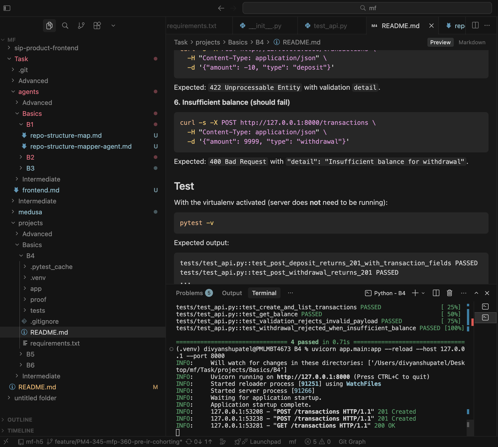
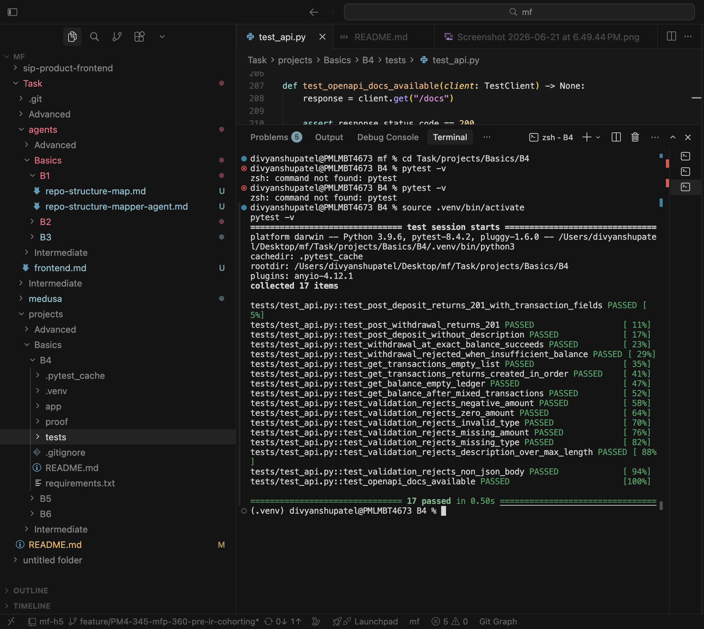

# Transaction Ledger API (FastAPI)

Small Python [FastAPI](https://fastapi.tiangolo.com/) service that records **deposits** and **withdrawals** in memory and exposes the current balance.

Built for **Basics B4**: greenfield API with input validation, automated tests, and documented install/run/test steps.

## Project layout

```
B4/
├── app/
│   ├── main.py       # FastAPI app and route handlers
│   ├── models.py     # Pydantic request/response schemas
│   └── store.py      # In-memory ledger (no database)
├── tests/
│   └── test_api.py   # API tests (pytest + TestClient)
├── proof/            # Screenshots proving tests and server run
├── requirements.txt
└── README.md
```

## API endpoints

| Method | Path            | Description                           | Success       |
| ------ | --------------- | ------------------------------------- | ------------- |
| `POST` | `/transactions` | Create a deposit or withdrawal        | `201 Created` |
| `GET`  | `/transactions` | List all transactions (oldest first)  | `200 OK`      |
| `GET`  | `/balance`      | Current balance and transaction count | `200 OK`      |

Interactive OpenAPI docs: http://127.0.0.1:8000/docs

### Request body — `POST /transactions`

| Field         | Type   | Required | Rules                         |
| ------------- | ------ | -------- | ----------------------------- |
| `amount`      | number | yes      | Must be **> 0**               |
| `type`        | string | yes      | `"deposit"` or `"withdrawal"` |
| `description` | string | no       | Max 200 characters            |

**Business rule:** A withdrawal is rejected with `400` if it would exceed the current balance.

### Response shapes

**Transaction** (`POST /transactions`, items in `GET /transactions`):

```json
{
  "id": 1,
  "amount": 100.0,
  "type": "deposit",
  "description": "Initial funding",
  "created_at": "2026-06-21T12:00:00.000000Z"
}
```

**Balance** (`GET /balance`):

```json
{
  "balance": 75.0,
  "transaction_count": 2
}
```

**Validation error** (`422`):

```json
{
  "detail": [
    {
      "type": "greater_than",
      "loc": ["body", "amount"],
      "msg": "Input should be greater than 0",
      "input": -10.0
    }
  ]
}
```

## Prerequisites

- **Python 3.9+** (3.10+ recommended)
- `python3` and `pip` on your PATH

## Install

From the repository root:

```bash
cd Task/projects/Basics/B4
```

Create and activate a virtual environment:

```bash
python3 -m venv .venv
source .venv/bin/activate    # Windows: .venv\Scripts\activate
pip install -r requirements.txt
```

If `pip` fails with `bad interpreter: .../Task/Basics/B4/.venv/...`, delete the stale venv and recreate:

```bash
rm -rf .venv
python3 -m venv .venv
source .venv/bin/activate
pip install -r requirements.txt
```

## Run the server

With the virtualenv activated:

```bash
uvicorn app.main:app --reload --host 127.0.0.1 --port 8000
```

Expected startup output (abbreviated):

```
INFO:     Uvicorn running on http://127.0.0.1:8000 (Press CTRL+C to quit)
INFO:     Started reloader process [...]
INFO:     Started server process [...]
INFO:     Application startup complete.
```

Open http://127.0.0.1:8000/docs to explore the API in the browser.

## Prove it runs (manual smoke test)

Run these in a **second terminal** while the server is up.

**1. Create a deposit**

```bash
curl -s -X POST http://127.0.0.1:8000/transactions \
  -H "Content-Type: application/json" \
  -d '{"amount": 100, "type": "deposit", "description": "Initial funding"}'
```

Expected: `201` response with `"id": 1`, `"type": "deposit"`, `"amount": 100`.

**2. Create a withdrawal**

```bash
curl -s -X POST http://127.0.0.1:8000/transactions \
  -H "Content-Type: application/json" \
  -d '{"amount": 25.5, "type": "withdrawal", "description": "ATM"}'
```

Expected: `201` response with `"type": "withdrawal"`.

**3. List transactions**

```bash
curl -s http://127.0.0.1:8000/transactions
```

Expected: JSON array with 2 transactions, ordered by `id`.

**4. Get balance**

```bash
curl -s http://127.0.0.1:8000/balance
```

Expected:

```json
{ "balance": 74.5, "transaction_count": 2 }
```

**5. Input validation (should fail)**

```bash
curl -s -X POST http://127.0.0.1:8000/transactions \
  -H "Content-Type: application/json" \
  -d '{"amount": -10, "type": "deposit"}'
```

Expected: `422 Unprocessable Entity` with validation `detail`.

**6. Insufficient balance (should fail)**

```bash
curl -s -X POST http://127.0.0.1:8000/transactions \
  -H "Content-Type: application/json" \
  -d '{"amount": 9999, "type": "withdrawal"}'
```

Expected: `400 Bad Request` with `"detail": "Insufficient balance for withdrawal"`.

## Test

With the virtualenv activated (server does **not** need to be running):

```bash
pytest -v
```

Expected output:

```
tests/test_api.py::test_post_deposit_returns_201_with_transaction_fields PASSED
tests/test_api.py::test_post_withdrawal_returns_201 PASSED
...
============================== XX passed in X.XXs ===============================
```

Run a single test file or test by name:

```bash
pytest tests/test_api.py -v
pytest tests/test_api.py::test_get_balance_after_mixed_transactions -v
```

## Test coverage summary

| Area                 | What is tested                                                                 |
| -------------------- | ------------------------------------------------------------------------------ |
| `POST /transactions` | Deposits, withdrawals, optional description, sequential IDs                    |
| `GET /transactions`  | Empty list, ordered results                                                    |
| `GET /balance`       | Empty ledger, mixed deposit/withdrawal math                                    |
| Input validation     | Negative/zero amount, invalid type, missing fields, long description, bad JSON |
| Business rules       | Insufficient balance (`400`), exact-balance withdrawal allowed                 |
| FastAPI app          | OpenAPI `/docs` page loads                                                     |

**17 automated tests** — exceeds the B4 minimum of 3.

## Proof it runs (screenshots)

### All tests pass (`pytest -v`)

<p align="center">
  
</p>

### Server running with live API requests

<p align="center">
  
</p>

## Dependencies

| Package    | Purpose                                     |
| ---------- | ------------------------------------------- |
| `fastapi`  | Web framework                               |
| `uvicorn`  | ASGI server                                 |
| `pydantic` | Request/response validation                 |
| `httpx`    | HTTP client (FastAPI TestClient dependency) |
| `pytest`   | Test runner                                 |
