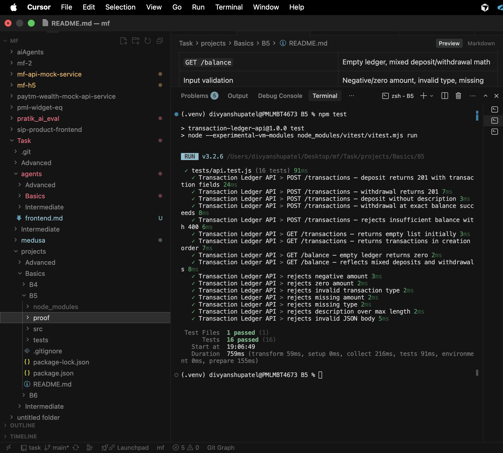
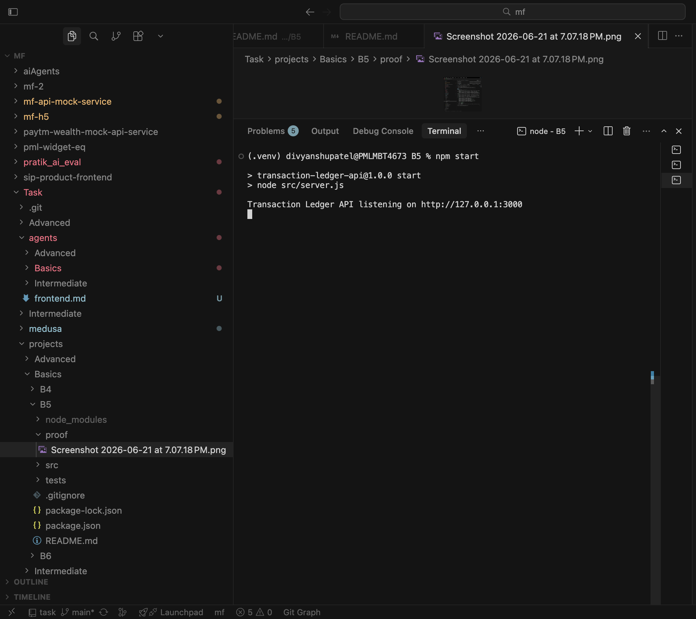

# Transaction Ledger API (Node.js / Express)

Small **Node.js** [Express](https://expressjs.com/) API that records **deposits** and **withdrawals** in memory and exposes the current balance.

Built for **Basics B5**: greenfield Node.js API with input validation (Zod), automated tests (Vitest + Supertest), and documented install/run/test steps. Node.js counterpart to the FastAPI version in [`Task/projects/Basics/B4`](../B4/README.md).

## Project layout

```
B5/
├── src/
│   ├── app.js        # Express app and route handlers
│   ├── server.js     # HTTP server entry point
│   ├── schemas.js    # Zod request validation
│   └── store.js      # In-memory ledger (no database)
├── tests/
│   └── api.test.js   # API tests (Vitest + Supertest)
├── proof/            # Screenshots proving tests and server run
├── package.json
└── README.md
```

## API endpoints

| Method | Path | Description | Success |
|--------|------|-------------|---------|
| `POST` | `/transactions` | Create a deposit or withdrawal | `201 Created` |
| `GET` | `/transactions` | List all transactions (oldest first) | `200 OK` |
| `GET` | `/balance` | Current balance and transaction count | `200 OK` |

### Request body — `POST /transactions`

| Field | Type | Required | Rules |
|-------|------|----------|-------|
| `amount` | number | yes | Must be **> 0** |
| `type` | string | yes | `"deposit"` or `"withdrawal"` |
| `description` | string | no | Max 200 characters |

**Business rule:** A withdrawal is rejected with `400` if it would exceed the current balance.

### Response shapes

**Transaction** (`POST /transactions`, items in `GET /transactions`):

```json
{
  "id": 1,
  "amount": 100,
  "type": "deposit",
  "description": "Initial funding",
  "created_at": "2026-06-21T12:00:00.000Z"
}
```

**Balance** (`GET /balance`):

```json
{
  "balance": 75,
  "transaction_count": 2
}
```

**Validation error** (`422`):

```json
{
  "detail": {
    "fieldErrors": {},
    "formErrors": []
  }
}
```

## Prerequisites

- **Node.js 18+**
- **npm** (comes with Node)

## Install

From the repository root:

```bash
cd Task/projects/Basics/B5
npm install
```

## Run the server

```bash
npm start
```

For auto-reload during development:

```bash
npm run dev
```

Expected startup output:

```
Transaction Ledger API listening on http://127.0.0.1:3000
```

The server listens on http://127.0.0.1:3000 by default. Override with `PORT` and `HOST` environment variables.

## Prove it runs (manual smoke test)

Run these in a **second terminal** while the server is up.

**1. Create a deposit**

```bash
curl -s -X POST http://127.0.0.1:3000/transactions \
  -H "Content-Type: application/json" \
  -d '{"amount": 100, "type": "deposit", "description": "Initial funding"}'
```

Expected: `201` response with `"id": 1`, `"type": "deposit"`, `"amount": 100`.

**2. Create a withdrawal**

```bash
curl -s -X POST http://127.0.0.1:3000/transactions \
  -H "Content-Type: application/json" \
  -d '{"amount": 25.5, "type": "withdrawal", "description": "ATM"}'
```

Expected: `201` response with `"type": "withdrawal"`.

**3. List transactions**

```bash
curl -s http://127.0.0.1:3000/transactions
```

Expected: JSON array with 2 transactions, ordered by `id`.

**4. Get balance**

```bash
curl -s http://127.0.0.1:3000/balance
```

Expected:

```json
{"balance":74.5,"transaction_count":2}
```

**5. Input validation (should fail)**

```bash
curl -s -X POST http://127.0.0.1:3000/transactions \
  -H "Content-Type: application/json" \
  -d '{"amount": -10, "type": "deposit"}'
```

Expected: `422 Unprocessable Entity` with validation `detail`.

**6. Insufficient balance (should fail)**

```bash
curl -s -X POST http://127.0.0.1:3000/transactions \
  -H "Content-Type: application/json" \
  -d '{"amount": 9999, "type": "withdrawal"}'
```

Expected: `400 Bad Request` with `"detail": "Insufficient balance for withdrawal"`.

## Test

The server does **not** need to be running for tests.

```bash
npm test
```

Expected output:

```
 ✓ tests/api.test.js (16 tests)

 Test Files  1 passed (1)
      Tests  16 passed (16)
```

Run with verbose output:

```bash
npm test -- --reporter=verbose
```

## Test coverage summary

| Area | What is tested |
|------|----------------|
| `POST /transactions` | Deposits, withdrawals, optional description, sequential IDs |
| `GET /transactions` | Empty list, ordered results |
| `GET /balance` | Empty ledger, mixed deposit/withdrawal math |
| Input validation | Negative/zero amount, invalid type, missing fields, long description, bad JSON |
| Business rules | Insufficient balance (`400`), exact-balance withdrawal allowed |

**16 automated tests** — exceeds the B5 minimum of 3.

## Proof it runs (screenshots)

### All tests pass (`npm test`)

<p align="center">
  
</p>

### Server running (`npm start`)

<p align="center">
  
</p>

## Dependencies

| Package | Purpose |
|---------|---------|
| `express` | Web framework |
| `zod` | Request validation |
| `vitest` | Test runner |
| `supertest` | HTTP assertions against Express app |
