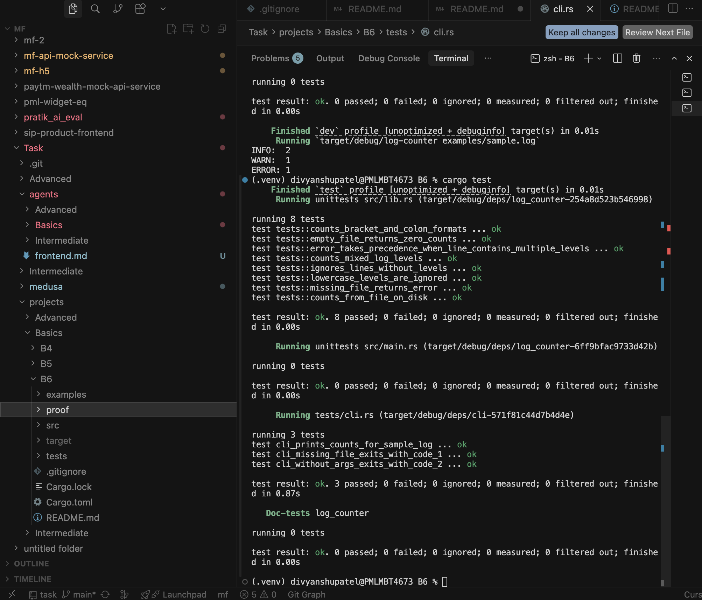
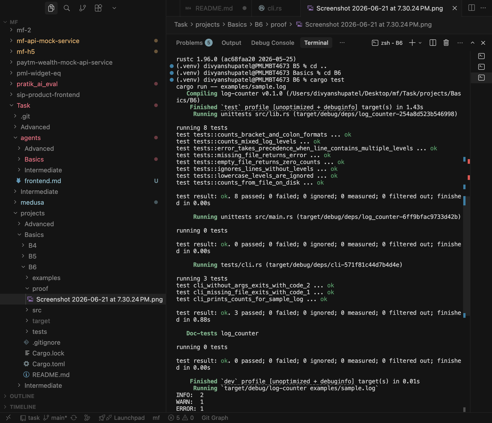

# Log Counter (Rust)

Small **Rust** CLI that reads a log file path from the command line and counts how many lines contain `INFO`, `WARN`, or `ERROR` log levels.

Built for **Basics B6**: Cargo project, file-path CLI, level counting, graceful missing-file handling, automated tests, and documented `cargo` commands.

## Requirements checklist

| Requirement                     | Status                                                       |
| ------------------------------- | ------------------------------------------------------------ |
| Cargo project                   | `Cargo.toml` + `src/main.rs` / `src/lib.rs`                  |
| CLI accepts file path           | `log-counter <log-file>`                                     |
| Counts INFO / WARN / ERROR      | One count per line; highest severity wins if multiple appear |
| Handles missing file gracefully | Prints `error: file not found: …` and exits `1`              |
| At least 3 tests                | **11 automated tests** (8 unit + 3 integration)              |
| README with cargo commands      | See [Build](#build), [Run](#run), and [Test](#test) below    |

## Project layout

```
B6/
├── src/
│   ├── main.rs       # CLI entry point
│   └── lib.rs        # Parsing logic + unit tests
├── tests/
│   └── cli.rs        # Integration tests (binary + exit codes)
├── examples/
│   └── sample.log    # Sample input for manual runs
├── proof/            # Screenshots proving tests and CLI run
├── Cargo.toml
└── README.md
```

## How counting works

- Each **line** is classified at most once.
- A line matches when `INFO`, `WARN`, or `ERROR` appears as a standalone token (split on non-alphanumeric characters).
- Examples that match: `2024-06-16 INFO started`, `[WARN] retry`, `level=ERROR`.
- Lines with **no** recognized level are ignored (e.g. `debug trace`).
- If a line mentions multiple levels, **ERROR** wins over **WARN**, which wins over **INFO**.

Given `examples/sample.log`:

```
2024-06-16 INFO Application started
2024-06-16 WARN Retrying request
2024-06-16 ERROR Database unavailable
[INFO] Health check passed
debug trace line with no level
```

Running the tool prints:

```
INFO:  2
WARN:  1
ERROR: 1
```

## Prerequisites

- **Rust 1.70+** via [rustup](https://rustup.rs/) (`cargo` on your PATH)

Verify (after [installing Rust](#install-rust)):

```bash
cargo --version
rustc --version
```

### Install Rust

If `cargo` is not found, install via [rustup](https://rustup.rs/):

```bash
curl --proto '=https' --tlsv1.2 -sSf https://sh.rustup.rs | sh
```

Then load it into your **current terminal** (required once per new shell session until added to your profile):

```bash
source "$HOME/.cargo/env"
cargo --version
rustc --version
```

## Build

From the repository root:

```bash
cd Task/projects/Basics/B6
cargo build
```

Release binary (optimized):

```bash
cargo build --release
```

Quick compile check without producing a binary:

```bash
cargo check
```

## Run

Using `cargo run`:

```bash
cargo run -- examples/sample.log
```

Or after building:

```bash
./target/debug/log-counter examples/sample.log
```

Release binary:

```bash
./target/release/log-counter examples/sample.log
```

### Missing file (graceful error)

```bash
cargo run -- missing.log
```

Expected stderr:

```
error: file not found: missing.log
```

Exit code: `1`

### Missing CLI argument

```bash
cargo run
```

Expected stderr includes `usage: log-counter <log-file>`. Exit code: `2`.

## Prove it runs (manual smoke test)

```bash
cd Task/projects/Basics/B6

# 1. Count levels in the sample log
cargo run -- examples/sample.log

# 2. Confirm missing-file handling
cargo run -- no-such-file.log; echo "exit code: $?"

# 3. Run the full test suite
cargo test
```

Expected output from step 1:

```
INFO:  2
WARN:  1
ERROR: 1
```

Expected output from step 3:

```
running 8 tests
...
test result: ok. 8 passed; 0 failed

running 3 tests
...
test result: ok. 3 passed; 0 failed
```

## Test

```bash
cargo test
```

Verbose test output:

```bash
cargo test -- --nocapture
```

Run only integration tests:

```bash
cargo test --test cli
```

Run only unit tests in the library:

```bash
cargo test --lib
```

## Test coverage summary

| Area            | What is tested                                                    |
| --------------- | ----------------------------------------------------------------- |
| Level counting  | Mixed levels, bracket/colon formats, empty input                  |
| Line filtering  | Lines without levels ignored; lowercase tokens ignored            |
| Severity rules  | ERROR wins when a line mentions multiple levels                   |
| File I/O        | Missing file returns `MissingFile` error; temp file read succeeds |
| CLI integration | Sample log output, missing file exit `1`, usage exit `2`          |

**11 automated tests** — exceeds the B6 minimum of 3.

## Proof it runs (screenshots)

### All tests pass (`cargo test`)

<p align="center">
  
</p>

### CLI counts sample log (`cargo run -- examples/sample.log`)

<p align="center">
  
</p>

## Format & lint

```bash
cargo fmt
cargo clippy
```

## Dependencies

No external crates — standard library only (`std::fs`, `std::io`, `std::env`).
