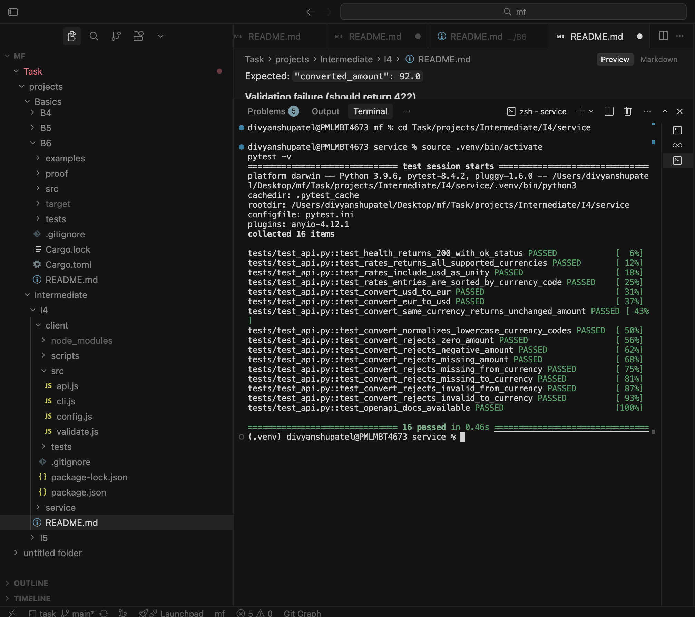
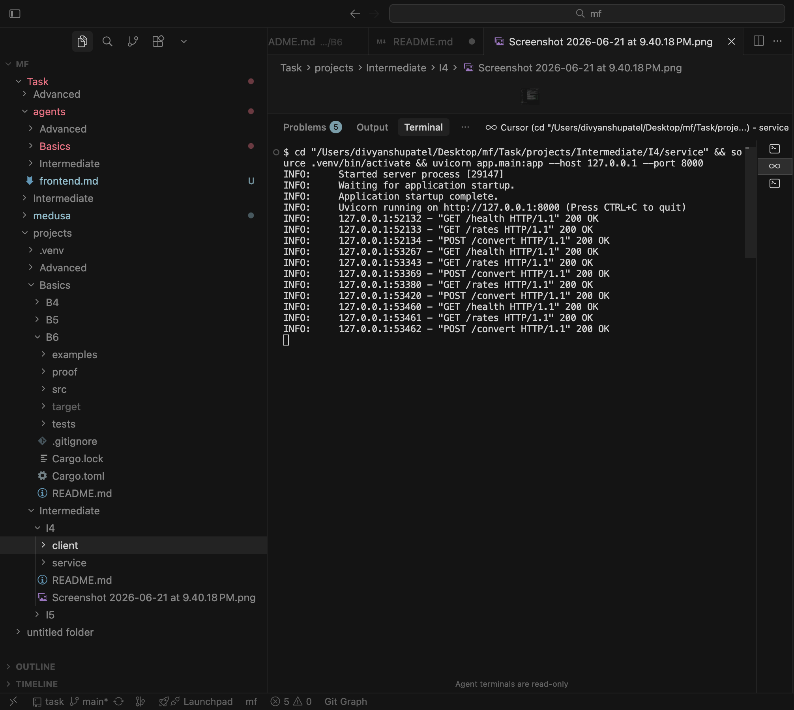
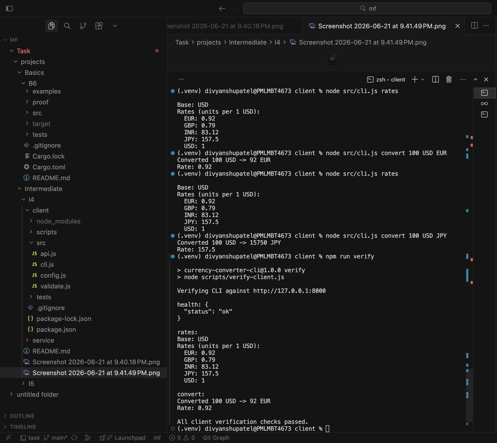

# Currency Converter — Two-Component System (I4)

A **FastAPI** conversion service and a **Node.js CLI client** that calls it over HTTP.

Built for **Intermediate I4**: hardcoded FX rates, input validation on both sides, automated tests for every service endpoint, client unit tests plus a live verification script, and two-terminal run instructions.

## Requirements checklist


| Requirement                           | Status                                                         |
| ------------------------------------- | -------------------------------------------------------------- |
| FastAPI service with `/convert`       | `POST /convert` in `service/app/main.py`                       |
| Node.js CLI client                    | `client/src/cli.js`                                            |
| Hardcoded rates                       | `service/app/rates.py`                                         |
| Input validation                      | Pydantic (service) + Zod (client)                              |
| Tests for every service endpoint      | **16 pytest tests** — `/health`, `/rates`, `/convert`, `/docs` |
| Client tests or scripted verification | **9 Vitest tests** + `npm run verify`                          |
| README with two-terminal instructions | See [Quick start (two terminals)](#quick-start-two-terminals)  |


## Project layout

```
I4/
├── service/                    # FastAPI conversion API
│   ├── app/
│   │   ├── main.py             # Routes: /health, /rates, /convert
│   │   ├── models.py           # Pydantic request/response schemas
│   │   ├── rates.py            # Hardcoded rates (USD base)
│   │   └── converter.py        # Conversion logic
│   ├── tests/
│   │   └── test_api.py         # One test section per endpoint
│   └── requirements.txt
├── client/                     # Node.js CLI
│   ├── src/
│   │   ├── cli.js              # CLI entry point
│   │   ├── api.js              # HTTP calls to the service
│   │   ├── validate.js         # Zod validation + output formatting
│   │   └── config.js           # Base URL + supported currencies
│   ├── tests/
│   │   ├── validate.test.js
│   │   └── api.test.js
│   ├── scripts/
│   │   └── verify-client.js    # Live end-to-end CLI verification
│   └── package.json
├── proof/                      # Screenshots proving tests and two-terminal run
└── README.md
```

## Architecture

```
┌─────────────────────┐         HTTP          ┌──────────────────────┐
│  Node.js CLI        │  GET  /health         │  FastAPI service     │
│  client/src/cli.js  │  GET  /rates          │  service/app/main.py │
│                     │  POST /convert        │                      │
└─────────────────────┘                       └──────────────────────┘
         │                                              │
         │  CONVERTER_API_URL                           │  Hardcoded rates
         │  (default http://127.0.0.1:8000)             │  service/app/rates.py
         └──────────────────────────────────────────────┘
```

## Hardcoded rates

All rates are relative to **USD** (1 USD = rate units of each currency):


| Currency | Rate (per 1 USD) |
| -------- | ---------------- |
| USD      | 1.0              |
| EUR      | 0.92             |
| GBP      | 0.79             |
| INR      | 83.12            |
| JPY      | 157.5            |


**Conversion formula:** `converted = amount × (rate[to] / rate[from])`, rounded to 2 decimal places.

Example: 100 USD → EUR = 100 × (0.92 / 1.0) = **92.00 EUR**

## Service API


| Method | Path       | Description                | Success  |
| ------ | ---------- | -------------------------- | -------- |
| `GET`  | `/health`  | Liveness check             | `200 OK` |
| `GET`  | `/rates`   | List hardcoded rates       | `200 OK` |
| `POST` | `/convert` | Convert between currencies | `200 OK` |


Interactive OpenAPI docs: [http://127.0.0.1:8000/docs](http://127.0.0.1:8000/docs)

### Request — `POST /convert`


| Field           | Type   | Required | Rules                                                        |
| --------------- | ------ | -------- | ------------------------------------------------------------ |
| `amount`        | number | yes      | Must be **> 0**                                              |
| `from_currency` | string | yes      | One of: `USD`, `EUR`, `GBP`, `INR`, `JPY` (case-insensitive) |
| `to_currency`   | string | yes      | Same supported set                                           |


### Response — `POST /convert`

```json
{
  "amount": 100,
  "from_currency": "USD",
  "to_currency": "EUR",
  "rate": 0.92,
  "converted_amount": 92.0
}
```

### Validation errors

Invalid body → `422 Unprocessable Entity` with Pydantic `detail` array.

## CLI client

### Commands

```bash
node src/cli.js health
node src/cli.js rates
node src/cli.js convert <amount> <from> <to>
```

### Environment


| Variable            | Default                 | Purpose                         |
| ------------------- | ----------------------- | ------------------------------- |
| `CONVERTER_API_URL` | `http://127.0.0.1:8000` | Base URL of the FastAPI service |


### Examples

```bash
node src/cli.js convert 100 USD EUR
# Converted 100 USD -> 92 EUR
# Rate: 0.92

node src/cli.js rates
# Base: USD
# Rates (units per 1 USD):
#   EUR: 0.92
#   ...

node src/cli.js health
# { "status": "ok" }
```

Client-side validation (before any HTTP call) rejects non-positive amounts and unsupported currency codes.

## Prerequisites

- **Python 3.9+**
- **Node.js 18+**
- **npm**

## Quick start (two terminals)

### Terminal 1 — start the FastAPI service

```bash
cd Task/projects/Intermediate/I4/service
python3 -m venv .venv
source .venv/bin/activate
pip install -r requirements.txt
uvicorn app.main:app --reload --host 127.0.0.1 --port 8000
```

Expected output:

```
INFO:     Uvicorn running on http://127.0.0.1:8000
```

Leave this terminal running.

### Terminal 2 — install client and call the service

```bash
cd Task/projects/Intermediate/I4/client
npm install

# Health check
node src/cli.js health

# List rates
node src/cli.js rates

# Convert 100 USD to EUR
node src/cli.js convert 100 USD EUR
```

Expected convert output:

```
Converted 100 USD -> 92 EUR
Rate: 0.92
```

### Optional — live client verification script

With the service still running in Terminal 1:

```bash
cd Task/projects/Intermediate/I4/client
npm run verify
```

Runs `health`, `rates`, and `convert 100 USD EUR` through the CLI and exits non-zero on failure.

## Prove it runs (manual curl smoke test)

Use Terminal 2 while the service is up in Terminal 1.

**Health**

```bash
curl -s http://127.0.0.1:8000/health
```

Expected: `{"status":"ok"}`

**Rates**

```bash
curl -s http://127.0.0.1:8000/rates
```

**Convert**

```bash
curl -s -X POST http://127.0.0.1:8000/convert \
  -H "Content-Type: application/json" \
  -d '{"amount": 100, "from_currency": "USD", "to_currency": "EUR"}'
```

Expected: `"converted_amount": 92.0`

**Validation failure (should return 422)**

```bash
curl -s -X POST http://127.0.0.1:8000/convert \
  -H "Content-Type: application/json" \
  -d '{"amount": -1, "from_currency": "USD", "to_currency": "EUR"}'
```

## Test the service

The service does **not** need to be running for pytest.

```bash
cd Task/projects/Intermediate/I4/service
source .venv/bin/activate
pytest -v
```

Expected: **16 passed**

### Service test coverage (every endpoint)


| Endpoint        | Tests                                                                                              |
| --------------- | -------------------------------------------------------------------------------------------------- |
| `GET /health`   | Returns 200 with `{ "status": "ok" }`                                                              |
| `GET /rates`    | All 5 currencies, USD = 1.0, sorted output                                                         |
| `POST /convert` | USD→EUR, EUR→USD, same currency, lowercase codes, zero/negative/missing fields, invalid currencies |
| `GET /docs`     | OpenAPI page loads                                                                                 |


## Test the client

Client unit tests mock `fetch` — no running service required.

```bash
cd Task/projects/Intermediate/I4/client
npm test
```

Expected: **9 passed**

### Client test coverage


| Area                                             | Tests                                                     |
| ------------------------------------------------ | --------------------------------------------------------- |
| `parseConvertArgs`                               | Valid input, non-positive amount, unsupported currency    |
| `formatConvertResult` / `formatRatesResult`      | Output formatting                                         |
| `fetchHealth` / `fetchRates` / `convertCurrency` | Success paths, error handling, correct URLs and POST body |


## Proof it runs (screenshots)

### Service tests pass (`pytest -v`)

<p align="center">
  
</p>

### FastAPI service running (`uvicorn`)

<p align="center">
  
</p>

### Client tests pass (`npm test`)

<p align="center">
  
</p>

## Troubleshooting


| Problem                                    | Fix                                                           |
| ------------------------------------------ | ------------------------------------------------------------- |
| `command not found: uvicorn`               | Activate venv: `source service/.venv/bin/activate`            |
| `ECONNREFUSED` from CLI                    | Start the service in Terminal 1 first                         |
| `422` from service                         | Check amount > 0 and currency codes are in the supported list |
| CLI `error: Amount must be greater than 0` | Client-side Zod validation — fix args before retrying         |
| Wrong port                                 | Set `CONVERTER_API_URL=http://127.0.0.1:<port>` in Terminal 2 |


## Dependencies

### Service (Python)


| Package    | Purpose               |
| ---------- | --------------------- |
| `fastapi`  | Web framework         |
| `uvicorn`  | ASGI server           |
| `pydantic` | Request validation    |
| `httpx`    | TestClient dependency |
| `pytest`   | Test runner           |


### Client (Node.js)


| Package  | Purpose                 |
| -------- | ----------------------- |
| `zod`    | CLI argument validation |
| `vitest` | Test runner             |


